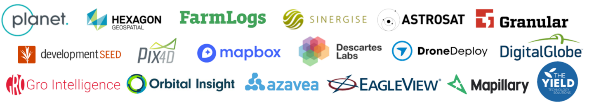
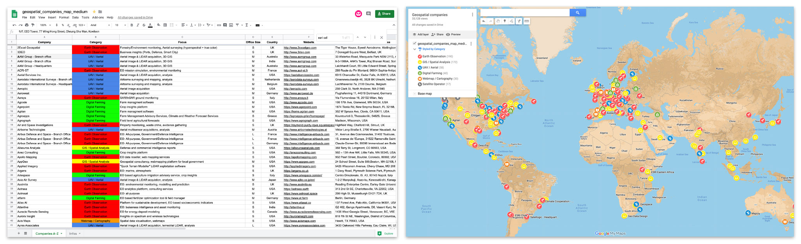

# Awesome Geospatial Companies 

List of 500+ geospatial companies & interactive map 

:earth_americas: Earth Observation :globe_with_meridians: GIS / Spatial Analysis :airplane: UAV / Aerial :seedling: Digital Farming :world_map: Webmap / Cartography :artificial_satellite: Satellite Operator

  

  

&nbsp;&nbsp;&nbsp;&nbsp;&nbsp;&nbsp;&nbsp;&nbsp;&nbsp;&nbsp;&nbsp;&nbsp;&nbsp;&nbsp;&nbsp;&nbsp;&nbsp;&nbsp;&nbsp;&nbsp;&nbsp;&nbsp;&nbsp;&nbsp;&nbsp;&nbsp;&nbsp;&nbsp;&nbsp;&nbsp;&nbsp;&nbsp;&nbsp;&nbsp;&nbsp;&nbsp;&nbsp;&nbsp;&nbsp;&nbsp;&nbsp;&nbsp;&nbsp;&nbsp;&nbsp;&nbsp;&nbsp;&nbsp;&nbsp;&nbsp;&nbsp;&nbsp;&nbsp;&nbsp;&nbsp;&nbsp;&nbsp;&nbsp; **[Or explore the list as an interactive map](https://www.google.com/maps/d/u/0/edit?mid=1SCCvhv3Tn3acV3EeY91dGxCdLuvSPGCH&ll=5.275933136532167%2C0&z=2)**  

 

- Office size (S < 20, M 20-100, L > 100) is an estimate (LinkendIn, industry knowledge, job ads etc.)
- Relevant (B)ranch offices (non-sales office with sufficient amount of geo-related jobs) are listed separately.
- Focus on commercial companies, currently no research institues included. 

Thank you to the many [contributors](https://github.com/chrieke/awesome-geospatial-companies/blob/master/CONTRIBUTING.md)!

 

[Argentina](https://github.com/chrieke/awesome-geospatial-companies#argentina-argentina) - [Armenia](https://github.com/chrieke/awesome-geospatial-companies#armenia-armenia) - [Australia](https://github.com/chrieke/awesome-geospatial-companies#australia-australia) - [Austria](https://github.com/chrieke/awesome-geospatial-companies#austria-austria) - [Belgium](https://github.com/chrieke/awesome-geospatial-companies#belgium-belgium) - [Brazil](https://github.com/chrieke/awesome-geospatial-companies#brazil-brazil) - [Bulgaria](https://github.com/chrieke/awesome-geospatial-companies#bulgaria-bulgaria) - [Canada](https://github.com/chrieke/awesome-geospatial-companies#canada-canada) - [Chile](https://github.com/chrieke/awesome-geospatial-companies#chile-chile) - [China](https://github.com/chrieke/awesome-geospatial-companies#china-cn) - [Colombia](https://github.com/chrieke/awesome-geospatial-companies#colombia-colombia) - [Costa Rica](https://github.com/chrieke/awesome-geospatial-companies#costa-rica-costa_rica) - [Croatia](https://github.com/chrieke/awesome-geospatial-companies#croatia-croatia) - [Cyprus](https://github.com/chrieke/awesome-geospatial-companies#cyprus-cyprus) - [Czech republic](https://github.com/chrieke/awesome-geospatial-companies#czech-republic-czech_republic) - [Denmark](https://github.com/chrieke/awesome-geospatial-companies#denmark-denmark) - [Egypt](https://github.com/chrieke/awesome-geospatial-companies#egypt-egypt) - [Estonia](https://github.com/chrieke/awesome-geospatial-companies#estonia-estonia) - [Finland](https://github.com/chrieke/awesome-geospatial-companies#finland-finland) - [France](https://github.com/chrieke/awesome-geospatial-companies#france-fr) - [Germany](https://github.com/chrieke/awesome-geospatial-companies#germany-de) - [Greece](https://github.com/chrieke/awesome-geospatial-companies#greece-greece) - [Guatemala](https://github.com/chrieke/awesome-geospatial-companies#guatemala-guatemala) - [Hungary](https://github.com/chrieke/awesome-geospatial-companies#hungary-hungary) - [India](https://github.com/chrieke/awesome-geospatial-companies#india-india) - [Indonesia](https://github.com/chrieke/awesome-geospatial-companies#indonesia-indonesia) - [Ireland](https://github.com/chrieke/awesome-geospatial-companies#ireland-ireland) - [Israel](https://github.com/chrieke/awesome-geospatial-companies#israel-israel) - [Italy](https://github.com/chrieke/awesome-geospatial-companies#italy-it) - [Japan](https://github.com/chrieke/awesome-geospatial-companies#japan-jp) - [Kenya](https://github.com/chrieke/awesome-geospatial-companies#kenya-kenya) - [Luxembourg](https://github.com/chrieke/awesome-geospatial-companies#luxembourg-luxembourg) - [Malaysia](https://github.com/chrieke/awesome-geospatial-companies#malaysia-malaysia) - [Mexico](https://github.com/chrieke/awesome-geospatial-companies#mexico-mexico) - [Netherlands](https://github.com/chrieke/awesome-geospatial-companies#netherlands-netherlands) - [New Zealand](https://github.com/chrieke/awesome-geospatial-companies#new-zealand-new_zealand) - [Nicaragua](https://github.com/chrieke/awesome-geospatial-companies#nicaragua-nicaragua) - [Norway](https://github.com/chrieke/awesome-geospatial-companies#norway-norway) - [Pakistan](https://github.com/chrieke/awesome-geospatial-companies#pakistan-pakistan) - [Peru](https://github.com/chrieke/awesome-geospatial-companies#peru-peru) - [Poland](https://github.com/chrieke/awesome-geospatial-companies#poland-poland) - [Portugal](https://github.com/chrieke/awesome-geospatial-companies#portugal-portugal) - [Romania](https://github.com/chrieke/awesome-geospatial-companies#romania-romania) - [Russia](https://github.com/chrieke/awesome-geospatial-companies#russia-ru) - [Saudi Arabia](https://github.com/chrieke/awesome-geospatial-companies#saudi-arabia-saudi_arabia) - [Serbia](https://github.com/chrieke/awesome-geospatial-companies#serbia-serbia) - [Singapore](https://github.com/chrieke/awesome-geospatial-companies#singapore-singapore) - [Slovakia](https://github.com/chrieke/awesome-geospatial-companies#slovakia-slovakia) - [Slovenia](https://github.com/chrieke/awesome-geospatial-companies#slovenia-slovenia) - [South Africa](https://github.com/chrieke/awesome-geospatial-companies#south-africa-south_africa) - [South Korea](https://github.com/chrieke/awesome-geospatial-companies#south-korea-kr) - [Spain](https://github.com/chrieke/awesome-geospatial-companies#spain-es) - [Sri Lanka](https://github.com/chrieke/awesome-geospatial-companies#sri-lanka-sri_lanka) - [Sweden](https://github.com/chrieke/awesome-geospatial-companies#sweden-sweden) - [Switzerland](https://github.com/chrieke/awesome-geospatial-companies#switzerland-switzerland) - [Taiwan](https://github.com/chrieke/awesome-geospatial-companies#taiwan-taiwan) - [Tanzania](https://github.com/chrieke/awesome-geospatial-companies#tanzania-tanzania) - [Thailand](https://github.com/chrieke/awesome-geospatial-companies#thailand-thailand) - [Turkey](https://github.com/chrieke/awesome-geospatial-companies#turkey-tr) - [UAE](https://github.com/chrieke/awesome-geospatial-companies#uae-united_arab_emirates) - [UK](https://github.com/chrieke/awesome-geospatial-companies#uk-uk) - [USA](https://github.com/chrieke/awesome-geospatial-companies#usa-us) - [Ukraine](https://github.com/chrieke/awesome-geospatial-companies#ukraine-ukraine) - [Vietnam](https://github.com/chrieke/awesome-geospatial-companies#vietnam-vietnam) -

## Argentina :argentina:
| Company                                  | Office Size   | Focus                                                                        | Address (Click)                                                                                                                                 |
|:-----------------------------------------|:--------------|:-----------------------------------------------------------------------------|:------------------------------------------------------------------------------------------------------------------------------------------------|
| [Dymaxion Labs](http://dymaxionlabs.com) | S             | :earth_americas: Monitoring drivers of economic development in Latin America | [:round_pushpin: Buenos Aires](https://www.google.com/maps/search/Castillo+1366+1414+Buenos+Aires,+Ciudad+Autónoma+de+Buenos+Aires,+Argentina+) |
| [Satellogic](https://www.satellogic.com) | M (H)         | :artificial_satellite: Cubesat 1m optical or 30m hyperspectral               | [:round_pushpin: Ciudad](https://www.google.com/maps/search/Av.+Raúl+Scalabrini+Ortíz+3306,+C1425DCO+CABA,+Argentina+)                          |
| [SpaceSUR](https://www.spacesur.com)     | M (H)         | :earth_americas: EO: All-purpose, InSAR, Geospatial Analytics                | [:round_pushpin: Buenos Aires](https://www.google.com/maps/search/Av.+Rivadavia+611,+Piso+11+-+C1002AAE,+Ciudad+de+Buenos+Aires,+Argentina+)    | 

## Armenia :armenia:
| Company                                  | Office Size   | Focus                        | Address (Click)                                                                                           |
|:-----------------------------------------|:--------------|:-----------------------------|:----------------------------------------------------------------------------------------------------------|
| [Intelinair](https://www.intelinair.com) | S (H)         | :seedling: UAV crop insights | [:round_pushpin: Yerevan](https://www.google.com/maps/search/2/2+Melik+Adamyan+Street,+Yerevan,+Armenia+) | 

## Australia :australia:
| Company                                            | Office Size   | Focus                                                                                      | Address (Click)                                                                                                                            |
|:---------------------------------------------------|:--------------|:-------------------------------------------------------------------------------------------|:-------------------------------------------------------------------------------------------------------------------------------------------|
| [AAM Group](http://www.aamgroup.com)               | M (B)         | :airplane: Aerial image & LiDAR acquisition, 3D GIS                                        | [:round_pushpin: Sydney](https://www.google.com/maps/search/33+Waterloo+Road,+Macquarie+Park+NSW+2113,+Australia+)                         |
| [AAM Group](http://www.aamgroup.com)               | M (H)         | :airplane: Aerial image & LiDAR acquisition, 3D GIS                                        | [:round_pushpin: Brisbane](https://www.google.com/maps/search/Leichhardt+Court,+55+Little+Edward+Street,+Spring+Hill+QLD+4000,+Australia+) |
| [Aerometrex](https://aerometrex.com.au/)           | M (H)         | :airplane: Aerial image & LiDAR acquisition, 3D GIS                                        | [:round_pushpin: Adelaide](https://www.google.com/maps/search/51-53+Glynburn+Rd,+Glynde,+SA+5070,+Australia+)                              |
| [Aerometrex](https://aerometrex.com.au/)           | M (B)         | :airplane: Aerial image & LiDAR acquisition, 3D GIS                                        | [:round_pushpin: Perth](https://www.google.com/maps/search/10+Brodie-Hall+Dr,+Technology+Park,+Bentley,+6102,+Australia+)                  |
| [Arlula](https://www.arlula.com/)                  | S             | :earth_americas: Single API for satellite imagery access                                   | [:round_pushpin: Sydney](https://www.google.com/maps/search/608+Harris+St,+Ultimo+NSW+2007,+Australia+)                                    |
| [Astron](http://www.astron.com.au)                 | S             | :earth_americas: Environmental consulting, remote sensing                                  | [:round_pushpin: Perth](https://www.google.com/maps/search/129+Royal+Street,+East+Perth+WA+6004,+Australia+)                               |
| [Core Logic](http://www.corelogic.co.nz)           | L             | :globe_with_meridians: Property intelligence, Geospatial consulting                        | [:round_pushpin: Wellington](https://www.google.com/maps/search/275+Cuba+St,+Te+Aro,+Wellington+6011,+New+Zealand+)                        |
| [ESRI](https://esriaustralia.com.au)               | L (B)         | :globe_with_meridians: ArcGIS software, GIS                                                | [:round_pushpin: Brisbane](https://www.google.com/maps/search/111+Elizabeth+Street,+Brisbane+QLD+4000,+Australia+)                         |
| [FrontierSI](https://frontiersi.com.au/)           | M             | :globe_with_meridians: Spatial mapping, infrastructure, positioning, geodesy               | [:round_pushpin: Melbourne](https://www.google.com/maps/search/Village+Street,+Docklands,+VIC,+3008,+Melbourne,+Australia+)                |
| [Geoimage](https://www.geoimage.com.au)            | S             | :earth_americas: EO consultancy                                                            | [:round_pushpin: Brisbane](https://www.google.com/maps/search/72+Costin+Street,+Fortitude+Valley+QLD+4006,+Australia+)                     |
| [Geoplex](http://www.geoplex.com.au)               | M             | :world_map: Geospatial application / web map development, GIS analysis                     | [:round_pushpin: Melbourne](https://www.google.com/maps/search/27+Hardware+Lane,+Melbourne,+VIC,+3000,+Australia+)                         |
| [GIS People](http://www.gispeople.com.au)          | M             | :globe_with_meridians: Spatial data insights plattform development, geospatial consultancy | [:round_pushpin: Brisbane](https://www.google.com/maps/search/27+Commercial+Road,+Newstead,+QLD+4006,+Australia+)                          |
| [Mapizy](http://www.mapizy.com)                    | S             | :earth_americas: Infrastructure and natural ressources monitoring                          | [:round_pushpin: Crawley](https://www.google.com/maps/search/UWA+School+of+Computer+Science,+Crawley+WA+6009,+​Australia+)                 |
| [Nearmap](https://www.nearmap.com/us/en)           | L             | :airplane: High-res aerial maps                                                            | [:round_pushpin: Sydney](https://www.google.com/maps/search/Tower+One,+100+Barangaroo+Avenue,+Barangaroo,+NSW+2000,+Australia+)            |
| [NGIS](https://ngis.com.au/)                       | S             | :globe_with_meridians: GIS + EO: All purpose                                               | [:round_pushpin: Sydney](https://www.google.com/maps/search/300+Barangaroo+Ave,+Sydney+NSW+2000,+Australia+)                               |
| [NGIS](https://ngis.com.au/)                       | M (H)         | :globe_with_meridians: GIS + EO: All purpose                                               | [:round_pushpin: Perth](https://www.google.com/maps/search/1a/53+Burswood+Road,+Burswood+WA+6100,+Australia+)                              |
| [Outline Global](https://outlineglobal.com.au)     | S             | :earth_americas: EO data reseller, GIS services                                            | [:round_pushpin: Mirrabooka](https://www.google.com/maps/search/Doncaster+Road,+Mirrabooka+Western+Australia+6061,+Australia+)             |
| [Ozius Spatial](http://www.ozius.com.au/#intro)    | S             | :earth_americas: EO: environmental monitoring, land management                             | [:round_pushpin: Brisbane](https://www.google.com/maps/search/Camp+Hill+QLD,+4152,+Australia+)                                             |
| [Pelicancorp](https://www.pelicancorp.com/us/home) | M             | :globe_with_meridians: Utilities & asset infrastructure monitoring                         | [:round_pushpin: Richmond](https://www.google.com/maps/search/2/600+Victoria+St,+Richmond+VIC+3121,+Australia+)                            |
| [Soar](https://about.soar.earth/index.html)        | S             | :world_map: Distribution & collaboration platform for EO imagery & maps                    | [:round_pushpin: Belmont](https://www.google.com/maps/search/2+Cowcher+Pl,+Belmont,+Western+Australia+6104,+Australia+)                    |
| [Spatial Vision](https://spatialvision.com.au/)    | M             | :globe_with_meridians: Geospatial consultancy, App/IT, cartography                         | [:round_pushpin: Melbourne](https://www.google.com/maps/search/575+Bourke+Street,+Melbourne+3000,+Australia+)                              |
| [The Yield](https://www.theyield.com)              | M             | :globe_with_meridians: Agriculture and aquaculture insights platform                       | [:round_pushpin: Sydney](https://www.google.com/maps/search/Holt+Street+50,+Surry+Hills,+Sydney,+NSW+2010,+Australia+)                     | 

## Austria :austria:
| Company                                                     | Office Size   | Focus                                                                             | Address (Click)                                                                                                 |
|:------------------------------------------------------------|:--------------|:----------------------------------------------------------------------------------|:----------------------------------------------------------------------------------------------------------------|
| [Airborne Technologies](http://www.airbornetechnologies.at) | M             | :airplane: Aerial multisensor acquisitions, analysis                              | [:round_pushpin: Wien](https://www.google.com/maps/search/Viktor+Lang-Straße+8,+2700+Wiener+Neustadt,+Austria+) |
| [EOX IT Services](https://eox.at)                           | S             | :earth_americas: "Sentinel 2 cloudless", EO data infrastructure                   | [:round_pushpin: Wien](https://www.google.com/maps/search/Thurngasse+8,+1090+Wien,+Austria+)                    |
| [Geoville](https://www.geoville.com)                        | M             | :earth_americas: EO: All-purpose                                                  | [:round_pushpin: Innsbruck](https://www.google.com/maps/search/Sparkassenplatz+2,+A+-+6020+Innsbruck,+Austria+) |
| [Sistema GmbH](http://www.sistema.at/wp/)                   | S             | :earth_americas: EO for atmospheric composition, climate change, AI for emergency | [:round_pushpin: Vienna](https://www.google.com/maps/search/Tiefer+Graben+19/2,+1050+Vienna,+Austria+)          | 

## Belgium :belgium:
| Company                                                       | Office Size   | Focus                                                                             | Address (Click)                                                                                                                 |
|:--------------------------------------------------------------|:--------------|:----------------------------------------------------------------------------------|:--------------------------------------------------------------------------------------------------------------------------------|
| [Aerodata International Surveys](http://aerodata-surveys.com) | M (H)         | :airplane: Airborne surveying and mapping, analysis                               | [:round_pushpin: Antwerpen](https://www.google.com/maps/search/Luchthavenlei+7a,+2100+Deurne,+Belgium+)                         |
| [Aerospacelab](https://www.aerospacelab.be/)                  | L             | :artificial_satellite: Satellite manufacturer and geospatial insights             | [:round_pushpin: Mont-Saint-Guibert](https://www.google.com/maps/search/Rue+André+Dumont+9,+1435,+Mont-Saint-Guibert,+Belgium+) |
| [ESRI](http://www.esribelux.com)                              | M (B)         | :globe_with_meridians: ArcGIS software, GIS                                       | [:round_pushpin: Wemmel](https://www.google.com/maps/search/54,+Nerviërslaan,+B-+1780+Wemmel,+Belgium+)                         |
| [Eurosense](http://www.eurosense.com/)                        | M (H)         | :airplane: Aerial imagery & LiDAR acquisition, all-purpose analysis               | [:round_pushpin: Wemmel](https://www.google.com/maps/search/Nerviërslaan+54,+B-1780+WEMMEL,+BELGIUM+)                           |
| [Geckomatics](https://geckomatics.com)                        | S             | :globe_with_meridians: GIS, outdoor, mobile mapping                               | [:round_pushpin: Antwerpen](https://www.google.com/maps/search/Borsbeeksebrug+34,+2600+Antwerpen-Berchem,+Belgium+)             |
| [Gim](https://www.gim.be/en)                                  | S  (B)        | :globe_with_meridians: GIS+EO: All-purpose                                        | [:round_pushpin: Gembloux](https://www.google.com/maps/search/Rue+Camille+Hubert+13C+-+5032+Gembloux,+Belgium+)                 |
| [Gim](https://www.gim.be/en)                                  | M (H)         | :globe_with_meridians: GIS+EO: All-purpose                                        | [:round_pushpin: Leuven](https://www.google.com/maps/search/Philipssite+5+bus+27+-+3001+Leuven,+Belgium+)                       |
| [Merkator BV](https://www.merkator.com/)                      | M (B)         | :globe_with_meridians: Geo-ICT Consultants for Goverment and  Utilities & Telco   | [:round_pushpin: Belgium](https://www.google.com/maps/search/Vliegwezenlaan+48,+1731+Zellik,+Belgium+)                          |
| [Scanworld](https://www.scanworld.be/)                        | S             | :artificial_satellite: Hyperspectral satellite constellation                      | [:round_pushpin: Liege](https://www.google.com/maps/search/Rue+des+Chasseurs+Ardennais+6,+Liège,+Walloon+Region+4031,+Belgium+) |
| [TomTom](https://www.tomtom.com)                              | L (B)         | :globe_with_meridians: GIS for navigation                                         | [:round_pushpin: Housse](https://www.google.com/maps/search/Rue+Richassa+32,+4671+Housse,+Belgium+)                             |
| [Vito Remote Sensing](https://remotesensing.vito.be/)         | M             | :earth_americas: Large scale EO image processing, UAV image acquisition, analysis | [:round_pushpin: Mol](https://www.google.com/maps/search/Boeretang+200,+2400+Mol,+Belgium+)                                     | 

## Brazil :brazil:
| Company                                                                | Office Size   | Focus                                                                                             | Address (Click)                                                                                                                                      |
|:-----------------------------------------------------------------------|:--------------|:--------------------------------------------------------------------------------------------------|:-----------------------------------------------------------------------------------------------------------------------------------------------------|
| [Agrosatellite](https://agrosatelite.com.br)                           | M             | :earth_americas: EO for agriculture, GIS development                                              | [:round_pushpin: Florianópolis](https://www.google.com/maps/search/SC-401+Highway+8600,+Santo+Antonio+de+Lisboa,+Florianópolis,+Brazil+)             |
| [Canopy Remote Sensing Solutions](http://www.canopyrss.tech/)          | S             | :earth_americas: Forest mapping, inventory, and monitoring                                        | [:round_pushpin: Florianópolis](https://www.google.com/maps/search/4150+Rod.+José+Carlos+Daux,+Florianópolis,+SC+88032-005,+Brazil+)                 |
| [Climate Cooperation](https://www.climate.com)                         | M (B)         | :seedling: "Field View" crop insights platform                                                    | [:round_pushpin: São Paulo,](https://www.google.com/maps/search/Av.+das+Nações+Unidas+12.901,+Torre+Norte+–+7o+andar,+São+Paulo,+04578-910,+Brazil+) |
| [Engemap](http://engemap.com.br/v3/)                                   | S (B)         | :globe_with_meridians: GIS, infrastructure feasibility Studies, aerial image acquisition, mapping | [:round_pushpin: Boa Vista](https://www.google.com/maps/search/Av.+Santos+Dumont,+160+-+Aparecida,+Boa+Vista+-+RR,+Brazil+)                          |
| [Engemap](http://engemap.com.br/v3/)                                   | S (B)         | :globe_with_meridians: GIS, infrastructure feasibility Studies, aerial image acquisition, mapping | [:round_pushpin: Chác. Sto. Antônio](https://www.google.com/maps/search/R.+Alexandre+Dumas,+1601+Cj.+67,+Chác.+Sto.+Antônio,+04717-004,+Brazil+)     |
| [Geo3topografia](http://www.geo3topografia.com.br/principal.html)      | S             | :globe_with_meridians: Cadastre, GIS services for energy, mining, urban                           | [:round_pushpin: Resende](https://www.google.com/maps/search/R.+Luís+Ferreira+Pinto,+80+-+32+-+Manejo,+Resende+-+RJ,+27520-330,+Brazil+)             |
| [Geoambiente](https://www.geoambiente.com.br)                          | M             | :globe_with_meridians: GIS & EO: All-purpose                                                      | [:round_pushpin: Urbanova](https://www.google.com/maps/search/São+José+dos+Campos+-+SP,+CEP:+12244-000,+Brazil+)                                     |
| [Grupo Engemap](http://grupoengemap.com.br)                            | S             | :globe_with_meridians: GIS: All-purpose, aerial survey                                            | [:round_pushpin: São Paulo](https://www.google.com/maps/search/Rua+Alexandre+Dumas,+1601+6º+andar+CJ+67,+São+Paulo,+Brazil+)                         |
| [Imagem](https://www.img.com.br/pt-br/home)                            | L             | :globe_with_meridians: GIS: All-purpose, ESRI reseller                                            | [:round_pushpin: São José dos Campos](https://www.google.com/maps/search/Rua+Itororó,+555+-+Vila+Cardoso,+São+José+dos+Campos,+Brazil+)              |
| [TecTerra Geotecnologias](https://tecterra.com.br)                     | S             | :earth_americas: Land monitoring, digital terrain modeling, geospatial data reseller              | [:round_pushpin: Nova Lima City](https://www.google.com/maps/search/89,+Alameda+do+Ingá+Street,+Nova+Lima+City,+Minas+Gerais+State,+Brazil+)         |
| [TerraGIS](https://www.terragis.com.br/)                               | S             | :globe_with_meridians: GIS: All-purpose                                                           | [:round_pushpin: Rio de Janeiro](https://www.google.com/maps/search/Rio+de+Janeiro+-+RJ+-+Brazil+)                                                   |
| [Visiona Tecnologia Espacial S.A.](https://www.visionaespacial.com.br) | M             | :earth_americas: Satellite & EO coordination with defence focus, EO image reseller                | [:round_pushpin: São Paulo](https://www.google.com/maps/search/500+Distrito+de+Eugênio+de+Melo,+São+José+dos+Campos,+São+Paulo,+Brazil+)             | 

## Bulgaria :bulgaria:
| Company                                | Office Size   | Focus                                                               | Address (Click)                                                                                                                   |
|:---------------------------------------|:--------------|:--------------------------------------------------------------------|:----------------------------------------------------------------------------------------------------------------------------------|
| [ESRI](http://esribulgaria.com)        | M (B)         | :globe_with_meridians: ArcGIS software, GIS                         | [:round_pushpin: Hladilnika](https://www.google.com/maps/search/bul.+"Nikola+Y.+Vaptsarov"+35,+1407+Hladilnika,+Sofia,+Bulgaria+) |
| [Eurosense](http://www.eurosense.com/) | S (B)         | :airplane: Aerial imagery & LiDAR acquisition, all-purpose analysis | [:round_pushpin: Hladilnika](https://www.google.com/maps/search/bul.+"Nikola+Y.+Vaptsarov"+35,+1407+Hladilnika,+Sofia,+Bulgaria+) | 

## Canada :canada:
| Company                                                       | Office Size   | Focus                                                                                | Address (Click)                                                                                                                                              |
|:--------------------------------------------------------------|:--------------|:-------------------------------------------------------------------------------------|:-------------------------------------------------------------------------------------------------------------------------------------------------------------|
| [Auracle Remote Sensing](http://www.auracleremotesensing.com) | S             | :earth_americas: EO for energy deposit modeling                                      | [:round_pushpin: Vancouver](https://www.google.com/maps/search/1435+West+Georgia+Street,+Vancouver,+BC,+V6E+4A2,+Canada+)                                    |
| [C-Core](https://www.c-core.ca)                               | S (B)         | :earth_americas: EO: All-purpose                                                     | [:round_pushpin: Ottawa](https://www.google.com/maps/search/4043+Carling+Avenue,+Ottawa,+ON,+Canada+)                                                        |
| [C-Core](https://www.c-core.ca)                               | M (H)         | :earth_americas: EO: All-purpose                                                     | [:round_pushpin: St. John's](https://www.google.com/maps/search/Morrissey+Road,+St.+John's,+NL,+Canada+)                                                     |
| [Cartovista](https://cartovista.com)                          | S             | :world_map: Webmap SDK, services                                                     | [:round_pushpin: Gatinbeau](https://www.google.com/maps/search/37+Saint-Joseph+Blvd,+Gatineau,+Quebec,+Canada+)                                              |
| [Catalyst](https://www.pcigeomatics.com)                      | M (H)         | :earth_americas: "Geomatica" for remote sensing, photogrammetry, geospatial analysis | [:round_pushpin: Markham](https://www.google.com/maps/search/90+Allstate+Parkway,+Markham,+Ontario,+Canada+)                                                 |
| [Catalyst](https://www.pcigeomatics.com)                      | M (B)         | :earth_americas: "Geomatica" for remote sensing, photogrammetry, geospatial analysis | [:round_pushpin: Gatineau](https://www.google.com/maps/search/490+Saint+Joseph+Blvd.,+Gatineau,+Quebec,+Canada+)                                             |
| [Chaac Technologies Inc.](https://chaac.tech)                 | S             | :globe_with_meridians: Mobile data collection, 3D modeling, virtual reality training | [:round_pushpin: Montreal](https://www.google.com/maps/search/201-4710+Saint-Ambroise,+Montréal,+Québec,+Canada+)                                            |
| [Eagle GIS](https://eagle-gis.com)                            | S             | :globe_with_meridians: Mobile mapping, GIS, Field data collection                    | [:round_pushpin: New Brunswick](https://www.google.com/maps/search/8+Avery+Street,+Hanwell,+New+Brunswick,+Canada+)                                          |
| [EarthDaily Analytics](https://earthdaily.com/)               | L             | :earth_americas: EO: Analytics, Ground Segment Pipeline as a Service                 | [:round_pushpin: Vancouver](https://www.google.com/maps/search/1055+Canada+Pl,+Vancouver,+British+Columbia,+Canada+)                                         |
| [Ecopia](https://www.ecopiatech.com)                          | S             | :earth_americas: High-res mapping                                                    | [:round_pushpin: Torronto](https://www.google.com/maps/search/101+College+St,+Toronto,+Canada+)                                                              |
| [Effigis](http://www.effigis.com)                             | S  (B)        | :globe_with_meridians: GIS+EO: All-purpose                                           | [:round_pushpin: Quebec City](https://www.google.com/maps/search/6655+Pierre-Bertrand+Boulevard,+Quebec,+Canada+)                                            |
| [Effigis](http://www.effigis.com)                             | S (B)         | :globe_with_meridians: GIS+EO: All-purpose                                           | [:round_pushpin: Vaughan](https://www.google.com/maps/search/2300,+Steeles+Avenue+West,+Vaughan+ON,+Canada+)                                                 |
| [Effigis](http://www.effigis.com)                             | M (H)         | :globe_with_meridians: GIS+EO: All-purpose                                           | [:round_pushpin: Montréal](https://www.google.com/maps/search/4101+Rue+Molson,+Montréal,+QC,+Canada+)                                                        |
| [ESRI](https://esri.ca/en)                                    | L (B)         | :globe_with_meridians: ArcGIS software, GIS                                          | [:round_pushpin: Toronto](https://www.google.com/maps/search/12+Concorde+Place,+Suite+900,+Toronto,+ON,+Canada+)                                             |
| [Farmers Edge](https://www.farmersedge.ca)                    | L (H)         | :seedling: Crop insights platform                                                    | [:round_pushpin: Winnipeg](https://www.google.com/maps/search/Unit+B+-+1470+Willson+Place,+Winnipeg,+Canada+)                                                |
| [FYBR](https://www.fybrsolutions.com)                         | S             | :earth_americas: EO: Forestry and supply-chain intelligence solutions                | [:round_pushpin: Vancouver](https://www.google.com/maps/search/138+E+7th+Avenue,+Vancouver,+BC,+Canada+)                                                     |
| [GHGSAT](https://www.ghgsat.com/)                             | M             | :artificial_satellite: Greenhouse gas satellite constellation and monitoring tools   | [:round_pushpin: Montreal](https://www.google.com/maps/search/3981+St-Laurent,+Montreal,+Quebec,+Canada+)                                                    |
| [Hatfield Consultants](https://www.hatfieldgroup.com)         | L             | :globe_with_meridians: GIS+EO: All-purpose                                           | [:round_pushpin: Vancouver](https://www.google.com/maps/search/200+–+850+Harbourside+Drive,+North+Vancouver,+BC,+Canada+)                                    |
| [Kongsberg Geospatial](https://www.kongsberggeospatial.com)   | M             | :world_map: "Terralens" geo. viz/mapping SDK, UAV insights platform                  | [:round_pushpin: Ottawa](https://www.google.com/maps/search/411+Legget+Drive,+Suite+400,+Ottawa,+Canada+)                                                    |
| [KorrAI](https://www.korrai.com/)                             | S             | :earth_americas: Satellite data analysis for mining                                  | [:round_pushpin: Halifax](https://www.google.com/maps/search/1505+Barrington+Street,+Halifax,+Canada+)                                                       |
| [Maxar](https://www.maxar.com)                                | L             | :artificial_satellite: "Radarsat" SAR satellites                                     | [:round_pushpin: Richmond](https://www.google.com/maps/search/13800+Commerce+Parkway+Richmond,+British+Columbia,+Canada+)                                    |
| [Planet](https://www.planet.com)                              | M (B)         | :artificial_satellite: Cubesat constellation (optical, daily coverage)               | [:round_pushpin: Lethbridge](https://www.google.com/maps/search/3528+30th+Street+North,+Lethbridge,+Alberta,+Canada+)                                        |
| [Skywatch](https://www.skywatch.com/)                         | M (H)         | :earth_americas: "Earthwatch" Sat-imagery platform + analysis API                    | [:round_pushpin: Waterloo](https://www.google.com/maps/search/14+Erb+St.+W.+,+Waterloo,+ON,+N2L+1S7,+Canada+)                                                |
| [SkyX](https://skyx.com)                                      | M             | :airplane: UAV manufacturer, oil & gas pipeline monitoring                           | [:round_pushpin: Markham](https://www.google.com/maps/search/3780+14th+Ave+(Unit+107),+Markham,+Ontario+L3R+9Y5,+Canada+)                                    |
| [Sparkgeo](http://www.sparkgeo.com)                           | M             | :globe_with_meridians: Web mapping solutions, "maptiks" platform                     | [:round_pushpin: Prince George](https://www.google.com/maps/search/Under+Coast+Inn+of+the+North,+770+Brunswick+St,+Prince+George,+British+Columbia,+Canada+) |
| [Terra Remote Sensing](http://www.terraremote.com)            | M (H)         | :earth_americas: EO: All-purpose, LiDAR acquisition                                  | [:round_pushpin: Sydney](https://www.google.com/maps/search/1962+Mills+Road,+Sidney,+BC,+Canada+)                                                            |
| [Terrasolis Inc.](https://www.terrasolis.ca)                  | S             | :globe_with_meridians: Cartography, wildfire mapping & conservation, UAV             | [:round_pushpin: Vilna](https://www.google.com/maps/search/Vilna,+Alberta,+Canada+)                                                                          |
| [Tesera Systems](https://tesera.com)                          | M             | :globe_with_meridians: Geospatial Application Development, Data Analysis Consultancy | [:round_pushpin: Calgary](https://www.google.com/maps/search/Royal+Oak,+Calgary,+Canada+)                                                                    |
| [Tre Altamira](http://tre-altamira.com)                       | S (B)         | :earth_americas: EO: InSAR                                                           | [:round_pushpin: Vancouver](https://www.google.com/maps/search/475+West+Georgia+Street,+Vancouver+BC,+Canada+)                                               |
| [Vineview](https://vineview.com/)                             | M             | :airplane: Vineyard insights                                                         | [:round_pushpin: Bedford](https://www.google.com/maps/search/1595+Bedford+Hwy,+Bedford,+NS,+Canada+)                                                         |
| [Wyvern](http://www.wyvern.space/)                            | M             | :artificial_satellite: Hyperspectral satellite constellation                         | [:round_pushpin: Edmonton](https://www.google.com/maps/search/11135+83+Ave+NW,+Edmonton,+Alberta,+Canada+)                                                   | 

## Chile :chile:
| Company                                            | Office Size   | Focus                                               | Address (Click)                                                                                                                                           |
|:---------------------------------------------------|:--------------|:----------------------------------------------------|:----------------------------------------------------------------------------------------------------------------------------------------------------------|
| [Agrospace](https://agrospace.cl/)                 | S             | :globe_with_meridians: EO monitoring & reports      | [:round_pushpin: Santiago](https://www.google.com/maps/search/Santiago,+Metropolitana+Region,+Chile+)                                                     |
| [ESRI](http://www.esri.cl)                         | M (B)         | :globe_with_meridians: ArcGIS software, GIS         | [:round_pushpin: Las Condes-Santiago-Chile](https://www.google.com/maps/search/Av.+Apoquindo+6550,+piso+7,+Las+Condes-Santiago-Chile,+Chile+)             |
| [Geosoluciones](http://www.geosoluciones.cl)       | S             | :earth_americas: EO: All-purpose                    | [:round_pushpin: Santiago de Chile](https://www.google.com/maps/search/Plaza+Pedro+de+Valdivia+1783,+Oficina+188,+Providencia,+Santiago+de+Chile,+Chile+) |
| [Terra Remote Sensing](http://www.terraremote.com) | S (B)         | :earth_americas: EO: All-purpose, LiDAR acquisition | [:round_pushpin: Valparaíso](https://www.google.com/maps/search/Av+Tupungato+3850,+Placilla,+Valparaíso,+Chile+)                                          | 

## China :cn:
| Company                                   | Office Size   | Focus                                                    | Address (Click)                                                                                                                    |
|:------------------------------------------|:--------------|:---------------------------------------------------------|:-----------------------------------------------------------------------------------------------------------------------------------|
| [ESRI](http://www.esrichina.com.cn)       | L (B)         | :globe_with_meridians: ArcGIS software, GIS              | [:round_pushpin: Beijing](https://www.google.com/maps/search/No.1+Xibahe+South+Road,+Chaoyang+District,+Beijing,+100028,+China+)   |
| [ESRI](http://www.esrichina.hk)           | M (B)         | :globe_with_meridians: ArcGIS software, GIS              | [:round_pushpin: Cheung Sha Wan](https://www.google.com/maps/search/9/F,+CEO+Tower,+77+Wing+Hong+Street,+Cheung+Sha+Wan,+Kowloon+) |
| [Spacewill](http://en.spacewillinfo.com/) | S             | :earth_americas: Superview-1 & GF satellites reseller    | [:round_pushpin: Beijing](https://www.google.com/maps/search/11+Changchunqiao+Road,+Beijing+100089,+China+)                        |
| [TerraQuanta](https://www.terraqt.com)    | S             | :earth_americas: EO: All-purpose, focus on AI & big data | [:round_pushpin: Beijing](https://www.google.com/maps/search/Tower+2,+Wangjing+SOHO,+Chaoyang+District,+Beijing,+China+)           | 

## Colombia :colombia:
| Company                      | Office Size   | Focus                                       | Address (Click)                                                                                                       |
|:-----------------------------|:--------------|:--------------------------------------------|:----------------------------------------------------------------------------------------------------------------------|
| [ESRI](http://www.esri.co)   | L (B)         | :globe_with_meridians: ArcGIS software, GIS | [:round_pushpin: Bogotá](https://www.google.com/maps/search/Bogotá,+Cundinamarca,+Colombia+)                          |
| [Gkudos](https://gkudos.com) | S             | :world_map: Webmapping                      | [:round_pushpin: Bogotá](https://www.google.com/maps/search/Bogotá+DC,+Calle+53A+Bis+No+22-16+Oficina+402,+Colombia+) | 

## Costa Rica :costa_rica:
| Company                                              | Office Size   | Focus                                                                   | Address (Click)                                                                                                              |
|:-----------------------------------------------------|:--------------|:------------------------------------------------------------------------|:-----------------------------------------------------------------------------------------------------------------------------|
| [Geotecnologias S.A.](http://www.geotecnologias.com) | M (H)         | :globe_with_meridians: Cadastre, GIS consulting, ESRI & Trimble partner | [:round_pushpin: San José,](https://www.google.com/maps/search/Calle+Masis+Mercedes+San+José+CR+2604,+San+José,+Costa+Rica+) | 

## Croatia :croatia:
| Company                              | Office Size   | Focus                                     | Address (Click)                                                                                    |
|:-------------------------------------|:--------------|:------------------------------------------|:---------------------------------------------------------------------------------------------------|
| [GISCloud](https://www.giscloud.com) | S             | :world_map: Colaborative Mapping platform | [:round_pushpin: Zagreb](https://www.google.com/maps/search/Jurišićeva+9,+10000,+Zagreb,+Croatia+) | 

## Cyprus :cyprus:
| Company                                     | Office Size   | Focus                               | Address (Click)                                                                                               |
|:--------------------------------------------|:--------------|:------------------------------------|:--------------------------------------------------------------------------------------------------------------|
| [Geo Imaging](http://www.geoimaging.com.cy) | S             | :globe_with_meridians: GIS services | [:round_pushpin: Nicosia](https://www.google.com/maps/search/Perikleous+47,+Strovolos,+2021+Nicosia,+Cyprus+) | 

## Czech republic :czech_republic:
| Company                                              | Office Size   | Focus                                                                                    | Address (Click)                                                                                                    |
|:-----------------------------------------------------|:--------------|:-----------------------------------------------------------------------------------------|:-------------------------------------------------------------------------------------------------------------------|
| [Gisat](http://www.gisat.cz/content/en)              | M             | :earth_americas: EO: All-purpose                                                         | [:round_pushpin: Prague](https://www.google.com/maps/search/Milady+Horakove+57,+170+00+Praha+7,+Czech+Republic+)   |
| [Maptiler](https://www.maptiler.com/)                | M             | :world_map: Maps, documentation, code samples, and developer tools for web & mobile      | [:round_pushpin: Brno](https://www.google.com/maps/search/Tišnovská+137,+614+00+Brno,+Czech+Republic+)             |
| [Spaceknow](https://spaceknow.com)                   | M (B)         | :earth_americas: EO: business, financial, commodity insights, Big Data                   | [:round_pushpin: Prague](https://www.google.com/maps/search/Thamova+18,+18600,+Prague,+Czech+republic+)            |
| [T-Mapy](https://www.tmapy.com)                      | M             | :globe_with_meridians: Spatial web asseg management, Analytic maps, Smart city solutions | [:round_pushpin: Hradec](https://www.google.com/maps/search/Spitalska+150,+500+03+Hradec+Kralove,+Czech+Republic+) |
| [World from Space](https://worldfrom.space/en/home/) | S             | :earth_americas: EO: Agriculture & urban                                                 | [:round_pushpin: Brno](https://www.google.com/maps/search/Technická+23,+61600+Královo+Pole,+Czechia+)              | 

## Denmark :denmark:
| Company                                      | Office Size   | Focus                                                                                      | Address (Click)                                                                                            |
|:---------------------------------------------|:--------------|:-------------------------------------------------------------------------------------------|:-----------------------------------------------------------------------------------------------------------|
| [DHI Gras](http://www.dhi-gras.com)          | M             | :earth_americas: EO: environmental assessment, water resources and marine monitoring       | [:round_pushpin: Horlsholm](https://www.google.com/maps/search/AGERN+ALLÉ+5+·+DK-2970+Horlsholm,+Denmark+) |
| [Fieldsense](https://site.fieldsenseapp.com) | M             | :seedling: Crop insights platform                                                          | [:round_pushpin: Aarhus](https://www.google.com/maps/search/Åbogade+34,+8200+Aarhus,+Denmark+)             |
| [LIFA A/S](https://www.lifa.dk)              | M             | :globe_with_meridians: Geospatial software development & datadistribution, GIS consultancy | [:round_pushpin: Odense](https://www.google.com/maps/search/Lucernemarken+1,+5260+Odense+S,+Denmark+)      | 

## Egypt :egypt:
| Company                        | Office Size   | Focus                                       | Address (Click)                                                                            |
|:-------------------------------|:--------------|:--------------------------------------------|:-------------------------------------------------------------------------------------------|
| [ESRI](http://www.esrinea.com) | L (B)         | :globe_with_meridians: ArcGIS software, GIS | [:round_pushpin: Egypt](https://www.google.com/maps/search/Ahmed+Kamel+St.,+Cairo,+Egypt+) | 

## Estonia :estonia:
| Company                                       | Office Size   | Focus                                                                                               | Address (Click)                                                                                                         |
|:----------------------------------------------|:--------------|:----------------------------------------------------------------------------------------------------|:------------------------------------------------------------------------------------------------------------------------|
| [Eyevi Technologies](https://www.eyevi.tech/) | M             | :globe_with_meridians: AI-powered platform for geospatial data production, on-demand mobile mapping | [:round_pushpin: Estonia](https://www.google.com/maps/search/Friedrich+Reinhold+Kreutzwaldi+19g,+51014+Tartu,+Estonia+) |
| [Regio](http://www.regio.ee/)                 | M             | :globe_with_meridians: GIS development, geospatial data                                             | [:round_pushpin: Tartu](https://www.google.com/maps/search/Regio,+Riia+35+Tartu,+50410,+Estonia+)                       | 

## Finland :finland:
| Company                                  | Office Size   | Focus                                                                                        | Address (Click)                                                                                             |
|:-----------------------------------------|:--------------|:---------------------------------------------------------------------------------------------|:------------------------------------------------------------------------------------------------------------|
| [Arbonaut](https://www.arbonaut.com/en/) | M             | :globe_with_meridians: GIS development for forest inventory and natural resource management  | [:round_pushpin: Joensuu](https://www.google.com/maps/search/Kaislakatu+2,+80130+Joensuu,+Finland+)         |
| [ESRI](http://www.esri.fi)               | M (B)         | :globe_with_meridians: ArcGIS software, GIS                                                  | [:round_pushpin: Espoo](https://www.google.com/maps/search/Bertel+Jungin+aukio+3,+FI-02600+Espoo,+Finland+) |
| [Gispo](https://www.gispo.fi/en/home/)   | S             | :globe_with_meridians: Open Source GIS development, training                                 | [:round_pushpin: Helsinki](https://www.google.com/maps/search/Kalevankatu+31,+00100,+Helsinki,+Finland+)    |
| [Iceye](https://www.iceye.com)           | M             | :artificial_satellite: SAR constellation (launch 2018), aerial imaging, EO data distribution | [:round_pushpin: Espoo](https://www.google.com/maps/search/Metallimiehenkuja+10,+02150+Espoo,+Finland+)     |
| [Maptionaire](https://maptionnaire.com)  | S             | :world_map: Resident engagement & map insights for urban planning                            | [:round_pushpin: Helsinki](https://www.google.com/maps/search/Kanavaranta+7,+00160+Helsinki,+Finland+)      |
| [Sharpershape](https://sharpershape.com) | S (B)         | :airplane: UAV automated utility inspections                                                 | [:round_pushpin: Espoo](https://www.google.com/maps/search/Lintuvaarantie+2,+02650+Espoo,+Finland+)         | 

## France :fr:
| Company                                                          | Office Size   | Focus                                                                                    | Address (Click)                                                                                                                         |
|:-----------------------------------------------------------------|:--------------|:-----------------------------------------------------------------------------------------|:----------------------------------------------------------------------------------------------------------------------------------------|
| [ACRI-ST](http://www.acri-st.fr)                                 | M             | :earth_americas: EO mission simulation, environmental monitoring                         | [:round_pushpin: Garbejaire](https://www.google.com/maps/search/260+Route+du+Pin+Montard,+06904+Sophia-Antipolis,+France+)              |
| [Airbus Defence and Space](http://www.intelligence-airbusds.com) | L (B)         | :earth_americas: EO: All-purpose, Government/Defence intelligence                        | [:round_pushpin: Toulouse](https://www.google.com/maps/search/31,+Avenue+des+Cosmonautes,+31402+Toulouse,+France+)                      |
| [Airbus Defence and Space](http://www.intelligence-airbusds.com) | L (B)         | :earth_americas: EO: All-purpose, Government/Defence intelligence                        | [:round_pushpin: Toulouse](https://www.google.com/maps/search/15,+avenue+de+l'Europe,+31522+Ramonville+Saint-Agne,+France+)             |
| [Alteia](https://alteia.com/)                                    | M             | :globe_with_meridians: Visual data analysis platform, AI, cloud GIS platform             | [:round_pushpin: Labège](https://www.google.com/maps/search/676,+Rue+Max+Planck,+Labège,+31670,+France+)                                |
| [Collecte Localisation Satellites (CLS)](https://www.cls.fr/en/) | M (B)         | :earth_americas: EO: Environmental monitoring, maritime services, energy                 | [:round_pushpin: Plouzané](https://www.google.com/maps/search/525+Avenue+Alexis+de+Rochon,+29280+Plouzané,+France+)                     |
| [Collecte Localisation Satellites (CLS)](https://www.cls.fr/en/) | L (H)         | :earth_americas: EO: Environmental monitoring, maritime services, energy                 | [:round_pushpin: Ramonville Saint-Agne](https://www.google.com/maps/search/11,+rue+Hermès,+31520+Ramonville+Saint-Agne,+France+)        |
| [Data Pink](http://datapink.com)                                 | S             | :globe_with_meridians: GIS + EO + Deep Learning: All-purpose                             | [:round_pushpin: Paris](https://www.google.com/maps/search/Tour+de+l'Horloge,+75012+Paris,+France+)                                     |
| [Delta Drone](http://www.deltadrone.com/en/)                     | M             | :airplane: UAV image acquistion, analysis                                                | [:round_pushpin: Dardilly](https://www.google.com/maps/search/8,+chemin+du+Jubin,+69570+Dardilly,+France+)                              |
| [Echo Analytics](https://echo-analytics.io/)                     | M             | :globe_with_meridians: Point of Interest Data, Building Footprints and Mobility Insights | [:round_pushpin: Paris](https://www.google.com/maps/search/115+Rue+Cardinet,+75017+Paris,+France+)                                      |
| [ESRI](http://www.esrifrance.fr)                                 | L (B)         | :globe_with_meridians: ArcGIS software, GIS                                              | [:round_pushpin: Meudon Cedex](https://www.google.com/maps/search/21,+rue+des+Capucins,+92195+Meudon+Cedex+)                            |
| [Eurosense](http://www.eurosense.com/)                           | S (B)         | :airplane: Aerial imagery & LiDAR acquisition, all-purpose analysis                      | [:round_pushpin: Boescheppe](https://www.google.com/maps/search/Rue+de+la+Gare,+3087,+59299+Boescheppe,+France+)                        |
| [Fruition Science](https://fruitionsciences.com/en/home)         | S (B)         | :seedling: Vineyard monitoring                                                           | [:round_pushpin: Montpellier](https://www.google.com/maps/search/MIBI+-+672+rue+du+Mas+de+Verchant,+34000+Montpellier,+FRANCE+)         |
| [Geo4i](http://geo4i.com/en/)                                    | S             | :earth_americas: Geospatial defence intelligence                                         | [:round_pushpin: Copenhagen](https://www.google.com/maps/search/100+rue+Louis+Blanc,+bâtiment+Copenhage,+60160+Montataire,+France+)    |
| [Geomatys](https://www.geomatys.com/en/)                         | S             | :globe_with_meridians: Geodata processing plattform, GIS development, training           | [:round_pushpin: Arles](https://www.google.com/maps/search/24+rue+Pierre+Renaudel,+13200+Arles,+France+)                                |
| [Geosys](http://www.geosys.com)                                  | M  (B)        | :earth_americas: EO: Agriculture, insurance, commodity insights and monitoring           | [:round_pushpin: Toulouse](https://www.google.com/maps/search/81,+Boulevard+Lazard+Carnot,+31000+Toulouse,+France+)                     |
| [HEAD Aerospatial Group France](https://www.head-aerospace.eu)   | M             | :earth_americas: EO: VHR, MR and Hyperspectral Images, SAR. 30 satellites constellation  | [:round_pushpin: Paris](https://www.google.com/maps/search/71+Boulevard+national,92250,+La+Garenne-Colombes,Paris,+France+)             |
| [Iconem](https://iconem.com)                                     | S             | :airplane: 3D scanning endangered heritage sites and monuments                           | [:round_pushpin: Paris](https://www.google.com/maps/search/6+rue+Jules+Chaplain,+75006+Paris,+France+)                                  |
| [Kayrros](https://kayrros.com)                                   | L (H)         | :earth_americas: EO: Energy, insurance, infrastructure, commodities, Big Data            | [:round_pushpin: Paris](https://www.google.com/maps/search/33+Rue+La+Fayette,+75009,+Paris,+France+)                                    |
| [LuxCarta](http://luxcarta.com)                                  | S (B)         | :globe_with_meridians: Geodata and Analysis for Wireless Network Planning                | [:round_pushpin: Mouans-Sartoux,](https://www.google.com/maps/search/460+Avenue+de+la+Quiéra,+06370+Mouans-Sartoux,+France+)            |
| [Planet Observer](https://www.planetobserver.com)                | S             | :earth_americas: EO data reseller                                                        | [:round_pushpin: Clermont](https://www.google.com/maps/search/25+boulevard+Gergovia,+63000+Clermont-Ferrand,+France+)                   |
| [Preligens](https://www.preligens.com/)                          | M             | :earth_americas: EO: Economic, Environment, Defence Insights, AI                         | [:round_pushpin: Paris](https://www.google.com/maps/search/13+Rue+de+Calais,+Paris,+IdF+75009,+France+)                                 |
| [SIRS](http://www.sirs-fr.com/en)                                | S             | :globe_with_meridians: EO: land use, environmental monitoring                            | [:round_pushpin: Villeneuve d’Ascq](https://www.google.com/maps/search/27+rue+du+Carrousel+59650+Villeneuve+d’Ascq,+France+)            |
| [Spacesense](https://www.spacesense.ai/)                         | S             | :earth_americas: Geospatial AI toolbox                                                   | [:round_pushpin: Paris](https://www.google.com/maps/search/62+rue+Jean-Jacques+Rousseau,+75001+Paris,+France+)                          |
| [Technatium](https://technatium.com/en/)                         | S             | :globe_with_meridians: GIS: All-purpose                                                  | [:round_pushpin: Paris](https://www.google.com/maps/search/55+rue+de+la+Boétie,+Paris+75008,+France+)                                   |
| [Terranis](http://terranis.fr/en/)                               | S             | :seedling: EO: precision agriculture and viticulture services                            | [:round_pushpin: Ramonville-Saint-Agne](https://www.google.com/maps/search/12+Avenue+de+l'Europe,+31520+Ramonville-Saint-Agne,+France+) |
| [Visioterra](https://www.visioterra.fr/web/?lang=en)             | S             | :earth_americas: EO: All-purpose                                                         | [:round_pushpin: Champs-sur-Marne](https://www.google.com/maps/search/14+rue+Albert+Einstein,+77420+Champs-sur-Marne,+France+)          | 

## Germany :de:
| Company                                                                   | Office Size   | Focus                                                                                                       | Address (Click)                                                                                                                             |
|:--------------------------------------------------------------------------|:--------------|:------------------------------------------------------------------------------------------------------------|:--------------------------------------------------------------------------------------------------------------------------------------------|
| [Aerowest](http://www.aerowest.de)                                        | M             | :airplane: Aerial image acquistion                                                                          | [:round_pushpin: Dortmund](https://www.google.com/maps/search/Flughafenring+11,+44319+Dortmund,+Germany+)                                   |
| [Airbus Defence and Space](http://www.intelligence-airbusds.com)          | L (B)         | :earth_americas: EO: All-purpose, Government/Defence intelligence                                           | [:round_pushpin: Immenstadt am Bodensee](https://www.google.com/maps/search/Claude-Dorner-Str,+88090+Immenstaad+am+Bodensee,+Germany+)      |
| [atfarm](https://www.at.farm)                                             | M             | :seedling: EO based fertilizer optimization tool & field manager                                            | [:round_pushpin: Berlin](https://www.google.com/maps/search/Berlin,+Germany+)                                                               |
| [Brockmann Consult](https://web.brockmann-consult.de)                     | M             | :earth_americas: EO Toolbox developer, e.g. Sentinel Toolbox                                                | [:round_pushpin: Geesthacht](https://www.google.com/maps/search/Max-Planck-Str.+2,+21502+Geesthacht,+Germany+)                              |
| [Cape Analytics](https://capeanalytics.com)                               | S (B)         | :earth_americas: Property risk insights for insurance industry, office for deep learning group              | [:round_pushpin: Munich](https://www.google.com/maps/search/Gottfried-Keller-Straße+35,+81245+Munich,+Germany+)                             |
| [cloudEO](https://www.cloudeo.group/)                                     | M             | :earth_americas: Geodata/software marketplace infrastructure                                                | [:round_pushpin: Munich](https://www.google.com/maps/search/Ludwigstraße+8,+80539+Munich,+Germany+)                                         |
| [codematix](http://www.codematix.de/)                                     | S             | :globe_with_meridians: (Web)GIS focused software development/infrastructure, Geo-IT/GIS training            | [:round_pushpin: Jena](https://www.google.com/maps/search/Felsbachstr.+5,+07745+Jena,+Germany+)                                             |
| [ConstellR](https://constellr.space/)                                     | S             | :globe_with_meridians: Global Temperature Monitoring                                                        | [:round_pushpin: Freiburg](https://www.google.com/maps/search/Ernst-Zermelo-Str.+4,+79104+Freiburg,+Germany+)                               |
| [con terra GmbH](https://www.con-terra.com)                     | L             | :globe_with_meridians: Geo-IT services, data infrastructures, spatial modelling                             | [:round_pushpin: Münster](https://www.google.com/maps/search/Martin-Luther-King-Weg+24,+48155+Münster,+Germany+)                            |
| [Delphi IMM](http://www.delphi-imm.de/en/homepage/)                       | S             | :globe_with_meridians: Geo-IT solutions, geospatial analysis, training/consulting                           | [:round_pushpin: Potsdam](https://www.google.com/maps/search/Eisenhartstraße+2,+14469+Potsdam,+Germany+)                                    |
| [Disy Informationssysteme](https://www.disy.net/nc/home.html)             | M             | :globe_with_meridians: GIS, Spatial Reporting                                                               | [:round_pushpin: Karlsruhe](https://www.google.com/maps/search/Ludwig-Erhard-Allee+6,+76131+Karlsruhe,+Germany+)                            |
| [EDEO](https://www.edeo-gmbh.de)                                          | S             | :earth_americas: EO+GIS: All-purpose                                                                        | [:round_pushpin: Roding](https://www.google.com/maps/search/Reinwaldstraße+14.+93426+Roding,+Germany+)                                      |
| [Edge Case Research](http://www.terraloupe.com)                           | S (B)         | :earth_americas: Precise EO mapping for cars nav. etc.                                                      | [:round_pushpin: Munich](https://www.google.com/maps/search/Belgradstr.+55,+80796+Munich,+Germany+)                                         |
| [Eftas](http://www.eftas.de/en/)                                          | M             | :earth_americas: EO: All-purpose, GeoIT services                                                            | [:round_pushpin: Münster](https://www.google.com/maps/search/Oststraße+2-18,+48145+Münster,+Germany+)                                       |
| [EGEOS GmbH](https://www.e-geos.it/en/)                                   | S             | :world_map: Web mapping, GIS                                                                                | [:round_pushpin: Kiel](https://www.google.com/maps/search/Einsteinstraße+1,+24118+Kiel,+Germany+)                                           |
| [eomap](http://www.eomap.com)                                             | S             | :earth_americas: EO: Aquatic                                                                                | [:round_pushpin: Seefeld](https://www.google.com/maps/search/Schloßhof+4,+82229+Seefeld,+Germany+)                                          |
| [ESRI](https://www.esri.de/de-de/home)                                    | L (B)         | :globe_with_meridians: ArcGIS software, GIS                                                                 | [:round_pushpin: Kranzberg](https://www.google.com/maps/search/Ringstrasse+7,+85402+Kranzberg,+Germany+)                                    |
| [European Space Imaging](http://www.euspaceimaging.com)                   | M             | :earth_americas: EO data reseller                                                                           | [:round_pushpin: Munich](https://www.google.com/maps/search/Arnulfstraße+197,+80634+Munich,+Germany+)                                       |
| [Eurosense](http://www.eurosense.com/)                                    | S (B)         | :airplane: Aerial imagery & LiDAR acquisition, all-purpose analysis                                         | [:round_pushpin: Rheinbach](https://www.google.com/maps/search/Marie-Curie+Strasse+3,+53359+Rheinbach,+Germany+)                            |
| [GAF AG](https://www.gaf.de)                                              | M (B)         | :earth_americas: EO: All-purpose                                                                            | [:round_pushpin: Neustrelitz](https://www.google.com/maps/search/Kalkhorstweg+53,+17235+Neustrelitz,+Germany+)                              |
| [GAF AG](https://www.gaf.de)                                              | L (H)         | :earth_americas: EO: All-purpose                                                                            | [:round_pushpin: München](https://www.google.com/maps/search/Arnulfstraße+199,+80634+München,+Germany+)                                     |
| [GBD Geoinformatikbüro Dassau](https://www.gbd-consult.de/en/)            | S             | :globe_with_meridians: GIS consultancy, training                                                            | [:round_pushpin: Düsseldorf](https://www.google.com/maps/search/Rethelstrasse+153,+40237+Düsseldorf,+Germany+)                              |
| [Geocledian](https://geocledian.com)                                      | S             | :seedling: Crop insights, farm management                                                                   | [:round_pushpin: Landshut](https://www.google.com/maps/search/Am+Wirtsanger+20,+84036+Landshut,+Germany+)                                   |
| [Geocontent](http://www.geocontent.de)                                    | S             | :earth_americas: Sat/Aerial data reseller, Webmap services                                                  | [:round_pushpin: Magdeburg](https://www.google.com/maps/search/Ottersleber+Chaussee+91,+39120+Magdeburg,+Germany+)                          |
| [Geofabrik](https://www.geofabrik.de/en/index.html)                       | S             | :globe_with_meridians: Open Street Map data services                                                        | [:round_pushpin: Karlsruhe](https://www.google.com/maps/search/Amalienstraße+44,+76133+Karlsruhe,+Germany+)                                 |
| [Geofly](http://web.geofly.eu/en/geofly.html)                             | S             | :airplane: Aerial Image/LiDAR acquisition                                                                   | [:round_pushpin: Magdeburg](https://www.google.com/maps/search/Ottersleber+Chaussee+91,+39120+Magdeburg+)                                   |
| [Geoplana](https://www.geoplana.de/)                                      | S             | :airplane: Aerial image acquistion, GIS                                                                     | [:round_pushpin: Marbach-Rielingshausen](https://www.google.com/maps/search/Backnanger+Str.+4,+71672+Marbach-Rielingshausen,+Germany+)      |
| [Geops](http://geops.de/?language=en)                                     | S             | :world_map: Webmap portals design, spatial CMS                                                              | [:round_pushpin: Freiburg](https://www.google.com/maps/search/Kaiser-Joseph-Str.+263,+79098+Freiburg,+Germany+)                             |
| [Geospin](https://www.geospin.de/en/)                                     | S             | :globe_with_meridians: E-Mobility & financial sector insights                                               | [:round_pushpin: Freiburg](https://www.google.com/maps/search/Im+Gärtle+21,+79098+Freiburg,+Germany+)                                       |
| [Geosysnet](http://www.geosysnet.de/en/index.html)                        | S             | :globe_with_meridians: Geodata collection, management, analysis, webmapping applications                    | [:round_pushpin: Berlin](https://www.google.com/maps/search/Pfluegerstr.+56,+12047+Berlin,+Germany+)                                        |
| [GFK](https://www.gfk.com/home)                                           | L             | :globe_with_meridians: GIS for business insights                                                            | [:round_pushpin: Nurenburg](https://www.google.com/maps/search/Bamberger+Str.+6,+90425+Nürnberg,+Germany+)                                  |
| [Greenspin](https://www.greenspin.de)                                     | S             | :seedling: Crop insights platform                                                                           | [:round_pushpin: Würzburg](https://www.google.com/maps/search/Magdalene-Schoch-Strasse+5,+97074+Würzburg,+Germany+)                         |
| [Hawa Dawa](https://www.hawadawa.com)                                     | M             | :earth_americas: Urban air pollution monitoring for descision support                                       | [:round_pushpin: Munich](https://www.google.com/maps/search/Gotzinger+Straße+8,+Munich,+Bavaria+81371,+Germany+)                            |
| [HERE Technologies](https://www.here.com/en)                              | L             | :globe_with_meridians: Car navigation mapping, GIS                                                          | [:round_pushpin: Berlin](https://www.google.com/maps/search/Invalidenstraße+116,+10115+Berlin+)                                             |
| [HERE Technologies](https://www.here.com/en)                              | L (B)         | :globe_with_meridians: Car navigation mapping, GIS                                                          | [:round_pushpin: Schwalbach](https://www.google.com/maps/search/Am+Kronberger+Hang+8,+65824+Schwalbach,+Germany+)                           |
| [IABG](https://www.iabg.de/en/)                                           | L             | :globe_with_meridians: GIS+EO: All-purpose                                                                  | [:round_pushpin: Taufkirchen bei München](https://www.google.com/maps/search/Lilienthalstrasse+12,+85521+Taufkirchen+bei+München,+Germany+) |
| [LiveEO](http://live-eo.com)                                              | M             | :earth_americas: EO based infrastructure monitoring                                                         | [:round_pushpin: Berlin](https://www.google.com/maps/search/Gitschiner+Straße94,+10969+Berlin,+Germany+)                                    |
| [Motiontag](https://motion-tag.com/)                                      | M             | :globe_with_meridians: Transport analytics                                                                  | [:round_pushpin: Potsdam](https://www.google.com/maps/search/Rudolf-Breitscheid-Straße+162,+14482+Potsdam,+Germany+)                        |
| [Mundialis](https://www.mundialis.de)                                     | S             | :earth_americas: EO+GIS: All-purpose, EO data infrastructure                                                | [:round_pushpin: Bonn](https://www.google.com/maps/search/Kölnstrasse+99,+53111+Bonn,+Germany+)                                             |
| [nFrames](http://www.nframes.com)                                         | S             | :earth_americas: Photogrammetry software development                                                        | [:round_pushpin: Stuttgart](https://www.google.com/maps/search/Kornbergstraße+36,+70176+Stuttgart,+Germany+)                                |
| [Opencage](https://opencagedata.com/)                                     | S             | :globe_with_meridians: Geocoding API                                                                        | [:round_pushpin: Münster](https://www.google.com/maps/search/Friedrich-Ebert-Straße+7,+48153+Münster,+Germany+)                             |
| [OroraTech](https://ororatech.com/)                                       | M             | :earth_americas: Realtime Thermal Infrared Products (30min Mid-Wave Thermal & RGB, edge computing in space) | [:round_pushpin: Munich](https://www.google.com/maps/search/Agnes-Pockels-Bogen+1,+80992+Munich,+Germany+)                                  |
| [Pix4D](https://pix4d.com)                                                | S (B)         | :airplane: Photogrametry software, UAV                                                                      | [:round_pushpin: Berlin](https://www.google.com/maps/search/Alte+Jakobstraße+85,+10179+Berlin,+Germany+)                                    |
| [Planet](https://www.planet.com)                                          | M (B)         | :artificial_satellite: Cubesat constellation (optical, daily coverage)                                      | [:round_pushpin: Berlin](https://www.google.com/maps/search/Kurfürstendamm+22,+10719+Berlin,+Germany+)                                      |
| [Point Cloud Technology](https://www.pointcloudtechnology.com/en/)        | S             | :earth_americas: 3D point cloud analysis software                                                           | [:round_pushpin: Potsdam](https://www.google.com/maps/search/August-Bebel-Str.+26-53,+14482+Potsdam,+Germany+)                              |
| [Promegis](http://www.promegis.de)                                        | S             | :globe_with_meridians: GIS solutions: admin., military, energy industry etc.                                | [:round_pushpin: Melle](https://www.google.com/maps/search/Breslauer+Straße+31,+49324+Melle,+Germany+)                                      |
| [Rapidlasso](https://rapidlasso.com)                                      | S             | :earth_americas: "LasTools" point cloud processing/analysis software                                        | [:round_pushpin: Gilching](https://www.google.com/maps/search/Friedrichshafener+Straße+1,+82205+Gilching,+Germany+)                         |
| [Remote Sensing Solutions RSS](https://www.remote-sensing-solutions.com/) | S             | :earth_americas: EO: All-purpose                                                                            | [:round_pushpin: Baierbrunn](https://www.google.com/maps/search/Isarstraße+3,+82065+Baierbrunn,+Germany+)                                   |
| [Riscognition GmbH](https://riscognition.com/)                            | S             | :earth_americas: Earth Observation Services for Developers                                                  | [:round_pushpin: Munich](https://www.google.com/maps/search/Bahnhofstr.+120,+82269+Geltendorf,+Germany+)                                    |
| [Supervision](http://supervision.earth)                                   | S             | :earth_americas: EO based infrastructure monitoring                                                         | [:round_pushpin: Darmstadt](https://www.google.com/maps/search/Darmstadt,+Germany+)                                                         |
| [Targomo](https://www.targomo.com/)                                       | M             | :globe_with_meridians: Location Intelligence Platform for Business Decisions                                | [:round_pushpin: Potsdam](https://www.google.com/maps/search/Alexanderstraße+5,+10178+Berlin,+Germany+)                                     |
| [Terranea](http://www.terranea.de)                                        | S             | :earth_americas: EO: Environmental consultancy, Geo IT                                                      | [:round_pushpin: Geltendorf](https://www.google.com/maps/search/Bahnhofstr.+120,+82269+Geltendorf,+Germany+)                                |
| [Terrestris](https://www.terrestris.de/en/)                               | S             | :globe_with_meridians: Open source Geodata/GIS service development                                          | [:round_pushpin: Bonn](https://www.google.com/maps/search/Koelnstr.+99,+53111+Bonn,+Germany+)                                               |
| [Trimble](http://www.ecognition.com/)                                     | S (B)         | :earth_americas: eCognition Software                                                                        | [:round_pushpin: Munich](https://www.google.com/maps/search/Arnulfstr.+126,+80636+München,+Germany+)                                        |
| [Ubilabs](https://ubilabs.net)                                            | M             | :world_map: Interactive map solutions development, Google Maps products reseller                            | [:round_pushpin: Hamburg](https://www.google.com/maps/search/Juliusstraße+25,+22769+Hamburg,+Germany+)                                      |
| [UP42](https://up42.com)                                                  | M             | :earth_americas: Marketplace & Platform for geospatial analysis at scale                                    | [:round_pushpin: Berlin](https://www.google.com/maps/search/Ohlauer+Str.+42,+10999+Berlin,+Germany+)                                        |
| [VISTA Remote Sensing](http://www.vista-geo.de/en/)                       | S             | :earth_americas: EO: All-purpose                                                                            | [:round_pushpin: Munich](https://www.google.com/maps/search/Gabelsbergerstr.+51,+80333+Munich,+Germany+)                                    |
| [WhereGroup GmbH](https://wheregroup.com/)                                | M             | :globe_with_meridians: Spatial open-source development                                                      | [:round_pushpin: Bonn](https://www.google.com/maps/search/Eifelstraße+7,+Bonn,+Germany+)                                                    |
| [xarvio](https://www.xarvio.com/de/de.html)                               | L             | :seedling: Crop Insights                                                                                    | [:round_pushpin: Münster](https://www.google.com/maps/search/Albrecht-Thaer-Straße+34,+48147+Münster,+Germany+)                             | 

## Greece :greece:
| Company                                                          | Office Size   | Focus                                                                                           | Address (Click)                                                                                                                              |
|:-----------------------------------------------------------------|:--------------|:------------------------------------------------------------------------------------------------|:---------------------------------------------------------------------------------------------------------------------------------------------|
| [Agroapps](https://agroapps.gr/en/home/)                         | S             | :seedling: Services for farm management advisory, climate and weather forecast                  | [:round_pushpin: Thessaloníki](https://www.google.com/maps/search/Kountourioti+3,+Thessaloníki,+54625,+Greece+)                              |
| [Draxis](https://draxis.gr)                                      | M             | :earth_americas: EO: Environmental consultancy, Geo IT                                          | [:round_pushpin: Thessaloniki](https://www.google.com/maps/search/Themistokli+Sofouli+St.+54-56+,+54655+Thessaloniki,+Greece+)               |
| [Geospatial Enabling Technologies (GET)](https://www.getmap.eu/) | S             | :globe_with_meridians: Spatial data infrastructure & webportal development, EO&GIS: All purpose | [:round_pushpin: Athens](https://www.google.com/maps/search/Leoforos+Poseidonos+43+&+Chrysostomou+Smyrnis,+18344,+Moschato,+Athens,+Greece+) |
| [Geosystems Hellas](http://www.geosystems-hellas.gr/en/home/)    | S             | :globe_with_meridians: Geospatial Analysis Software reseller, GIS+EO: All-purpose               | [:round_pushpin: Metamorfosi](https://www.google.com/maps/search/Gkinosati+81,+Metamorfosi+144+52,+Greece+)                                  |
| [Map](http://map4u.gr/?lang=el)                                  | S             | :globe_with_meridians: GIS & EO: All-purpose                                                    | [:round_pushpin: Athens](https://www.google.com/maps/search/Aristotelous+str.+6,+15562,+Cholargos,+Athens,+Greece+)                          |
| [Planetek Hellas](http://www.planetek.gr)                        | M             | :earth_americas: EO: All-purpose                                                                | [:round_pushpin: Athens](https://www.google.com/maps/search/44,+Kifissias+Ave,+15125,+Athens+)                                               |
| [SatShipAI](https://satshipai.eu)                                | S             | :earth_americas: EO based marine surveillance, ship tracking with EO&AI                         | [:round_pushpin: Athens](https://www.google.com/maps/search/Mitropoleos+43,+105+56,+Athens,+Greece+)                                         | 

## Guatemala :guatemala:
| Company                                              | Office Size   | Focus                                                                   | Address (Click)                                                                                                                   |
|:-----------------------------------------------------|:--------------|:------------------------------------------------------------------------|:----------------------------------------------------------------------------------------------------------------------------------|
| [Geotecnologias S.A.](http://www.geotecnologias.com) | S  (B)        | :globe_with_meridians: Cadastre, GIS consulting, ESRI & Trimble partner | [:round_pushpin: Santa Catarina Pinula](https://www.google.com/maps/search/Plaza+Tigo+Torre+3,+Santa+Catarina+Pinula,+Guatemala+) | 

## Hungary :hungary:
| Company                                | Office Size   | Focus                                                               | Address (Click)                                                                                               |
|:---------------------------------------|:--------------|:--------------------------------------------------------------------|:--------------------------------------------------------------------------------------------------------------|
| [Eurosense](http://www.eurosense.com/) | S (B)         | :airplane: Aerial imagery & LiDAR acquisition, all-purpose analysis | [:round_pushpin: Budapest](https://www.google.com/maps/search/Ady+Endre+ùt+42-44,+HU-1191+Budapest,+HUNGARY+) | 

## India :india:
| Company                                                         | Office Size   | Focus                                                                                                  | Address (Click)                                                                                                                                                                                                    |
|:----------------------------------------------------------------|:--------------|:-------------------------------------------------------------------------------------------------------|:-------------------------------------------------------------------------------------------------------------------------------------------------------------------------------------------------------------------|
| [AAM Group](http://www.aamgroup.com)                            | M (B)         | :airplane: Aerial image & LiDAR acquisition, 3D GIS                                                    | [:round_pushpin: Hyderabad](https://www.google.com/maps/search/Raj+Bhavan+Rd,+Nishat+Bagh+Colony,+Somajiguda,+Hyderabad,+Telangana+500082,+India+)                                                                 |
| [Aidash](https://www.aidash.com/)                               | M (B)         | :earth_americas: EO for utility vegetation management                                                  | [:round_pushpin: Bellandur](https://www.google.com/maps/search/RMZ+Ecoworld,+6A,+Outer+Ring+Rd,+Devarabisanahalli,+Bellandur,+Bengaluru,+Karnataka+560103,+India+)                                                 |
| [Attentive AI](http://attentive.ai)                             | S             | :earth_americas: EO: buiseness intelligence and asset monitoring                                       | [:round_pushpin: New Delhi](https://www.google.com/maps/search/G2+402,+Ganga+Apartments,+D6,+Vasant+Kunj,+New+Delhi+-+110070,++India+)                                                                             |
| [Blue Sky Analytics](https://blueskyhq.in/)                     | M             | :earth_americas: EO: Environmental monitoring, climate risk assessment                                 | [:round_pushpin: Gurgaon](https://www.google.com/maps/search/DLF+Phase+1,+Gurgaon,+Haryana+122008,+India+)                                                                                                         |
| [Cropin](https://www.cropin.com/)                               | L             | :seedling: Farm management solutions                                                                   | [:round_pushpin: Bangalore](https://www.google.com/maps/search/16th+Main,+BTM+Layout+1st+Stage,+Bangalore,+560029+Karnataka,+India+)                                                                               |
| [ESRI](https://www.esri.com/en-us/home)                         | M (B)         | :globe_with_meridians: ArcGIS software, GIS                                                            | [:round_pushpin: Mumbai](https://www.google.com/maps/search/106-107,+Marwah+Complex,+Krishanlal+Marwah+Road,+Marol,+Andheri+East,+Mumbai,+Maharashtra+400072,+India+)                                              |
| [ESRI](http://www.esriindia.com)                                | L (B)         | :globe_with_meridians: ArcGIS software, GIS                                                            | [:round_pushpin: Ghaziabad](https://www.google.com/maps/search/H-7,+Sector+63,+Noida+-+201301,+India+)                                                                                                             |
| [Geo Adithya Technologies](http://www.geoadithya.com)           | M             | :globe_with_meridians: GIS & EO: All-purpose                                                           | [:round_pushpin: Chennai](https://www.google.com/maps/search/7,+Zackaria+Colony,+Main+Road,+Chennai,+600024+Tamil+Nadu,+India++)                                                                                   |
| [GeoIQ](https://geoiq.io/)                                      | S             | :globe_with_meridians: Retail insights via spatial analysis                                            | [:round_pushpin: Bengaluru](https://www.google.com/maps/search/15th+Main+Rd,+Bengaluru,+560102,+India+)                                                                                                            |
| [Geospatial Media+Communications](http://geospatialmedia.net)   | M (B)         | :globe_with_meridians: Organization for public / policy outreach to promote geospatial services / data | [:round_pushpin: Ghaziabad](https://www.google.com/maps/search/A+-+145,+Sector+63,+Noida,+India+)                                                                                                                  |
| [Geospoc](https://geospoc.com/)                                 | L             | :globe_with_meridians: GIS+EO: All-purpose                                                             | [:round_pushpin: Maharashtra](https://www.google.com/maps/search/Ideas+to+Impacts+Building,+Lane+3,+Pallod+Farms,+Baner+Road,+Baner,+411045,+India+)                                                               |
| [HERE Technologies](https://www.here.com/en)                    | L (B)         | :globe_with_meridians: Car navigation mapping, GIS                                                     | [:round_pushpin: Navi Mumbai](https://www.google.com/maps/search/Serene+Properties+SEZ,+MIDC+INDL+Area,+Airoli,+Navi+Mumbai,+Maharashtra+400708,+India+)                                                           |
| [Hexamap Solutions](http://www.hexamapsolutions.com)            | S             | :globe_with_meridians: GIS consultancy for utilities                                                   | [:round_pushpin: Kottivakkam](https://www.google.com/maps/search/3rd+Main+Road,+Nehru+Nagar,+Kottivakkam,+Chennai+-+600096,+India+)                                                                                |
| [Hyperverge](https://hyperverge.co/)                            | L (H)         | :earth_americas: HyperVerge Geospatial Platform for object detection & change detection                | [:round_pushpin: Malleshwaram](https://www.google.com/maps/search/S2904,+WTC,+Malleshwaram,+Bangalore+-+560055,+Inida+)                                                                                            |
| [Kawa Space](https://www.kawa.space/)                           | S             | :earth_americas: Geo-intelligence platform                                                             | [:round_pushpin: Bengaluru](https://www.google.com/maps/search/24th+Main+Road,+Bengaluru,+Karnataka+560078,+India+)                                                                                                |
| [Marvel Geospatial Solutions](https://www.marvelgeospatial.com) | M             | :globe_with_meridians: GIS+EO: All-purpose                                                             | [:round_pushpin: Hyderabad](https://www.google.com/maps/search/Shapoor+Hall,+5-9-22/1/B,+Shapoorwadi,+Adarsh+Nagar,+Hyderabad-500063,+Telangana,+India.+)                                                          |
| [Pixxel](https://pixxel.space/)                                 | M             | :artificial_satellite: Building daily global coverage EO smallsat constellation                        | [:round_pushpin: Bangalore](https://www.google.com/maps/search/NO+722,+CMH+Road,+Indiranagar,+Bangalore,+India+)                                                                                                   |
| [Quantum Asia](http://www.quantumasia.in)                       | M             | :globe_with_meridians: GIS+EO: All-purpose                                                             | [:round_pushpin: Hyderabad](https://www.google.com/maps/search/34/A,+Hitech+City+Station+Road,+Khanamet,+Madhapur,+Hyderabad+–+500+081,+India+)                                                                    |
| [RMSI](https://www.rmsi.com)                                    | L (B)         | :earth_americas: EO+GIS: All-purpose, mapping software, insight platforms                              | [:round_pushpin: Hyderabad](https://www.google.com/maps/search/Plot+No.+17+Gate+No.5,+Software+Units+Layout,+Madhapur,+Telangana+500081,+India+)                                                                   |
| [RMSI](https://www.rmsi.com)                                    | L (B)         | :earth_americas: EO+GIS: All-purpose, mapping software, insight platforms                              | [:round_pushpin: Dehradun](https://www.google.com/maps/search/1105,+Doon+Express+Business+Park,+Opposite+Transport+Nagar,+Subhash+Nagar,+Dehradun+248002,+India+)                                                  |
| [RMSI](https://www.rmsi.com)                                    | L (H)         | :earth_americas: EO+GIS: All-purpose, mapping software, insight platforms                              | [:round_pushpin: Noida](https://www.google.com/maps/search/A-8+Sector+16,+Noida+201+301,+India+)                                                                                                                   |
| [Satpalda Geospatial Services](http://www.satpalda.com)         | S             | :earth_americas: EO data reseller, EO/GIS services                                                     | [:round_pushpin: New Delhi](https://www.google.com/maps/search/Barakhamba+Rd+18,+Barakhamba,+New+Delhi,+Delhi+110001,+India+)                                                                                      |
| [Satsure](https://satsure.co/)                                  | M             | :earth_americas: EO: All-purpose                                                                       | [:round_pushpin: Bangalore](https://www.google.com/maps/search/18+MG+Road,+Bangalore+,+Karnataka+560008,+India+)                                                                                                   |
| [Skymap Global](https://skymapglobal.com)                       | M (B)         | :globe_with_meridians: Location-based analytics platforms for buiseness, agriculture, forest insights  | [:round_pushpin: Rajasthan](https://www.google.com/maps/search/SFS+Mansarovar,+Jaipur,+Rajasthan+302020,+India+)                                                                                                   |
| [Spatial Decisions](http://www.spatialdecisions.com/)           | M (H)         | :globe_with_meridians: GIS consultancy (urban/regional planning, energy/infrastructure, climate)       | [:round_pushpin: New Delhi](https://www.google.com/maps/search/B-30+Kailash+Colony,+New+Delhi+110048,+India+)                                                                                                      |
| [TomTom](https://www.tomtom.com)                                | L (B)         | :globe_with_meridians: GIS for navigation                                                              | [:round_pushpin: Maharashtra](https://www.google.com/maps/search/Deepak+Complex,+Plot+no-190&192+,+Plot+C,+National+Games+Road,+Shastri+Nagar,+Yerawada,+Shastrinagar,+Yerawada,+Pune,+Maharashtra+411006,+India+) |
| [TraceAgTech](https://traceagtech.com/)                         | S             | :globe_with_meridians: Farm management software for agribusiness                                       | [:round_pushpin: Kerala](https://www.google.com/maps/search/Memorial+Building,+SA+Road,+Varghese,+Kerala+682019,+India+)                                                                                           |
| [Vasundharaa Geo Technologies](https://vasundharaa.in/)         | S             | :earth_americas: EO: Urban, Agriculture, Disaster & Environment                                        | [:round_pushpin: India](https://www.google.com/maps/search/Indiranagar+Society,+Vakil+Nagar,+Erandwane,+Pune,+Maharashtra+411004,+India+)                                                                          | 

## Indonesia :indonesia:
| Company                            | Office Size   | Focus                                       | Address (Click)                                                                                                                                        |
|:-----------------------------------|:--------------|:--------------------------------------------|:-------------------------------------------------------------------------------------------------------------------------------------------------------|
| [ESRI](http://esriindonesia.co.id) | M (B)         | :globe_with_meridians: ArcGIS software, GIS | [:round_pushpin: Jakarta](https://www.google.com/maps/search/Menara+165,+6th+Floor+Unit+B,+JL.+TB+Simatupang+Kav+1,+Jakarta+Selatan+12560,+Indonesia+) | 

## Ireland :ireland:
| Company                                              | Office Size   | Focus                                       | Address (Click)                                                                                                              |
|:-----------------------------------------------------|:--------------|:--------------------------------------------|:-----------------------------------------------------------------------------------------------------------------------------|
| [ESRI](http://www.esri-ireland.ie)                   | M (B)         | :globe_with_meridians: ArcGIS software, GIS | [:round_pushpin: Dublin](https://www.google.com/maps/search/Block+B,+Ashtown+Gate,+Navan+Road,+Dublin,+Ireland+)             |
| [Mallontechnology](https://www.mallontechnology.com) | M (B)         | :globe_with_meridians: GIS+EO: All-purpose  | [:round_pushpin: Dublin](https://www.google.com/maps/search/34+Fitzwilliam+Square,+Dublin,+Ireland+)                         |
| [Mallontechnology](https://www.mallontechnology.com) | M (H)         | :globe_with_meridians: GIS+EO: All-purpose  | [:round_pushpin: Cookstown](https://www.google.com/maps/search/Union+House,+Union+Place,+Cookstown,+Co.+Tyrone,+N.+Ireland+) | 

## Israel :israel:
| Company                                      | Office Size   | Focus                                                                         | Address (Click)                                                                                                    |
|:---------------------------------------------|:--------------|:------------------------------------------------------------------------------|:-------------------------------------------------------------------------------------------------------------------|
| [Albo](https://www.albosys.com/)             | S             | :earth_americas: EO for carbon sequestration analysis                         | [:round_pushpin: Raanana](https://www.google.com/maps/search/HaTidhar+5,+Raanana,+Israel+)                         |
| [HERE Technologies](https://www.here.com/en) | L (B)         | :globe_with_meridians: Car navigation mapping, GIS                            | [:round_pushpin: Ramat Gan](https://www.google.com/maps/search/12+Abba+Hillel,+HaBursa,+Ramat+Gan,+52506,+Israel+) |
| [ISI](https://www.imagesatintl.com/)         | L             | :artificial_satellite: EROS NG satellite constellation, EO Analytics          | [:round_pushpin: Or Yehuda](https://www.google.com/maps/search/6+Yoni+Netanyahu+St.,+Or+Yehuda,+Israel+)           |
| [Planet Watchers](http://planetwatchers.com) | S             | :earth_americas: EO: SAR asset monitoring (commercial & environment)          | [:round_pushpin: Tel Aviv](https://www.google.com/maps/search/Tel+Aviv,+Israel+)                                   |
| [Prospera](https://www.prospera.ag)          | M             | :seedling: Crop insights platform                                             | [:round_pushpin: Tel Aviv-Yafo](https://www.google.com/maps/search/124+Ibe+Gabirol+St,+Tel+Aviv-Yafo,+Israel+)     |
| [Sivan Design](http://sivandesign.com)       | M             | :globe_with_meridians: GIS and 3D GIS software development, some GIS analysis | [:round_pushpin: Ra'anana](https://www.google.com/maps/search/Ha-Tidhar+St+17,+Ra'anana,+Israel+)                  |
| [Taranis](http://www.taranis.ag)             | M             | :seedling: Crop insights platform                                             | [:round_pushpin: Tel Aviv-Yafo](https://www.google.com/maps/search/3+HaBarzel+St,+Tel+Aviv-Yafo,+Israel+)          |
| [Utilis](https://utiliscorp.com)             | M             | :earth_americas: EO: water utility leakage detection                          | [:round_pushpin: Rosh Haayin](https://www.google.com/maps/search/Amal+St.+13,+Rosh+Haayin+4809249,+Israel+)        | 

## Italy :it:
| Company                                        | Office Size   | Focus                                                                                         | Address (Click)                                                                                                          |
|:-----------------------------------------------|:--------------|:----------------------------------------------------------------------------------------------|:-------------------------------------------------------------------------------------------------------------------------|
| [Aersys](http://www.aresys.it)                 | S             | :earth_americas: SAR/InSAR ground monitoring                                                  | [:round_pushpin: Milan](https://www.google.com/maps/search/Via+Flumendosa+16,+20132+Milan,+Italy+)                       |
| [Ariespace](https://www.ariespace.com/en/)     | S             | :seedling: EO based agriculture irrigiation advisory service, crop insights                   | [:round_pushpin: Naples](https://www.google.com/maps/search/Centro+Direzionale,+IS.+A3,+80143+Napoli,+Italy+)            |
| [e-Geos](https://www.e-geos.it/#/)             | L             | :earth_americas: EO: All-purpose                                                              | [:round_pushpin: Rome](https://www.google.com/maps/search/Via+Tiburtina,+965,+00156+Rome,+Italy+)                        |
| [ESRI](http://www.esriitalia.it)               | L (B)         | :globe_with_meridians: ArcGIS software, GIS                                                   | [:round_pushpin: Rome](https://www.google.com/maps/search/Via+Casilina+98,+00182+Roma,+Italy+)                           |
| [Geobeyond](http://www.geobeyond.it/)          | S             | :globe_with_meridians: Spatial Data Infrastructures, Webgis                                   | [:round_pushpin: Italy](https://www.google.com/maps/search/Via+delle+Cave+91B,+00181,+Roma,+Italy+)                      |
| [Geodatalab](https://www.geodatalab.it/)       | M             | :globe_with_meridians: GIS focused software development/infrastructure, Geo-IT/GIS training   | [:round_pushpin: Rome](https://www.google.com/maps/search/Via+Tiburtina,+912,+00156+Roma+RM,+Italy+)                     |
| [GeoSolutions](https://www.geo-solutions.it)   | M             | :globe_with_meridians: Enterprise Support and development for open-source geospatial software | [:round_pushpin: Massarosa](https://www.google.com/maps/search/Via+di+Montramito+3/A,+55054+Massarosa+(Lucca),+Italy+)   |
| [IsardSat](http://www.isardsat.co.uk)          | M             | :earth_americas: EO: R&D focus on altimetry, Passive Microwaves and SAR imaging               | [:round_pushpin: Barcelona](https://www.google.com/maps/search/Carrer+Marie+Curie,+8-14,+A213.+08042.+Barcelona,+Spain+) |
| [Meeo](https://www.meeo.it/)                   | S             | :earth_americas: Meteorological Enviroment EO, ADAM Platform                                  | [:round_pushpin: Ferrara](https://www.google.com/maps/search/Corso+Ercole+I+d'Este+6/A,+44121+Ferrara,+Italy+)           |
| [Planetek](http://www.planetek.it/eng)         | M             | :earth_americas: EO: All-purpose                                                              | [:round_pushpin: Bari](https://www.google.com/maps/search/Via+Massaua,+12,+70132+Bari+BA,+Italy+)                        |
| [Planetek Italia](https://www.planetek.it/eng) | M             | :earth_americas: EO+GIS: All-purpose                                                          | [:round_pushpin: Bari](https://www.google.com/maps/search/Via+Massaua+12,+I-70132+Bari,+Italy+)                          |
| [Telespazio](http://www.telespazio.com)        | L (B)         | :globe_with_meridians: GIS+EO: All-purpose                                                    | [:round_pushpin: Capua](https://www.google.com/maps/search/Via+Maiorise,+81043+Capua+(CE),+Italy+)                       |
| [Telespazio](http://www.telespazio.com)        | L (H)         | :globe_with_meridians: GIS+EO: All-purpose                                                    | [:round_pushpin: Rome](https://www.google.com/maps/search/Via+Tiburtina,+965,+00156+Rome,+Italy+)                        |
| [Terradue](https://www.terradue.com/portal/)   | S             | :earth_americas: EO data cloud infrastructure services                                        | [:round_pushpin: Rome](https://www.google.com/maps/search/Via+Giovanni+Amendola+46,+00185+Roma,+Italy+)                  |
| [Tre Altamira](http://tre-altamira.com)        | M (H)         | :earth_americas: EO: InSAR                                                                    | [:round_pushpin: Milan](https://www.google.com/maps/search/Ripa+di+Porta+Ticinese,+79,+20143+Milano,+Italy+)             | 

## Japan :jp:
| Company                                       | Office Size   | Focus                                                                            | Address (Click)                                                                                                                        |
|:----------------------------------------------|:--------------|:---------------------------------------------------------------------------------|:---------------------------------------------------------------------------------------------------------------------------------------|
| [Asia Air Survey](http://www.ajiko.co.jp/en/) | M             | :airplane: Aerial image & LiDAR acquistion, analysis                             | [:round_pushpin: 川崎市](https://www.google.com/maps/search/1-2-2+Manpukuji,+Asao-ku,+Kawasaki-shi,+Kanagawa+Prefecture+215-0004,+Japan+) |
| [Axelspace](https://www.axelspace.com/)       | M             | :artificial_satellite: Microsatellite constellation for daily global observation | [:round_pushpin: Tokyo](https://www.google.com/maps/search/3-3-3+Nihonbashi-Honcho,+Chuo-ku,+Tokyo,+103-0023,+Japan+)                  |
| [Georepublic](https://georepublic.info/en/)   | S             | :globe_with_meridians: GIS/geodata solution consultancy                          | [:round_pushpin: Kobe](https://www.google.com/maps/search/5-3-1+Kumoidori,+Chuo+Ward,+Kobe,+Japan+)                                    |
| [Pasco](http://www.pasco.co.jp/eng/)          | M             | :earth_americas: EO data reseller, Aerial image acquisition, GIS services        | [:round_pushpin: Tokyo](https://www.google.com/maps/search/1-1-2+Higashiyama,+Meguro-ku,+Tokyo+153-0043,+Japan+)                       |
| [Synspective](https://synspective.com)        | S             | :earth_americas: EO: Smallsat SAR constellation & analytics                      | [:round_pushpin: Tokyo](https://www.google.com/maps/search/Ginza+1-chome+bldg.+7F,+1-15-4+Ginza,+Chuo-ku,+Tokyo,+Japan+)               | 

## Kenya :kenya:
| Company                                          | Office Size   | Focus                                                                   | Address (Click)                                                                                                   |
|:-------------------------------------------------|:--------------|:------------------------------------------------------------------------|:------------------------------------------------------------------------------------------------------------------|
| [ESRI](https://www.esriea.com)                   | L (B)         | :globe_with_meridians: ArcGIS software, GIS                             | [:round_pushpin: Nairobi](https://www.google.com/maps/search/Kilimanjaro+Avenue,+Upper+Hill,+Nairobi,+Kenya+)     |
| [Gro Intelligence](https://gro-intelligence.com) | S (B)         | :earth_americas: Agriculture commodity intelligence                     | [:round_pushpin: Nairobi](https://www.google.com/maps/search/Eldama+Ravine+Road,+Westlands+Nairobi,+Kenya+)       |
| [Oakar Services](https://osl.co.ke)              | M             | :globe_with_meridians: Geospatial software / data reseller and analysis | [:round_pushpin: Nairobi](https://www.google.com/maps/search/KUSCCO+Centre,+Kilimanjaro+Road,+Upper+Hill,+Kenya+) |
| [Orbital Africa](http://www.orbital.co.ke)       | S             | :globe_with_meridians: Geospatial software / data reseller and analysis | [:round_pushpin: Nairobi](https://www.google.com/maps/search/Kimathi+Building,+Kimathi+Ln,+Nairobi,+Kenya+)       |
| [QED](https://qed.ai/)                           | S (B)         | :earth_americas: EO for agriculture, environment, and health            | [:round_pushpin: Nairobi](https://www.google.com/maps/search/Nairobi,+Westlands+Chiromo+Road,+Kenya+)             | 

## Luxembourg :luxembourg:
| Company                                               | Office Size   | Focus                                                                   | Address (Click)                                                                                                                                   |
|:------------------------------------------------------|:--------------|:------------------------------------------------------------------------|:--------------------------------------------------------------------------------------------------------------------------------------------------|
| [Hydrosat](https://www.hydrosat.com/)                 | S (B)         | :earth_americas: Thermal imagery insights with focus on agriculture     | [:round_pushpin: Luxembourg](https://www.google.com/maps/search/9+Rue+du+Laboratoire,+L-1911+Luxembourg,+Luxembourg+)                             |
| [Kleos Space](https://kleos.space/)                   | M             | :earth_americas: RF Reconnaissance Data as a Service                    | [:round_pushpin: Luxembourg](https://www.google.com/maps/search/Luxite+Two+7,+Rue+de+l'Innovation,+1896,+Luxembourg+)                             |
| [RSS-Hydro](https://rss-hydro.lu/)                    | S             | :airplane: R&D, Remote Sensing, Environmental consulting, UAV, flooding | [:round_pushpin: Dudelange](https://www.google.com/maps/search/Innovation+Hub+Dudelange,+100,+route+de+Volmerange,+L-3593+Dudelange,+Luxembourg+) |
| [Space4Environment](http://www.space4environment.com) | S             | :earth_americas: EO: All-purpose                                        | [:round_pushpin: Niederanven](https://www.google.com/maps/search/48,+rue+Gabriel+Lippmann,+L-6947+Niederanven,+Luxembourg+)                       |
| [Spire](https://spire.com/)                           | M (B)         | :artificial_satellite: Remote Frequency satellite constellation         | [:round_pushpin: Vienna](https://www.google.com/maps/search/8000+Towers+Crescent+Dr,+Vienna,+VA+22182,+USA+)                                      | 

## Malaysia :malaysia:
| Company                                   | Office Size   | Focus                                                                                                 | Address (Click)                                                                                                                       |
|:------------------------------------------|:--------------|:------------------------------------------------------------------------------------------------------|:--------------------------------------------------------------------------------------------------------------------------------------|
| [ESRI](http://esrimalaysia.com.my)        | M (B)         | :globe_with_meridians: ArcGIS software, GIS                                                           | [:round_pushpin: Petaling Jaya](https://www.google.com/maps/search/16+Persiaran+Barat,+46050+Petaling+Jaya,+Selangor,+Malaysia+)      |
| [Skymap Global](https://skymapglobal.com) | S (B)         | :globe_with_meridians: Location-based analytics platforms for buiseness, agriculture, forest insights | [:round_pushpin: Kuala Lumpur](https://www.google.com/maps/search/Lingkaran,+Sunway+Velocity,+Cheras,+55100,+Kuala+Lumpur,+Malaysia+) | 

## Mexico :mexico:
| Company                                                          | Office Size   | Focus                                                                           | Address (Click)                                                                                                                                                  |
|:-----------------------------------------------------------------|:--------------|:--------------------------------------------------------------------------------|:-----------------------------------------------------------------------------------------------------------------------------------------------------------------|
| [Descifra](https://www.descifra.global)                          | M             | :globe_with_meridians: Geospatial Intelligence for retail, telco, logistic etc. | [:round_pushpin: Álvaro Obregón](https://www.google.com/maps/search/Insurgentes+Sur+1806,+Col.+Florida,+Álvaro+Obregón,+01030,+CDMX,+México+)                    |
| [HERE Technologies](https://www.here.com/en)                     | L (B)         | :globe_with_meridians: Car navigation mapping, GIS                              | [:round_pushpin: León](https://www.google.com/maps/search/Blvd.+Campestre+2502,+El+Refugio+Campestre,+37156+León,+Gto.,+Mexico+)                                 |
| [Merrick](https://www.merrick.com/services/geospatial-services/) | M             | :earth_americas: EO data reseller, LiDAR, mapping, all-purpose geodata analysis | [:round_pushpin: Maxico City](https://www.google.com/maps/search/Jaime+Balmes+no.+11,+Col.+Los+Morales+Polanco,+C.P.+11510,+Mexico+)                             |
| [Tycho Solutions](https://tycho.solutions/)                      | S             | :earth_americas: EO: Energy, Mobility, Land Ressources                          | [:round_pushpin: Mexico](https://www.google.com/maps/search/Aristóteles+321-Dpto+103,+Polanco,+Polanco+IV+Secc,+Miguel+Hidalgo,+11550+Ciudad+de+México,+Mexico+) | 

## Netherlands :netherlands:
| Company                                                       | Office Size   | Focus                                                                                                  | Address (Click)                                                                                                                        |
|:--------------------------------------------------------------|:--------------|:-------------------------------------------------------------------------------------------------------|:---------------------------------------------------------------------------------------------------------------------------------------|
| [Aerodata International Surveys](http://aerodata-surveys.com) | S (B)         | :airplane: Airborne surveying and mapping, analysis                                                    | [:round_pushpin: Utrecht](https://www.google.com/maps/search/Groenewoudsedijk+40,+3528+BK+Utrecht,+Netherlands+)                       |
| [Aurea Imaging](http://www.aureaimaging.com/)                 | S             | :seedling: Crop insights platform                                                                      | [:round_pushpin: Utrecht](https://www.google.com/maps/search/Weg+der+Verenigde+Naties+1,+3527+KT+Utrecht,+Netherlands+)                |
| [Elastic](https://www.elastic.co/products/kibana)             | L (B)         | :globe_with_meridians: General data analysis plattform with some geo/GIS/Maps                          | [:round_pushpin: Amsterdam](https://www.google.com/maps/search/Rijnsburgstraat+9-11,+1059+AT,+Amsterdam,+Netherlands+)                 |
| [eLEAF](https://eleaf.com/)                                   | S             | :seedling: EO: Solutions for crop production and water management                                      | [:round_pushpin: Wageningen](https://www.google.com/maps/search/Hesselink+van+Suchtelenweg+6,+6703CT+Wageningen,+Netherlands+)         |
| [ESRI](http://www.esri.nl)                                    | L (B)         | :globe_with_meridians: ArcGIS software, GIS                                                            | [:round_pushpin: Rotterdam](https://www.google.com/maps/search/Weena+695+(B2+-+036),+3013AM+Rotterdam,+Netherlands+)                   |
| [Eurosense](http://www.eurosense.com/)                        | S (B)         | :airplane: Aerial imagery & LiDAR acquisition, all-purpose analysis                                    | [:round_pushpin: Zwijndrecht](https://www.google.com/maps/search/Stationsweg+41+B,+3331+LR+Zwijndrecht,+THE+NETHERLANDS+)              |
| [Fugro](https://www.fugro.com/)                               | L             | :globe_with_meridians: Marine, land and asset engineering                                              | [:round_pushpin: Leidschendam](https://www.google.com/maps/search/Veurse+Achterweg+10,+Leidschendam,+2264+South+Holland,+Netherlands+) |
| [Genscape](https://www.genscape.com)                          | M (B)         | :earth_americas: EO: Oil storage and infrastructure monitoring                                         | [:round_pushpin: Amsterdam](https://www.google.com/maps/search/Damrak+20A,+1012+LH+Amsterdam,+Netherlands+)                            |
| [Geospatial Media+Communications](http://geospatialmedia.net) | M (H)         | :globe_with_meridians: Organization for public / policy outreach to promote geospatial services / data | [:round_pushpin: Amsterdam](https://www.google.com/maps/search/Donauweg+10,+1043+AJ+Amsterdam,+Netherlands+)                           |
| [HERE Technologies](https://www.here.com/en)                  | L (B)         | :globe_with_meridians: Car navigation mapping, GIS                                                     | [:round_pushpin: Eindhoven](https://www.google.com/maps/search/Kennedyplein+222,+5611+Eindhoven,+Netherlands+)                         |
| [HERE Technologies](https://www.here.com/en)                  | L (H)         | :globe_with_meridians: Car navigation mapping, GIS                                                     | [:round_pushpin: Amsterdam](https://www.google.com/maps/search/Beethovenstraat+500,+1082+LC+Amsterdam,+Netherlands+)                   |
| [Imagem nl](https://imagemnl.com)                             | M             | :earth_americas: EO+GIS: Asset Managment, mapping, location intelligence                               | [:round_pushpin: Capelle aan den IJssel](https://www.google.com/maps/search/2908+MA+Capelle+aan+den+IJssel,+Netherlands+)              |
| [Merkator BV](https://www.merkator.com/)                      | M (H)         | :globe_with_meridians: Geo-ICT Consultants for Goverment and  Utilities & Telco                        | [:round_pushpin: Groningen](https://www.google.com/maps/search/Leonard+Springerlaan+37-3,+9727+KB+Groningen,+Netherlands+)             |
| [Merkator BV](https://www.merkator.com/)                      | M (B)         | :globe_with_meridians: Geo-ICT Consultants for Goverment and  Utilities & Telco                        | [:round_pushpin: Zaltbommel](https://www.google.com/maps/search/Hogeweg+137A,+5301+LL+Zaltbommel,+Netherlands+)                        |
| [NEO BV](https://www.neo.nl)                                  | M             | :earth_americas: EO: Change detection, agriculture, topography managment system                        | [:round_pushpin: Amersfoort](https://www.google.com/maps/search/Stadsring+65D,+3811+HN+Amersfoort,+Netherlands+)                       |
| [Overstory](https://www.overstory.ai)                         | S             | :earth_americas: Vegetation Management for Electric Utilities                                          | [:round_pushpin: Amsterdamn](https://www.google.com/maps/search/Amsterdam,+Netherlands+)                                               |
| [Readaar](http://en.readaar.com)                              | S             | :earth_americas: EO: Urban insights and surveying at scale                                             | [:round_pushpin: Utrecht](https://www.google.com/maps/search/Maliestraat+1,+3581+SH+Utrecht,+Netherlands+)                             |
| [Satelligence](https://satelligence.com)                      | S             | :earth_americas: EO based natural resource management                                                  | [:round_pushpin: Utrecht](https://www.google.com/maps/search/Maliebaan+22,+Utrecht,+Netherlands+)                                      |
| [Sensar](https://www.sensar.nl)                               | S             | :earth_americas: EO based subsidence and deformation monitoring                                        | [:round_pushpin: Delft](https://www.google.com/maps/search/Olof+Palmestraat+14,+2616+LR+Delft,+Netherlands+)                           |
| [SkyGeo](https://skygeo.com)                                  | M             | :earth_americas: EO: InSAR subsidience monitoring                                                      | [:round_pushpin: Delft](https://www.google.com/maps/search/Oude+Delft+175,+Delft,+2611+HB,+Netherlands+)                               |
| [Skylab Analytics](http://skylabanalytics.com)                | S             | :earth_americas: EO: All-purpose                                                                       | [:round_pushpin: Amsterdam](https://www.google.com/maps/search/Céramiquelaan,+Amsterdam,+Netherlands+)                                 |
| [Sobolt](https://www.sobolt.com/)                             | M             | :earth_americas: EO for sustainability                                                                 | [:round_pushpin: Rotterdam](https://www.google.com/maps/search/Weena+592,+Rotterdam,+South+Holland+3012CN,+Netherlands+)               |
| [Spacemetric](http://spacemetric.com)                         | S (B)         | :earth_americas: EO image managment solutions                                                          | [:round_pushpin: Zwolle](https://www.google.com/maps/search/Eekwal+3,+8011+LA+Zwolle,+Netherlands+)                                    |
| [Tensing](https://www.tensing.com/en/)                        | M             | :globe_with_meridians: GIS Consultancy focused on ArcGIS & FME, GLP                                    | [:round_pushpin: Waardenburg](https://www.google.com/maps/search/Achterweg+38,+4181+AE+Waardenburg,+Netherlands+)                      |
| [TomTom](https://www.tomtom.com)                              | L (H)         | :globe_with_meridians: GIS for navigation                                                              | [:round_pushpin: Amsterdam](https://www.google.com/maps/search/De+Ruijterkade+154,+1011+AC+Amsterdam,+The+Netherlands+)                |
| [Vandersat](https://www.vandersat.com)                        | M             | :earth_americas: EO: Soil moisture / temperature monitoring                                            | [:round_pushpin: Haarlem](https://www.google.com/maps/search/Wilhelminastraat+43A,+2011+VK+Haarlem,+Netherlands+)                      |
| [Webmapper](https://webmapper.net)                            | S             | :world_map: Web mapping solutions, cartography and GIS consultancy                                     | [:round_pushpin: Utrecht](https://www.google.com/maps/search/Kromme+Nieuwegracht+3,+3512+HC+Utrecht,+Netherlands+)                     | 

## New Zealand :new_zealand:
| Company                                       | Office Size   | Focus                                                                  | Address (Click)                                                                                                                                 |
|:----------------------------------------------|:--------------|:-----------------------------------------------------------------------|:------------------------------------------------------------------------------------------------------------------------------------------------|
| [Beca](https://www.beca.com)                  | L (H)         | :globe_with_meridians: Engineering firm with GIS consultancy           | [:round_pushpin: Auckland](https://www.google.com/maps/search/21+Pitt+Street,+Auckland+1010,+New+Zealand+)                                      |
| [Beca](https://www.beca.com)                  | L (B)         | :globe_with_meridians: Engineering firm with GIS consultancy           | [:round_pushpin: Hamilton](https://www.google.com/maps/search/6+Garden+Place,+Hamilton+3204,+New+Zealand+)                                      |
| [Beca](https://www.beca.com)                  | L (B)         | :globe_with_meridians: Engineering firm with GIS consultancy           | [:round_pushpin: Christchurch](https://www.google.com/maps/search/267+High+Street,+Christchurch+8011,+New+Zealand+)                             |
| [Beca](https://www.beca.com)                  | L (B)         | :globe_with_meridians: Engineering firm with GIS consultancy           | [:round_pushpin: Wellington](https://www.google.com/maps/search/85+Molesworth+Street,+Wellington+6011+)                                         |
| [Eagle Technology](https://www.eagle.co.nz)   | M             | :globe_with_meridians: GIS consultancy , ESRI distributor              | [:round_pushpin: Albert](https://www.google.com/maps/search/25+Great+South+Road,+Epsom,+Auckland+1051,+New+Zealand+)                            |
| [Eagle Technology](https://www.eagle.co.nz)   | M             | :globe_with_meridians: GIS consultancy , ESRI distributor              | [:round_pushpin: Christchurch](https://www.google.com/maps/search/177+High+Street,+Christchurch,+8011,+New+Zealand+)                            |
| [GBS](https://gbs.kiwi)                       | M             | :globe_with_meridians: Geospatial solutions provider, ESRI partner     | [:round_pushpin: Maungakiekie](https://www.google.com/maps/search/45+Mt+Wellington+Highway,+Mount+Wellington,+Auckland,+1060,+New+Zealand+)     |
| [Interpret](http://www.interpret.co.nz)       | S             | :globe_with_meridians: Mapping, web maps, transportation insights      | [:round_pushpin: Auckland](https://www.google.com/maps/search/LEVEL+8,+57+FORT+STREET,+CBD,+AUCKLAND,+New+Zealand+)                             |
| [Koordinates](https://koordinates.com/about/) | S             | :globe_with_meridians: Spatial data application building platform      | [:round_pushpin: Auckland](https://www.google.com/maps/search/Level+1,+101+Pakenham+Street+West,+Auckland+1010,+New+Zealand+)                   |
| [Orbica](https://orbica.world)                | M             | :globe_with_meridians: Location insights, GeoAI, Field Data Collection | [:round_pushpin: Christchurch](https://www.google.com/maps/search/100+Manchester+Street,+Christchurch+Central,+Christchurch+8011,+New+Zealand+) | 

## Nicaragua :nicaragua:
| Company                       | Office Size   | Focus                                                            | Address (Click)                                                                   |
|:------------------------------|:--------------|:-----------------------------------------------------------------|:----------------------------------------------------------------------------------|
| [Evolvo](http://evolo.online) | S             | :airplane: UAV image acquisition, mapping, agriculutral insights | [:round_pushpin: Managua](https://www.google.com/maps/search/Managua,+Nicaragua+) | 

## Norway :norway:
| Company                             | Office Size | Focus                                                     | Address (Click)                                                                                    |
|:------------------------------------|:------------|:----------------------------------------------------------|:---------------------------------------------------------------------------------------------------|
| [Geodata](https://geodata.no/) | M (B)       | :globe_with_meridians: GIS consultancy , ESRI distributor | [:round_pushpin: Oslo](https://goo.gl/maps/SjFrxpVRUpuo3jxR7)                                      | 
| [Geodata](https://geodata.no/) | M (B)       | :globe_with_meridians: GIS consultancy , ESRI distributor | [:round_pushpin: Stavanger](https://g.page/geodata-stavanger?share)                                | 
| [Geodata](https://geodata.no/) | M (B)       | :globe_with_meridians: GIS consultancy , ESRI distributor | [:round_pushpin: Trondheim](https://goo.gl/maps/rXkx3M3FC3V9jzLu7)                                 | 
| [Unacast](https://www.unacast.com/) | M           | :globe_with_meridians: International Location Data vendor | [:round_pushpin: Oslo](https://www.google.com/maps/search/Karl+Johans+Gate+21,+0159+Oslo,+Norway+) |

## Pakistan :pakistan:
| Company                       | Office Size   | Focus                                                  | Address (Click)                                                                                               |
|:------------------------------|:--------------|:-------------------------------------------------------|:--------------------------------------------------------------------------------------------------------------|
| [LMKT](https://www.lmkt.com/) | L             | :globe_with_meridians: Smart city & agritech solutions | [:round_pushpin: Islamabad](https://www.google.com/maps/search/Street+3rd+&+Lodhi+Road,+Islamabad,+Pakistan+) | 

## Peru :peru:
| Company                                        | Office Size   | Focus                                                                           | Address (Click)                                                                                         |
|:-----------------------------------------------|:--------------|:--------------------------------------------------------------------------------|:--------------------------------------------------------------------------------------------------------|
| [Developmentseed](https://developmentseed.org) | S (B)         | :earth_americas: DevSeed Data Team / Mapbox Peru, OSM Mapping, ML data creation | [:round_pushpin: Ayacucho](https://www.google.com/maps/search/Jose+Santos+Chocano+416,+Ayacucho,+Peru+) | 

## Poland :poland:
| Company                                        | Office Size   | Focus                                                                      | Address (Click)                                                                                                        |
|:-----------------------------------------------|:--------------|:---------------------------------------------------------------------------|:-----------------------------------------------------------------------------------------------------------------------|
| [ESRI](http://www.esri.pl)                     | M (B)         | :globe_with_meridians: ArcGIS software, GIS                                | [:round_pushpin: Warsaw](https://www.google.com/maps/search/ul.+Bonifraterska+17,+00-203+Warszawa,+Poland+)            |
| [Eurosense](http://www.eurosense.com/)         | S (B)         | :airplane: Aerial imagery & LiDAR acquisition, all-purpose analysis        | [:round_pushpin: Warsaw](https://www.google.com/maps/search/Ul.+Sienna+83,+Lok+218,+PL-00-815+Warsaw,+POLAND+)         |
| [Geovigo](https://geovigo.pl/en/)              | S             | :earth_americas: ]                                                         | [:round_pushpin: Iwanowice Dworskie](https://www.google.com/maps/search/Zielna+15,+32-095+Iwanowice+Dworskie,+Poland+) |
| [Onesoil](https://onesoil.ai)                  | M ( B)        | :seedling: AI-Powered Precision Farming Platform                           | [:round_pushpin: Warsaw](https://www.google.com/maps/search/Dzielna+60,+01-029+Warszawa,+Poland+)                      |
| [Satrevolution S.A](https://satrevolution.com) | M             | :artificial_satellite: EO satellite construction & mission design          | [:round_pushpin: Wrocław](https://www.google.com/maps/search/Stabłowicka+147,+54-066+Wrocław,+Poland+)                 |
| [Spectator.earth](https://spectator.earth)     | S             | :earth_americas: Acquisition planning, satellite tracking, data management | [:round_pushpin: Krakow](https://www.google.com/maps/search/Podole+60,+30-394+Krakow,+Poland+)                         |
| [Tensorflight](https://tensorflight.io)        | S (H)         | :earth_americas: Property data and AI technology for insurance             | [:round_pushpin: Warsaw](https://www.google.com/maps/search/Mikołaja+Kopernika+32/12,+00-336+Warsaw,+Poland+)          |
| [TomTom](https://www.tomtom.com)               | L (B)         | :globe_with_meridians: GIS for navigation                                  | [:round_pushpin: Lodz](https://www.google.com/maps/search/Stefana+Żeromskiego+94c,+90-550+Łódź,+Poland+)               | 

## Portugal :portugal:
| Company                                        | Office Size   | Focus                                                              | Address (Click)                                                                                                             |
|:-----------------------------------------------|:--------------|:-------------------------------------------------------------------|:----------------------------------------------------------------------------------------------------------------------------|
| [Developmentseed](https://developmentseed.org) | S (B)         | :earth_americas: EO data and analysis infrastructure (open source) | [:round_pushpin: Lisabon](https://www.google.com/maps/search/Avenida+da+Liberdade+229,+1250-142+Lisboa,+Portugal+)          |
| [ESRI](http://www.esriportugal.pt)             | L (B)         | :globe_with_meridians: ArcGIS software, GIS                        | [:round_pushpin: Lisabon](https://www.google.com/maps/search/RUA+JULIETA+FERRÃO,+Nº+10+-+10º+A,+1600-131+LISBOA,+Portugal+) |
| [GMV](https://www.gmv.com/en/)                 | M (B)         | :earth_americas: EO: All-purpose                                   | [:round_pushpin: Lisboa](https://www.google.com/maps/search/Avenida+Dom+João+II,+no+43,+1998-025+Lisboa,+Portugal+)         |
| [Tesselo](https://tesselo.com/)                | S             | :earth_americas: EO: Sustainability, mapping                       | [:round_pushpin: Lisbon](https://www.google.com/maps/search/Lisbon,+Portugal+)                                              | 

## Romania :romania:
| Company                                      | Office Size   | Focus                                                                              | Address (Click)                                                                                                             |
|:---------------------------------------------|:--------------|:-----------------------------------------------------------------------------------|:----------------------------------------------------------------------------------------------------------------------------|
| [ESRI](http://www.esri.ro)                   | L (B)         | :globe_with_meridians: ArcGIS software, GIS                                        | [:round_pushpin: Voluntari](https://www.google.com/maps/search/Drumul+Potcoavei+48,+Voluntari+077190,+Romania+)             |
| [Essensys Software](http://www.essensys.ro/) | M             | :globe_with_meridians: GIS solutions, INSPIRE implementation, software development | [:round_pushpin: Bucharest](https://www.google.com/maps/search/8+Iancu+de+Hunedoara+Boulevard,+011742,+Bucharest,+Romania+) |
| [Eurosense](http://www.eurosense.com/)       | S (B)         | :airplane: Aerial imagery & LiDAR acquisition, all-purpose analysis                | [:round_pushpin: Bucharest](https://www.google.com/maps/search/Calea+Victoriei+26,+Sector+3+-+030027+-+Bucharest,+ROMANIA+) |
| [Terrasigna](http://www.terrasigna.com)      | S             | :earth_americas: EO: All-purpose, InSAR / PSI                                      | [:round_pushpin: Bucharest](https://www.google.com/maps/search/3+Logofat+Luca+Stroici+Street,+020581,+Bucharest,+Romania+)  | 

## Russia :ru:
| Company                            | Office Size   | Focus                                                                                  | Address (Click)                                                                                                   |
|:-----------------------------------|:--------------|:---------------------------------------------------------------------------------------|:------------------------------------------------------------------------------------------------------------------|
| [NextGIS](https://www.nextgis.com) | M             | :globe_with_meridians: GIS, Webgis & server development, data processing, GIS training | [:round_pushpin: Moscow](https://www.google.com/maps/search/20+Novaya+Basmannaya+street,+Moscow,+107078,+Russia+) | 

## Saudi Arabia :saudi_arabia:
| Company                                | Office Size   | Focus                                       | Address (Click)                                                                                                     |
|:---------------------------------------|:--------------|:--------------------------------------------|:--------------------------------------------------------------------------------------------------------------------|
| [ESRI](http://www.esrisaudiarabia.com) | M (B)         | :globe_with_meridians: ArcGIS software, GIS | [:round_pushpin: Riyadh](https://www.google.com/maps/search/Imam+Saud+Bin+Faisal+Road,+Riyadh+11585,+Saudi+Arabia+) | 

## Serbia :serbia:
| Company                    | Office Size   | Focus                                        | Address (Click)                                                                                        |
|:---------------------------|:--------------|:---------------------------------------------|:-------------------------------------------------------------------------------------------------------|
| [Gilab](https://gilab.rs/) | S             | :globe_with_meridians: GIS + EO: All-purpose | [:round_pushpin: Belgrade](https://www.google.com/maps/search/Veljka+Dugoševića+54,+Belgrade,+Serbia+) | 

## Singapore :singapore:
| Company                                   | Office Size   | Focus                                                                                                 | Address (Click)                                                                                                        |
|:------------------------------------------|:--------------|:------------------------------------------------------------------------------------------------------|:-----------------------------------------------------------------------------------------------------------------------|
| [eofactory](https://eofactory.ai/)        | M             | :earth_americas: EO platform for geo insights                                                         | [:round_pushpin: Singapore](https://www.google.com/maps/search/18+Howard+Rd,+Singapore+)                               |
| [ESRI](http://esrisingapore.com.sg)       | M (B)         | :globe_with_meridians: ArcGIS software, GIS                                                           | [:round_pushpin: Singapore](https://www.google.com/maps/search/82+Ubi+Avenue+4,+408832,+Singapore++)                   |
| [ESRI](http://esrisingapore.com.sg)       | M (B)         | :globe_with_meridians: ArcGIS software, GIS                                                           | [:round_pushpin: Singapore](https://www.google.com/maps/search/82+Ubi+Avenue+4,+Singapore+408832+)                     |
| [Skymap Global](https://skymapglobal.com) | S (H)         | :globe_with_meridians: Location-based analytics platforms for buiseness, agriculture, forest insights | [:round_pushpin: Singapore](https://www.google.com/maps/search/12+Tannery+Road,+#04-03+HB+Centre+1,+Singapore+347722+) | 

## Slovakia :slovakia:
| Company                                | Office Size   | Focus                                                               | Address (Click)                                                                                                 |
|:---------------------------------------|:--------------|:--------------------------------------------------------------------|:----------------------------------------------------------------------------------------------------------------|
| [Eurosense](http://www.eurosense.com/) | S (B)         | :airplane: Aerial imagery & LiDAR acquisition, all-purpose analysis | [:round_pushpin: Bratislava](https://www.google.com/maps/search/Kutuzovova+13,+SK-831+03+BRATISLAVA,+SLOVAKIA+) |
| [InSAR Sk](https://insar.space)        | S             | :earth_americas: EO: InSAR research, ground deformation etc.        | [:round_pushpin: Presov](https://www.google.com/maps/search/08001+Presov,+Slovakia+)                            | 

## Slovenia :slovenia:
| Company                                  | Office Size   | Focus                                              | Address (Click)                                                                                                |
|:-----------------------------------------|:--------------|:---------------------------------------------------|:---------------------------------------------------------------------------------------------------------------|
| [Sinergise](http://www.sinergise.com/en) | M             | :earth_americas: Sentinel Hub, Data Infrastructure | [:round_pushpin: Ljubljana](https://www.google.com/maps/search/Cvetkova+ulica+29+SI-1000+Ljubljana,+Slovenia+) | 

## South Africa :south_africa:
| Company                                            | Office Size   | Focus                                                                        | Address (Click)                                                                                                                                         |
|:---------------------------------------------------|:--------------|:-----------------------------------------------------------------------------|:--------------------------------------------------------------------------------------------------------------------------------------------------------|
| [ESRI](http://www.esri-southafrica.com)            | L (B)         | :globe_with_meridians: ArcGIS software, GIS                                  | [:round_pushpin: Midrand](https://www.google.com/maps/search/Cnr+New+Road+&+6th+Road,+Midrand,+South+Africa+)                                           |
| [Geo Data Design](https://www.geodatadesign.co.za) | S             | :earth_americas: InSAR displacement monitoring, All-purpose geodata analysis | [:round_pushpin: Cape Town](https://www.google.com/maps/search/1F,+Nautica+Building,+The+Water+Club,+Beach+Road,+Granger+Bay,+Cape+Town,+South+Africa+) |
| [Geospace](http://www.geospace.co.za)              | S             | :airplane: Aerial image acquisition                                          | [:round_pushpin: Pretoria](https://www.google.com/maps/search/290+Glenwood+Road,+Lynnwood+Park,+Pretoria,+0081,+South+Africa+)                          |
| [GeoTerraImage](http://www.geoterraimage.com)      | M             | :earth_americas: EO+GIS: All-purpose, spatial business intelligence          | [:round_pushpin: Pretoria](https://www.google.com/maps/search/477+Witherite+Street,+Die+Wilgers,+Pretoria,+South+Africa+)                               |
| [Giscoe](http://www.giscoe.com)                    | S (B)         | :globe_with_meridians: GIS, Buiseness revenue analysis + maps                | [:round_pushpin: Western Cape](https://www.google.com/maps/search/Willie+Van+Schoor+Drive,+Tyger+Valley,+7530+Western+Cape,+South+Africa+)              |
| [Giscoe](http://www.giscoe.com)                    | S (H)         | :globe_with_meridians: GIS, Buiseness revenue analysis + maps                | [:round_pushpin: Potchefstroom](https://www.google.com/maps/search/2531,+Potchefstroom,+South+Africa+)                                                  |
| [Kartoza](https://kartoza.com/)                    | S             | :globe_with_meridians: GIS training, Open source GIS solution development    | [:round_pushpin: Stellenbosch](https://www.google.com/maps/search/26+Quantum+Street,+Technopark,+Stellenbosch,+7600,+South+Africa+)                     |
| [LuxCarta](http://luxcarta.com)                    | S (B)         | :globe_with_meridians: Geodata and Analysis for Wireless Network Planning    | [:round_pushpin: Cape](https://www.google.com/maps/search/Dreyersdal+Farm+Road,+Bergvliet+7945,+Cape+Town,+South+Africa+)                               |
| [Souther Mapping](http://www.southernmapping.com)  | M             | :airplane: Aerial image & LiDAR acquistion, analysis                         | [:round_pushpin: Randburg](https://www.google.com/maps/search/Roos+St,+Beverley+Gardens,+Randburg,+South+Africa+)                                       |
| [WGS Aerial Surveys](http://www.wgsair.com)        | S             | :airplane: Aerial survey, GIS                                                | [:round_pushpin: Kwa-Zulu Natal](https://www.google.com/maps/search/Builders+Way+1,+Hillcrest,+3610+Kwa-Zulu+Natal,+South+Africa+)                      |
| [Woolpert](http://www.southernmapping.com)         | M (B)         | :airplane: Aerial image & LiDAR acquistion, geospatial analysis              | [:round_pushpin: Randburg](https://www.google.com/maps/search/Roos+St,+Beverley+Gardens,+Randburg,+South+Africa+)                                       | 

## South Korea :kr:
| Company                                          | Office Size   | Focus                                                                         | Address (Click)                                                                                                     |
|:-------------------------------------------------|:--------------|:------------------------------------------------------------------------------|:--------------------------------------------------------------------------------------------------------------------|
| [Angelswing](https://angelswing.io/en/)          | M             | :airplane: Drone data platform                                                | [:round_pushpin: Seoul](https://www.google.com/maps/search/Gwanak-ro1,+Gwanak-gu,+Seoul+00826,+South+Korea+)        |
| [SI Imaging Services](http://www.si-imaging.com) | M             | :earth_americas: Kompsat distributor, other satdata, photogrammetric software | [:round_pushpin: Dae-jeon](https://www.google.com/maps/search/Gwahak-ro,+Yuseong-gu,+Dae-jeon,+34133,+South+Korea+) | 

## Spain :es:
| Company                                       | Office Size   | Focus                                                                                     | Address (Click)                                                                                                                                        |
|:----------------------------------------------|:--------------|:------------------------------------------------------------------------------------------|:-------------------------------------------------------------------------------------------------------------------------------------------------------|
| [Aistech](https://aistechspace.com)           | M             | :earth_americas: Geospatial intelligence (Asset monitoring, EO, Aviation tracking)        | [:round_pushpin: Barcelona](https://www.google.com/maps/search/Carrer+d'Esteve+Terradas,+1,+08860+Castelldefels,+Barcelona,+Spain+)                    |
| [Carto](https://carto.com)                    | L (B)         | :globe_with_meridians: Location data analysis platform                                    | [:round_pushpin: Madrid](https://www.google.com/maps/search/Madrid+Plaza+del+Callao,+4,+28013+Madrid,+Spain+)                                          |
| [Earthpulse](https://earthpulse.ai/)          | S             | :earth_americas: AI-powered satellite analytics                                           | [:round_pushpin: Barcelona](https://www.google.com/maps/search/San+Juan+de+la+Salle+42,+415,+08022,+Barcelona,+Spain+)                                 |
| [ESRI](http://www.esri.es)                    | M (B)         | :globe_with_meridians: ArcGIS software, GIS                                               | [:round_pushpin: Madrid](https://www.google.com/maps/search/Emilio+Muñoz+35-37,+28037+Madrid,+Spain+)                                                  |
| [Geocento](http://geocento.com)               | S (B)         | :earth_americas: EO imagery and analytics platform                                        | [:round_pushpin: Madrid](https://www.google.com/maps/search/Centro+de+Negocios+Villafranca,+Local+61,+28692+Villafranca+del+Castillo+(Madrid),+Spain+) |
| [GMV](https://www.gmv.com/en/)                | L (H)         | :earth_americas: EO: All-purpose                                                          | [:round_pushpin: Madrid](https://www.google.com/maps/search/Calle+de+Isaac+Newton,+11,+28760+Tres+Cantos,+Madrid,+Spain+)                              |
| [InfluuntAI](https://www.influunt.ai/)        | S             | :globe_with_meridians: Water Risk Intelligence                                            | [:round_pushpin: Barcelona](https://www.google.com/maps/search/Barcelona,+Spain+)                                                                      |
| [La GIStería](https://lagisteria.com)         | S             | :world_map: Spatial data vizualisation, webmaps, graphic design with maps                 | [:round_pushpin: Vitoria-Gasteiz](https://www.google.com/maps/search/Portal+de+Foronda+54,+Vitoria-Gasteiz,+01010,+Álava,+Spain+)                      |
| [Marketingeo](https://www.marketingeo.es)     | S             | :globe_with_meridians: Geolocation & online marketing                                     | [:round_pushpin: Valencia](https://www.google.com/maps/search/Espacio+Arcade+c/+Serpis+68+-+1o,+46022+Valencia,+Spain+)                                |
| [Near Space Labs](https://nearspacelabs.com/) | S             | :artificial_satellite: High resolution data from stratosphere baloons                     | [:round_pushpin: Barcelona](https://www.google.com/maps/search/Calle+de+Llull+63,+08005+Barcelona,+Spain+)                                             |
| [Satellogic](https://www.satellogic.com)      | S  (B)        | :artificial_satellite: Cubesat 1m optical or 30m hyperspectral, focused on Data Analytics | [:round_pushpin: Barcelona](https://www.google.com/maps/search/Carrer+de+Jordi+Girona+1,+Parc+UPC+-+K2M,+Barcelona,+Spain+)                            |
| [SpaceSUR](https://www.spacesur.com)          | S (B)         | :earth_americas: EO: All-purpose, InSAR, Geospatial Analytics                             | [:round_pushpin: Barcelona](https://www.google.com/maps/search/Passeig+Garcia+Fària,+49+-+08019,+Barcelona+-+Spain+)                                   |
| [Telespazio](http://www.telespazio.es/en/)    | L (B)         | :globe_with_meridians: GIS+EO: All-purpose                                                | [:round_pushpin: Barcelona](https://www.google.com/maps/search/C/Rosa+Sensat+9-11,+6th+Floor+08005+Barcelona,+Spain+)                                  |
| [Telespazio](http://www.telespazio.es/en/)    | M (B)         | :globe_with_meridians: GIS+EO: All-purpose                                                | [:round_pushpin: Madrid](https://www.google.com/maps/search/Julian+Camarillo+4,+Edificio+B,+4,+28037,+Madrid,+Spain+)                                  |
| [Tre Altamira](http://tre-altamira.com)       | M (B)         | :earth_americas: EO: InSAR                                                                | [:round_pushpin: Barcelona](https://www.google.com/maps/search/Corsega,+381-387,+E-08037+Barcelona,+Spain+)                                            |
| [Vizzuality](http://www.vizzuality.com)       | M             | :world_map: Spatial data vizualization, webmapping                                        | [:round_pushpin: Madrid](https://www.google.com/maps/search/Calle+de+Fuencarral,+123,+28010,+Madrid,+Spain+)                                           | 

## Sri Lanka :sri_lanka:
| Company                             | Office Size   | Focus                                                          | Address (Click)                                                                                |
|:------------------------------------|:--------------|:---------------------------------------------------------------|:-----------------------------------------------------------------------------------------------|
| [RS Metrics](https://rsmetrics.com) | S (B)         | :earth_americas: EO: Retail, Real Estate, Commodity monitoring | [:round_pushpin: Pita Kotte](https://www.google.com/maps/search/Pita+Kotte,+Kotte,+Sri+Lanka+) | 

## Sweden :sweden:
| Company                                | Office Size   | Focus                                                                       | Address (Click)                                                                                                                   |
|:---------------------------------------|:--------------|:----------------------------------------------------------------------------|:----------------------------------------------------------------------------------------------------------------------------------|
| [ESRI](http://www.esri.se)             | L (B)         | :globe_with_meridians: ArcGIS software, GIS                                 | [:round_pushpin: Gävle](https://www.google.com/maps/search/Regementsvägen+29,+S-802+67+Gävle,+Sweden+)                            |
| [Mapillary](https://www.mapillary.com) | M             | :globe_with_meridians: Street-level imagery analysis                        | [:round_pushpin: Malmö](https://www.google.com/maps/search/Bredgatan+4,+211+30+Malmö,+Sweden+)                                    |
| [Maxar](https://www.maxar.com)         | M (B)         | :earth_americas: 3D visualization platform for EO data                      | [:round_pushpin: Linköping](https://www.google.com/maps/search/Bröderna+Ugglas+gata+581+88+Linköping,+Sweden+)                    |
| [Solvi](https://solvi.nu)              | S             | :seedling: Software for drone-based crop management                         | [:round_pushpin: Gothenburg](https://www.google.com/maps/search/Östra+Hamngatan+19,+Gothenburg,+Sweden+)                          |
| [Spacemetric](http://spacemetric.com)  | S (H)         | :earth_americas: EO image managment solutions                               | [:round_pushpin: Sollentuna](https://www.google.com/maps/search/Tingsvägen+17,+SE-191+61+Sollentuna,+Sweden+)                     |
| [Spacept](https://spacept.com/)        | S             | :earth_americas: EO: Powerline inspection, Light Inspection, Leak detection | [:round_pushpin: Sweden](https://www.google.com/maps/search/Artillerigatan+76,+Ladugårdsgärdet,+Stockholm+County+115+30,+Sweden+) |
| [T-Kartor](https://www.t-kartor.com)   | M             | :world_map: Weggeo solutions, Map production, City Wayfinding               | [:round_pushpin: Kristianstad](https://www.google.com/maps/search/Olof+Mohlins+väg+12,+291+62+Kristianstad,+Sweden+)              |
| [Vultus](https://www.vultus.io/)       | S             | :seedling: Crop insights                                                    | [:round_pushpin: Lund](https://www.google.com/maps/search/Bankgatan+1a,+223+52+Lund,+Sweden+)                                     | 

## Switzerland :switzerland:
| Company                                           | Office Size   | Focus                                                                               | Address (Click)                                                                                                                         |
|:--------------------------------------------------|:--------------|:------------------------------------------------------------------------------------|:----------------------------------------------------------------------------------------------------------------------------------------|
| [Camptocamp](https://www.camptocamp.com/en)       | L             | :globe_with_meridians: Open Source GIS development, consultancy & training          | [:round_pushpin: Lausanne](https://www.google.com/maps/search/Camptocamp+SA,+EPFL+Innovation+Park,+1015+Lausanne,+Switzerland+)         |
| [ESRI](https://www.esri.ch)                       | M (B)         | :globe_with_meridians: ArcGIS software, GIS                                         | [:round_pushpin: Zurich](https://www.google.com/maps/search/Josefstrasse+218,+8005+Zurich,+Switzerland+)                                |
| [Gamaya](http://gamaya.com)                       | M             | :airplane: Hyperspectral UAV data for crop insights                                 | [:round_pushpin: Lausanne](https://www.google.com/maps/search/EPFL+Innovation+Park,+C,+Route+J-D.Colladon,+1015+Lausanne,+Switzerland+) |
| [Klokan Technologies](https://www.klokantech.com) | S             | :world_map: Webmap services development                                             | [:round_pushpin: Unterageri](https://www.google.com/maps/search/Hofnerstrasse+98,+6314+Unterageri,+Switzerland+)                        |
| [Maptiler](https://www.maptiler.com/)             | M             | :world_map: Maps, documentation, code samples, and developer tools for web & mobile | [:round_pushpin: Unterägeri](https://www.google.com/maps/search/Höfnerstrasse+98,+6314+Unterägeri,+Switzerland+)                        |
| [Onesoil](https://onesoil.ai)                     | S (H)         | :seedling: AI-Powered Precision Farming Platform                                    | [:round_pushpin: Zurich](https://www.google.com/maps/search/Seefeldstr.+123,+8008+Zurich,+Switzerland+)                                 |
| [Picterra](https://picterra.ch)                   | S             | :earth_americas: AI Platform for geospatial analysis at scale                       | [:round_pushpin: Lausanne](https://www.google.com/maps/search/Rue+de+la+Mouline+8,+1022+Chavannes-près-Renens,+Switzerland+)            |
| [Pix4D](https://pix4d.com)                        | M (H)         | :airplane: Photogrametry software, UAV                                              | [:round_pushpin: Prilly](https://www.google.com/maps/search/Route+de+Renens+24,+1008+Prilly,+Switzerland+)                              |
| [Sensefly](https://www.sensefly.com/home.html)    | L (H)         | :airplane: "ebee" UAV manufacturer, "eMotion" flight software                       | [:round_pushpin: Cheseaux-Lausanne](https://www.google.com/maps/search/Route+de+Genève+38,+1033+Cheseaux-Lausanne,+Switzerland+)        | 

## Taiwan :taiwan:
| Company                                | Office Size   | Focus                                                         | Address (Click)                                                                                                                              |
|:---------------------------------------|:--------------|:--------------------------------------------------------------|:---------------------------------------------------------------------------------------------------------------------------------------------|
| [Getchee](http://www.getchee.com)      | S             | :world_map: Spatial buiseness data visualization platform     | [:round_pushpin: Taipei](https://www.google.com/maps/search/7F,+No.+5,+Lane+768,+Section+4,+Bade+Rd.,+Nangang+District,+Taipei+115,+Taiwan+) |
| [Supergeo](http://www.supergeotek.com) | M             | :globe_with_meridians: GIS / Spatial data collection software | [:round_pushpin: Taipei](https://www.google.com/maps/search/5F.,+No.71,+Zhouzi+Street,+Neihu+District,+Taipei+City+114,+Taipei,+Taiwan+)     | 

## Tanzania :tanzania:
| Company                                              | Office Size   | Focus                                                        | Address (Click)                                                                                                       |
|:-----------------------------------------------------|:--------------|:-------------------------------------------------------------|:----------------------------------------------------------------------------------------------------------------------|
| [Techno-Environment ](https://technoenvironment.com) | S             | :globe_with_meridians: Environment resources management, GIS | [:round_pushpin: Dar Es Salaam](https://www.google.com/maps/search/Tazara+Building,+Temeke,+Dar+Es+Salaam,+Tanzania+) | 

## Thailand :thailand:
| Company                       | Office Size   | Focus                                       | Address (Click)                                                                                                         |
|:------------------------------|:--------------|:--------------------------------------------|:------------------------------------------------------------------------------------------------------------------------|
| [ESRI](http://www.esrith.com) | M (B)         | :globe_with_meridians: ArcGIS software, GIS | [:round_pushpin: Bangkok](https://www.google.com/maps/search/Nanglinchee+Road+12,+Chongnonsee,+Yannawa,+Bangkok+10120+) | 

## Turkey :tr:
| Company                                  | Office Size   | Focus                                      | Address (Click)                                                                                                  |
|:-----------------------------------------|:--------------|:-------------------------------------------|:-----------------------------------------------------------------------------------------------------------------|
| [Bits 'n Bricks](http://bitsnbricks.com) | S             | :globe_with_meridians: GIS: Urban insights | [:round_pushpin: Istanbul](https://www.google.com/maps/search/Safa+Sokak+No.6,+Moda,+Kadikoy,+Istanbul,+Turkey+) | 

## UAE :united_arab_emirates:
| Company                                                     | Office Size   | Focus                                  | Address (Click)                                                                                                                |
|:------------------------------------------------------------|:--------------|:---------------------------------------|:-------------------------------------------------------------------------------------------------------------------------------|
| [4 Earth Intelligence](https://www.4earthintelligence.com/) | S (B)         | :earth_americas: EO: All-purpose       | [:round_pushpin: Abu Dhabi](https://www.google.com/maps/search/The+Offices+World+Trade+Center,+Hamdan+Street,+Abu+Dhabi,+UAE+) |
| [Pix4D](https://pix4d.com)                                  | S (B)         | :airplane: Photogrametry software, UAV | [:round_pushpin: Mohammed Bin Zayed City](https://www.google.com/maps/search/Injazat+Building,+Mohammed+Bin+Zayed+City,+UAE+)  | 

## UK :uk:
| Company                                                                    | Office Size   | Focus                                                                                         | Address (Click)                                                                                                                                                   |
|:---------------------------------------------------------------------------|:--------------|:----------------------------------------------------------------------------------------------|:------------------------------------------------------------------------------------------------------------------------------------------------------------------|
| [2Excel Geospatial](http://www.2excelgeo.com)                              | S             | :earth_americas: Forestry/Environment monitoring, Aerial surveying                            | [:round_pushpin: Wellington](https://www.google.com/maps/search/The+Tiger+House,+Sywell+Aerodrome,+Wellingborough+Rd,+Sywell,+Northampton,+UK+)                   |
| [3DEO](https://www.3deo.com/)                                              | S             | :earth_americas: Business insights (Ports, Defence, Smart City)                               | [:round_pushpin: Belfast](https://www.google.com/maps/search/7+Donegall+Square+West,+Belfast,+UK+)                                                                |
| [4 Earth Intelligence](https://www.4earthintelligence.com/)                | M             | :earth_americas: EO: All-purpose                                                              | [:round_pushpin: Bristol](https://www.google.com/maps/search/Kings+Court,+Little+King+St,+Bristol,+UK+)                                                           |
| [Air and Space Investigations](https://raymond-purdy-rqws.squarespace.com) | S             | :earth_americas: Property monitoring, waste crime, evidence gathering                         | [:round_pushpin: Stroud](https://www.google.com/maps/search/Highfield+Way,+Chalford+Hill,+Stroud,+UK+)                                                            |
| [Alba Orbital](https://www.albaorbital.com/)                               | M             | :artificial_satellite: Satellites for High Resolution Night-time Imagery                      | [:round_pushpin: Glasgow](https://www.google.com/maps/search/71+Oxford+Street,+Glasgow,+Scotland,+UK+)                                                            |
| [Alcis](https://www.alcis.org/)                                            | S             | :globe_with_meridians: GIS for international development                                      | [:round_pushpin: Guildford](https://www.google.com/maps/search/40+Occam+Road,+Guildford,+UK+)                                                                     |
| [Argans](https://argans.co.uk)                                             | S             | :earth_americas: EO: marine, atmospheric                                                      | [:round_pushpin: Plymouth](https://www.google.com/maps/search/1+Davy+Road,+Plymouth+Science+Park,+Plymouth,+UK+)                                                  |
| [Assimila](http://www.assimila.eu)                                         | S             | :earth_americas: EO: environmental monitoring, modelling and prediction                       | [:round_pushpin: Reading](https://www.google.com/maps/search/Reading+Enterprise+Centre,+Earley+Gate+University+of+Reading,+Whiteknights+Rd,+Reading+RG6+6BU,+UK+) |
| [Astrosat](https://www.astrosat.space)                                     | M             | :earth_americas: EO: all-purpose                                                              | [:round_pushpin: Musselburgh](https://www.google.com/maps/search/200+High+St,+Musselburgh+EH21+7DX,+UK+)                                                          |
| [Bird.i](https://www.hibirdi.com)                                          | S             | :earth_americas: EO: Construction and commodity monitoring                                    | [:round_pushpin: Glasgow](https://www.google.com/maps/search/93+Hope+Street,+Glasgow,+UK+)                                                                        |
| [Cadcorp](https://www.cadcorp.com)                                         | M             | :globe_with_meridians: "Cadcorp Spatial Information System", GIS development                  | [:round_pushpin: Stevenage](https://www.google.com/maps/search/Sterling+Court,+Norton+road,+Stevenage,+UK+)                                                       |
| [Carbomap](https://www.carbomap.xyz)                                       | S             | :earth_americas: EO: Forest                                                                   | [:round_pushpin: Edinburgh](https://www.google.com/maps/search/Centre+for+Carbon+Innovation,,+High+School+Yards,+Edinburgh,+UK+)                                  |
| [Catapult Satellite Applications](https://sa.catapult.org.uk)              | L             | :earth_americas: UK Space & EO innovation hub                                                 | [:round_pushpin: Didcot](https://www.google.com/maps/search/Fermi+Avenue,+Harwell+Campus,+Didcot,+Oxfordshire,+UK+)                                               |
| [CGG](https://www.cgg.com/en)                                              | M             | :earth_americas: Focus on geophysical insights: InSAR, geology remote sensing, hazards        | [:round_pushpin: Reigate](https://www.google.com/maps/search/1+St.+Anne’s+Boulevard,+Redhill,+UK+)                                                                |
| [CGG](https://www.cgg.com/en)                                              | M             | :globe_with_meridians: Focus on geological, geophysical insights: GIS                         | [:round_pushpin: Houston](https://www.google.com/maps/search/10300+Town+Park+Drive,+Houston,+TX+77072,+USA+)                                                      |
| [Climate X](https://www.climate-x.com/)                                    | M             | :earth_americas: Weather event analysis for climate change resilience                         | [:round_pushpin: London](https://www.google.com/maps/search/26-30+Artillery+Lane,+London,+UK+)                                                                    |
| [Deep Planet](https://www.deepplanet.ai/)                                  | M             | :seedling: Agtech Platform focused on winemakers                                              | [:round_pushpin: Oxford](https://www.google.com/maps/search/Hythe+Bridge+Street,+Oxford,+UK+)                                                                     |
| [Earthblox](https://www.earthblox.io/)                                     | M             | :earth_americas: No-code access to Google Earth Engine                                        | [:round_pushpin: Edinburgh](https://www.google.com/maps/search/6+Redheughs+Rigg,+Edinburgh,+UK+)                                                                  |
| [earth-i](http://earthi.space)                                             | M             | :artificial_satellite: Future sat constellation (optical, VHR, launch 2019), EO data reseller | [:round_pushpin: Guildford](https://www.google.com/maps/search/10+Nugent+Road,+Surrey+Research+Park,+Guildford,+Surrey,+UK+)                                      |
| [Earthsense](https://www.earthsense.co.uk/)                                | M             | :globe_with_meridians: Air quality monitoring & modelling                                     | [:round_pushpin: Leicester](https://www.google.com/maps/search/92+Corporation+Road,+Leicester,+Leicestershire+LE45SP,+GB+)                                        |
| [Ecometria](https://ecometrica.com)                                        | M             | :earth_americas: Platform for geodata analysis, mapping, reporting                            | [:round_pushpin: Edinburgh](https://www.google.com/maps/search/30+Queensferry+Rd,+Edinburgh,+UK+)                                                                 |
| [Ecometria](https://ecometrica.com)                                        | S             | :earth_americas: Platform for geodata analysis, mapping, reporting                            | [:round_pushpin: London](https://www.google.com/maps/search/7+Cavendish+Square,+Marylebone,+London,+UK+)                                                          |
| [emapsite](https://www.emapsite.com/)                                      | M             | :globe_with_meridians: Spatial data & insights, mapping apps                                  | [:round_pushpin: Farnborough](https://www.google.com/maps/search/Building+A2,+Cody+Technology+Park,+Old+Ively+Road,+Farnborough,+UK+)                             |
| [Emu Analytics](https://www.emu-analytics.com/)                            | S             | :globe_with_meridians: Location analytics software for digital twins & smart cities           | [:round_pushpin: London](https://www.google.com/maps/search/21+Brownlow+Mews,+London,+GB+)                                                                        |
| [Environment Systems](http://www.envsys.co.uk)                             | M             | :earth_americas: Environmental consulting, agriculture insights, remote sensing               | [:round_pushpin: Ceredigion](https://www.google.com/maps/search/Cefn+Llan+Science+Park,+Aberystwyth,+Ceredigion,+UK+)                                             |
| [ESRI](https://www.esriuk.com/en-gb/home)                                  | L (B)         | :globe_with_meridians: ArcGIS software, GIS                                                   | [:round_pushpin: Aylesbury](https://www.google.com/maps/search/65+Walton+Street,+Aylesbury,+UK+)                                                                  |
| [Fatmap](https://fatmap.com)                                               | M             | :world_map: Outdoor trip planning 3D map platform                                             | [:round_pushpin: Bristol](https://www.google.com/maps/search/8+Brunswick+Square,+Bristol,+BS2+8PE,+UK+)                                                           |
| [Genscape](https://www.genscape.com)                                       | S (B)         | :earth_americas: EO: Oil storage and infrastructure monitoring                                | [:round_pushpin: London](https://www.google.com/maps/search/Warnford+Court,+29+Throgmorton+Street,+London,+UK+)                                                   |
| [Geo-4D](https://www.geo-4d.com/)                                          | S             | :globe_with_meridians: Geoscience consultancy and survey specialist, UAV                      | [:round_pushpin: Faringdon](https://www.google.com/maps/search/Park+Road,+Faringdon,+Oxfordshire,+UK+)                                                            |
| [Geoblink](https://www.geoblink.com)                                       | L             | :globe_with_meridians: Location intelligence for Retail & Real estate                         | [:round_pushpin: London](https://www.google.com/maps/search/China+Works,+Black+Prince+Road,+Vauxhall,+London,+UK+)                                                |
| [Geocento](http://geocento.com)                                            | S (H)         | :earth_americas: EO imagery and analytics platform                                            | [:round_pushpin: Oxfordshire](https://www.google.com/maps/search/Electron+Building,+Harwell,+Didcot,+Oxfordshire,+UK+)                                            |
| [Geospatial Insight](https://www.geospatial-insight.com)                   | S             | :earth_americas: EO: finance, insurance, corporate insights                                   | [:round_pushpin: Birmingham](https://www.google.com/maps/search/Coleshill+House,+1+Station+Road,+Coleshill,+Birmingham,+UK+)                                      |
| [Geovation](https://geovation.uk/)                                         | S             | :globe_with_meridians: Geospatial startup accelerator, spinoff Ordonance survey               | [:round_pushpin: London](https://www.google.com/maps/search/Sutton+Yard,+65+Goswell+Road,+London,+UK+)                                                            |
| [Getmapping](https://www.getmapping.com)                                   | M             | :airplane: Aerial image acquisition                                                           | [:round_pushpin: London](https://www.google.com/maps/search/27+Rye+Cl,+Fleet,+UK+)                                                                                |
| [Globaltrust](https://globaltrustgrp.com/)                                 | S             | :earth_americas: EO: All-purpose                                                              | [:round_pushpin: Winchester](https://www.google.com/maps/search/37/39+Southgate+Street,+Winchester,+UK+)                                                          |
| [GMV](https://www.gmv.com/en/)                                             | M (B)         | :earth_americas: EO: All-purpose, Deep Learning/Machine Learning/Robotics/GNSS                | [:round_pushpin: Didcot](https://www.google.com/maps/search/HQ+Building,+Bldg+77.+1st+floor,+Thomson+Avenue.+Harwell+Science+and+Innovation+Campus,+Didcot,+UK+)  |
| [GSI - Global Surface Intelligence](https://www.surfaceintelligence.com)   | M             | :earth_americas: Natural ressource management platform for forestry, agriculture              | [:round_pushpin: Edinburgh](https://www.google.com/maps/search/10+York+Place,+Edinburgh,+UK+)                                                                     |
| [GVL Geomatic Ventures](https://www.geomaticventures.com)                  | S             | :earth_americas: SAR/InSAR ground monitoring                                                  | [:round_pushpin: Nottingham](https://www.google.com/maps/search/Triumph+Road,+Nottingham,+East+Midlands,+UK+)                                                     |
| [Hummingbirdtechnology](https://hummingbirdtech.com)                       | S             | :seedling: Crop insights platform                                                             | [:round_pushpin: London](https://www.google.com/maps/search/34-35+Hatton+Garden,+London,+UK+)                                                                     |
| [Imgeospatial](http://www.imgeospatial.com)                                | S             | :earth_americas: EO: Buiseness intelligence                                                   | [:round_pushpin: Burnham](https://www.google.com/maps/search/60-62+High+Street,+Burnham,+Buckinghamshire+)                                                        |
| [Landmark](https://www.landmark.co.uk/)                                    | L             | :globe_with_meridians: Property and land data and services                                    | [:round_pushpin: Reading](https://www.google.com/maps/search/Imperial+Way,+Reading,+RG2+0,+England,+UK+)                                                          |
| [Lutra consulting](https://www.lutraconsulting.co.uk)                      | S             | :globe_with_meridians: GIS services/spatial software development consultancy                  | [:round_pushpin: Burgess Hill](https://www.google.com/maps/search/23+Chestnut+Close+Burgess+Hill+West+Sussex,+UK+)                                                |
| [Mangomap](https://mangomap.com/)                                          | S             | :world_map: Self-service mapping platform                                                     | [:round_pushpin: Bristol](https://www.google.com/maps/search/Hawkins+Cres,+Bradley+Stoke,+Bristol+BS32+8EH,+UK+)                                                  |
| [McKenzie Intelligence](http://www.mckenzieintelligence.co.uk)             | S             | :earth_americas: EO: Agriculture, buiseness, insurance insights                               | [:round_pushpin: London](https://www.google.com/maps/search/22+Bevis+Marks,+London+EC3A+7JB,+UK+)                                                                 |
| [Onespatial](https://1spatial.com)                                         | M             | :globe_with_meridians: Spatial data managment                                                 | [:round_pushpin: Cambridge](https://www.google.com/maps/search/Tennyson+House,+Cambridge+Business+Park,+Cambridge,+UK+)                                           |
| [Pixalytics](https://www.pixalytics.com)                                   | S             | :earth_americas: EO: All-purpose                                                              | [:round_pushpin: Plymouth](https://www.google.com/maps/search/Plymouth+Science+Park,+1+Davy+Rd,+Plymouth,+UK+)                                                    |
| [Pixpro](https://www.pix-pro.com/)                                         | S             | :earth_americas: Photogrametry software, UAV                                                  | [:round_pushpin: Norfolk](https://www.google.com/maps/search/28+Seamere+Road,,+Hingham,+Norfolk,+UK+)                                                             |
| [Polar View](http://www.polarview.org)                                     | S             | :earth_americas: EO: Polar ice monitoring                                                     | [:round_pushpin: Didcot](https://www.google.com/maps/search/Fermi+Avenue,+Harwell+Oxford,+Didcot,+Oxfordshire,+UK+)                                               |
| [Previscio](https://previsico.com)                                         | S             | :globe_with_meridians: Flood prediction and analytics                                         | [:round_pushpin: Loughborough](https://www.google.com/maps/search/Holywell+Building,+Holywell+Way,+Loughborough,+UK+)                                             |
| [Rezatec](https://www.rezatec.com)                                         | M             | :earth_americas: EO+GIS: All-purpose                                                          | [:round_pushpin: Didcot](https://www.google.com/maps/search/Electron+Building,+Fermi+Ave,+Didcot,+UK+)                                                            |
| [Satellite Vu](https://www.satellitevu.com/)                               | S             | :artificial_satellite: Building high resolution thermal imagery satellite constellation       | [:round_pushpin: London](https://www.google.com/maps/search/153+Park+Close,+Walton+on+Thames,+Surrey,+UK+)                                                        |
| [Satsense](https://satsense.com/)                                          | S             | :earth_americas: InSAR ground stability data, geotechnical consultancy                        | [:round_pushpin: Leeds](https://www.google.com/maps/search/Discovery+Way,+Leeds,+UK+)                                                                             |
| [Sensat](https://www.sensat.co.uk)                                         | M             | :airplane: UAV survey, insights platform                                                      | [:round_pushpin: London](https://www.google.com/maps/search/59+Rivington+St,+London,+UK+)                                                                         |
| [Sky futures](http://www.sky-futures.com)                                  | M             | :airplane: UAV inspections                                                                    | [:round_pushpin: Hayes](https://www.google.com/maps/search/Blyth+Road,+Hayes,+Middlesex,+UK+)                                                                     |
| [Space Intelligence Ltd](https://www.space-intelligence.com)               | S             | :earth_americas: Deforestation asessment, general EO consulting                               | [:round_pushpin: Edinburgh](https://www.google.com/maps/search/GeoVation+suite,+Meadowbank+House,+153+London+Road,+Edinburgh,+UK+)                                |
| [Specto Natura](http://www.specto-natura.co.uk)                            | S             | :earth_americas: EO project management services, consulting                                   | [:round_pushpin: Cambridge](https://www.google.com/maps/search/9+College+Road,+Impington,+Cambridge,+UK+)                                                         |
| [Spire](https://spire.com/)                                                | L (B)         | :artificial_satellite: Remote Frequency satellite constellation                               | [:round_pushpin: Glasgow](https://www.google.com/maps/search/45+Finnieston+Street,+Anderston,+Glasgow,+Scotland,+UK+)                                             |
| [spottitt](https://www.spottitt.com)                                       | S             | :earth_americas: EO based energy industry services                                            | [:round_pushpin: Didcot](https://www.google.com/maps/search/Electron+Building,+Fermi+Ave,+Didcot,+UK+)                                                            |
| [Terrabotics](http://www.terrabotics.co.uk)                                | S             | :earth_americas: 3D Terrain mapping, Change Detection                                         | [:round_pushpin: London](https://www.google.com/maps/search/71-75+Shelton+Street+Covent+Garden,+London,+UK+)                                                      |
| [Think Where](http://www.thinkwhere.com)                                   | M             | :globe_with_meridians: GIS consultancy                                                        | [:round_pushpin: Stirling](https://www.google.com/maps/search/Glendevon+House,+Castle+Business+Park,+Stirling,+UK+)                                               |
| [Topolytics](http://topolytics.com)                                        | S             | :earth_americas: EO: Mapping of industrial & commercial waste, analytics platform             | [:round_pushpin: Edinburgh](https://www.google.com/maps/search/38+Castle+Terrace,+Edinburgh,+UK+)                                                                 |
| [Traveltime](https://traveltime.com/)                                      | M             | :globe_with_meridians: API for travel time calculation                                        | [:round_pushpin: London](https://www.google.com/maps/search/16+Broadway+West+Ealing,+London,+UK+)                                                                 |
| [Vercator](https://vercator.com/)                                          | S             | :earth_americas: Point cloud processing                                                       | [:round_pushpin: UK](https://www.google.com/maps/search/190+Clarence+Gate+Gardens,+London,+UK+)                                                                   |
| [Vizzuality](http://www.vizzuality.com)                                    | S             | :world_map: Spatial data vizualization, webmapping                                            | [:round_pushpin: Cambridge](https://www.google.com/maps/search/Gwydir+St,+Cambridge,+CB1+2LJ,+UK+)                                                                | 

## USA :us:
| Company                                                     | Office Size | Focus                                                                                            | Address (Click)                                                                                                                      |
|:------------------------------------------------------------|:------------|:-------------------------------------------------------------------------------------------------|:-------------------------------------------------------------------------------------------------------------------------------------|
| [Aerial Services Inc.](https://aerialservicesinc.com)       | M           | :airplane: Aerial image & LiDAR acquistion, analysis                                             | [:round_pushpin: Cedar Falls](https://www.google.com/maps/search/6315+Chancellor+Dr,+Cedar+Falls,+IA+50613,+USA+)                    |
| [Agcode](http://www.agcode.com)                             | M           | :seedling: Farm managment software                                                               | [:round_pushpin: Glenwood](https://www.google.com/maps/search/100+17th+Ave,+Glenwood,+MN+56334,+USA+)                                |
| [Agerpoint](https://www.agerpoint.com)                      | M           | :seedling: Crop insights platform                                                                | [:round_pushpin: New Symyrna Beach](https://www.google.com/maps/search/1674+Tionia+Rd,+New+Smyrna+Beach,+FL+32168,+USA+)             |
| [Agrian](https://home.agrian.com)                           | M           | :seedling: Farm managment software                                                               | [:round_pushpin: Clovis](https://www.google.com/maps/search/352+W+Spruce+Ave,+Clovis,+CA+93611,+USA+)                                |
| [Agrograph](https://agrograph.com/)                         | S           | :seedling: Field level agricultural forecasts                                                    | [:round_pushpin: Madison](https://www.google.com/maps/search/Madison,+Wisconsin,+USA+)                                               |
| [AI Clearing](https://www.aiclearing.com/#intro-one)        | S           | :globe_with_meridians: Construction progress tracking using aerial imagery, AI and GIS           | [:round_pushpin: Austin](https://www.google.com/maps/search/7600+Chevy+Chase+Dr,+Austin,+TX+78752,+USA+)                             |
| [Aidash](https://www.aidash.com/)                           | S (H)       | :earth_americas: EO for utility vegetation management                                            | [:round_pushpin: Santa Clara](https://www.google.com/maps/search/2445+Augustine+Dr.+Suite+150,+Santa+Clara,+CA+95054,+USA+)          |
| [Albedo](https://albedo.com/)                               | S           | :artificial_satellite: Building high resolution thermal imagery constellation                    | [:round_pushpin: Austin](https://www.google.com/maps/search/Austin,+Texas,+USA+)                                                     |
| [Allsource Analysis](https://allsourceanalysis.com)         | S           | :globe_with_meridians: Defense and commercial intelligence reports                               | [:round_pushpin: Longmont](https://www.google.com/maps/search/350+Terry+St,+Longmont,+CO+80503,+USA+)                                |
| [Anez Consulting](https://anezconsulting.com/)              | S           | :seedling: Crop insights platform                                                                | [:round_pushpin: Little Falls](https://www.google.com/maps/search/502+–+13th+Ave+NW,+Little+Falls,+MN+56345,+USA+)                   |
| [Apollo Mapping](https://apollomapping.com)                 | S           | :earth_americas: EO data reseller, web mapping services                                          | [:round_pushpin: Boulder](https://www.google.com/maps/search/932+Pearl+Street,+Boulder,+Colorado,+80302,+USA++)                      |
| [AppGeo](https://www.appgeo.com)                            | M           | :globe_with_meridians: Geospatial consultancy, webmapping platform for local government          | [:round_pushpin: Boston](https://www.google.com/maps/search/24+School+Street,+Suite+500,+Boston,+MA+02108,+USA+)                     |
| [Applied Imagery](http://appliedimagery.com)                | S           | :earth_americas: "Quick Terrain Modeller" LiDAR exploitation software                            | [:round_pushpin: Chevy Chase](https://www.google.com/maps/search/5425+Wisconsin+Avenue,+Chevy+Chase,+MD+20815+USA+)                  |
| [Arturo](https://arturo.ai/)                                | M           | :earth_americas: Property Insights and Predictive Analytics via Aerial Imagery for Insurance     | [:round_pushpin: Chicago](https://www.google.com/maps/search/2045+W+Grand+Ave+Ste+B,+Chicago,+USA+)                                  |
| [Ask Iggy Inc.](https://www.askiggy.com/)                   | S           | :globe_with_meridians: Location enrichment API                                                   | [:round_pushpin: USA](https://www.google.com/maps/search/500+3rd+St,+San+Francisco,+California+94107,+USA+)                          |
| [Aspectum](https://eos.com)                                 | M           | :earth_americas: Online GIS mapping platform                                                     | [:round_pushpin: Kawasaki](https://www.google.com/maps/search/1906+El+Camino+Real,+Menlo+Park,+CA+94027,+USA+)                       |
| [Astraea](https://astraea.earth)                            | M           | :earth_americas: EO analytics plattform, consulting services                                     | [:round_pushpin: Charlottesville](https://www.google.com/maps/search/313+2nd+St+SE,+Charlottesville,+VA+22902,+USA+)                 |
| [Atlas AI](https://www.atlasai.co)                          | S           | :earth_americas: Platform for sustainable development, EO based socioeconomic indicators         | [:round_pushpin: Palo Alto](https://www.google.com/maps/search/137+Forest+Ave,+Palo+Alto,+California+94301,+USA+)                    |
| [Aurora Insight](http://aurorainsight.com)                  | S           | :earth_americas: Insights on spectrum and wireless technologies                                  | [:round_pushpin: Washington](https://www.google.com/maps/search/810+7th+St+NE,+Washington,+District+of+Columbia,+USA+)               |
| [Axis Maps](http://www.axismaps.com)                        | S           | :world_map: Spatial data vizualisation, webmaps                                                  | [:round_pushpin: Hewitt](https://www.google.com/maps/search/Hewitt,+TX+76643,+USA+)                                                  |
| [Ayres Associates](https://www.ayresassociates.com)         | L           | :airplane: Aerial image & LiDAR acquistion, terrestrial LiDAR, analysis                          | [:round_pushpin: Eau](https://www.google.com/maps/search/3433+Oakwood+Hills+Parkway,+Eau+Claire,+WI,+USA+)                           |
| [Azavea](https://www.azavea.com)                            | M           | :earth_americas: Consultancy / Open-source infrastructure applications, e.g. GeoTrellis          | [:round_pushpin: Philadelphia](https://www.google.com/maps/search/990+Spring+Garden,+Philadelphia,+PA+19123,+USA+)                   |
| [Betterview ](https://www.betterview.net)                   | M           | :airplane: UAV property inspections                                                              | [:round_pushpin: San Francisco](https://www.google.com/maps/search/643+7th+St,+San+Francisco,+CA+94103,+USA+)                        |
| [Blacksky](https://www.blacksky.com)                        | M           | :artificial_satellite: 60 sat constellation (optical, high temporal res., launch 2017)           | [:round_pushpin: Herndon](https://www.google.com/maps/search/2201+Cooperative+Way,+Herndon,+VA+20171,+USA+)                          |
| [Blue Marble Geographics](https://www.bluemarblegeo.com)    | M           | :globe_with_meridians: Global Mapper, GIS software, professional services                        | [:round_pushpin: Hallowell](https://www.google.com/maps/search/22+Carriage+Ln,+Hallowell,+Maine+04347,+USA+)                         |
| [Blue Raster](https://www.blueraster.com)                   | M           | :world_map: Web mapping application infrastructure                                               | [:round_pushpin: Arlington](https://www.google.com/maps/search/2200+Wilson+Blvd.,+Arlington,+VA+22201,+USA+)                         |
| [Bountiful](https://bountiful.ag/)                          | S           | :seedling: Yield forecasts grapes/almonds                                                        | [:round_pushpin: San Francisco](https://www.google.com/maps/search/461+2nd+Street+#207,+San+Francisco,+CA+94107,+USA+)               |
| [Caltopo](https://caltopo.com/)                             | S           | :globe_with_meridians: Mapping software development for web/mobile                               | [:round_pushpin: Truckee](https://www.google.com/maps/search/Truckee,+California+96161,+USA+)                                        |
| [Cape Analytics](https://capeanalytics.com)                 | M (H)       | :earth_americas: Property risk insights for insurance industry                                   | [:round_pushpin: Palo Alto](https://www.google.com/maps/search/855+El+Camino+Real+Suite+405+Palo+Alto,+CA+94301,+USA+)               |
| [Capella Space](https://www.capellaspace.com/)              | L           | :artificial_satellite: SAR satellite constellation                                               | [:round_pushpin: San Francisco](https://www.google.com/maps/search/438+Shotwell+St,+San+Francisco,+CA+94110,+USA+)                   |
| [Carbon Plan](https://carbonplan.org/)                      | S           | :globe_with_meridians: Carbon offset monitoring                                                  | [:round_pushpin: USA](https://www.google.com/maps/search/San+Fransisco,+California,+USA+)                                            |
| [Carto](https://carto.com)                                  | M (H)       | :globe_with_meridians: Location data analysis platform                                           | [:round_pushpin: New York City](https://www.google.com/maps/search/201+Moore+St,+Brooklyn,+NY+11206,+USA+)                           |
| [Ceres Imaging](http://www.ceresimaging.net)                | M           | :seedling: UAV imagery provider for agriculture                                                  | [:round_pushpin: Oakland](https://www.google.com/maps/search/428+13th+St,+Oakland,+CA+94612,+USA+)                                   |
| [Chesapeake Conservancy](https://chesapeakeconservancy.org) | M           | :globe_with_meridians: GIS&EO for conversation                                                   | [:round_pushpin: Annapolis](https://www.google.com/maps/search/716+Giddings+Ave,+Annapolis,+MD+21401,+USA+)                          |
| [Climate Cooperation](https://www.climate.com)              | L (B)       | :seedling: "Field View" crop insights platform                                                   | [:round_pushpin: Seattle](https://www.google.com/maps/search/710+Second+Avenue,+Seattle,+WA+98104,+USA+)                             |
| [Climate Cooperation](https://www.climate.com)              | L (B)       | :seedling: "Field View" crop insights platform                                                   | [:round_pushpin: St. Louis](https://www.google.com/maps/search/4+City+Place+Drive,+St.+Louis,+MO+63141,+USA+)                        |
| [Climate Cooperation](https://www.climate.com)              | M (B)       | :seedling: "Field View" crop insights platform                                                   | [:round_pushpin: Chicago](https://www.google.com/maps/search/1330+West+Fulton,+Chicago+IL,+60607,+USA+)                              |
| [Climate Cooperation](https://www.climate.com)              | S (B)       | :seedling: "Field View" crop insights platform                                                   | [:round_pushpin: Morton](https://www.google.com/maps/search/923+Detroit+Ct.,+Morton,+IL+61550,+USA+)                                 |
| [Climate Corporation](https://www.climate.com)              | L (H)       | :seedling: "Field View" crop insights platform                                                   | [:round_pushpin: San Francisco](https://www.google.com/maps/search/201+Third+Street,+San+Francisco,+CA+94103,+USA+)                  |
| [Climate Engine](https://climateengine.com/)                | S           | :earth_americas: Enterprise Solution for Google Earth Engine                                     | [:round_pushpin: Carson City](https://www.google.com/maps/search/Carson+City,+Nevada,+USA+)                                          |
| [Climavision](https://www.climavision.com/)                 | M           | :earth_americas: Proprietary weather data and forecasting tools                                  | [:round_pushpin: Louisville](https://www.google.com/maps/search/552+E+Market+St,+Louisville,+KY+40202,+USA+)                         |
| [Cloud to Street](http://www.cloudtostreet.info)            | S           | :earth_americas: EO: Flood and vulneravility mapping                                             | [:round_pushpin: New York City](https://www.google.com/maps/search/New+York,+USA+)                                                   |
| [Continental Mapping](https://www.continentalmapping.com)   | L (H)       | :globe_with_meridians: Aerial & satellite mapping, lidar acquisition & mapping, survey           | [:round_pushpin: Sun Prairie](https://www.google.com/maps/search/100+QBE+Way,+Suite+1225,+Sun+Prairie,+WI+53590,+USA+)               |
| [Continental Mapping](https://www.continentalmapping.com)   | M (B)       | :globe_with_meridians: Aerial & satellite mapping, lidar acquisition & mapping, survey           | [:round_pushpin: Saint Louis](https://www.google.com/maps/search/727+N.+1st+Street,+Suite+410,+Saint+Louis,+MO+63102,+USA+)          |
| [Cosmiq works](http://www.cosmiqworks.org)                  | S           | :earth_americas: Geospatial capabilities research for US intelligence community                  | [:round_pushpin: Arlington](https://www.google.com/maps/search/Arlington,+VA,+USA+)                                                  |
| [Critigen](http://www.critigen.com)                         | L           | :globe_with_meridians: GIS development for business insights                                     | [:round_pushpin: Denver](https://www.google.com/maps/search/7555+E.+Hampden+Avenue,+Suite+415,+Denver,+CO+80231,+USA+)               |
| [CrowdAI](https://crowdai.com)                              | S           | :earth_americas: EO: Mapping and change detection, focus on Deep Learning                        | [:round_pushpin: Mountain View](https://www.google.com/maps/search/Mountain+View,+CA,+USA+)                                          |
| [Descartes Labs](https://www.descarteslabs.com)             | M           | :earth_americas: EO: Agriculture forecasts, commodity monitoring, Big Data & AI                  | [:round_pushpin: Santa Fe](https://www.google.com/maps/search/1613+Paseo+De+Peralta+Ste.+200,+Santa+Fe,+NM+87501,+USA+)              |
| [Developmentseed](https://developmentseed.org)              | S (H)       | :earth_americas: EO data and analysis infrastructure (open source)                               | [:round_pushpin: Washington D.C:](https://www.google.com/maps/search/1226+9th+Street+NW,+Washington+DC+20001,+USA+)                  |
| [Drone Deploy](https://www.dronedeploy.com)                 | M           | :airplane: UAV image acquisition, insights                                                       | [:round_pushpin: San Francisco](https://www.google.com/maps/search/1045+Bryant+St,+San+Francisco,+CA+94103,+USA+)                    |
| [DroneView Technologies](https://www.droneviewtech.com/)    | S           | :airplane: Aerial Image Acquisition & Processing                                                 | [:round_pushpin: USA](https://www.google.com/maps/search/1750+S.+Telegraph+Road,+Bloomfield+Township,+MI+48302,+USA+)                |
| [Eagle View](https://www.eagleview.com)                     | L           | :earth_americas: UAV Roof/Solar/Utility damage/change assessment, image acquisition              | [:round_pushpin: Rochester](https://www.google.com/maps/search/25+Methodist+Hill+Dr,+Rochester,+NY+14623,+USA+)                      |
| [Eagle View](https://www.eagleview.com)                     | L           | :earth_americas: UAV Roof/Solar/Utility damage/change assessment, image acquisition              | [:round_pushpin: Bothell](https://www.google.com/maps/search/3700+Monte+Villa+Pkwy,+Ste+200,+Bothell,+WA+98021,+USA+)                |
| [EarthX](https://earthx.com)                                | S           | :world_map: Geospatial data platform                                                             | [:round_pushpin: San Francisco](https://www.google.com/maps/search/39+Mesa+Street+Suite+111,+San+Francisco,+CA.+94129,+USA+)         |
| [Elastic](https://www.elastic.co/products/kibana)           | L (H)       | :globe_with_meridians: General data analysis plattform with some geo/GIS/Maps                    | [:round_pushpin: Mountain View](https://www.google.com/maps/search/800+West+El+Camino+Real,+Mountain+View,+California+94040,+USA+)   |
| [Element 84](https://element84.com/)                        | M           | :globe_with_meridians: Consultancy, Processing pipelines, Open-source standards, e.g. STAC       | [:round_pushpin: Alexandria](https://www.google.com/maps/search/200+North+Lee+St.,+Suite+203,+Alexandria,+VA+22314,+USA+)            |
| [ESRI](https://www.esri.com/en-us/home)                     | L (B)       | :globe_with_meridians: ArcGIS software, GIS                                                      | [:round_pushpin: Arlington](https://www.google.com/maps/search/1001+19th+St+N+#910,+Arlington,+VA+22209,+USA+)                       |
| [ESRI](https://www.esri.com/en-us/home)                     | L (B)       | :globe_with_meridians: ArcGIS software, GIS                                                      | [:round_pushpin: Charlotte](https://www.google.com/maps/search/3325+Springbank+Ln+#200,+Charlotte,+NC+28226,+USA+)                   |
| [ESRI](https://www.esri.com/en-us/home)                     | L (B)       | :globe_with_meridians: ArcGIS software, GIS                                                      | [:round_pushpin: Broomfield](https://www.google.com/maps/search/1+International+Ct,+Broomfield,+CO+80020,+USA+)                      |
| [ESRI](https://www.esri.com/en-us/home)                     | M (B)       | :globe_with_meridians: ArcGIS software, GIS                                                      | [:round_pushpin: Chesterbrook](https://www.google.com/maps/search/1325+Morris+Drive+Suite+201,+Chesterbrook,+PA+19087-5521,+USA+)    |
| [ESRI](https://www.esri.com/en-us/home)                     | M (B)       | :globe_with_meridians: ArcGIS software, GIS                                                      | [:round_pushpin: St. Charles,](https://www.google.com/maps/search/3060+Little+Hills+Expressway,+St.+Charles,+MO+63301-3751,+USA+)    |
| [ESRI](https://www.esri.com/en-us/home)                     | M (B)       | :globe_with_meridians: ArcGIS software, GIS                                                      | [:round_pushpin: St. Paul](https://www.google.com/maps/search/880+Blue+Gentian+Rd+Suite+200,+St.+Paul,+MN+55121-1670,+USA+)          |
| [ESRI](https://www.esri.com/en-us/home)                     | M (B)       | :globe_with_meridians: ArcGIS software, GIS                                                      | [:round_pushpin: San Antonio](https://www.google.com/maps/search/19026+Ridgewood+Parkway+Suite+309,+San+Antonio,+TX+78259,+USA+)     |
| [ESRI](https://www.esri.com/en-us/home)                     | M (B)       | :globe_with_meridians: ArcGIS software, GIS                                                      | [:round_pushpin: Olympia](https://www.google.com/maps/search/111+Market+St.+N.E.,+Olympia,+WA+98501-1073,+USA+)                      |
| [ESRI](https://www.esri.com/en-us/home)                     | M (B)       | :globe_with_meridians: ArcGIS software, GIS                                                      | [:round_pushpin: Middleton](https://www.google.com/maps/search/35+Village+Rd+Suite+501,+Middleton,+MA+01949-1234,+USA+)              |
| [ESRI](https://www.esri.com/en-us/home)                     | L (H)       | :globe_with_meridians: ArcGIS software, GIS                                                      | [:round_pushpin: Redlands](https://www.google.com/maps/search/380+New+York+St,+Redlands,+CA+92373,+USA+)                             |
| [Extensis](https://www.extensis.com)                        | M           | :globe_with_meridians: Spatial data compression, distribution infrastructure                     | [:round_pushpin: Portland](https://www.google.com/maps/search/1800+SW+First+Avenue,+Portland,+OR+97201+USA+)                         |
| [Farmers Edge](https://www.farmersedge.ca)                  | M (B)       | :seedling: Crop insights platform                                                                | [:round_pushpin: Shakopee](https://www.google.com/maps/search/12th+Ave+E,+Shakopee,+USA+)                                            |
| [Farmlogs](https://farmlogs.com)                            | S (B)       | :seedling: Farm managment software                                                               | [:round_pushpin: Clive](https://www.google.com/maps/search/9902+Swanson+Blvd,+Des+Moines,+Clive,+IA+50325,+USA+)                     |
| [Farmlogs](https://farmlogs.com)                            | L (H)       | :seedling: Farm managment software                                                               | [:round_pushpin: Ann Arbor](https://www.google.com/maps/search/410+N+4th+Ave,+Ann+Arbor,+MI+48104,+USA+)                             |
| [Farmshots](http://farmshots.com)                           | S           | :seedling: EO crop insights platform                                                             | [:round_pushpin: Raleigh](https://www.google.com/maps/search/Durham,+North+Carolina.+31010+Glenwood+Avenue.+Raleigh,+NC+27612,+USA+) |
| [Felt](https://felt.com/)                                   | M           | :world_map: Custom web maps                                                                      | [:round_pushpin: Oakland](https://www.google.com/maps/search/350+30th+St,+Oakland,+CA+94609,+USA+)                                   |
| [Flo Analytics](https://www.flo-analytics.com/)             | M           | :globe_with_meridians: GIS Consultancy, Local Gov, School Districts                              | [:round_pushpin: Portland](https://www.google.com/maps/search/3140+NE+Broadway+St,+Portland,+OR+97232,+USA+)                         |
| [FOAM](https://foam.space)                                  | S           | :world_map: Blockchain-enabled location services                                                 | [:round_pushpin: New York City](https://goo.gl/maps/1rdQV4KWeN3xN3oX9)               |
| [Fraym](http://fraym.io)                                    | S           | :globe_with_meridians: Spatial buiseness intelligence, focus Africa                              | [:round_pushpin: McLean](https://www.google.com/maps/search/7900+Westpark+Dr.,+McLean,+VA+22102,+USA+)                               |
| [Fruition Science](https://fruitionsciences.com/en/home)    | S (H)       | :seedling: Vineyard monitoring                                                                   | [:round_pushpin: Oakland](https://www.google.com/maps/search/5235+Shattuck+Avenue,+Oakland,+CA+94609,+USA+)                          |
| [Genscape](https://www.genscape.com)                        | M (B)       | :earth_americas: EO: Oil storage and infrastructure monitoring                                   | [:round_pushpin: Boston](https://www.google.com/maps/search/501+Boylston+St.,+Boston,+MA+02116,+USA+)                                |
| [Genscape](https://www.genscape.com)                        | S (B)       | :earth_americas: EO: Oil storage and infrastructure monitoring                                   | [:round_pushpin: Austin](https://www.google.com/maps/search/115+E.+5th+St.,+Austin,+TX+78701,+USA+)                                  |
| [Genscape](https://www.genscape.com)                        | M (B)       | :earth_americas: EO: Oil storage and infrastructure monitoring                                   | [:round_pushpin: Sugar Land](https://www.google.com/maps/search/2245+Texas+Dr.,+Sugar+Land,+TX+77479,+USA+)                          |
| [Genscape](https://www.genscape.com)                        | L (H)       | :earth_americas: EO: Oil storage and infrastructure monitoring                                   | [:round_pushpin: Louisville](https://www.google.com/maps/search/1140+Garvin+Place,+Louisville,+KY+40203,+USA+)                       |
| [Geocue](https://geocue.com/)                               | M           | :globe_with_meridians: LIDAR Mapping: software, hardware, training, support                      | [:round_pushpin: Madison](https://www.google.com/maps/search/520+6th+Street+Madison,+AL+35756,+USA+)                                 |
| [GEO Jobe GIS Consulting](http://www.geo-jobe.com)          | S           | :globe_with_meridians: ArcGIS online services, UAV mapping services                              | [:round_pushpin: Hermitage](https://www.google.com/maps/search/256+Jackson+Meadows+Dr.+Hermitage,+TN+37076,+USA+)                    |
| [Geomarvel](http://www.geomarvel.com)                       | S           | :world_map: Webmap & spatial app development                                                     | [:round_pushpin: Alexandria](https://www.google.com/maps/search/1940+Duke+Street,+Suite+200+Alexandria,+VA+22314,+USA+)              |
| [Geosite](https://www.geosite.io/)                          | M           | :globe_with_meridians: Enterprise SaaS platform for spatial data                                 | [:round_pushpin: Palo Alto](https://www.google.com/maps/search/435+Hamilton+Ave,+Palo+Alto,+CA+94305,+US+)                           |
| [Geospark Analytics](https://geospark.io)                   | S           | :globe_with_meridians: "BlueGlass" location-based intelligence platform                          | [:round_pushpin: Chantilly](https://www.google.com/maps/search/14291+Park+Meadow+Drive,+Chantilly,+VA+20151,+USA+)                   |
| [Geosys](http://www.geosys.com)                             | M  (B)      | :earth_americas: EO: Agriculture, insurance, commodity insights and monitoring                   | [:round_pushpin: Plymouth](https://www.google.com/maps/search/3030+Harbor+Lane+N.,+Plymouth,+MN+55447-5141,+USA+)                    |
| [GISInc](http://gisinc.com)                                 | L           | :globe_with_meridians: Geospatial app dev., GIS consultancy, government GIS solutions, etc.      | [:round_pushpin: Birmingham](https://www.google.com/maps/search/2100+Riverchase+Center,+Suite+105,+Birmingham,+AL+35244,+USA+)       |
| [Google](https://careers.google.com)                        | L           | :earth_americas: E.g. Google Earth Engine EO analysis platform, Maps, etc. pp.                   | [:round_pushpin: Mountain View](https://www.google.com/maps/search/1600+Amphitheatre+Pkwy,+Mountain+View,+CA+94043,+USA+)            |
| [Granular](https://www.granular.ag)                         | M           | :seedling: Farm managment, "Acre Value" and crop insights software                               | [:round_pushpin: San Francisco](https://www.google.com/maps/search/425+2nd+St+#301,+San+Francisco,+CA+94107,+USA+)                   |
| [Greenwood Mapping Inc.](https://www.greenwoodmap.com)      | S           | :globe_with_meridians: Local government, web mapping, Open Source GIS                            | [:round_pushpin: Wilson](https://www.google.com/maps/search/P.O.+Box+461,+Wilson,+Wyoming+83014,+USA+)                               |
| [Gro Intelligence](https://gro-intelligence.com)            | M (H)       | :earth_americas: Agriculture commodity intelligence                                              | [:round_pushpin: New York City](https://www.google.com/maps/search/12+E+49th+Street,+New+York,+NY+10017,+USA+)                       |
| [Harris](https://www.harris.com)                            | L  (B)      | :earth_americas: ENVI software, geospatial analysis                                              | [:round_pushpin: Melbourne](https://www.google.com/maps/search/1025+W+NASA+Blvd,+Melbourne,+FL+32901,+USA+)                          |
| [Harris](https://www.harris.com)                            | L  (B)      | :earth_americas: ENVI software, geospatial analysis                                              | [:round_pushpin: St. Louis](https://www.google.com/maps/search/4437+Fyler+Ave,+St.+Louis,+MO+63116,+USA+)                            |
| [Hawkeye 360](https://www.he360.com/)                       | L           | :artificial_satellite: Remote frequency data satellites and insights                             | [:round_pushpin: Herndon](https://www.google.com/maps/search/196+Van+Buren+Street,+Herndon,+Virginia+20170,+USA+)                    |
| [Hera Systems](http://www.herasys.com)                      | S           | :artificial_satellite: 12U EO cubesats (optical, launch 2017)                                    | [:round_pushpin: San José](https://www.google.com/maps/search/7013+Realm+Drive,+San+Jose,+CA+95119,+USA+)                            |
| [HERE Technologies](https://www.here.com/en)                | L (B)       | :globe_with_meridians: Car navigation mapping, GIS                                               | [:round_pushpin: Chicago](https://www.google.com/maps/search/425+W+Randolph+St,+Chicago,+IL+60606,+USA+)                             |
| [HERE Technologies](https://www.here.com/en)                | L (B)       | :globe_with_meridians: Car navigation mapping, GIS                                               | [:round_pushpin: Seattle](https://www.google.com/maps/search/701+Pike+St,+Seattle,+WA+98101,+USA+)                                   |
| [Hexagon Geospatial](https://www.hexagongeospatial.com)     | L (B)       | :globe_with_meridians: GIS+EO: All-purpose                                                       | [:round_pushpin: Norcross](https://www.google.com/maps/search/5051+Peachtree+Corners+Circle,+Norcross,+Georgia,+30092-2500,+USA+)    |
| [Hexagon Geospatial](https://www.hexagongeospatial.com)     | L (H)       | :globe_with_meridians: GIS+EO: All-purpose                                                       | [:round_pushpin: Madison](https://www.google.com/maps/search/305+Intergraph+Way,+Madison,+Alabama,+35758,+USA+)                      |
| [Hivemapper](https://hivemapper.com)                        | S           | :world_map: 3D maps from UAV video feed                                                          | [:round_pushpin: Burlingame](https://www.google.com/maps/search/1400+Marsten+Rd,+Burlingame,+CA+94010,+USA+)                         |
| [Hydrosat](https://www.hydrosat.com/)                       | S (H)       | :earth_americas: Thermal imagery insights with focus on agriculture                              | [:round_pushpin: Washington D.C.](https://www.google.com/maps/search/1250+Connecticut+Ave+NW,+Washington,+DC+20036,+USA+)            |
| [Hyperverge](https://hyperverge.co/)                        | S (B)       | :earth_americas: HyperVerge Geospatial Platform for object detection & change detection          | [:round_pushpin: Los Altos](https://www.google.com/maps/search/104+1st+Street,+Los+Altos,+CA+94022,+USA+)                            |
| [HySpecIQ](https://hyspeciq.com/)                           | S           | :artificial_satellite: Hyperspectral RS satellites                                               | [:round_pushpin: Herndon](https://www.google.com/maps/search/13655+Dulles+Technology+Drive,+Herndon,+VA+20171,+USA+)                 |
| [Icaros](https://www.icaros.us)                             | S           | :airplane: Aerial image acquistion, analysis software reseller                                   | [:round_pushpin: Fairfax](https://www.google.com/maps/search/4100+Monument+Corner+Drive,+Fairfax,+Virginia+22030,+USA+)              |
| [Identified Technologies](https://www.identifiedtech.com)   | M           | :airplane: UAV image acquisition, analysis services                                              | [:round_pushpin: Pittsburgh](https://www.google.com/maps/search/6534+Hamilton+Avenue,+Pittsburgh,+PA+15206,+USA+)                    |
| [Impact Observatory](https://www.impactobservatory.com/)    | S           | :globe_with_meridians: Geospatial AI for sustainability and environmental risk analysis          | [:round_pushpin: USA](https://www.google.com/maps/search/Washington,+DC+20008,+USA+)                                                 |
| [Indigo Ag](https://www.indigoag.com/)                      | M           | :seedling: Crop intelligence platform                                                            | [:round_pushpin: Cambridge](https://www.google.com/maps/search/One+Broadway,+Cambridge,+MA+02142,+USA+)                              |
| [Intelinair](https://www.intelinair.com)                    | S (B)       | :seedling: UAV crop insights                                                                     | [:round_pushpin: Champaign](https://www.google.com/maps/search/60+Hazelwood+Drive,+Champaign,+IL+61820,+USA+)                        |
| [Kairos Aerospace](http://kairosaerospace.com)              | M           | :earth_americas: Oil & gas industry infrastructure leak detection                                | [:round_pushpin: Mountain View](https://www.google.com/maps/search/777+Cuesta+Drive,+Suite+202,+Mountain+View,+CA,+94040,+USA+)      |
| [KatrRisk](https://www.katrisk.com/)                        | S           | :globe_with_meridians: Catastrophe modeling solutions for flood and wind risk                    | [:round_pushpin: Berkeley](https://www.google.com/maps/search/2397+Shattuck+Ave,+Berkeley,+CA+94704,+USA+)                           |
| [Land IQ](http://www.landiq.com)                            | M           | :globe_with_meridians: GIS+EO: All-purpose                                                       | [:round_pushpin: Sacramento](https://www.google.com/maps/search/2020+L+Street,+Sacramento,+CA+95811,+USA+)                           |
| [Line 45](https://www.line-45.com)                          | S           | :world_map: App Development, GIS, Cartography, Data Vis., Databases                              | [:round_pushpin: Michigan](https://www.google.com/maps/search/Gaylord,+Michigan,+USA+)                                               |
| [Makepath](https://makepath.com/)                           | M           | :globe_with_meridians: Geospatial open source tools and consulting                               | [:round_pushpin: Austin](https://www.google.com/maps/search/9900+Spectrum+Drive,+Austin,+Texas+)                                     |
| [Mapbox](https://www.mapbox.com)                            | L (B)       | :world_map: SDKs for mapping, navigation, and location search                                    | [:round_pushpin: Washington](https://www.google.com/maps/search/1509+16th+St+NW,+Washington,+DC+20036,+USA+)                         |
| [Mapbox](https://www.mapbox.com)                            | S (B)       | :world_map: SDKs for mapping, navigation, and location search                                    | [:round_pushpin: Denver](https://www.google.com/maps/search/Denver,+USA+)                                                            |
| [Mapbox](https://www.mapbox.com)                            | L (H)       | :world_map: SDKs for mapping, navigation, and location search                                    | [:round_pushpin: San Francisco](https://www.google.com/maps/search/85+2nd+St,+San+Francisco,+CA+94105,+USA+)                         |
| [MapHubs](http://www.maphubs.com)                           | S           | :world_map: Web mapping plattform, data management                                               | [:round_pushpin: Washington](https://www.google.com/maps/search/Washington,+DC,+USA+)                                                |
| [Maxar](https://www.maxar.com)                              | L (B)       | :artificial_satellite: "Worldview" satellites (optical, VHR)                                     | [:round_pushpin: Westminster](https://www.google.com/maps/search/1300+W.+120th+Ave,+Westminster,+CO+80234,+USA+)                     |
| [Maxar](https://www.maxar.com)                              | M (B)       | :artificial_satellite: "Worldview" satellites (optical, VHR)                                     | [:round_pushpin: Tampa](https://www.google.com/maps/search/601+Bayshore+Blvd,Tampa,+FL+33606,+USA+)                                  |
| [Maxar](https://www.maxar.com)                              | L (B)       | :artificial_satellite: "Worldview" satellites (optical, VHR)                                     | [:round_pushpin: Arlington](https://www.google.com/maps/search/2107+Wilson+Boulevard,+Arlington,+VA+22201,+USA+)                     |
| [Maxar](https://www.maxar.com)                              | L (H)       | :artificial_satellite: "Worldview" satellites (optical, VHR)                                     | [:round_pushpin: Herndon](https://www.google.com/maps/search/2325+Dulles+Corner+Boulevard,+Herndon,+VA+20171,+USA+)                  |
| [Maxar](https://www.maxar.com)                              | M (B)       | :earth_americas: EO+GIS: Defence focus, all-purpose                                              | [:round_pushpin: Ypsilanti](https://www.google.com/maps/search/1200+Joe+Hall+Dr,+Ypsilanti,+MI+48197,+USA+)                          |
| [Maxar](https://www.maxar.com)                              | M (H)       | :earth_americas: EO+GIS: Defence focus, all-purpose                                              | [:round_pushpin: Herndon](https://www.google.com/maps/search/2325+Dulles+Corner+Blvd,+Herndon,+VA+20171,+USA+)                       |
| [Microsoft](https://www.microsoft.com)                      | L (H)       | :world_map: AI for Earth, Azure & Bing Maps, mapping, navigation, location search                | [:round_pushpin: USA](https://www.google.com/maps/search/Microsoft+Way,+Redmond,+WA+98052,+USA+)                                     |
| [NCX](https://silviaterra.com/bark/index.html)              | L           | :earth_americas: Forest carbon marketplace                                                       | [:round_pushpin: San Francisco](https://www.google.com/maps/search/2443+Fillmore+St.,+San+Francisco,+CA+94115,+USA+)                 |
| [Near Space Labs](https://nearspacelabs.com/)               | M           | :artificial_satellite: High resolution data from stratosphere baloons                            | [:round_pushpin: New York City](https://www.google.com/maps/search/141+Flushing+Ave,+Brooklyn,+NY+11251,+USA+)                       |
| [Orbital Insight](https://orbitalinsight.com)               | M (B)       | :earth_americas: EO: Consumer, energy, financial, insurance insights, Big Data                   | [:round_pushpin: New York City](https://www.google.com/maps/search/One+World+Trade+Center,+285+Fulton+St,+New+York,+NY+10007,+USA+)  |
| [Orbital Insight](https://orbitalinsight.com)               | S (B)       | :earth_americas: EO: Consumer, energy, financial, insurance insights, Big Data                   | [:round_pushpin: Washington D.C.](https://www.google.com/maps/search/1050+30th+Street+NW,+Washington,+DC+20007,+USA+)                |
| [Orbital Insight](https://orbitalinsight.com)               | L (H)       | :earth_americas: EO: Consumer, energy, financial, insurance insights, Big Data                   | [:round_pushpin: Roseville](https://www.google.com/maps/search/100+W+Evelyn+Ave,+Mountain+View,+CA+94041,+USA+)                      |
| [Orbital Sidekick](https://orbitalsidekick.com/)            | M           | :earth_americas: Hyperspectral sensors for monitoring                                            | [:round_pushpin: San Francisco](https://www.google.com/maps/search/224+11th+St,+San+Francisco,+California+94103,+USA+)               |
| [Pachama](https://pachama.com/)                             | M           | :earth_americas: Carbon capture platform & EO based verification                                 | [:round_pushpin: San Francisco](https://www.google.com/maps/search/1435+48th+Avenue,+San+Francisco,+CA+94122,+USA+)                  |
| [Pix4D](https://pix4d.com)                                  | S (B)       | :airplane: Photogrametry software, UAV                                                           | [:round_pushpin: San Francisco](https://www.google.com/maps/search/353+Sacramento+St,+San+Francisco,+California+94105,+USA+)         |
| [Place](https://www.thisisplace.org/)                       | M           | :airplane: Highres aerial and ground imagery acquistion                                          | [:round_pushpin: Washington](https://www.google.com/maps/search/1875+K+St+NW,+Washington,+District+of+Columbia+20006,+USA+)          |
| [Placemark](https://www.placemark.io/)                      | S           | :globe_with_meridians: Collaborative online modern mapping software                              | [:round_pushpin: New York City](https://www.google.com/maps/search/Rockefeller+Center,+New+York+City,+USA+)                          |
| [Planet](https://www.planet.com)                            | S (B)       | :artificial_satellite: Cubesat constellation (optical, daily coverage)                           | [:round_pushpin: Bellevue](https://www.google.com/maps/search/2300+130th+Ave+NE,+Bellevue,+WA+98005,+USA+)                           |
| [Planet](https://www.planet.com)                            | L (H)       | :artificial_satellite: Cubesat constellation (optical, daily coverage)                           | [:round_pushpin: San](https://www.google.com/maps/search/346+9th+Street,+San+Francisco,+CA+94103,+USA+)                              |
| [PolArctic LLC](https://polarcticllc.com/)                  | S           | :earth_americas: EO for sea ice modeling, nearshore mapping and water quality mapping            | [:round_pushpin: Lorton](https://www.google.com/maps/search/9435+Lorton+Market+Street,+Lorton,+VA,+USA+)                             |
| [Precision Hawk](http://www.precisionhawk.com)              | L           | :airplane: UAV imagery acquisition, analysis platform                                            | [:round_pushpin: Raleigh](https://www.google.com/maps/search/8601+Six+Forks+Rd+#600,+Raleigh,+NC+27615,+USA+)                        |
| [Prenav](https://www.prenav.com/)                           | S           | :airplane: Infrastructure structural inspections                                                 | [:round_pushpin: USA](https://www.google.com/maps/search/303+Twin+Dolphin+Drive,+Redwood+City,+CA,+94065,+USA+)                      |
| [QED](https://qed.ai/)                                      | M (H)       | :earth_americas: EO for agriculture, environment, and health                                     | [:round_pushpin: Sheridan](https://www.google.com/maps/search/Sheridan,+Wyoming,+USA+)                                               |
| [Quantum Spatial](https://quantumspatial.com)               | M (B)       | :airplane: GIS+EO: All-purpose, aerial acquisitions                                              | [:round_pushpin: Corvallis](https://www.google.com/maps/search/#400,+517+SW+2nd+St,+Corvallis,+OR+97333,+USA+)                       |
| [Quantum Spatial](https://quantumspatial.com)               | M (B)       | :airplane: GIS+EO: All-purpose, aerial acquisitions                                              | [:round_pushpin: St. Petersburg](https://www.google.com/maps/search/10033+9th+St+N,+St.+Petersburg,+FL+33716,+USA+)                  |
| [Quantum Spatial](https://quantumspatial.com)               | S (B)       | :airplane: GIS+EO: All-purpose, aerial acquisitions                                              | [:round_pushpin: Anchorage](https://www.google.com/maps/search/2014+Merrill+Field+Dr,+Anchorage,+AK+99501,+USA+)                     |
| [Quantum Spatial](https://quantumspatial.com)               | S (B)       | :airplane: GIS+EO: All-purpose, aerial acquisitions                                              | [:round_pushpin: Lexington](https://www.google.com/maps/search/523+Wellington+Way,+Lexington,+KY+40503,+USA+)                        |
| [Quantum Spatial](https://quantumspatial.com)               | M (B)       | :airplane: GIS+EO: All-purpose, aerial acquisitions                                              | [:round_pushpin: Sheboygan Falls](https://www.google.com/maps/search/N+6216+Resource+Drive,+Sheboygan+Falls,+WI+53085,+USA+)         |
| [Quantum Spatial](https://quantumspatial.com)               | L (H)       | :airplane: GIS+EO: All-purpose, aerial acquisitions                                              | [:round_pushpin: Portland](https://www.google.com/maps/search/421+SW+6th+#800,+Portland,+OR+97204,+USA+)                             |
| [Radiant Earth](https://www.radiant.earth)                  | S           | :earth_americas: Imagery platform                                                                | [:round_pushpin: Arlington](https://www.google.com/maps/search/4350+Fairfax+Dr,+Arlington,+VA+22203,+USA+)                           |
| [Red Fox GIS & Remote Sensing](https://www.redfoxgis.com/)  | S           | :globe_with_meridians: GIS & EO consultancy for environmental and natural resources applications | [:round_pushpin: Duluth](https://www.google.com/maps/search/Duluth,+Minnesota,+USA+)                                                 |
| [Regrid](https://regrid.com/)                               | M           | :globe_with_meridians: Land parcel data vendor                                                   | [:round_pushpin: Detroit](https://www.google.com/maps/search/440+Burroughs+St,+Suite+672+Detroit,+MI+48202,+USA+)                    |
| [Regrow](https://www.regrow.ag/)                            | M           | :seedling: Crop & Sustainability insights                                                        | [:round_pushpin: Durham](https://www.google.com/maps/search/15+Newmarket+Rd,+Durham,+NH+03824,+USA+)                                 |
| [Riverside](https://www.riverside.com)                      | M           | :earth_americas: EO: river/environmental decision support                                        | [:round_pushpin: Fort Collins](https://www.google.com/maps/search/3350+Eastbrook+Drive,+Suite+270,+Fort+Collins,+CO+80525,+USA+)     |
| [Riverside](https://www.riverside.com)                      | M           | :earth_americas: EO: river/environmental decision support                                        | [:round_pushpin: Silver Spring](https://www.google.com/maps/search/1100+Bonifant+Street,+Suite+240,+Silver+Spring,+MD+20910,+USA+)   |
| [RS Metrics](https://rsmetrics.com)                         | S (B)       | :earth_americas: EO: Retail, Real Estate, Commodity monitoring                                   | [:round_pushpin: Chicago](https://www.google.com/maps/search/Chicago+Loop,+Chicago,+IL+60603,+USA+)                                  |
| [RS Metrics](https://rsmetrics.com)                         | S (H)       | :earth_americas: EO: Retail, Real Estate, Commodity monitoring                                   | [:round_pushpin: New York City](https://www.google.com/maps/search/205+E.+42nd+St,+New+York,+NY+10017,+USA+)                         |
| [Safegraph](https://www.safegraph.com/)                     | L           | :globe_with_meridians: Point of interest data vendor                                             | [:round_pushpin: Denver](https://www.google.com/maps/search/1624+Market+St,+Denver,+Colorado,+USA+)                                  |
| [Salo Sciences](https://salo.ai/)                           | S           | :globe_with_meridians: Conversation analytics & monitoring                                       | [:round_pushpin: San Francisco](https://www.google.com/maps/search/Van+Ness+Ave,+San+Francisco,+USA+)                                |
| [Satelytics](https://www.satelytics.com)                    | M           | :earth_americas: EO: energy asset, pipeline monitoring                                           | [:round_pushpin: Toledo](https://www.google.com/maps/search/1510+N.+Westwood+Ave.+Toledo,+Ohio+43606,+USA+)                          |
| [Schneider](http://schneidercorp.com)                       | M (B)       | :globe_with_meridians: GIS: All-purpose                                                          | [:round_pushpin: Ankeny](https://www.google.com/maps/search/1450+SW+Vintage+Parkway,+Ankeny,+IA+50023,+USA+)                         |
| [Schneider](http://schneidercorp.com)                       | M (H)       | :globe_with_meridians: GIS: All-purpose                                                          | [:round_pushpin: Indianapolis](https://www.google.com/maps/search/8901+Otis+Avenue,+Indianapolis,+IN+46216-1037+)                    |
| [Sensefly](https://www.sensefly.com/home.html)              | S (B)       | :airplane: "ebee" UAV manufacturer, "eMotion" flight software                                    | [:round_pushpin: Washington DC](https://www.google.com/maps/search/205+New+York+Ave,+Washington+DC,+USA+)                            |
| [Sharpershape](https://sharpershape.com)                    | S (H)       | :airplane: UAV automated utility inspections                                                     | [:round_pushpin: Grand Forks](https://www.google.com/maps/search/1168+12th+Street+NE,+Grand+Forks,+North+Dakota+58201,+USA+)         |
| [SigmaSpace](http://www.sigmaspace.com)                     | M           | :airplane: LiDAR acquisition                                                                     | [:round_pushpin: Lanham](https://www.google.com/maps/search/4600+Forbes+Boulevard,+Lanham,+MD+20706,+USA+)                           |
| [Simularity](https://simularity.com)                        | S           | :earth_americas: Anomaly detection and pattern recognition for EO analysis                       | [:round_pushpin: Richmond](https://www.google.com/maps/search/1160+Brickyard+Cove+Rd+#200,+Richmond,+CA+94801,+USA+)                 |
| [Skycatch](https://www.skycatch.com)                        | M           | :airplane: Photogrammetry software, UAV                                                          | [:round_pushpin: San Francisco](https://www.google.com/maps/search/424+9th+St,+San+Francisco,+CA+94103,+USA+)                        |
| [Skylark Drones](https://www.skylarkdrones.com)             | M           | :airplane: UAV analytics for planning, monitoring, inspections                                   | [:round_pushpin: Bengaluru](https://www.google.com/maps/search/Tavarekere+Main+Road,+16,+Bengaluru,+560029,+Karnataka,+India+)       |
| [Skytruth](https://skytruth.org/)                           | S           | :earth_americas: EO: environment protection                                                      | [:round_pushpin: Shepherdstown](https://www.google.com/maps/search/213+W+Washington+St,+Shepherdstown,+WV+25443,+USA+)               |
| [Skywatch](https://www.skywatch.com/)                       | S (B)       | :earth_americas: "Earthwatch" Sat-imagery platform + analysis API                                | [:round_pushpin: New York City](https://www.google.com/maps/search/16+W+22nd+St,+New+York+City,+NY,+10011,+USA+)                     |
| [Slantrange](http://www.slantrange.com)                     | S           | :airplane: UAV based crop insights                                                               | [:round_pushpin: San Diego](https://www.google.com/maps/search/4901+Morena+Blvd,+San+Diego,+CA+92117,+USA+)                          |
| [Spaceknow](https://spaceknow.com)                          | S (H)       | :earth_americas: EO: business, financial, commodity insights, Big Data                           | [:round_pushpin: San Francisco](https://www.google.com/maps/search/535+Mission+St,+San+Francisco+CA,+USA+)                           |
| [Spatial Networks](http://www.spatialnetworks.com/)         | M           | :globe_with_meridians: Ground Truth Data Collection                                              | [:round_pushpin: St. Petersburg](https://www.google.com/maps/search/360+Central+Ave,+St.+Petersburg,+FL+33701,+USA+)                 |
| [Spatial.ai](https://www.spatial.ai/)                       | S           | :globe_with_meridians: Geographic social media-based lifestyle dataset                           | [:round_pushpin: Cincinnati](https://www.google.com/maps/search/1008+Race+St,+2nd+Floor,+Cincinnati,+OH+45202,+USA+)                 |
| [Spire](https://spire.com/)                                 | L (H)       | :artificial_satellite: Remote Frequency satellite constellation                                  | [:round_pushpin: Vienna](https://www.google.com/maps/search/8000+Towers+Crescent+Dr,+Vienna,+VA+22182,+USA+)                         |
| [Spire](https://spire.com/)                                 | M (B)       | :artificial_satellite: Remote Frequency satellite constellation                                  | [:round_pushpin: Boulder](https://www.google.com/maps/search/1690+38th+St,+Boulder,+CO+80301,+USA+)                                  |
| [Spire](https://spire.com/)                                 | M (B)       | :artificial_satellite: Remote Frequency satellite constellation                                  | [:round_pushpin: San Francisco](https://www.google.com/maps/search/251+Rhode+Island+St,+San+Francisco,+CA+94103,+USA+)               |
| [Stadia Maps](https://stadiamaps.com)                       | S           | :world_map: Webmap infrastructure for map tiles, static maps and routing                         | [:round_pushpin: Greenville](https://www.google.com/maps/search/101+Main+St,+Greenville,+SC+29601,+USA+)                             |
| [Sylvera](https://www.sylvera.io/)                          | S           | :globe_with_meridians: Carbon offset monitoring                                                  | [:round_pushpin: London](https://www.google.com/maps/search/29e+Thorney+Crescent,+London,+England+)                                  |
| [TCarta Marine](https://www.tcarta.com)                     | S           | :earth_americas: Marine Geospatial Analysis + Imagery Reseller                                   | [:round_pushpin: Denver](https://www.google.com/maps/search/3015+W+9th+Ave,+Denver,+CO+80204,+USA+)                                  |
| [Tensorflight](https://tensorflight.io)                     | S (B)       | :earth_americas: Property data and AI technology for insurance                                   | [:round_pushpin: New York City](https://www.google.com/maps/search/99+Wall+St+231357,+New+York,+NY+10005,+USA+)                      |
| [Terra Cover](http://www.terracover.ai/)                    | S           | :earth_americas: EO: Reservoir, Lake & Flood Monitoring                                          | [:round_pushpin: USA](https://www.google.com/maps/search/Denver,+USA+)                                                               |
| [Terrapulse](https://www.terrapulse.com)                    | S           | :earth_americas: EO: Land monitoring & insights                                                  | [:round_pushpin: North Potomac](https://www.google.com/maps/search/11521+Alcinda+Ln.,+North+Potomac,+Maryland+20878,+USA+)           |
| [Tomorrow io](https://www.tomorrow.io/)                     | L           | :globe_with_meridians: Weather and Climate Security Platform                                     | [:round_pushpin: Boston](https://www.google.com/maps/search/9+Channel+Center+St,+7th+Floor,+Boston,+MA+02210,+USA+)                  |
| [Trimble](https://geospatial.trimble.com/)                  | L (H)       | :globe_with_meridians: GIS data collection/surveying solutions, analytics, etc.                  | [:round_pushpin: Westminster](https://www.google.com/maps/search/10368+Westmoor+Drive,+Westminster,+Colorado+80021,+USA+)            |
| [Umbra](https://umbra.space/)                               | M           | :artificial_satellite: High-resolution SAR constellation                                         | [:round_pushpin: Santa Barbara](https://www.google.com/maps/search/133+E+De+la+Guerra+St,+Santa+Barbara,+CA+93101,+USA+)             |
| [Unfolded Inc.](https://www.unfolded.ai/)                   | S           | :world_map: Geospatial Analytics platform based on deck.gl/kepler.gl                             | [:round_pushpin: USA](https://www.google.com/maps/search/San+Francisco,+California,+USA+)                                            |
| [Upstream Tech](https://upstream.tech)                      | S           | :earth_americas: Conservation project monitoring, agriculture, wetlands, streamflow services     | [:round_pushpin: Alameda](https://www.google.com/maps/search/Alameda,+California+94501,+USA+)                                        |
| [Ursa Space](http://ursaspace.com)                          | M           | :earth_americas: EO: Oil storage and infrastructure monitoring                                   | [:round_pushpin: Ithaca](https://www.google.com/maps/search/314+E+State+St,+Ithaca,+NY+14850,+USA+)                                  |
| [WhiteStar Corporation](https://www.whitestar.com)          | S           | :globe_with_meridians: Landmapping software, Cartography / GIS                                   | [:round_pushpin: Lakewood](https://www.google.com/maps/search/777+South+Wadsworth+Blvd,+Lakewood,+CO+80226,+USA+)                    |
| [Woolpert](https://woolpert.com)                            | L (H)       | :airplane: Aerial image & LiDAR acquistion, geospatial analysis                                  | [:round_pushpin: Dayton](https://www.google.com/maps/search/4454+Idea+Center+Boulevard,+Dayton,+OH+45430,+USA+)                      | 

## Ukraine :ukraine:
| Company                     | Office Size   | Focus                                        | Address (Click)                                                           |
|:----------------------------|:--------------|:---------------------------------------------|:--------------------------------------------------------------------------|
| [Aspectum](https://eos.com) | M             | :earth_americas: Online GIS mapping platform | [:round_pushpin: Kiev](https://www.google.com/maps/search/Kiev,+Ukraine+) | 

## Vietnam :vietnam:
| Company                                               | Office Size   | Focus                                                                                                 | Address (Click)                                                                                                         |
|:------------------------------------------------------|:--------------|:------------------------------------------------------------------------------------------------------|:------------------------------------------------------------------------------------------------------------------------|
| [Skymap Global](https://skymapglobal.com)             | S (B)         | :globe_with_meridians: Location-based analytics platforms for buiseness, agriculture, forest insights | [:round_pushpin: Hanoi](https://www.google.com/maps/search/Van+Quan,+Ha+Dong,+Hanoi,+Vietnam+)                          |
| [Spatial Decisions](http://www.spatialdecisions.com/) | S (B)         | :globe_with_meridians: GIS consultancy (urban/regional planning, energy/infrastructure, climate)      | [:round_pushpin: Hanoi](https://www.google.com/maps/search/36B,+Ngõ+11+-+Tô+Ngọc+Vân,+Tây+Hồ+District,+Hanoi,+Vietnam+) | 
