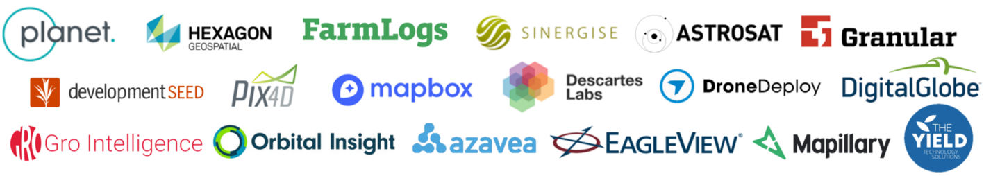
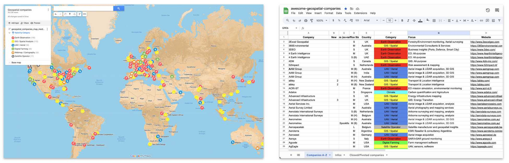

# Awesome Geospatial Companies 

List of 700+ geospatial companies & interactive map. For finding geospatial jobs, customers and understanding the geospatial industry! 

🛰️ Earth Observation 🌎 GIS / Spatial 🌿 Digital Farming ☁️️ Climate / Weather 🗺️ Webmap / Cartography 📡️ Satellite Operator ✈️ UAV / Aerial

  

  

Explore the list below, or as an <a href="https://www.google.com/maps/d/u/0/edit?mid=1SCCvhv3Tn3acV3EeY91dGxCdLuvSPGCH&ll=5.275933136532167%2C0&z=2">🗺️ Interactive Map</a> or a <a href="https://docs.google.com/spreadsheets/d/1oBwZ7hq68nXnRV7wuM3-Aae9uRDyjnIOIEQXgQZAoBQ/edit?usp=sharing">📝 Google Sheet!</a>

 

- Recent additions indicated with ❗
- Office size (S < 20, M 20-100, L > 100) is an estimate (LinkendIn, industry knowledge, job ads etc.)
- Relevant (B)ranch offices (non-sales office with sufficient amount of geo-related jobs) are listed separately.
- Focus on commercial companies, currently no research institues included.

Thank you to the many contributors! To contribute please see the 
[contribution guide](https://github.com/chrieke/awesome-geospatial-companies/blob/master/CONTRIBUTING.md). 

 

[:angola: Angola](https://github.com/chrieke/awesome-geospatial-companies#angola-angola) - [:argentina: Argentina](https://github.com/chrieke/awesome-geospatial-companies#argentina-argentina) - [:armenia: Armenia](https://github.com/chrieke/awesome-geospatial-companies#armenia-armenia) - [:australia: Australia](https://github.com/chrieke/awesome-geospatial-companies#australia-australia) - [:austria: Austria](https://github.com/chrieke/awesome-geospatial-companies#austria-austria) - [:azerbaijan: Azerbaijan](https://github.com/chrieke/awesome-geospatial-companies#azerbaijan-azerbaijan) - [:bahrain: Bahrain](https://github.com/chrieke/awesome-geospatial-companies#bahrain-bahrain) - [:bangladesh: Bangladesh](https://github.com/chrieke/awesome-geospatial-companies#bangladesh-bangladesh) - [:belgium: Belgium](https://github.com/chrieke/awesome-geospatial-companies#belgium-belgium) - [:bolivia: Bolivia](https://github.com/chrieke/awesome-geospatial-companies#bolivia-bolivia) - [:bosnia_herzegovina: Bosnia Herzegovina](https://github.com/chrieke/awesome-geospatial-companies#bosnia_herzegovina-bosnia-herzegovina) - [:brazil: Brazil](https://github.com/chrieke/awesome-geospatial-companies#brazil-brazil) - [:bulgaria: Bulgaria](https://github.com/chrieke/awesome-geospatial-companies#bulgaria-bulgaria) - [:cambodia: Cambodia](https://github.com/chrieke/awesome-geospatial-companies#cambodia-cambodia) - [:cameroon: Cameroon](https://github.com/chrieke/awesome-geospatial-companies#cameroon-cameroon) - [:canada: Canada](https://github.com/chrieke/awesome-geospatial-companies#canada-canada) - [:chile: Chile](https://github.com/chrieke/awesome-geospatial-companies#chile-chile) - [:cn: China](https://github.com/chrieke/awesome-geospatial-companies#cn-china) - [:colombia: Colombia](https://github.com/chrieke/awesome-geospatial-companies#colombia-colombia) - [:costa_rica: Costa Rica](https://github.com/chrieke/awesome-geospatial-companies#costa_rica-costa-rica) - [:croatia: Croatia](https://github.com/chrieke/awesome-geospatial-companies#croatia-croatia) - [:cyprus: Cyprus](https://github.com/chrieke/awesome-geospatial-companies#cyprus-cyprus) - [:czech_republic: Czech Republic](https://github.com/chrieke/awesome-geospatial-companies#czech_republic-czech-republic) - [:denmark: Denmark](https://github.com/chrieke/awesome-geospatial-companies#denmark-denmark) - [:egypt: Egypt](https://github.com/chrieke/awesome-geospatial-companies#egypt-egypt) - [:estonia: Estonia](https://github.com/chrieke/awesome-geospatial-companies#estonia-estonia) - [:finland: Finland](https://github.com/chrieke/awesome-geospatial-companies#finland-finland) - [:fr: France](https://github.com/chrieke/awesome-geospatial-companies#fr-france) - [:de: Germany](https://github.com/chrieke/awesome-geospatial-companies#de-germany) - [:greece: Greece](https://github.com/chrieke/awesome-geospatial-companies#greece-greece) - [:guatemala: Guatemala](https://github.com/chrieke/awesome-geospatial-companies#guatemala-guatemala) - [:hungary: Hungary](https://github.com/chrieke/awesome-geospatial-companies#hungary-hungary) - [:iceland: Iceland](https://github.com/chrieke/awesome-geospatial-companies#iceland-iceland) - [:india: India](https://github.com/chrieke/awesome-geospatial-companies#india-india) - [:indonesia: Indonesia](https://github.com/chrieke/awesome-geospatial-companies#indonesia-indonesia) - [:iran: Iran](https://github.com/chrieke/awesome-geospatial-companies#iran-iran) - [:iraq: Iraq](https://github.com/chrieke/awesome-geospatial-companies#iraq-iraq) - [:ireland: Ireland](https://github.com/chrieke/awesome-geospatial-companies#ireland-ireland) - [:israel: Israel](https://github.com/chrieke/awesome-geospatial-companies#israel-israel) - [:it: Italy](https://github.com/chrieke/awesome-geospatial-companies#it-italy) - [:jp: Japan](https://github.com/chrieke/awesome-geospatial-companies#jp-japan) - [:kenya: Kenya](https://github.com/chrieke/awesome-geospatial-companies#kenya-kenya) - [:laos: Laos](https://github.com/chrieke/awesome-geospatial-companies#laos-laos) - [:luxembourg: Luxembourg](https://github.com/chrieke/awesome-geospatial-companies#luxembourg-luxembourg) - [:malaysia: Malaysia](https://github.com/chrieke/awesome-geospatial-companies#malaysia-malaysia) - [:mexico: Mexico](https://github.com/chrieke/awesome-geospatial-companies#mexico-mexico) - [:montenegro: Montenegro](https://github.com/chrieke/awesome-geospatial-companies#montenegro-montenegro) - [:netherlands: Netherlands](https://github.com/chrieke/awesome-geospatial-companies#netherlands-netherlands) - [:new_zealand: New Zealand](https://github.com/chrieke/awesome-geospatial-companies#new_zealand-new-zealand) - [:nigeria: Nigeria](https://github.com/chrieke/awesome-geospatial-companies#nigeria-nigeria) - [:norway: Norway](https://github.com/chrieke/awesome-geospatial-companies#norway-norway) - [:pakistan: Pakistan](https://github.com/chrieke/awesome-geospatial-companies#pakistan-pakistan) - [:peru: Peru](https://github.com/chrieke/awesome-geospatial-companies#peru-peru) - [:poland: Poland](https://github.com/chrieke/awesome-geospatial-companies#poland-poland) - [:portugal: Portugal](https://github.com/chrieke/awesome-geospatial-companies#portugal-portugal) - [:romania: Romania](https://github.com/chrieke/awesome-geospatial-companies#romania-romania) - [:ru: Russia](https://github.com/chrieke/awesome-geospatial-companies#ru-russia) - [:rwanda: Rwanda](https://github.com/chrieke/awesome-geospatial-companies#rwanda-rwanda) - [:saudi_arabia: Saudi Arabia](https://github.com/chrieke/awesome-geospatial-companies#saudi_arabia-saudi-arabia) - [:serbia: Serbia](https://github.com/chrieke/awesome-geospatial-companies#serbia-serbia) - [:singapore: Singapore](https://github.com/chrieke/awesome-geospatial-companies#singapore-singapore) - [:slovakia: Slovakia](https://github.com/chrieke/awesome-geospatial-companies#slovakia-slovakia) - [:slovenia: Slovenia](https://github.com/chrieke/awesome-geospatial-companies#slovenia-slovenia) - [:south_africa: South Africa](https://github.com/chrieke/awesome-geospatial-companies#south_africa-south-africa) - [:kr: South Korea](https://github.com/chrieke/awesome-geospatial-companies#kr-south-korea) - [:es: Spain](https://github.com/chrieke/awesome-geospatial-companies#es-spain) - [:sri_lanka: Sri Lanka](https://github.com/chrieke/awesome-geospatial-companies#sri_lanka-sri-lanka) - [:sweden: Sweden](https://github.com/chrieke/awesome-geospatial-companies#sweden-sweden) - [:switzerland: Switzerland](https://github.com/chrieke/awesome-geospatial-companies#switzerland-switzerland) - [:taiwan: Taiwan](https://github.com/chrieke/awesome-geospatial-companies#taiwan-taiwan) - [:tanzania: Tanzania](https://github.com/chrieke/awesome-geospatial-companies#tanzania-tanzania) - [:thailand: Thailand](https://github.com/chrieke/awesome-geospatial-companies#thailand-thailand) - [:tr: Turkey](https://github.com/chrieke/awesome-geospatial-companies#tr-turkey) - [:united_arab_emirates: UAE](https://github.com/chrieke/awesome-geospatial-companies#united_arab_emirates-uae) - [:uk: UK](https://github.com/chrieke/awesome-geospatial-companies#uk-uk) - [:us: USA](https://github.com/chrieke/awesome-geospatial-companies#us-usa) - [:ukraine: Ukraine](https://github.com/chrieke/awesome-geospatial-companies#ukraine-ukraine) - [:uzbekistan: Uzbekistan](https://github.com/chrieke/awesome-geospatial-companies#uzbekistan-uzbekistan) - [:vietnam: Vietnam](https://github.com/chrieke/awesome-geospatial-companies#vietnam-vietnam) - [:zimbabwe: Zimbabwe](https://github.com/chrieke/awesome-geospatial-companies#zimbabwe-zimbabwe) - 

## :angola: Angola 
| Company (1)                            | Size & City                                                                                        | Focus              |
| :------------------------------------- | :------------------------------------------------------------------------------------------------- | :----------------- |
| [Topogis](https://www.topogis-ao.com/) | **S** [📍 Luanda](https://www.google.com/maps/search/Rua+Cónego+Manuel+das+Neves+,+Luanda,+Angola+) | 🌎 GIS: All-purpose |

 ## :argentina: Argentina 
| Company (6)                                       | Size & City                                                                                                                                    | Focus                                                         |
| :------------------------------------------------ | :--------------------------------------------------------------------------------------------------------------------------------------------- | :------------------------------------------------------------ |
| [Aeroterra](https://www.aeroterra.com/es-ar/home) | **M** [📍 Buenos Aires](https://www.google.com/maps/search/Calle+Carlos+M.+Della+Paolera+218,+Retiro,+Buenos+Aires,+Argentina+)                 | 🌎 ESRI Reseller & consultancy Argentinia                      |
| [Dymaxion Labs](https://dymaxionlabs.com/)        | **S** [📍 Buenos Aires](https://www.google.com/maps/search/Castillo+1366+1414+Buenos+Aires,+Ciudad+Autónoma+de+Buenos+Aires,+Argentina+)        | 🛰️ Monitoring drivers of economic development in Latin America |
| [Geosystems S.A.](https://www.geosystems.com.ar/) | **M** [📍 Buenos Aires](https://www.google.com/maps/search/Esteban+de+Luca+2223,+Capital+Federal,+Buenos+Aires+C1246ABS,+AR+)                   | 🌎 GIS software development                                    |
| [Kan Territory & IT](https://kan.com.ar/)         | **M** [📍 Buenos Aires](https://www.google.com/maps/search/Av.+Juan+Bautista+Justo+4701-4749,+C1416+Cdad.+Autónoma+de+Buenos+Aires,+Argentina+) | 🌎 GIS consultancy                                             |
| [Satellogic](https://www.satellogic.com)          | **M** (H) [📍 Ciudad](https://www.google.com/maps/search/Av.+Raúl+Scalabrini+Ortíz+3306,+C1425DCO+CABA,+Argentina+)                             | 📡 Cubesat 1m optical or 30m hyperspectral                     |
| [SpaceSUR](https://www.spacesur.com)              | **M** (H) [📍 Buenos Aires](https://www.google.com/maps/search/Av.+Rivadavia+611,+Piso+11+-+C1002AAE,+Ciudad+de+Buenos+Aires,+Argentina+)       | 🛰️ EO: All-purpose, InSAR, Geospatial Analytics                |

 ## :armenia: Armenia 
| Company (2)                              | Size & City                                                                                                      | Focus               |
| :--------------------------------------- | :--------------------------------------------------------------------------------------------------------------- | :------------------ |
| [Geovibe](https://geo-vibe.com/)         | **S** [📍 Yerevan](https://www.google.com/maps/search/41+Arshakunyats+Avenue,+Yerevan+0026,+Republic+of+Armenia+) | 🌎 GIS: All-purpose  |
| [Intelinair](https://www.intelinair.com) | **S** (H) [📍 Yerevan](https://www.google.com/maps/search/2/2+Melik+Adamyan+Street,+Yerevan,+Armenia+)            | 🌿 UAV crop insights |

 ## :australia: Australia 
| Company (53)                                                                  | Size & City                                                                                                                                                                                                                                                                                                                                         | Focus                                                                 |
| :---------------------------------------------------------------------------- | :-------------------------------------------------------------------------------------------------------------------------------------------------------------------------------------------------------------------------------------------------------------------------------------------------------------------------------------------------- | :-------------------------------------------------------------------- |
| [AAM Group](https://aamgroup.com/)                                            | **M** (B) [📍 Sydney](https://www.google.com/maps/search/33+Waterloo+Road,+Macquarie+Park+NSW+2113,+Australia+)   **M** (H) [📍 Brisbane](https://www.google.com/maps/search/Leichhardt+Court,+55+Little+Edward+Street,+Spring+Hill+QLD+4000,+Australia+)                                                                                        | ✈️ Aerial image & LiDAR acquisition, 3D GIS                            |
| [Aerial Survey Limited](https://www.aerialsurveys.co.nz/)                     | **M** [📍 Albany](https://www.google.com/maps/search/8+Saturn+Place,+Albany,+North+Shore,+Auckland+0632,+New+Zealand+)                                                                                                                                                                                                                               | ✈️ Aerial photography and mapping services                             |
| [Aerometrex](https://aerometrex.com.au/)                                      | **M** (H) [📍 Adelaide](https://www.google.com/maps/search/51-53+Glynburn+Rd,+Glynde,+SA+5070,+Australia+)   **M** (B) [📍 Perth](https://www.google.com/maps/search/10+Brodie-Hall+Dr,+Technology+Park,+Bentley,+6102,+Australia+)                                                                                                              | ✈️ Aerial image & LiDAR acquisition, 3D GIS                            |
| [Anditi](https://www.anditi.com/)                                             | **M** [📍 Newcastle](https://www.google.com/maps/search/287+King+St,+Newcastle,+New+South+Wales+2300,+Australia+)                                                                                                                                                                                                                                    | 🌎 GIS + EO: All-purpose                                               |
| [Arlula](https://www.arlula.com/)                                             | **S** [📍 Sydney](https://www.google.com/maps/search/608+Harris+St,+Ultimo+NSW+2007,+Australia+)                                                                                                                                                                                                                                                     | 🛰️ Single API for satellite imagery access                             |
| [Astron](https://www.astron.com.au/)                                          | **S** [📍 Perth](https://www.google.com/maps/search/129+Royal+Street,+East+Perth+WA+6004,+Australia+)                                                                                                                                                                                                                                                | 🛰️ Environmental consulting, remote sensing                            |
| [Beyond Essential Systems](https://www.bes.au/) ❗                             | **M** [📍 Melbourne](https://www.google.com/maps/search/89+Nicholson+St,+East+Brunswick,+VIC+3057,+Australia+)                                                                                                                                                                                                                                       | 🌎 Health systems support via digital solutions (including geospatial) |
| [Biosys](https://www.biosis.com.au/)                                          | **L** [📍 Melbourne](https://www.google.com/maps/search/38+Bertie+St,+Port+Melbourne+VIC+3207,+Australia+)                                                                                                                                                                                                                                           | 🌎 Ecology and Heritage Consulting                                     |
| [Core Logic](https://www.corelogic.co.nz/)                                    | **L** [📍 Wellington](https://www.google.com/maps/search/275+Cuba+St,+Te+Aro,+Wellington+6011,+New+Zealand+)                                                                                                                                                                                                                                         | 🌎 Property intelligence, Geospatial consulting                        |
| [DAS (Digital Agriculture Services)](https://digitalagricultureservices.com/) | **M** [📍 Melbourne](https://www.google.com/maps/search/M2+525+Collins+Street,+Melbourne,+Australia+)                                                                                                                                                                                                                                                | 🌎 SAAS for agriculture and finance                                    |
| [Dendra Systems](https://dendra.io/)                                          | **M** (B) [📍 Singleton](https://www.google.com/maps/search/112+John+St,+Singleton,+New+South+Wales+2330,+Australia+)                                                                                                                                                                                                                                | 🌎 Ecosystem Restoration Platform for Environmental Managers           |
| [ESRI](https://esriaustralia.com.au)                                          | **L** (B) [📍 Brisbane](https://www.google.com/maps/search/111+Elizabeth+Street,+Brisbane+QLD+4000,+Australia+)                                                                                                                                                                                                                                      | 🌎 ArcGIS software, GIS                                                |
| [Eco Logical Australia](https://www.ecoaus.com.au/)                           | **L** (H) [📍 Sutherland](https://www.google.com/maps/search/668+Old+Princes+Highway,+Sutherland,+NSW+2232,+Australia+)   **M** (B) [📍 Sydney](https://www.google.com/maps/search/101+Sussex+St,+Sydney,+NSW+2000,+Australia+)   **M** (B) [📍 Perth](https://www.google.com/maps/search/235+St+Georges+Terrace+Perth,+WA+6000,+Australia+) | 🌎 Environmental consultancy                                           |
| [Envirometrics](https://environmetrics.net/)                                  | **S** [📍 Brisbane](https://www.google.com/maps/search/10+Browning+St,+South+Brisbane+QLD+4101,+Australia+)                                                                                                                                                                                                                                          | 🛰️ EO: environmental monitoring & mining rehabilitation                |
| [FloodMapp](https://www.floodmapp.com/)                                       | **S** [📍 Brisbane](https://www.google.com/maps/search/315+Brunswick+St,+Fortitude+Valley,+Queensland+4006,+Australia+)                                                                                                                                                                                                                              | 🌎 Live flood mapping data                                             |
| [FrontierSI](https://frontiersi.com.au/)                                      | **M** [📍 Melbourne](https://www.google.com/maps/search/Village+Street,+Docklands,+VIC,+3008,+Melbourne,+Australia+)                                                                                                                                                                                                                                 | 🌎 Spatial mapping, infrastructure, positioning, geodesy               |
| [GIS People](https://www.gispeople.com.au/)                                   | **M** [📍 Brisbane](https://www.google.com/maps/search/27+Commercial+Road,+Newstead,+QLD+4006,+Australia+)                                                                                                                                                                                                                                           | 🌎 Spatial data insights plattform development, geospatial consultancy |
| [Gaia Ressources](https://www.gaiaresources.com.au/)                          | **M** [📍 Perth](https://www.google.com/maps/search/191+St+Georges+Terrace,+Perth,+Western+Australia+6000,+AU+)                                                                                                                                                                                                                                      | 🌎 Environmental technology consultancy                                |
| [Geo Image](https://www.geoimage.com.au/)                                     | **S** [📍 Brisbane](https://www.google.com/maps/search/72+Costin+St,+Fortitude+Valley,+Queensland+4006,+Australia+)                                                                                                                                                                                                                                  | 🛰️ EO: All-purpose                                                     |
| [Geoimage](https://www.geoimage.com.au)                                       | **S** [📍 Brisbane](https://www.google.com/maps/search/72+Costin+Street,+Fortitude+Valley+QLD+4006,+Australia+)                                                                                                                                                                                                                                      | 🛰️ EO consultancy                                                      |
| [Geoscape](https://geoscape.com.au/)                                          | **M** [📍 Canberra](https://www.google.com/maps/search/113+Canberra+Avenue,+Griffith,+Canberra,+ACT+2603,+Australia+)                                                                                                                                                                                                                                | 🌎 Location data-as-a-service                                          |
| [Geospatial Australia](https://www.geospatial.land/)                          | **S** [📍 Dubbo](https://www.google.com/maps/search/274+Macquarie+Street,+Dubbo,+NSW+2830,+Australia+)                                                                                                                                                                                                                                               | 🌎 GIS: All-purpose                                                    |
| [Geospatial Intelligence PTY LTD](https://geoint.com.au/)                     | **M** [📍 Canberra](https://www.google.com/maps/search/42+Macquarie+Street+Barton+ACT,+Canberra,+2600+Australia+)                                                                                                                                                                                                                                    | 🌎 GIS: Environment, natural resource management, defence and security |
| [HQPlantations](https://www.hqplantations.com.au/)                            | **M** [📍 North Lakes](https://www.google.com/maps/search/3a/2+Flinders+Parade,+North+Lakes+QLD+4509,+Australia+)                                                                                                                                                                                                                                    | 🌎 Forest Management                                                   |
| [HyVista Corporation](https://hyvista.com/)                                   | **S** [📍 Castle Hill](https://www.google.com/maps/search/1/3+Salisbury+Rd,+Castle+Hill+NSW+2154,+Australia+)                                                                                                                                                                                                                                        | ✈️ Hyperspectral aerial RS & photogrammetry                            |
| [Latconnect](https://latconnect60.com/)                                       | **S** [📍 Perth](https://www.google.com/maps/search/191+St+Georges+Terrace,+Perth,+Australia+)                                                                                                                                                                                                                                                       | 📡 Multispectral and hyperspectral satellites                          |
| [Location IQ](https://locationiq.com.au/)                                     | **M** [📍 Sydney](https://www.google.com/maps/search/19+Martin+Place,+Sydney,+New+South+Wales+2000,+Australia+)                                                                                                                                                                                                                                      | 🌎 Property economics advisory                                         |
| [Lotssearch](https://www.lotsearch.com.au/)                                   | **M** [📍 Sydney](https://www.google.com/maps/search/68+Alfred+Street,+Milsons+Point,+Sydney,+NSW+2061,+Australia+)                                                                                                                                                                                                                                  | 🌎 Environmental risk mapping                                          |
| [Mammoth Geospatial](https://mammothgeospatial.com) ❗                         | **S** [📍 Perth](https://www.google.com/maps/search/Fremantle,+WA+6160,+Australia+)                                                                                                                                                                                                                                                                  | 🌎 Open source GIS consulting & training                               |
| [Mapizy](https://mapizy.com/)                                                 | **S** [📍 Crawley](https://www.google.com/maps/search/UWA+School+of+Computer+Science,+Crawley+WA+6009,+​Australia+)                                                                                                                                                                                                                                  | 🛰️ Infrastructure and natural ressources monitoring                    |
| [Maptek](https://www.maptek.com/)                                             | **L** (H) [📍 Adelaide](https://www.google.com/maps/search/31+Flemington+Street,+Glenside,+Adelaide,+SA+5065,+Australia+)                                                                                                                                                                                                                            | 🌎 Mining decision-making support solutions                            |
| [NGIS](https://ngis.com.au/)                                                  | **S** [📍 Sydney](https://www.google.com/maps/search/300+Barangaroo+Ave,+Sydney+NSW+2000,+Australia+)   **M** (H) [📍 Perth](https://www.google.com/maps/search/1a/53+Burswood+Road,+Burswood+WA+6100,+Australia+)                                                                                                                               | 🌎 GIS + EO: All purpose                                               |
| [Nearmap](https://www.nearmap.com/us/en)                                      | **L** [📍 Sydney](https://www.google.com/maps/search/Tower+One,+100+Barangaroo+Avenue,+Barangaroo,+NSW+2000,+Australia+)                                                                                                                                                                                                                             | ✈️ High-res aerial maps                                                |
| [Outline Global](https://outlineglobal.com.au)                                | **S** [📍 Mirrabooka](https://www.google.com/maps/search/Doncaster+Road,+Mirrabooka+Western+Australia+6061,+Australia+)                                                                                                                                                                                                                              | 🛰️ EO data reseller, GIS services                                      |
| [Ozius Spatial](https://ozius.earth/#intro)                                   | **S** [📍 Brisbane](https://www.google.com/maps/search/Camp+Hill+QLD,+4152,+Australia+)                                                                                                                                                                                                                                                              | 🛰️ EO: environmental monitoring, land management                       |
| [Pelicancorp](https://www.pelicancorp.com/us/home)                            | **M** [📍 Richmond](https://www.google.com/maps/search/2/600+Victoria+St,+Richmond+VIC+3121,+Australia+)                                                                                                                                                                                                                                             | 🌎 Utilities & asset infrastructure monitoring                         |
| [Plotlogic](https://www.plotlogic.com/)                                       | **M** [📍 Red Hill](https://www.google.com/maps/search/25+Musgrave+Rd,+Red+Hill,+Queensland+4059,+Australia+)                                                                                                                                                                                                                                        | 🛰️ Mining Exploration                                                  |
| [Propeller Aero](https://www.propelleraero.com/)                              | **L** (H) [📍 Surry](https://www.google.com/maps/search/251+Riley+Street,+Surry+Hills,+NSW+2010,+Australia+)                                                                                                                                                                                                                                         | ✈️ UAV 3D mapping and data analytics solutions                         |
| [Reask](https://reask.earth/)                                                 | **M** [📍 Sydney](https://www.google.com/maps/search/11+York+Street,+Sydney,+NSW+2000,+Australia+)                                                                                                                                                                                                                                                   | ☁️ Weather hazard prediction for risk management                       |
| [Revelare](https://revelare.com.au/)                                          | **S** [📍 Revelare](https://www.google.com/maps/search/119+Condon+St,+Kennington,+Victoria+3550,+Australia+)                                                                                                                                                                                                                                         | ✈️ Photomapping Services & LiDAR                                       |
| [Risk Frontiers](https://riskfrontiers.com/)                                  | **M** [📍 St Leonards](https://www.google.com/maps/search/100+Christie+St,+St+Leonards,+New+South+Wales+2065,+Australia+)                                                                                                                                                                                                                            | 🌎 Natural hazard risk and catastrophe modelling                       |
| [SLR Consulting](https://www.slrconsulting.com/)                              | **M** [📍 West Leederville](https://www.google.com/maps/search/10+Bermondsey+Street,+West+Leederville,+Western+Australia+6007,+Australia+)                                                                                                                                                                                                           | 🌎 Environmental Consultants & Services                                |
| [Seequent](https://www.seequent.com/)                                         | **M** (B) [📍 Perth](https://www.google.com/maps/search/11+Mounts+Bay+Road,+Perth,+Australia+)                                                                                                                                                                                                                                                       | 🌎 Earth modelling & geo-data management software                      |
| [Sensorem](https://sensorem.com.au/)                                          | **S** [📍 Perth](https://www.google.com/maps/search/A4/435+Roberts+Rd,+Subiaco+WA+6008,+Australia+)                                                                                                                                                                                                                                                  | ✈️ Drone & software solutions for remote inspections                   |
| [SkedGo](https://skedgo.com/) ❗                                               | **S** [📍 Sydney](https://www.google.com/maps/search/17-19+Bridge+St,+Sydney,+New+South+Wale+2000,+Australia+)                                                                                                                                                                                                                                       | 🌎 Mobile trip planning services & APIs                                |
| [Soar](https://about.soar.earth/index.html)                                   | **S** [📍 Belmont](https://www.google.com/maps/search/2+Cowcher+Pl,+Belmont,+Western+Australia+6104,+Australia+)                                                                                                                                                                                                                                     | 🗺️ Distribution & collaboration platform for EO imagery & maps         |
| [Spatial Distillery](https://spatialdistillery.com/)                          | **S** [📍 Melbourne](https://www.google.com/maps/search/425+Smith+St,+Fitzroy,+Victoria+3065,+Australia+)                                                                                                                                                                                                                                            | 🌎 Location intelligence & spatial data solutions                      |
| [Spatial Services](https://www.spatial-services.com/en/spatial-services-ltd/) | **S** [📍 Salzburg](https://www.google.com/maps/search/Schillerstraße+30,+A-5020+Salzburg,+Germany+)                                                                                                                                                                                                                                                 | 🌎 GIS+EO: All-purpose                                                 |
| [Spatial Vision](https://spatialvision.com.au/)                               | **M** [📍 Melbourne](https://www.google.com/maps/search/575+Bourke+Street,+Melbourne+3000,+Australia+)                                                                                                                                                                                                                                               | 🌎 Geospatial consultancy, App/IT, cartography                         |
| [Spectrum Ecology & Spatial](https://spectrumecology.com.au/)                 | **S** [📍 Leederville](https://www.google.com/maps/search/660c+Newcastle+St,+Leederville,+Western+Australia+6007,+AU+)                                                                                                                                                                                                                               | 🌎 Environmental consultancy                                           |
| [Sprial Blue](https://spiralblue.space/)                                      | **S** [📍 Sydney](https://www.google.com/maps/search/1/39+Wellington+St,+Chippendale+NSW+2008,+Australia+)                                                                                                                                                                                                                                           | 🛰️ EO satellite edge computing                                         |
| [The Yield](https://www.theyield.com)                                         | **M** [📍 Sydney](https://www.google.com/maps/search/Holt+Street+50,+Surry+Hills,+Sydney,+NSW+2010,+Australia+)                                                                                                                                                                                                                                      | 🌎 Agriculture and aquaculture insights platform                       |
| [eratos](https://www.eratos.com/)                                             | **S** [📍 Richmond](https://www.google.com/maps/search/487+Swan+St,+Level+2,+Richmond,+Victoria+3121,+Australia+)                                                                                                                                                                                                                                    | 🌎 Data platform                                                       |

 ## :austria: Austria 
| Company (13)                                                      | Size & City                                                                                                     | Focus                                                               |
| :---------------------------------------------------------------- | :-------------------------------------------------------------------------------------------------------------- | :------------------------------------------------------------------ |
| [Airborne Technologies](https://www.airbornetechnologies.at/en/)  | **M** [📍 Wien](https://www.google.com/maps/search/Viktor+Lang-Straße+8,+2700+Wiener+Neustadt,+Austria+)         | ✈️ Aerial multisensor acquisitions, analysis                         |
| [BlackShark](https://blackshark.ai/)                              | **M** [📍 Graz](https://www.google.com/maps/search/Kaiserfeldgasse+1/1/2,+8010+Graz,+Austria+)                   | 🌎 3D Digital Twin                                                   |
| [EOX IT Services](https://eox.at)                                 | **S** [📍 Wien](https://www.google.com/maps/search/Thurngasse+8,+1090+Wien,+Austria+)                            | 🛰️ "Sentinel 2 cloudless", EO data infrastructure                    |
| [EnliteAI GmbH](https://www.enlite.ai/)                           | **S** [📍 Vienna](https://www.google.com/maps/search/Wollzeile+24/14,+Vienna,+Wien+1010,+Asurtia+)               | 🌎 AI / GeoAI development                                            |
| [Geoville](https://www.geoville.com)                              | **M** [📍 Innsbruck](https://www.google.com/maps/search/Sparkassenplatz+2,+A+-+6020+Innsbruck,+Austria+)         | 🛰️ EO: All-purpose                                                   |
| [Necture](https://www.necture.com/)                               | **M** [📍 Vienna](https://www.google.com/maps/search/Treustrasse+22-24,+Wien,+1200,+Austria+)                    | 🌎 Car fleet solutions                                               |
| [Sentinelhub Austria](https://www.sentinel-hub.at/)               | **M** [📍 Graz](https://www.google.com/maps/search/Eggenberger+Allee+49,+Graz,+Styria+8020,+Austria+)            | 🛰️ EO: All-purpose, subsidary of Sinergise (sentinelhub data portal) |
| [Sistema GmbH](https://sistema.at/)                               | **S** [📍 Vienna](https://www.google.com/maps/search/Tiefer+Graben+19/2,+1050+Vienna,+Austria+)                  | ☁️ EO for atmospheric composition, climate change, AI for emergency  |
| [SynerGIS Informationssysteme GmbH](https://www.esri-austria.at/) | **S** [📍 Wien](https://www.google.com/maps/search/Technologiestraße+10/2E,+A-1120+Wien,+Austria+)               | 🌎 ESRI distributor Austria                                          |
| [Umweltdata](https://umweltdata.at/)                              | **S** [📍 Tullnerbach](https://www.google.com/maps/search/Knabstraße+7/4,+3013+Tullnerbach,+Austria+)            | 🌎 LIDAR and Drones in Forest Inventory                              |
| [Vertigis](https://www.vertigis.com/)                             | **M** (B) [📍 Innsbruck](https://www.google.com/maps/search/Wilhelm-Greil-Straße+17,+A-6020+Innsbruck,+Austria+) | 🌎 GIS: All-purpose                                                  |
| [eodc](https://eodc.eu/)                                          | **S** [📍 Vienna](https://www.google.com/maps/search/Franz-Grill-Straße+9,+Vienna,+1030,+Austria+)               | 🛰️ EO: Data Centre for Water Resources Monitoring                    |
| [ms.GIS](https://www.msgis.com/)                                  | **S** [📍 Mödling](https://www.google.com/maps/search/Bahnhofplatz+1a,+Mödling,+Niederösterreich+2340,+Austria+) | 🌎 Geo Solutions for Cities, Government, Infrastructure              |

 ## :azerbaijan: Azerbaijan 
| Company (2)                                        | Size & City                                                                                                         | Focus                                                    |
| :------------------------------------------------- | :------------------------------------------------------------------------------------------------------------------ | :------------------------------------------------------- |
| [Caspian Geomatics](https://caspiangeomatics.com/) | **S** [📍 Baku](https://www.google.com/maps/search/55+Khojali+Avenue,+Baku+1025,+Azerbaijan+)                        | 🌎 Geomatics, Hydrography survey & environmental services |
| [Datum](https://datum.az/)                         | **M** [📍 Baku](https://www.google.com/maps/search/Afiyeddin+Jalilov+Street+20,+9+floor,+Baku,+AZ+1025,+Azerbaijan+) | 🌎 GIS + EO: All-purpose                                  |

 ## :bahrain: Bahrain 
| Company (1)                                                                    | Size & City                                                                                                                      | Focus                   |
| :----------------------------------------------------------------------------- | :------------------------------------------------------------------------------------------------------------------------------- | :---------------------- |
| [Microcenter GIS Solutions](https://www.microcentergulf.com/gis-solutions.php) | **M** [📍 Al Janabiyah](https://www.google.com/maps/search/Road+No:7544+Building+3050+Block:+575,+Al+Janabiyah,+Manama,+Bahrain+) | 🌎 ESRI distributor, GIS |

 ## :bangladesh: Bangladesh 
| Company (4)                                                     | Size & City                                                                                                             | Focus                                    |
| :-------------------------------------------------------------- | :---------------------------------------------------------------------------------------------------------------------- | :--------------------------------------- |
| [Arc Bangladesh](https://arcbangladesh.business.site/)          | **L** [📍 Dhaka](https://www.google.com/maps/search/6/5,+Block+-+B,+Lalmatia,+Dhaka-1219,+Bangladesh+)                   | 🌎 GIS & Engineering consultancy          |
| [Digital Survey & GIS Services (DSGS)](https://www.dsgsbd.com/) | **S** [📍 Dhaka](https://www.google.com/maps/search/126/3,+Monipuripara,+Airport+Road,+Tejgaon,+Dhaka-1215,+Bangladesh+) | 🌎 GIS: All-purpose                       |
| [HawarIT Limited](https://www.hawarit.com/)                     | **M** [📍 Dhaka](https://www.google.com/maps/search/Narsinghapur,+Zirabo,+Ashulia,+Dhaka,+Dhaka+1341,+Bangladesh+)       | 🌎 GIS application development & services |
| [iFarmer Asia](https://ifarmer.asia/en/home)                    | **L** [📍 Dhaka](https://www.google.com/maps/search/Road+-+81,+Gulshan+2,+Dhaka+1212,+Bangladesh+)                       | 🌿 Farming supply chain platform          |

 ## :belgium: Belgium 
| Company (13)                                          | Size & City                                                                                                                                                                                                               | Focus                                                      |
| :---------------------------------------------------- | :------------------------------------------------------------------------------------------------------------------------------------------------------------------------------------------------------------------------ | :--------------------------------------------------------- |
| [Aerospacelab](https://www.aerospacelab.be/)          | **L** [📍 Mont-Saint-Guibert](https://www.google.com/maps/search/Rue+André+Dumont+9,+1435,+Mont-Saint-Guibert,+Belgium+)                                                                                                   | 📡 Satellite manufacturer and geospatial insights           |
| [ConstellR](https://www.constellr.com/)               | **S** [📍 Liege](https://www.google.com/maps/search/Rue+des+Chasseurs+Ardennais+6,+Liège,+Walloon+Region+4031,+Belgium+)                                                                                                   | 📡 Hyperspectral satellite constellation                    |
| [ESRI](https://www.esribelux.com/en-be/home)          | **M** (B) [📍 Wemmel](https://www.google.com/maps/search/54,+Nerviërslaan,+B-+1780+Wemmel,+Belgium+)                                                                                                                       | 🌎 ArcGIS software, GIS                                     |
| [Eurosense](https://www.eurosense.com/)               | **M** (H) [📍 Wemmel](https://www.google.com/maps/search/Nerviërslaan+54,+B-1780+WEMMEL,+BELGIUM+)                                                                                                                         | ✈️ Aerial imagery & LiDAR acquisition, all-purpose analysis |
| [Geo Solutions](https://geosolutions.be/)             | **M** [📍 Edegem](https://www.google.com/maps/search/Prins+Boudewijnlaan+41,+2650+Edegem,+Belgium+)                                                                                                                        | 🌎 GIS, Fleet management, Routing                           |
| [Gim](https://www.gim.be/en)                          | **S**  (B) [📍 Gembloux](https://www.google.com/maps/search/Rue+Camille+Hubert+13C+-+5032+Gembloux,+Belgium+)   **M** (H) [📍 Leuven](https://www.google.com/maps/search/Philipssite+5+bus+27+-+3001+Leuven,+Belgium+) | 🌎 GIS+EO: All-purpose                                      |
| [HydroScan Group](https://www.hydroscan.eu/en/home/)  | **M** [📍 Vlaams-Brabant](https://www.google.com/maps/search/Diestsesteenweg+104A,+Kessel-Lo,+Vlaams-Brabant+3010,+Belgium+)                                                                                               | 🌎 Water environmental services                             |
| [Inflights](https://inflights.com/)                   | **S** [📍 Brussels](https://www.google.com/maps/search/Cantersteen+10+BeCentral,+1000+Brussel,+Belgium+)                                                                                                                   | ✈️ Drones for remote inspections                            |
| [Merkator BV](https://www.merkator.com/)              | **M** (B) [📍 Belgium](https://www.google.com/maps/search/Vliegwezenlaan+48,+1731+Zellik,+Belgium+)                                                                                                                        | 🌎 Geo-ICT Consultants for Goverment and  Utilities & Telco |
| [Spacebel](https://www.spacebel.com/)                 | **M** [📍 Angleur](https://www.google.com/maps/search/Rue+des+Chasseurs+Ardennais+6,+LIEGE+science+park,+4031+Angleur,+Belgium+)                                                                                           | 🛰️ Space systems engineering & EO applications              |
| [TomTom](https://www.tomtom.com)                      | **L** (B) [📍 Housse](https://www.google.com/maps/search/Rue+Richassa+32,+4671+Housse,+Belgium+)                                                                                                                           | 🌎 GIS for navigation                                       |
| [Vito Remote Sensing](https://remotesensing.vito.be/) | **M** [📍 Mol](https://www.google.com/maps/search/Boeretang+200,+2400+Mol,+Belgium+)                                                                                                                                       | 🛰️ Large scale EO image processing, Terrascope platform     |
| [kpler](https://www.kpler.com/)                       | **L** [📍 Brussels](https://www.google.com/maps/search/Keltenlaan+20/8,+1040+Brussels,+Belgium+)                                                                                                                           | 🌎 Global trade intelligence                                |

 ## :bolivia: Bolivia 
| Company (1)                                | Size & City                                                                                                 | Focus              |
| :----------------------------------------- | :---------------------------------------------------------------------------------------------------------- | :----------------- |
| [Igeo](https://www.igeo.com.bo/es-bo/home) | **S** [📍 Santa Cruz](https://www.google.com/maps/search/Santa+Cruz+de+la+Sierra,+Santa+Cruz+0000,+Bolivia+) | 🌎 ESRI distributor |

 ## :bosnia_herzegovina: Bosnia Herzegovina 
| Company (3)                                          | Size & City                                                                                                       | Focus                             |
| :--------------------------------------------------- | :---------------------------------------------------------------------------------------------------------------- | :-------------------------------- |
| [Gauss Geoinformation Systems](https://gauss.ba/en/) | **S** [📍 Tuzla](https://www.google.com/maps/search/Stupine+B2,+75000+Tuzla,+Bosnia+and+Herzegowina+)              | 🌎 GIS: All-purpose                |
| [GeoGis](https://www.geogis.ba/)                     | **S** [📍 Sarajevo](https://www.google.com/maps/search/Ferde+Hauptmana+7,+Sarajevo+71000,+Bosnia+and+Herzegowina+) | 🌎 Surveying, GIS, and 3D modeling |
| [Geobiro](https://www.geobiro.ba/)                   | **M** [📍 Konjic](https://www.google.com/maps/search/Pleha+2A,+88+400+Konjic,+Bosnia+and+Herzegovina+)             | 🌎 3D Modelling, Building Survey   |

 ## :brazil: Brazil 
| Company (19)                                                           | Size & City                                                                                                                                                                                                                                                                 | Focus                                                                        |
| :--------------------------------------------------------------------- | :-------------------------------------------------------------------------------------------------------------------------------------------------------------------------------------------------------------------------------------------------------------------------- | :--------------------------------------------------------------------------- |
| [Agrooffico](https://www.agrofficio.com.br/)                           | **S** [📍 Piracicaba](https://www.google.com/maps/search/Butantã,+São+Paulo+-+State+of+São+Paulo,+05508-000,+Brazil+)                                                                                                                                                        | 🌎 EO: All-purpose                                                            |
| [Agrosatellite](https://agrosatelite.com.br)                           | **M** [📍 Florianópolis](https://www.google.com/maps/search/SC-401+Highway+8600,+Santo+Antonio+de+Lisboa,+Florianópolis,+Brazil+)                                                                                                                                            | 🛰️ EO for agriculture, GIS development                                        |
| [Arpeggeo](https://arpeggeo.tech) ❗                                    | **S** [📍 Sao Paulo](https://www.google.com/maps/search/Avenida+Paulista,+1106,+Sala+01,+Andar+16,+Edifício+Elijass+Gliks-Manis,+São+Paulo+)                                                                                                                                 | 🌎 Core geospatial & geostatistics libraries                                  |
| [Audsat](https://www.audsat.com.br/)                                   | **S** [📍 Sao Paulo](https://www.google.com/maps/search/Al.+Santos,+1773,+São+Paulo,+SP+01255-000,+Brazil+)                                                                                                                                                                  | 🌿 AG financing & support platform                                            |
| [Canopy Remote Sensing Solutions](https://canopyrss.com.br/)           | **S** [📍 Florianópolis](https://www.google.com/maps/search/4150+Rod.+José+Carlos+Daux,+Florianópolis,+SC+88032-005,+Brazil+)                                                                                                                                                | 🛰️ Forest mapping, inventory, and monitoring                                  |
| [Climate Corperation](https://www.climate.com)                         | **M** (B) [📍 São Paulo,](https://www.google.com/maps/search/Av.+das+Nações+Unidas+12.901,+Torre+Norte+–+7o+andar,+São+Paulo,+04578-910,+Brazil+)                                                                                                                            | 🌿 "Field View" crop insights platform                                        |
| [ECCON](https://ecconsa.com.br/) ❗                                     | **M** [📍 Sao Paulo](https://www.google.com/maps/search/Rua+D.+Fernandes+Coelho,+Pinheiros,+CEP+05423-911,+São+Paulo,+Brazil+)                                                                                                                                               | 🌎 Environment consulting                                                     |
| [Engemap](https://engemap.com.br/)                                     | **S** (B) [📍 Boa Vista](https://www.google.com/maps/search/Av.+Santos+Dumont,+160+-+Aparecida,+Boa+Vista+-+RR,+Brazil+)   **S** (B) [📍 Chác. Sto. Antônio](https://www.google.com/maps/search/R.+Alexandre+Dumas,+1601+Cj.+67,+Chác.+Sto.+Antônio,+04717-004,+Brazil+) | 🌎 GIS, infrastructure feasibility Studies, aerial image acquisition, mapping |
| [Engemap](https://engemap.com.br/)                                     | **S** [📍 São Paulo](https://www.google.com/maps/search/Rua+Alexandre+Dumas,+1601+6º+andar+CJ+67,+São+Paulo,+Brazil+)                                                                                                                                                        | 🌎 GIS: All-purpose, aerial survey                                            |
| [Geo3topografia](https://geo3topografia.com.br/)                       | **S** [📍 Resende](https://www.google.com/maps/search/R.+Luís+Ferreira+Pinto,+80+-+32+-+Manejo,+Resende+-+RJ,+27520-330,+Brazil+)                                                                                                                                            | 🌎 Cadastre, GIS services for energy, mining, urban                           |
| [Geoambiente](https://www.geoambiente.com.br)                          | **M** [📍 Urbanova](https://www.google.com/maps/search/São+José+dos+Campos+-+SP,+CEP:+12244-000,+Brazil+)                                                                                                                                                                    | 🌎 GIS & EO: All-purpose                                                      |
| [Geodados](https://www.geodados.com.br/)                               | **M** [📍 São José do Rio Preto](https://www.google.com/maps/search/Rua+Inglaterra,+840+Vila+Nossa+Senhora+de+Fátima,+São+José+do+Rio+Preto,+Brazil+)                                                                                                                        | 🌎 Geoprocessing platform for municipalities                                  |
| [Imagem](https://www.img.com.br/pt-br/home)                            | **L** [📍 São José dos Campos](https://www.google.com/maps/search/Rua+Itororó,+555+-+Vila+Cardoso,+São+José+dos+Campos,+Brazil+)                                                                                                                                             | 🌎 GIS: All-purpose, ESRI reseller                                            |
| [ORN Space](https://www.ornspace.com/) ❗                               | **S** [📍 Florianopolis](https://www.google.com/maps/search/Avenida+Prefeito+Osmar+Cunha,+416,+Florianopolis,+Brazil+)                                                                                                                                                       | 🌎 Geospatial Analytics                                                       |
| [TecTerra Geotecnologias](https://tecterra.com.br)                     | **S** [📍 Nova Lima City](https://www.google.com/maps/search/89,+Alameda+do+Ingá+Street,+Nova+Lima+City,+Minas+Gerais+State,+Brazil+)                                                                                                                                        | 🛰️ Land monitoring, digital terrain modeling, geospatial data reseller        |
| [TerraGIS](https://www.terragis.com.br/)                               | **S** [📍 Rio de Janeiro](https://www.google.com/maps/search/Rio+de+Janeiro+-+RJ+-+Brazil+)                                                                                                                                                                                  | 🌎 GIS: All-purpose                                                           |
| [Visiona Tecnologia Espacial S.A.](https://www.visionaespacial.com.br) | **M** [📍 São Paulo](https://www.google.com/maps/search/500+Distrito+de+Eugênio+de+Melo,+São+José+dos+Campos,+São+Paulo,+Brazil+)                                                                                                                                            | 🛰️ Satellite & EO coordination with defence focus, EO image reseller          |
| [Yara International](https://www.yara.com/)                            | **L** (B) [📍 Sao Paulo](https://www.google.com/maps/search/R.+Diogo+Moreira,+184+-+Pinheiros,+São+Paulo+-+SP,+05423-010,+Brazil+)                                                                                                                                           | 🌿 Digital farming solutions                                                  |
| [codex](https://codex.com.br/)                                         | **L** [📍 Porto Alegre](https://www.google.com/maps/search/Av.+Andrade+Neves,+2412,+Sala+02+T,+Campinas+–+SP,+13070-001,+Brasil+)                                                                                                                                            | 🛰️ IT & Environmental consultancy                                             |

 ## :bulgaria: Bulgaria 
| Company (5)                                     | Size & City                                                                                                                   | Focus                                                      |
| :---------------------------------------------- | :---------------------------------------------------------------------------------------------------------------------------- | :--------------------------------------------------------- |
| [Bitmap Bulgaria](https://bitmap-bulgaria.com/) | **S** [📍 Sofia](https://www.google.com/maps/search/Sofia+1582,+z.k.+Druzhba+bl.+291,+Bulgaria+)                               | 🌎 GIS: All-purpose                                         |
| [ESRI](https://esribulgaria.com/)               | **M** (B) [📍 Hladilnika](https://www.google.com/maps/search/bul.+"Nikola+Y.+Vaptsarov"+35,+1407+Hladilnika,+Sofia,+Bulgaria+) | 🌎 ArcGIS software, GIS                                     |
| [Eurosense](https://www.eurosense.com/)         | **S** (B) [📍 Hladilnika](https://www.google.com/maps/search/bul.+"Nikola+Y.+Vaptsarov"+35,+1407+Hladilnika,+Sofia,+Bulgaria+) | ✈️ Aerial imagery & LiDAR acquisition, all-purpose analysis |
| [GAP Consult](https://gapconsult.bg/)           | **S** [📍 Sofia](https://www.google.com/maps/search/48,+Evlogi+Georgiev+Bldv,+Sofia,+1504,+Bulgaria+)                          | 🌎 GIS consultancy                                          |
| [GIS Sofia](https://www.gis-sofia.bg/en/)       | **S** [📍 Sofia](https://www.google.com/maps/search/5+Serdika+Str.,+Sofia+1000,+Bulgaria+)                                     | 🌎 Land Surveying & GIS                                     |

 ## :cambodia: Cambodia 
| Company (1)                                        | Size & City                                                                                                          | Focus              |
| :------------------------------------------------- | :------------------------------------------------------------------------------------------------------------------- | :----------------- |
| [Aruna Technologies](https://arunatechnology.com/) | **M** [📍 Phnom Penh](https://www.google.com/maps/search/417+Sisowath+Blvd,+Sangkat+Chaktomuk,+Phnom+Penh,+Cambodia+) | 🌎 GIS: All-purpose |

 ## :cameroon: Cameroon 
| Company (1)                         | Size & City                                                                                | Focus              |
| :---------------------------------- | :----------------------------------------------------------------------------------------- | :----------------- |
| [Immergis](https://immergis.fr/en/) | **S** (B) [📍 Yaoundé](https://www.google.com/maps/search/Rue+Elig+Efi,+Yaoundé,+Cameroon+) | 🌎 GIS: All-purpose |

 ## :canada: Canada 
| Company (38)                                                    | Size & City                                                                                                                                                                                                                                                                                                                             | Focus                                                                 |
| :-------------------------------------------------------------- | :-------------------------------------------------------------------------------------------------------------------------------------------------------------------------------------------------------------------------------------------------------------------------------------------------------------------------------------- | :-------------------------------------------------------------------- |
| [3vGeomatics](https://3vgeomatics.com/)                         | **M** [📍 Vancouver](https://www.google.com/maps/search/2233+Columbia+Street,+Vancouver,+BC,+Canada+)                                                                                                                                                                                                                                    | 🛰️ InSAR for hazard monitoring                                         |
| [4DM](https://www.4dm-inc.com/)                                 | **S** [📍 Toronto](https://www.google.com/maps/search/671+Danforth+Ave.,+Toronto,+ON,+Canada+)                                                                                                                                                                                                                                           | 🌎 GIS: All-purpose                                                    |
| [Auracle Remote Sensing](https://www.auracleremotesensing.com/) | **S** [📍 Vancouver](https://www.google.com/maps/search/1435+West+Georgia+Street,+Vancouver,+BC,+V6E+4A2,+Canada+)                                                                                                                                                                                                                       | 🛰️ EO for energy deposit modeling                                      |
| [Avenza International](https://www.avenza.com/)                 | **L** [📍 Toronto](https://www.google.com/maps/search/84+Merton+Street,+Toronto,+ON,+Canada+)                                                                                                                                                                                                                                            | 🌎 GIS software and mobile mapping apps development                    |
| [C-Core](https://www.c-core.ca)                                 | **M** [📍 St. John's](https://www.google.com/maps/search/Morrissey+Road,+St.+John's,+NL,+Canada+)                                                                                                                                                                                                                                        | 🛰️ EO: All-purpose                                                     |
| [Cartovista](https://cartovista.com)                            | **S** [📍 Gatinbeau](https://www.google.com/maps/search/37+Saint-Joseph+Blvd,+Gatineau,+Quebec,+Canada+)                                                                                                                                                                                                                                 | 🗺️ Webmap SDK, services                                                |
| [Catalyst](https://www.pcigeomatics.com)                        | **M** (H) [📍 Markham](https://www.google.com/maps/search/90+Allstate+Parkway,+Markham,+Ontario,+Canada+)   **M** (B) [📍 Gatineau](https://www.google.com/maps/search/490+Saint+Joseph+Blvd.,+Gatineau,+Quebec,+Canada+)                                                                                                            | 🛰️ "Geomatica" for remote sensing, photogrammetry, geospatial analysis |
| [Chaac Technologies Inc.](https://chaac.tech)                   | **S** [📍 Montreal](https://www.google.com/maps/search/201-4710+Saint-Ambroise,+Montréal,+Québec,+Canada+)                                                                                                                                                                                                                               | 🌎 Mobile data collection, 3D modeling, virtual reality training       |
| [ESRI](https://esri.ca/en)                                      | **L** (B) [📍 Toronto](https://www.google.com/maps/search/12+Concorde+Place,+Toronto,+ON,+Canada+)                                                                                                                                                                                                                                       | 🌎 ArcGIS software, GIS                                                |
| [EarthDaily Analytics](https://earthdaily.com/)                 | **L** [📍 Vancouver](https://www.google.com/maps/search/1055+Canada+Pl,+Vancouver,+British+Columbia,+Canada+)                                                                                                                                                                                                                            | 🛰️ EO: Analytics, Ground Segment Pipeline as a Service                 |
| [Ecere](https://ecere.com/)                                     | **S** [📍 Gatineau](https://www.google.com/maps/search/355-381+Bd+Gréber,+Gatineau,+QC+J8T+5R6,+Canada+)                                                                                                                                                                                                                                 | 🗺️ Geospatial visualization software                                   |
| [Ecopia](https://www.ecopiatech.com)                            | **S** [📍 Torronto](https://www.google.com/maps/search/101+College+St,+Toronto,+Canada+)                                                                                                                                                                                                                                                 | 🛰️ High-res mapping                                                    |
| [FYBR](https://www.fybrsolutions.com)                           | **S** [📍 Vancouver](https://www.google.com/maps/search/138+E+7th+Avenue,+Vancouver,+BC,+Canada+)                                                                                                                                                                                                                                        | 🛰️ EO: Forestry and supply-chain intelligence solutions                |
| [Farmers Edge](https://www.farmersedge.ca)                      | **L** (H) [📍 Winnipeg](https://www.google.com/maps/search/Unit+B+-+1470+Willson+Place,+Winnipeg,+Canada+)                                                                                                                                                                                                                               | 🌿 Crop insights platform                                              |
| [GHGSAT](https://www.ghgsat.com/)                               | **M** [📍 Montreal](https://www.google.com/maps/search/3981+St-Laurent,+Montreal,+Quebec,+Canada+)                                                                                                                                                                                                                                       | 📡 Greenhouse gas satellite constellation and monitoring tools         |
| [Hatfield Consultants](https://www.hatfieldgroup.com)           | **L** (H) [📍 Vancouver](https://www.google.com/maps/search/200+–+850+Harbourside+Drive,+North+Vancouver,+BC,+Canada+)                                                                                                                                                                                                                   | 🌎 GIS+EO: All-purpose                                                 |
| [Kongsberg Geospatial](https://www.kongsberggeospatial.com)     | **M** [📍 Ottawa](https://www.google.com/maps/search/411+Legget+Drive,+Ottawa,+Canada+)                                                                                                                                                                                                                                                  | 🗺️ "Terralens" geo. viz/mapping SDK, UAV insights platform             |
| [KorrAI](https://www.korrai.com/)                               | **S** [📍 Halifax](https://www.google.com/maps/search/1505+Barrington+Street,+Halifax,+Canada+)                                                                                                                                                                                                                                          | 🛰️ EO for ground motion monitoring                                     |
| [Maxar](https://www.maxar.com)                                  | **L** [📍 Richmond](https://www.google.com/maps/search/13800+Commerce+Parkway+Richmond,+British+Columbia,+Canada+)                                                                                                                                                                                                                       | 📡 "Radarsat" SAR satellites                                           |
| [Osmose](https://www.osmose.ca/fr/?utm_campaign=effigis)        | **S**  (B) [📍 Quebec City](https://www.google.com/maps/search/6655+Pierre-Bertrand+Boulevard,+Quebec,+Canada+)   **S** (B) [📍 Vaughan](https://www.google.com/maps/search/2300,+Steeles+Avenue+West,+Vaughan+ON,+Canada+)   **M** (H) [📍 Montréal](https://www.google.com/maps/search/4101+Rue+Molson,+Montréal,+QC,+Canada+) | 🌎 Utility solutions                                                   |
| [PRS Corp](https://prscorp.ca/)                                 | **S** [📍 Vancouver](https://www.google.com/maps/search/1131+Dufferin+St,+Coquitlam,+BC,+Canada+)                                                                                                                                                                                                                                        | 🛰️ EO: All-purpose                                                     |
| [Planet](https://www.planet.com)                                | **M** (B) [📍 Lethbridge](https://www.google.com/maps/search/3528+30th+Street+North,+Lethbridge,+Alberta,+Canada+)                                                                                                                                                                                                                       | 📡 Cubesat constellation (optical, daily coverage)                     |
| [Presagis](https://www.presagis.com/en/)                        | **L** [📍 Montreal](https://www.google.com/maps/search/4700+Rue+de+la+Savane,+Montreal,+Quebec,+Canada+)                                                                                                                                                                                                                                 | 🌎 Digital twin & simulation development framework                     |
| [SGA](https://sga.ai/)                                          | **S** [📍 Saskatoon](https://www.google.com/maps/search/116+Research+Dr,+Saskatoon,+Canada+)                                                                                                                                                                                                                                             | 🌿 Agriculture AI platform                                             |
| [Seequent](https://www.seequent.com/)                           | **M** (B) [📍 Toronto](https://www.google.com/maps/search/207+Queens+Quay+West,+Toronto,+Ontario,+Canada+)                                                                                                                                                                                                                               | 🌎 Earth modelling & geo-data management software                      |
| [SkyX](https://skyx.com)                                        | **M** [📍 Markham](https://www.google.com/maps/search/3780+14th+Ave+(Unit+107),+Markham,+Ontario+L3R+9Y5,+Canada+)                                                                                                                                                                                                                       | ✈️ UAV manufacturer, oil & gas pipeline monitoring                     |
| [Skywatch](https://www.skywatch.com/)                           | **M** (H) [📍 Waterloo](https://www.google.com/maps/search/14+Erb+St.+W.+,+Waterloo,+ON,+N2L+1S7,+Canada+)                                                                                                                                                                                                                               | 🛰️ "Earthwatch" Sat-imagery platform + analysis API                    |
| [Sparkgeo](https://sparkgeo.com/)                               | **M** [📍 Prince George](https://www.google.com/maps/search/Under+Coast+Inn+of+the+North,+770+Brunswick+St,+Prince+George,+British+Columbia,+Canada+)                                                                                                                                                                                    | 🌎 Web mapping solutions, "maptiks" platform                           |
| [Spexi Geospatial Inc.](https://spexigeo.com/)                  | **S** [📍 Vancouver](https://www.google.com/maps/search/510+Seymour+St,+Vancouver,+British+Columbia+V6B,+Canada+)                                                                                                                                                                                                                        | 🌎 Drone data platform                                                 |
| [Streambatch](https://www.streambatch.io/)                      | **S** [📍 Toronto](https://www.google.com/maps/search/329+Brock+Ave,+Toronto,+Canada+)                                                                                                                                                                                                                                                   | 🛰️ API for daily Analysis-Ready NDVI                                   |
| [Terra Remote Sensing](https://www.terraremote.com/)            | **M** (H) [📍 Sydney](https://www.google.com/maps/search/1962+Mills+Road,+Sidney,+BC,+Canada+)                                                                                                                                                                                                                                           | 🛰️ EO: All-purpose, LiDAR acquisition                                  |
| [Terrasolis Inc.](https://www.terrasolis.ca)                    | **S** [📍 Vilna](https://www.google.com/maps/search/Vilna,+Alberta,+Canada+)                                                                                                                                                                                                                                                             | 🌎 Cartography, wildfire mapping & conservation, UAV                   |
| [Tesera Systems](https://tesera.com)                            | **M** [📍 Calgary](https://www.google.com/maps/search/Royal+Oak,+Calgary,+Canada+)                                                                                                                                                                                                                                                       | 🌎 Geospatial Application Development, Data Analysis Consultancy       |
| [Tre Altamira](https://site.tre-altamira.com/)                  | **S** (B) [📍 Vancouver](https://www.google.com/maps/search/475+West+Georgia+Street,+Vancouver+BC,+Canada+)                                                                                                                                                                                                                              | 🛰️ EO: InSAR                                                           |
| [Vertigis](https://www.vertigis.com/)                           | **M** (B) [📍 Victoria](https://www.google.com/maps/search/300-1117+Wharf+St.,+Victoria+BC,+Canada+)                                                                                                                                                                                                                                     | 🌎 GIS: All-purpose                                                    |
| [Vineview](https://vineview.com/)                               | **M** [📍 Bedford](https://www.google.com/maps/search/1595+Bedford+Hwy,+Bedford,+NS,+Canada+)                                                                                                                                                                                                                                            | ✈️ Vineyard insights                                                   |
| [Wyvern](https://wyvern.space/)                                 | **M** [📍 Edmonton](https://www.google.com/maps/search/11135+83+Ave+NW,+Edmonton,+Alberta,+Canada+)                                                                                                                                                                                                                                      | 📡 Hyperspectral satellite constellation                               |
| [riskthinking AI](https://riskthinking.ai/)                     | **S** [📍 Toronto](https://www.google.com/maps/search/392+Markham+St,+Toronto,+ON,+Canada+)                                                                                                                                                                                                                                              | ☁️ Climate Risk analytics                                              |

 ## :chile: Chile 
| Company (4)                                          | Size & City                                                                                                                                       | Focus                                |
| :--------------------------------------------------- | :------------------------------------------------------------------------------------------------------------------------------------------------ | :----------------------------------- |
| [Agrospace](https://agrospace.cl/)                   | **S** [📍 Santiago](https://www.google.com/maps/search/Santiago,+Metropolitana+Region,+Chile+)                                                     | 🌎 EO monitoring & reports            |
| [ESRI](https://www.esri.cl/es-cl/inicio)             | **M** (B) [📍 Las Condes-Santiago-Chile](https://www.google.com/maps/search/Av.+Apoquindo+6550,+piso+7,+Las+Condes-Santiago-Chile,+Chile+)         | 🌎 ArcGIS software, GIS               |
| [Geosoluciones](https://www.geosoluciones.cl/)       | **S** [📍 Santiago de Chile](https://www.google.com/maps/search/Plaza+Pedro+de+Valdivia+1783,+Oficina+188,+Providencia,+Santiago+de+Chile,+Chile+) | 🛰️ EO: All-purpose                    |
| [Terra Remote Sensing](https://www.terraremote.com/) | **S** (B) [📍 Valparaíso](https://www.google.com/maps/search/Av+Tupungato+3850,+Placilla,+Valparaíso,+Chile+)                                      | 🛰️ EO: All-purpose, LiDAR acquisition |

 ## :cn: China 
| Company (3)                                 | Size & City                                                                                                                  | Focus                                     |
| :------------------------------------------ | :--------------------------------------------------------------------------------------------------------------------------- | :---------------------------------------- |
| [ESRI](https://www.esrichina.hk/en-hk/home) | **L** (B) [📍 Beijing](https://www.google.com/maps/search/No.1+Xibahe+South+Road,+Chaoyang+District,+Beijing,+100028,+China+) | 🌎 ArcGIS software, GIS                    |
| [Spacewill](https://en.spacewillinfo.com/)  | **S** [📍 Beijing](https://www.google.com/maps/search/11+Changchunqiao+Road,+Beijing+100089,+China+)                          | 🛰️ Superview-1 & GF satellites reseller    |
| [TerraQuanta](https://www.terraqt.com)      | **S** [📍 Beijing](https://www.google.com/maps/search/Tower+2,+Wangjing+SOHO,+Chaoyang+District,+Beijing,+China+)             | 🛰️ EO: All-purpose, focus on AI & big data |

 ## :colombia: Colombia 
| Company (3)                                  | Size & City                                                                                                   | Focus                  |
| :------------------------------------------- | :------------------------------------------------------------------------------------------------------------ | :--------------------- |
| [ESRI](https://www.esri.co/es-co/home)       | **L** (B) [📍 Bogotá](https://www.google.com/maps/search/Bogotá,+Cundinamarca,+Colombia+)                      | 🌎 ArcGIS software, GIS |
| [Geospatial](https://www.geospatial.com.co/) | **M** [📍 Bogotá](https://www.google.com/maps/search/Carrera+32A,+Bogotá,+Bogotá+D.C.+111321,+Colombia+)       | 🛰️ EO: All-purpose      |
| [Gkudos](https://gkudos.com)                 | **S** [📍 Bogotá](https://www.google.com/maps/search/Bogotá+DC,+Calle+53A+Bis+No+22-16+Oficina+402,+Colombia+) | 🗺️ Webmapping           |

 ## :costa_rica: Costa Rica 
| Company (1)                                                      | Size & City                                                                                                              | Focus                                              |
| :--------------------------------------------------------------- | :----------------------------------------------------------------------------------------------------------------------- | :------------------------------------------------- |
| [Geotecnologias S.A.](https://www.geotecnologias.com/es-cr/home) | **M** (H) [📍 San José,](https://www.google.com/maps/search/Calle+Masis+Mercedes+San+José+CR+2604,+San+José,+Costa+Rica+) | 🌎 Cadastre, GIS consulting, ESRI & Trimble partner |

 ## :croatia: Croatia 
| Company (2)                                      | Size & City                                                                                      | Focus                           |
| :----------------------------------------------- | :----------------------------------------------------------------------------------------------- | :------------------------------ |
| [GISCloud](https://www.giscloud.com)             | **S** [📍 Zagreb](https://www.google.com/maps/search/Jurišićeva+9,+10000,+Zagreb,+Croatia+)       | 🗺️ Colaborative Mapping platform |
| [Promet i Prosta](https://prometiprostor.hr/en/) | **S** [📍 Zagreb](https://www.google.com/maps/search/Ul.+Otona+Kučere+5,+10000,+Zagreb,+Croatia+) | 🌎 GIS development               |

 ## :cyprus: Cyprus 
| Company (2)                               | Size & City                                                                                            | Focus              |
| :---------------------------------------- | :----------------------------------------------------------------------------------------------------- | :----------------- |
| [Geo Imaging](https://geoimaging.com.cy/) | **S** [📍 Nicosia](https://www.google.com/maps/search/Perikleous+47,+Strovolos,+2021+Nicosia,+Cyprus+)  | 🌎 GIS services     |
| [Selas](https://www.selas.com.cy/)        | **S** [📍 Nicosia](https://www.google.com/maps/search/51,+RIK+Avenue,+2122+Aglantzia,+Nicosia,+Cyprus+) | 🌎 GIS: All-purpose |

 ## :czech_republic: Czech Republic 
| Company (11)                                 | Size & City                                                                                                      | Focus                                                                     |
| :------------------------------------------- | :--------------------------------------------------------------------------------------------------------------- | :------------------------------------------------------------------------ |
| [Ceda Maps](https://www.ceda.cz/en/)         | **S** [📍 Prague](https://www.google.com/maps/search/Jihlavská+1558/21,+140+00+Prague+4,+Czech+Republic+)         | 🌎 Maps for Mobility                                                       |
| [Clever Maps](https://www.clevermaps.io/)    | **M** [📍 Brno](https://www.google.com/maps/search/Vídeňská+101/119,+Brno+61900,+Czech+Repbulic+)                 | 🌎 Location insights for buiseness descisions                              |
| [DynaCrop](https://dynacrop.space/en/)       | **S** [📍 Brno](https://www.google.com/maps/search/Pellicova+624/3,+Brno,+Czech+Republic+)                        | 🌿 Satellite Crop Monitoring                                               |
| [Geoczech](https://geoczech.org/)            | **S** [📍 Klimkovice](https://www.google.com/maps/search/Josefovice+108,+742+83+Klimkovice,+Czech+Republic+)      | 🌎 Geospatial analysis & processing                                        |
| [Georeal](https://georeal.cz/)               | **M** [📍 Plzeň](https://www.google.com/maps/search/Hálkova+12,+301+00+Plzeň,+Czech+republic+)                    | 🌎 GIS & data collection                                                   |
| [Gisat](https://www.gisat.cz/)               | **M** [📍 Prague](https://www.google.com/maps/search/Milady+Horakove+57,+170+00+Praha+7,+Czech+Republic+)         | 🛰️ EO: All-purpose                                                         |
| [Mapotik](https://www.mapotic.com/)          | **S** [📍 Prague](https://www.google.com/maps/search/Pod+Hajkem,+Prague,+Czech+republic,+180+00,+Czech+Republic+) | 🗺️ Webmap platform                                                         |
| [Maptiler](https://www.maptiler.com/)        | **M** [📍 Brno](https://www.google.com/maps/search/Tišnovská+137,+614+00+Brno,+Czech+Republic+)                   | 🗺️ Maps, documentation, code samples, and developer tools for web & mobile |
| [Spaceknow](https://spaceknow.com)           | **M** (B) [📍 Prague](https://www.google.com/maps/search/Thamova+18,+18600,+Prague,+Czech+republic+)              | 🛰️ EO: business, financial, commodity insights, Big Data                   |
| [T-Mapy](https://www.tmapy.com)              | **M** [📍 Hradec](https://www.google.com/maps/search/Spitalska+150,+500+03+Hradec+Kralove,+Czech+Republic+)       | 🌎 Spatial web asseg management, Analytic maps, Smart city solutions       |
| [World from Space](https://worldfrom.space/) | **S** [📍 Brno](https://www.google.com/maps/search/Technická+23,+61600+Královo+Pole,+Czechia+)                    | 🛰️ EO: Agriculture & urban                                                 |

 ## :denmark: Denmark 
| Company (8)                                                 | Size & City                                                                                                      | Focus                                                                 |
| :---------------------------------------------------------- | :--------------------------------------------------------------------------------------------------------------- | :-------------------------------------------------------------------- |
| [Aegir Insights](https://www.aegirinsights.com/)            | **M** [📍 Copenhagen](https://www.google.com/maps/search/Havnegade+27,+Copenhagen,+Capital+Region+1058,+Denmark+) | 🌎 Offshore wind intelligence                                          |
| [Clearsky Vision](https://clearsky.vision/)                 | **S** [📍 Aalborg](https://www.google.com/maps/search/Fyensgade+34a,+9000+Aalborg,+North+Jutland,+Denmark+)       | 🛰️ Cloudless Sentinel-2                                                |
| [DHI](https://eo.dhigroup.com/)                             | **M** [📍 Hoerlsholm](https://www.google.com/maps/search/AGERN+ALLÉ+5+·+DK-2970+Hoerlsholm,+Denmark+)             | 🛰️ EO: environmental assessment, water resources and marine monitoring |
| [Electricity Maps](https://www.electricitymaps.com/company) | **M** [📍 Copenhagen](https://www.google.com/maps/search/Univate,+Njalsgade+76,+2300+Copenhagen,+Denmark+)        | 🌎 Mapping the climate impact of electricity                           |
| [Fieldsense](https://www.fieldsense.in/)                    | **M** [📍 Aarhus](https://www.google.com/maps/search/Åbogade+34,+8200+Aarhus,+Denmark+)                           | 🌿 Crop insights platform                                              |
| [LIFA A/S](https://www.lifa.dk)                             | **M** [📍 Odense](https://www.google.com/maps/search/Lucernemarken+1,+5260+Odense+S,+Denmark+)                    | 🌎 Geospatial software development & datadistribution, GIS consultancy |
| [Scalgo](https://scalgo.com/)                               | **M** [📍 Aarhus](https://www.google.com/maps/search/Aabogade+40D,+8200+Aarhus,+Denmark+)                         | 🌎 Water and terrain planning solutions                                |
| [Scopito](https://scopito.com/)                             | **S** [📍 Aarhus](https://www.google.com/maps/search/Agro+Food+Park+13,+Aarhus+N,+Danmark+8200,+Denmark+)         | 🛰️ Energy grid inspections                                             |

 ## :egypt: Egypt 
| Company (2)                                        | Size & City                                                                                                                       | Focus                                |
| :------------------------------------------------- | :-------------------------------------------------------------------------------------------------------------------------------- | :----------------------------------- |
| [Qsit](https://qsitint.com/)                       | **L** [📍 Egypt](https://www.google.com/maps/search/1+Citadel+Plaza+Intersection,+Of+Mokattam+Road+with+Autostrade,+Cairo,+Egypt+) | 🌎 GIS: All-purpose                   |
| [Visual and AI Solutions (VAIS)](https://vais.ai/) | **S** [📍 Giza](https://www.google.com/maps/search/LINX+Business+Park,+Smart+Village,+Giza,+12577,+Egypt+)                         | 🌿 Farm management software solutions |

 ## :estonia: Estonia 
| Company (4)                                   | Size & City                                                                                                     | Focus                                                                          |
| :-------------------------------------------- | :-------------------------------------------------------------------------------------------------------------- | :----------------------------------------------------------------------------- |
| [Eyevi Technologies](https://www.eyevi.tech/) | **M** [📍 Estonia](https://www.google.com/maps/search/Friedrich+Reinhold+Kreutzwaldi+19g,+51014+Tartu,+Estonia+) | 🌎 AI-powered platform for geospatial data production, on-demand mobile mapping |
| [Geolynx](https://geolynx.ee/en/home/)        | **S** [📍 Tartu](https://www.google.com/maps/search/Tartu+linn,+Küütri+tn+3,+51007,+Estonia+)                    | 🌎 GIS & open-source                                                            |
| [Kappazeta](https://kappazeta.ee/)            | **M** [📍 Tartu](https://www.google.com/maps/search/Kastani+42,+50410+Tartu,+Estonia+)                           | 🛰️ Radar satellite monitoring                                                   |
| [Regio](https://www.regio.ee/)                | **M** [📍 Tartu](https://www.google.com/maps/search/Regio,+Riia+35+Tartu,+50410,+Estonia+)                       | 🌎 GIS development, geospatial data                                             |

 ## :finland: Finland 
| Company (10)                                           | Size & City                                                                                                          | Focus                                                                   |
| :----------------------------------------------------- | :------------------------------------------------------------------------------------------------------------------- | :---------------------------------------------------------------------- |
| [Arbonaut](https://www.arbonaut.com/en/)               | **M** [📍 Joensuu](https://www.google.com/maps/search/Kaislakatu+2,+80130+Joensuu,+Finland+)                          | 🌎 GIS development for forest inventory and natural resource management  |
| [Collective Crunch](https://www.collectivecrunch.com/) | **M** [📍 Espoo](https://www.google.com/maps/search/Keilaranta+6,+Espoo,+02150,+Finland+)                             | 🛰️ Forestry solutions                                                    |
| [ESRI](https://www.esri.fi/fi-fi/home)                 | **M** (B) [📍 Espoo](https://www.google.com/maps/search/Bertel+Jungin+aukio+3,+FI-02600+Espoo,+Finland+)              | 🌎 ArcGIS software, GIS                                                  |
| [Gispo](https://www.gispo.fi/en/home/)                 | **S** [📍 Helsinki](https://www.google.com/maps/search/Kalevankatu+31,+00100,+Helsinki,+Finland+)                     | 🌎 Open Source GIS development, training                                 |
| [Iceye](https://www.iceye.com)                         | **M** [📍 Espoo](https://www.google.com/maps/search/Metallimiehenkuja+10,+02150+Espoo,+Finland+)                      | 📡 SAR constellation (launch 2018), aerial imaging, EO data distribution |
| [Kuva Space](https://kuvaspace.com/)                   | **M** [📍 Espoo](https://www.google.com/maps/search/Otakaari+5,+Espoo,+Southern+Finland+02150,+Finland+)              | 📡 daily, spaceborne hyperspectral imaging and AI                        |
| [Maptionaire](https://maptionnaire.com)                | **S** [📍 Helsinki](https://www.google.com/maps/search/Kanavaranta+7,+00160+Helsinki,+Finland+)                       | 🗺️ Resident engagement & map insights for urban planning                 |
| [Sharpershape](https://sharpershape.com)               | **S** (B) [📍 Espoo](https://www.google.com/maps/search/Lintuvaarantie+2,+02650+Espoo,+Finland+)                      | ✈️ UAV automated utility inspections                                     |
| [SoilWatch](https://soilwatch.eu/)                     | **S** [📍 Helsinki](https://www.google.com/maps/search/Mikonkatu+23,+00100+Helsinki,+Finland+)                        | 🛰️ Soil remote monitoring                                                |
| [Spatineo](https://www.spatineo.com/)                  | **M** [📍 Helsinki](https://www.google.com/maps/search/Työpajankatu+9+D,+Helsinki,+Southern+Finland+00580,+Finnland+) | 🌎 Spatial web services consulting                                       |

 ## :fr: France 
| Company (34)                                                     | Size & City                                                                                                                                                                                                                                         | Focus                                                                    |
| :--------------------------------------------------------------- | :-------------------------------------------------------------------------------------------------------------------------------------------------------------------------------------------------------------------------------------------------- | :----------------------------------------------------------------------- |
| [ACRI-ST](https://www.acri-st.fr/en/)                            | **M** [📍 Garbejaire](https://www.google.com/maps/search/260+Route+du+Pin+Montard,+06904+Sophia-Antipolis,+France+)                                                                                                                                  | 🛰️ EO mission simulation, environmental monitoring                        |
| [Absolut Sensing](https://absolut-sensing.com/)                  | **S** [📍 Seyssinet-Pariset,](https://www.google.com/maps/search/2+Rue+des+Murailles,+Seyssinet-Pariset,+38170,+France+)                                                                                                                             | 📡 Greenhouse gas emissions satellite development                         |
| [Ageoce Solutions](https://www.ageoce.com/en/)                   | **S** [📍 Lyon](https://www.google.com/maps/search/41+Cours+de+la+Liberte,+69003+Lyon,+France+)                                                                                                                                                      | 🌎 Geodata consultancy                                                    |
| [Airbus Defence and Space](https://space-solutions.airbus.com/)  | **L** (B) [📍 Toulouse](https://www.google.com/maps/search/31,+Avenue+des+Cosmonautes,+31402+Toulouse,+France+)   **L** (B) [📍 Toulouse](https://www.google.com/maps/search/15,+avenue+de+l'Europe,+31522+Ramonville+Saint-Agne,+France+)       | 🛰️ EO: All-purpose, Government/Defence intelligence                       |
| [Alteia](https://alteia.com/)                                    | **M** [📍 Labège](https://www.google.com/maps/search/676,+Rue+Max+Planck,+Labège,+31670,+France+)                                                                                                                                                    | 🌎 Visual data analysis platform, AI, cloud GIS platform                  |
| [CLS](https://www.cls.fr/en/)                                    | **S** (B) [📍 Villeneuve d’Ascq](https://www.google.com/maps/search/27+rue+du+Carrousel+59650+Villeneuve+d’Ascq,+France+)   **L** (H) [📍 Toulouse](https://www.google.com/maps/search/11+Rue+Hermès,+31520+Ramonville-Saint-Agne,+France+)      | 🛰️ EO: Monitoring & Surveillance                                          |
| [CarbonFarm](https://carbonfarm.tech/)                           | **S** [📍 Paris](https://www.google.com/maps/search/5+Parv.+Alan+Turing,+75013+Paris,+France+)                                                                                                                                                       | 🛰️ EO to decarbonize rice farming                                         |
| [Collecte Localisation Satellites (CLS)](https://www.cls.fr/en/) | **M** (B) [📍 Plouzané](https://www.google.com/maps/search/525+Avenue+Alexis+de+Rochon,+29280+Plouzané,+France+)   **L** (H) [📍 Ramonville Saint-Agne](https://www.google.com/maps/search/11,+rue+Hermès,+31520+Ramonville+Saint-Agne,+France+) | 🛰️ EO: Environmental monitoring, maritime services, energy                |
| [ESRI](https://www.esrifrance.fr/fr-fr/home)                     | **L** (B) [📍 Meudon Cedex](https://www.google.com/maps/search/21,+rue+des+Capucins,+92195+Meudon+Cedex+)                                                                                                                                            | 🌎 ArcGIS software, GIS                                                   |
| [EarthDaily](https://earthdailyagro.com/)                        | **M**  (B) [📍 Toulouse](https://www.google.com/maps/search/81,+Boulevard+Lazard+Carnot,+31000+Toulouse,+France+)                                                                                                                                    | 🛰️ EO: Agriculture, insurance, commodity insights and monitoring          |
| [Echo Analytics](https://www.echo-analytics.com/)                | **M** [📍 Paris](https://www.google.com/maps/search/115+Rue+Cardinet,+75017+Paris,+France+)                                                                                                                                                          | 🌎 Point of Interest Data, Building Footprints and Mobility Insights      |
| [Eurosense](https://www.eurosense.com/)                          | **S** (B) [📍 Boescheppe](https://www.google.com/maps/search/Rue+de+la+Gare,+3087,+59299+Boescheppe,+France+)                                                                                                                                        | ✈️ Aerial imagery & LiDAR acquisition, all-purpose analysis               |
| [Everimpact](https://www.everimpact.com/)                        | **M** [📍 Paris](https://www.google.com/maps/search/Station+F,+5+Parvis+Alan+Turing,+Paris,+75013,+France+)                                                                                                                                          | ☁️ Carbon tracking                                                        |
| [Fruition Science](https://fruitionsciences.com/en/home)         | **S** (B) [📍 Montpellier](https://www.google.com/maps/search/MIBI+-+672+rue+du+Mas+de+Verchant,+34000+Montpellier,+FRANCE+)                                                                                                                         | 🌿 Vineyard monitoring                                                    |
| [Geo4i](https://www.geo4i.com/?lang=en)                          | **S** [📍 Montataire](https://www.google.com/maps/search/100+rue+Louis+Blanc,+60160+Montataire,+France+)                                                                                                                                             | 🛰️ Geospatial defence intelligence                                        |
| [Geomatys](https://www.geomatys.com/en/)                         | **S** [📍 Arles](https://www.google.com/maps/search/24+rue+Pierre+Renaudel,+13200+Arles,+France+)                                                                                                                                                    | 🌎 Geodata processing plattform, GIS development, training                |
| [HEAD Aerospatial Group France](https://www.head-aerospace.eu)   | **M** [📍 Paris](https://www.google.com/maps/search/71+Boulevard+national,92250,+La+Garenne-Colombes,Paris,+France+)                                                                                                                                 | 🛰️ EO: VHR, MR and Hyperspectral Images, SAR. 30 satellites constellation |
| [Hyperplan](https://www.hyperplan.fr/en)                         | **M** [📍 Bidart](https://www.google.com/maps/search/8+Rue+de+la+Madeleine,+64+210+Bidart,+France+)                                                                                                                                                  | 🛰️ Agriculture & crop insights                                            |
| [Iconem](https://iconem.com)                                     | **S** [📍 Paris](https://www.google.com/maps/search/82+Rue+du+Faubourg+Saint-Martin,+75010,+Paris+)                                                                                                                                                  | ✈️ 3D scanning endangered heritage sites and monuments                    |
| [Immergis](https://immergis.fr/en/)                              | **S** (H) [📍 Montpellier](https://www.google.com/maps/search/La+Valsière,+44+rue+Antoine+Jérôme+Balard,+Grabels,+34790,+France+)                                                                                                                    | 🌎 GIS: All-purpose                                                       |
| [Kanop](https://www.kanop.io/)                                   | **S** [📍 Paris](https://www.google.com/maps/search/17+Rue+Ernest+Cresson,+75014+Paris,+France+)                                                                                                                                                     | 🛰️ Voluntary Carbon Market reporting                                      |
| [Kayrros](https://kayrros.com)                                   | **L** (H) [📍 Paris](https://www.google.com/maps/search/33+Rue+La+Fayette,+75009,+Paris,+France+)                                                                                                                                                    | 🛰️ EO: Energy, insurance, infrastructure, commodities, Big Data           |
| [Kermap](https://kermap.com/en/)                                 | **M** [📍 Cesson-Sévigné](https://www.google.com/maps/search/1137a+Av.+des+Champs+Blancs,+35510+Cesson-Sévigné,+France+)                                                                                                                             | 🛰️ EO: Agriculture, Environment & Urban Planning                          |
| [LuxCarta](https://www.luxcarta.com/)                            | **S** (B) [📍 Mouans-Sartoux,](https://www.google.com/maps/search/460+Avenue+de+la+Quiéra,+06370+Mouans-Sartoux,+France+)                                                                                                                            | 🌎 Geodata and Analysis for Wireless Network Planning                     |
| [PROMÉTHÉE Earth Intelligence](https://www.promethee.earth/en/)  | **M** [📍 Aix-en-Provence](https://www.google.com/maps/search/Technopole+de+l’Arbois+–+Avenue+Louis+Philibert,+13100+Aix-en-Provence,+France+)                                                                                                       | 📡 Optical smallsat constellation                                         |
| [Planet Observer](https://www.planetobserver.com)                | **S** [📍 Clermont](https://www.google.com/maps/search/25+boulevard+Gergovia,+63000+Clermont-Ferrand,+France+)                                                                                                                                       | 🛰️ EO data reseller                                                       |
| [Preligens](https://www.preligens.com/)                          | **M** [📍 Paris](https://www.google.com/maps/search/13+Rue+de+Calais,+Paris,+IdF+75009,+France+)                                                                                                                                                     | 🛰️ EO: Economic, Environment, Defence Insights, AI                        |
| [Spacesense](https://www.spacesense.ai/)                         | **S** [📍 Paris](https://www.google.com/maps/search/62+rue+Jean-Jacques+Rousseau,+75001+Paris,+France+)                                                                                                                                              | 🛰️ Geospatial AI toolbox                                                  |
| [Technatium](https://technatium.com/en/)                         | **S** [📍 Paris](https://www.google.com/maps/search/55+rue+de+la+Boétie,+Paris+75008,+France+)                                                                                                                                                       | 🌎 GIS: All-purpose                                                       |
| [Terranis](https://www.terranis.fr/en/home/)                     | **S** [📍 Ramonville-Saint-Agne](https://www.google.com/maps/search/12+Avenue+de+l'Europe,+31520+Ramonville-Saint-Agne,+France+)                                                                                                                     | 🌿 EO: precision agriculture and viticulture services                     |
| [Tonner Drones](https://tonnerdrones.com/en/)                    | **M** [📍 Dardilly](https://www.google.com/maps/search/8,+chemin+du+Jubin,+69570+Dardilly,+France+)                                                                                                                                                  | ✈️ UAV image acquistion, analysis                                         |
| [UnseenLabs](https://unseenlabs.space/)                          | **M** [📍 Rennes](https://www.google.com/maps/search/4+B+Allee+Du+BAtiment,+Rennes,+Bretagne,+France+)                                                                                                                                               | 🛰️ Maritime surveillance via RF signal detection                          |
| [Visioterra](https://www.visioterra.fr/web/?lang=en)             | **S** [📍 Champs-sur-Marne](https://www.google.com/maps/search/14+rue+Albert+Einstein,+77420+Champs-sur-Marne,+France+)                                                                                                                              | 🛰️ EO: All-purpose                                                        |
| [eOdyn](https://www.eodyn.com/)                                  | **S** [📍 Plouzane](https://www.google.com/maps/search/135+rue+Claude+Chappe,+Plouzane,+Brittany+29280,+France+)                                                                                                                                     | 🌎 AIS derived ocean currents data                                        |

 ## :de: Germany 
| Company (88)                                                                      | Size & City                                                                                                                                                                                                           | Focus                                                                                        |
| :-------------------------------------------------------------------------------- | :-------------------------------------------------------------------------------------------------------------------------------------------------------------------------------------------------------------------- | :------------------------------------------------------------------------------------------- |
| [ASDRO](https://www.asdro.de/)                                                    | **M** [📍 Essen](https://www.google.com/maps/search/Katernberger+Straße+107,+Essen,+Nordrhein-Westfalen+45327,+Germany+)                                                                                               | ✈️ Geophysical Services with Drones                                                           |
| [Aerowest](https://www.aerowest.de/)                                              | **M** [📍 Dortmund](https://www.google.com/maps/search/Flughafenring+11,+44319+Dortmund,+Germany+)                                                                                                                     | ✈️ Aerial image acquistion                                                                    |
| [Airbus Defence and Space](https://space-solutions.airbus.com/)                   | **L** (B) [📍 Immenstadt am Bodensee](https://www.google.com/maps/search/Claude-Dorner-Str,+88090+Immenstaad+am+Bodensee,+Germany+)                                                                                    | 🛰️ EO: All-purpose, Government/Defence intelligence                                           |
| [Airmo](https://www.airmo.io/)                                                    | **S** [📍 Weßling](https://www.google.com/maps/search/Claude-Dornier-Strasse+1,+82234+Weßling,+Germany+)                                                                                                               | 🛰️ LiDAR for emissions measurement                                                            |
| [Brockmann Consult](https://web.brockmann-consult.de)                             | **M** [📍 Geesthacht](https://www.google.com/maps/search/Max-Planck-Str.+2,+21502+Geesthacht,+Germany+)                                                                                                                | 🛰️ EO Toolbox developer, e.g. Sentinel Toolbox                                                |
| [ClimateFarmers](https://www.climatefarmers.org/)                                 | **M** [📍 Berlin](https://www.google.com/maps/search/Gustav-Müller-Straße+52,+10829+Berlin,+Germany+)                                                                                                                  | 🛰️ Infrastructure for regenerative agriculture                                                |
| [ConstellR](https://www.constellr.com/)                                           | **S** (H) [📍 Freiburg](https://www.google.com/maps/search/Ernst-Zermelo-Str.+4,+79104+Freiburg,+Germany+)                                                                                                             | 🌎 Global Temperature Monitoring                                                              |
| [Contagt](https://contagt.com/)                                                   | **S** [📍 Mannheim](https://www.google.com/maps/search/contagt+GmbH,+Langstraße+83,+68169+Mannheim,+Germany+)                                                                                                          | 🌎 Indoor navigation                                                                          |
| [CosmosIndex GmbH ](https://cosmos-index.com/) ❗                                  | **S** [📍 Munich](https://www.google.com/maps/search/Hedwig-Dransfeld-Allee+32,+80637+Munich,+Germany+)                                                                                                                | 🛰️ EO for forest carbon, biodiversity, renewables, infrastructure                             |
| [Delphi IMM](https://delphi-imm.de/cms/portal/startseite)                         | **S** [📍 Potsdam](https://www.google.com/maps/search/Eisenhartstraße+2,+14469+Potsdam,+Germany+)                                                                                                                      | 🌎 Geo-IT solutions, geospatial analysis, training/consulting                                 |
| [Disy Informationssysteme](https://www.disy.net/en/)                              | **M** [📍 Karlsruhe](https://www.google.com/maps/search/Ludwig-Erhard-Allee+6,+76131+Karlsruhe,+Germany+)                                                                                                              | 🌎 GIS, Spatial Reporting                                                                     |
| [EDEO](https://www.edeo-gmbh.de)                                                  | **S** [📍 Roding](https://www.google.com/maps/search/Reinwaldstraße+14.+93426+Roding,+Germany+)                                                                                                                        | 🛰️ EO+GIS: All-purpose                                                                        |
| [EGEOS GmbH](https://www.e-geos.it/en/)                                           | **S** [📍 Kiel](https://www.google.com/maps/search/Einsteinstraße+1,+24118+Kiel,+Germany+)                                                                                                                             | 🗺️ Web mapping, GIS                                                                           |
| [ESRI](https://www.esri.de/de-de/home)                                            | **L** (B) [📍 Kranzberg](https://www.google.com/maps/search/Ringstrasse+7,+85402+Kranzberg,+Germany+)                                                                                                                  | 🌎 ArcGIS software, GIS                                                                       |
| [Eftas](https://www.eftas.de/en/)                                                 | **M** [📍 Münster](https://www.google.com/maps/search/Oststraße+2-18,+48145+Münster,+Germany+)                                                                                                                         | 🛰️ EO: All-purpose, GeoIT services                                                            |
| [Eomap](https://www.eomap.com/)                                                   | **S** [📍 Seefeld](https://www.google.com/maps/search/Schloßhof+4,+82229+Seefeld,+Germany+)                                                                                                                            | 🛰️ EO: Aquatic                                                                                |
| [European Space Imaging](https://www.euspaceimaging.com/)                         | **M** [📍 Munich](https://www.google.com/maps/search/Arnulfstraße+197,+80634+Munich,+Germany+)                                                                                                                         | 🛰️ EO data reseller                                                                           |
| [Eurosense](https://www.eurosense.com/)                                           | **S** (B) [📍 Rheinbach](https://www.google.com/maps/search/Marie-Curie+Strasse+3,+53359+Rheinbach,+Germany+)                                                                                                          | ✈️ Aerial imagery & LiDAR acquisition, all-purpose analysis                                   |
| [Flypix AI](https://flypix.ai/)                                                   | **S** [📍 Darmstadt](https://www.google.com/maps/search/Robert-Bosch-Str.+7,+64293+Darmstadt,+Germany+)                                                                                                                | 🛰️ EO: AI object analysis                                                                     |
| [GAF AG](https://www.gaf.de)                                                      | **M** (B) [📍 Neustrelitz](https://www.google.com/maps/search/Kalkhorstweg+53,+17235+Neustrelitz,+Germany+)   **L** (H) [📍 München](https://www.google.com/maps/search/Arnulfstraße+199,+80634+München,+Germany+) | 🛰️ EO: All-purpose                                                                            |
| [GBD Geoinformatikbüro Dassau](https://www.gbd-consult.de/en/)                    | **S** [📍 Düsseldorf](https://www.google.com/maps/search/Rethelstrasse+153,+40237+Düsseldorf,+Germany+)                                                                                                                | 🌎 GIS consultancy, training                                                                  |
| [GFK](https://www.gfk.com/home)                                                   | **L** [📍 Nurenburg](https://www.google.com/maps/search/Bamberger+Str.+6,+90425+Nürnberg,+Germany+)                                                                                                                    | 🌎 GIS for business insights                                                                  |
| [GIS Consult GmbH](https://www.gis-consult.de)                                    | **S** [📍 Haltern](https://www.google.com/maps/search/Schultenbusch+3,+45721+Haltern+am+See,+Germany+)                                                                                                                 | 🌎 GIS: All-purpose, Smallworld GIS Partner                                                   |
| [Geo Engine](https://www.geoengine.de/)                                           | **S** [📍 Marburg](https://www.google.com/maps/search/Am+Kornacker+68,+35041+Marburg,+Germany+)                                                                                                                        | 🛰️ Cloud-ready geo-spatial data processing platform                                           |
| [Geobase](https://geobase.app/)                                                   | **S** [📍 Berlin](https://www.google.com/maps/search/Chausseestr.+105,+10115+Berlin,+Germany+)                                                                                                                         | 🌎 Geo backend as a service                                                                   |
| [Geocledian](https://geocledian.com)                                              | **S** [📍 Landshut](https://www.google.com/maps/search/Am+Wirtsanger+20,+84036+Landshut,+Germany+)                                                                                                                     | 🌿 Crop insights, farm management                                                             |
| [Geofabrik](https://www.geofabrik.de/en/index.html)                               | **S** [📍 Karlsruhe](https://www.google.com/maps/search/Amalienstraße+44,+76133+Karlsruhe,+Germany+)                                                                                                                   | 🌎 Open Street Map data services                                                              |
| [Geofly](https://web.geofly.eu/en/geofly.html)                                    | **S** [📍 Magdeburg](https://www.google.com/maps/search/Ottersleber+Chaussee+91,+39120+Magdeburg+)                                                                                                                     | ✈️ Aerial Image/LiDAR acquisition                                                             |
| [Geoplana](https://www.geoplana.de/)                                              | **S** [📍 Marbach-Rielingshausen](https://www.google.com/maps/search/Backnanger+Str.+4,+71672+Marbach-Rielingshausen,+Germany+)                                                                                        | ✈️ Aerial image acquistion, GIS                                                               |
| [Geops](https://geops.com/de)                                                     | **S** [📍 Freiburg](https://www.google.com/maps/search/Kaiser-Joseph-Str.+263,+79098+Freiburg,+Germany+)                                                                                                               | 🗺️ Webmap portals design, spatial CMS                                                         |
| [Geospin](https://www.geospin.de/en/)                                             | **S** [📍 Freiburg](https://www.google.com/maps/search/Im+Gärtle+21,+79098+Freiburg,+Germany+)                                                                                                                         | 🌎 E-Mobility & financial sector insights                                                     |
| [Geosysnet](https://geosysnet.com/en/index.php)                                   | **S** [📍 Berlin](https://www.google.com/maps/search/Pfluegerstr.+56,+12047+Berlin,+Germany+)                                                                                                                          | 🌎 Geodata collection, management, analysis, webmapping applications                          |
| [Greenspin](https://www.greenspin.de)                                             | **S** [📍 Würzburg](https://www.google.com/maps/search/Magdalene-Schoch-Strasse+5,+97074+Würzburg,+Germany+)                                                                                                           | 🌿 Crop insights platform                                                                     |
| [HERE Technologies](https://www.here.com/en)                                      | **L** [📍 Berlin](https://www.google.com/maps/search/Invalidenstraße+116,+10115+Berlin+)   **L** (B) [📍 Schwalbach](https://www.google.com/maps/search/Am+Kronberger+Hang+8,+65824+Schwalbach,+Germany+)          | 🌎 Car navigation mapping, GIS                                                                |
| [Hawa Dawa](https://www.hawadawa.com)                                             | **M** [📍 Munich](https://www.google.com/maps/search/Gotzinger+Straße+8,+Munich,+Bavaria+81371,+Germany+)                                                                                                              | 🛰️ Urban air pollution monitoring for descision support                                       |
| [Hivekit](https://hivekit.io/)                                                    | **S** [📍 Berlin](https://www.google.com/maps/search/Oranienstraße+135,+10969+Berlin,+Germany+)                                                                                                                        | 🌎 Spatial automation platform                                                                |
| [Hula](https://hula.earth/)                                                       | **S** [📍 Munich](https://www.google.com/maps/search/Freddie-Mercury-Straße+5,+80797,+Munich,+Germany+)                                                                                                                | 🛰️ Biodiversity Impact Detection, Monitoring, and Reporting                                   |
| [IABG](https://www.iabg.de/en/)                                                   | **L** [📍 Taufkirchen bei München](https://www.google.com/maps/search/Lilienthalstrasse+12,+85521+Taufkirchen+bei+München,+Germany+)                                                                                   | 🌎 GIS+EO: All-purpose                                                                        |
| [INTEND Geoinformatik GmbH](https://www.intend.de/)                               | **M** [📍 Kassel](https://www.google.com/maps/search/Johanna+Waescher+Straße+5,+34131+Kassel,+Germany+)                                                                                                                | 🌎 GIS software development based in ESRI tools for the forest sector                         |
| [Kleffmann Digital](https://kleffmann.digital/)                                   | **M** [📍 Lüdinghausen](https://www.google.com/maps/search/Mühlenstraße+3-5,+Lüdinghausen,+Nordrhein-Westfalen+59348,+Germany+)                                                                                        | 🛰️ EO for agriculture                                                                         |
| [Landbanking Group](https://thelandbankinggroup.com/)                             | **M** [📍 Munich](https://www.google.com/maps/search/Platzl+5,+80331+Munich,+Germany+)                                                                                                                                 | 🌎 Finance platform for nature Restoration and Presevation                                    |
| [LiveEO](https://www.live-eo.com/)                                                | **M** [📍 Berlin](https://www.google.com/maps/search/Cuvrystraße+3-4,+10997+Berlin+)                                                                                                                                   | 🛰️ EO based infrastructure monitoring                                                         |
| [Mapular](https://www.mapular.com/)                                               | **S** [📍 Berlin](https://www.google.com/maps/search/Kronenstraße+63,+10117+Berlin,+Germany+)                                                                                                                          | 🌎 Geospatial consultancy                                                                     |
| [Maya Climate](https://www.maya-climate.com/)                                     | **S** [📍 Berlin](https://www.google.com/maps/search/Novalisstraße+11,+10115+Berlin,+Germany+)                                                                                                                         | 🛰️ EO insights for carbon projects                                                            |
| [Mayday ai GmbH](https://mayday.ai/)                                              | **S** [📍 Darmstadt](https://www.google.com/maps/search/Robert-Bosch-Straße+7,+64293+Darmstadt,+Germany+)                                                                                                              | 🛰️ EO: Disaster monitoring                                                                    |
| [Motiontag](https://motion-tag.com/)                                              | **M** [📍 Potsdam](https://www.google.com/maps/search/Rudolf-Breitscheid-Straße+162,+14482+Potsdam,+Germany+)                                                                                                          | 🌎 Transport analytics                                                                        |
| [Mundialis](https://www.mundialis.de)                                             | **S** [📍 Bonn](https://www.google.com/maps/search/Kölnstrasse+99,+53111+Bonn,+Germany+)                                                                                                                               | 🛰️ EO+GIS: All-purpose, EO data infrastructure                                                |
| [NaVvis](https://www.navvis.com)                                                  | **L** [📍 Munich](https://www.google.com/maps/search/Blutenburgstraße+18,+80636+München+)                                                                                                                              | 🌎 Mobile LiDAR mapping sustems, digital twin solutions                                       |
| [Nadar](https://www.nadar.earth/)                                                 | **S** [📍 Leipzig](https://www.google.com/maps/search/Kasseler+Straße+42,+04155+Leipzig,+Germany+)                                                                                                                     | 🌎 Forest Analytics platform                                                                  |
| [Nala Earth](https://www.nala.earth/)                                             | **S** [📍 Berlin](https://www.google.com/maps/search/Straßburger+Str.+27+10405,+Berlin,+Germany+)                                                                                                                      | 🌎 Platform for Nature & Biodiversity Management                                              |
| [Ocell](https://www.ocell.io/)                                                    | **M** [📍 Munich](https://www.google.com/maps/search/Rosenheimer+Straße+139,+Munich,+Bavaria+81671,+Germany+)                                                                                                          | ☁️ Forest climate projects platform                                                           |
| [Opencage](https://opencagedata.com/)                                             | **S** [📍 Hannover](https://www.google.com/maps/search/Philipsbornstrasse+2,+30165+Hannover,+Germany+)                                                                                                                 | 🌎 Geocoding API                                                                              |
| [Orbio Earth](https://www.orbio.earth/)                                           | **S** [📍 Cologne](https://www.google.com/maps/search/Geestemnder+Str.+41,+50735+Köln,+Germany+)                                                                                                                       | 🛰️ Global methane emission tracking                                                           |
| [OroraTech](https://ororatech.com/)                                               | **M** [📍 Munich](https://www.google.com/maps/search/Agnes-Pockels-Bogen+1,+80992+Munich,+Germany+)                                                                                                                    | 🛰️ Realtime Thermal Infrared Products (30min Mid-Wave Thermal & RGB, edge computing in space) |
| [Pina Earth](https://pina.earth/en)                                               | **S** [📍 Munich](https://www.google.com/maps/search/Vogelanger+Str.,+Starnberg,+82319,+Germany+)                                                                                                                      | ☁️ Forest carbon certification digitilaization                                                |
| [Pix4D](https://pix4d.com)                                                        | **S** (B) [📍 Berlin](https://www.google.com/maps/search/Alte+Jakobstraße+85,+10179+Berlin,+Germany+)                                                                                                                  | ✈️ Photogrametry software, UAV                                                                |
| [Planblue](https://www.planblue.com/)                                             | **M** [📍 Bremen](https://www.google.com/maps/search/Fahrenheitstr.+1,+28359+Bremen,+Germany+)                                                                                                                         | 🛰️ Hyperspectral seafloor data                                                                |
| [Planet](https://www.planet.com)                                                  | **M** (B) [📍 Berlin](https://www.google.com/maps/search/Kurfürstendamm+22,+10719+Berlin,+Germany+)                                                                                                                    | 📡 Cubesat constellation (optical, daily coverage)                                            |
| [Point Cloud Technology](https://www.pointcloudtechnology.com/en/)                | **S** [📍 Potsdam](https://www.google.com/maps/search/August-Bebel-Str.+26-53,+14482+Potsdam,+Germany+)                                                                                                                | 🛰️ 3D point cloud analysis software                                                           |
| [Promegis](https://www.promegis.de/)                                              | **S** [📍 Melle](https://www.google.com/maps/search/Breslauer+Straße+31,+49324+Melle,+Germany+)                                                                                                                        | 🌎 GIS solutions: admin., military, energy industry etc.                                      |
| [Rapidlasso](https://rapidlasso.de/)                                              | **S** [📍 Gilching](https://www.google.com/maps/search/Friedrichshafener+Straße+1,+82205+Gilching,+Germany+)                                                                                                           | 🛰️ "LasTools" point cloud processing/analysis software                                        |
| [Remote Sensing Solutions RSS](https://www.remote-sensing-solutions.com/)         | **S** [📍 Baierbrunn](https://www.google.com/maps/search/Isarstraße+3,+82065+Baierbrunn,+Germany+)                                                                                                                     | 🛰️ EO: All-purpose                                                                            |
| [Riscognition GmbH](https://riscognition.com/)                                    | **S** [📍 Munich](https://www.google.com/maps/search/Bahnhofstr.+120,+82269+Geltendorf,+Germany+)                                                                                                                      | 🛰️ Earth Observation Services for Developers                                                  |
| [Seqana](https://www.seqana.com/)                                                 | **S** [📍 Berlin](https://www.google.com/maps/search/Oranienstrasse+183,+2.+Hof,+Aufgang+A,+10999+Berlin+)                                                                                                             | 🌎 Agriculure/Soil/Carbon                                                                     |
| [Skyseed](https://www.skyseed.eco/#start)                                         | **M** [📍 Berlin](https://www.google.com/maps/search/Rollbergstraße+28a,+Impact+Hub+Berlin,+Berlin,+12053,+Germany+)                                                                                                   | 🌿 Forest seeding via drones                                                                  |
| [Spacenus](https://www.spacenus.com/) ❗                                           | **S** [📍 Darmstadt](https://www.google.com/maps/search/Hilpertstraße+31,+64295+Darmstadt,+Germany+)                                                                                                                   | 🌿 Precision Farming                                                                          |
| [Supervision](https://www.supervision.earth/)                                     | **S** [📍 Darmstadt](https://www.google.com/maps/search/Otto-Hesse-Straße+19/T2,+64293+Darmstadt,+Germany+)                                                                                                            | 🛰️ EO based infrastructure monitoring                                                         |
| [Targomo](https://www.targomo.com/)                                               | **M** [📍 Potsdam](https://www.google.com/maps/search/Alexanderstraße+5,+10178+Berlin,+Germany+)                                                                                                                       | 🌎 Location Intelligence Platform for Business Decisions                                      |
| [Terranea](https://www.terranea.de/)                                              | **S** [📍 Geltendorf](https://www.google.com/maps/search/Bahnhofstr.+120,+82269+Geltendorf,+Germany+)                                                                                                                  | 🛰️ EO: Environmental consultancy, Geo IT                                                      |
| [Terrestris](https://www.terrestris.de/en/)                                       | **S** [📍 Bonn](https://www.google.com/maps/search/Koelnstr.+99,+53111+Bonn,+Germany+)                                                                                                                                 | 🌎 Open source Geodata/GIS service development                                                |
| [Thrivegeo](https://thrivegeo.com/)                                               | **S** [📍 Isen](https://www.google.com/maps/search/Bischof-Josef+Straße+13a,+Isen,+Bavaria+84424,+Germany+)                                                                                                            | 🌎 Geospatial training and consulting                                                         |
| [Trigis Geoservices GmbH](https://www.trigis.de/en/willkommen.html)               | **M** [📍 Korbußen](https://www.google.com/maps/search/Heidelbergstraße,+Korbußen,+07554,+Germany+)                                                                                                                    | 🌎 GIS: construnction                                                                         |
| [Trimble](https://geospatial.trimble.com/en/products/software/trimble-ecognition) | **S** (B) [📍 Munich](https://www.google.com/maps/search/Arnulfstr.+126,+80636+München,+Germany+)                                                                                                                      | 🛰️ eCognition Software                                                                        |
| [UP42](https://up42.com)                                                          | **M** [📍 Berlin](https://www.google.com/maps/search/Ohlauer+Str.+42,+10999+Berlin,+Germany+)                                                                                                                          | 🛰️ Marketplace & Platform for geospatial analysis at scale                                    |
| [Ubilabs](https://ubilabs.net)                                                    | **M** [📍 Hamburg](https://www.google.com/maps/search/Juliusstraße+25,+22769+Hamburg,+Germany+)                                                                                                                        | 🗺️ Interactive map solutions development, Google Maps products reseller                       |
| [VISTA Remote Sensing](https://www.vista-geo.de/)                                 | **S** [📍 Munich](https://www.google.com/maps/search/Gabelsbergerstr.+51,+80333+Munich,+Germany+)                                                                                                                      | 🛰️ EO: All-purpose                                                                            |
| [Vertigis](https://www.vertigis.com/)                                             | **S** (B) [📍 Berlin](https://www.google.com/maps/search/Eichenstraße+3b,+D-12435+Berlin,+Germany+)                                                                                                                    | 🌎 GIS: All-purpose                                                                           |
| [Vida](https://vida.place/)                                                       | **M** (H) [📍 Munich](https://www.google.com/maps/search/Franz-Joseph-Str.+10,+München,+80801,+Germany+)                                                                                                               | 🛰️ Infrastructure location risk reporting                                                     |
| [WhereGroup GmbH](https://wheregroup.com/)                                        | **M** [📍 Bonn](https://www.google.com/maps/search/Eifelstraße+7,+Bonn,+Germany+)                                                                                                                                      | 🌎 Spatial open-source development                                                            |
| [Yara International](https://www.yara.com/)                                       | **L** (B) [📍 Berlin](https://www.google.com/maps/search/Gneisenaustraße+66,+10961+Berlin,+Germany+)                                                                                                                   | 🌿 Digital farming solutions                                                                  |
| [atfarm](https://www.at.farm)                                                     | **M** [📍 Berlin](https://www.google.com/maps/search/Berlin,+Germany+)                                                                                                                                                 | 🌿 EO based fertilizer optimization tool & field manager                                      |
| [cloudEO](https://www.cloudeo.group/)                                             | **M** [📍 Munich](https://www.google.com/maps/search/Ludwigstraße+8,+80539+Munich,+Germany+)                                                                                                                           | 🛰️ Geodata/software marketplace infrastructure                                                |
| [codematix](https://www.codematix.de/)                                            | **S** [📍 Jena](https://www.google.com/maps/search/Felsbachstr.+5,+07745+Jena,+Germany+)                                                                                                                               | 🌎 (Web)GIS focused software development/infrastructure, Geo-IT/GIS training                  |
| [con terra](https://www.con-terra.com)                                            | **L** [📍 Münster](https://www.google.com/maps/search/Martin-Luther-King-Weg+24,+48155+Münster,+Germany+)                                                                                                              | 🌎 Geo-IT services, data infrastructures, spatial modelling                                   |
| [nFrames](https://www.nframes.com/)                                               | **S** [📍 Stuttgart](https://www.google.com/maps/search/Kornbergstraße+36,+70176+Stuttgart,+Germany+)                                                                                                                  | 🛰️ Photogrammetry software development                                                        |
| [north.io](https://north.io/en/)                                                  | **M** [📍 Kiel](https://www.google.com/maps/search/Einsteinstraße+1,+Kiel,+Schleswig-Holstein+24118,+Germany+)                                                                                                         | 🌎 SaaS Solutions for marine and terrestrial geo-survey data                                  |
| [unique land use](https://www.unique-landuse.de/en/)                              | **M** [📍 Freiburg](https://www.google.com/maps/search/Schnewlinstr.+10,+Freiburg,+Baden-Württemberg+79098,+Germany+)                                                                                                  | 🌎 Consulting for sustainable forestry and agriculture                                        |
| [xarvio](https://www.xarvio.com/de/de.html)                                       | **L** [📍 Münster](https://www.google.com/maps/search/Albrecht-Thaer-Straße+34,+48147+Münster,+Germany+)                                                                                                               | 🌿 Crop Insights                                                                              |

 ## :greece: Greece 
| Company (7)                                                      | Size & City                                                                                                                          | Focus                                                                      |
| :--------------------------------------------------------------- | :----------------------------------------------------------------------------------------------------------------------------------- | :------------------------------------------------------------------------- |
| [Agroapps](https://agroapps.gr/en/)                              | **S** [📍 Thessaloníki](https://www.google.com/maps/search/Kountourioti+3,+Thessaloníki,+54625,+Greece+)                              | 🌿 Services for farm management advisory, climate and weather forecast      |
| [Draxis](https://draxis.gr)                                      | **M** [📍 Thessaloniki](https://www.google.com/maps/search/Themistokli+Sofouli+St.+54-56+,+54655+Thessaloniki,+Greece+)               | 🛰️ EO: Environmental consultancy, Geo IT                                    |
| [Geospatial Enabling Technologies (GET)](https://www.getmap.eu/) | **S** [📍 Athens](https://www.google.com/maps/search/Leoforos+Poseidonos+43+&+Chrysostomou+Smyrnis,+18344,+Moschato,+Athens,+Greece+) | 🌎 Spatial data infrastructure & webportal development, EO&GIS: All purpose |
| [Geosystems Hellas](https://geosystems-hellas.gr/)               | **S** [📍 Metamorfosi](https://www.google.com/maps/search/Gkinosati+81,+Metamorfosi+144+52,+Greece+)                                  | 🌎 Geospatial Analysis Software reseller, GIS+EO: All-purpose               |
| [Map](https://map4u.gr/?lang=el)                                 | **S** [📍 Athens](https://www.google.com/maps/search/Aristotelous+str.+6,+15562,+Cholargos,+Athens,+Greece+)                          | 🌎 GIS & EO: All-purpose                                                    |
| [Planetek Hellas](https://www.planetek.gr/)                      | **M** [📍 Athens](https://www.google.com/maps/search/44,+Kifissias+Ave,+15125,+Athens+)                                               | 🛰️ EO: All-purpose                                                          |
| [SatShipAI](https://satshipai.eu)                                | **S** [📍 Athens](https://www.google.com/maps/search/Mitropoleos+43,+105+56,+Athens,+Greece+)                                         | 🛰️ EO based marine surveillance, ship tracking with EO&AI                   |

 ## :guatemala: Guatemala 
| Company (1)                                                      | Size & City                                                                                                                    | Focus                                              |
| :--------------------------------------------------------------- | :----------------------------------------------------------------------------------------------------------------------------- | :------------------------------------------------- |
| [Geotecnologias S.A.](https://www.geotecnologias.com/es-cr/home) | **S**  (B) [📍 Santa Catarina Pinula](https://www.google.com/maps/search/Plaza+Tigo+Torre+3,+Santa+Catarina+Pinula,+Guatemala+) | 🌎 Cadastre, GIS consulting, ESRI & Trimble partner |

 ## :hungary: Hungary 
| Company (1)                             | Size & City                                                                                               | Focus                                                      |
| :-------------------------------------- | :-------------------------------------------------------------------------------------------------------- | :--------------------------------------------------------- |
| [Eurosense](https://www.eurosense.com/) | **S** (B) [📍 Budapest](https://www.google.com/maps/search/Ady+Endre+ùt+42-44,+HU-1191+Budapest,+HUNGARY+) | ✈️ Aerial imagery & LiDAR acquisition, all-purpose analysis |

 ## :iceland: Iceland 
| Company (1)                       | Size & City                                                                                                  | Focus                                  |
| :-------------------------------- | :----------------------------------------------------------------------------------------------------------- | :------------------------------------- |
| [Svarmi](https://www.svarmi.com/) | **S** [📍 Reykjavík](https://www.google.com/maps/search/Árleynir+22,+Reykjavík,+Capital+Region+112,+Iceland+) | 🌎 Nature risk & biodiversity reporting |

 ## :india: India 
| Company (31)                                                    | Size & City                                                                                                                                                                                                                                                                                                                                                                                                           | Focus                                                                             |
| :-------------------------------------------------------------- | :-------------------------------------------------------------------------------------------------------------------------------------------------------------------------------------------------------------------------------------------------------------------------------------------------------------------------------------------------------------------------------------------------------------------- | :-------------------------------------------------------------------------------- |
| [AAM Group](https://aamgroup.com/)                              | **M** (B) [📍 Hyderabad](https://www.google.com/maps/search/Raj+Bhavan+Rd,+Nishat+Bagh+Colony,+Somajiguda,+Hyderabad,+Telangana+500082,+India+)                                                                                                                                                                                                                                                                        | ✈️ Aerial image & LiDAR acquisition, 3D GIS                                        |
| [Aidash](https://www.aidash.com/)                               | **M** (B) [📍 Bellandur](https://www.google.com/maps/search/RMZ+Ecoworld,+6A,+Outer+Ring+Rd,+Devarabisanahalli,+Bellandur,+Bengaluru,+Karnataka+560103,+India+)                                                                                                                                                                                                                                                        | 🛰️ EO for utility vegetation management                                            |
| [Attentive AI](https://attentive.ai/)                           | **S** [📍 New Delhi](https://www.google.com/maps/search/G2+402,+Ganga+Apartments,+D6,+Vasant+Kunj,+New+Delhi+-+110070,++India+)                                                                                                                                                                                                                                                                                        | 🛰️ EO: buiseness intelligence and asset monitoring                                 |
| [Blue Sky Analytics](https://blueskyhq.in/)                     | **M** [📍 Gurgaon](https://www.google.com/maps/search/DLF+Phase+1,+Gurgaon,+Haryana+122008,+India+)                                                                                                                                                                                                                                                                                                                    | ☁️ Environmental monitoring, climate risk assessment                               |
| [Cropin](https://www.cropin.com/)                               | **L** [📍 Bangalore](https://www.google.com/maps/search/16th+Main,+BTM+Layout+1st+Stage,+Bangalore,+560029+Karnataka,+India+)                                                                                                                                                                                                                                                                                          | 🌿 Farm management solutions                                                       |
| [ESRI](https://www.esri.com/en-us/home)                         | **M** (B) [📍 Mumbai](https://www.google.com/maps/search/106-107,+Marwah+Complex,+Krishanlal+Marwah+Road,+Marol,+Andheri+East,+Mumbai,+Maharashtra+400072,+India+)                                                                                                                                                                                                                                                     | 🌎 ArcGIS software, GIS                                                            |
| [ESRI](https://www.esri.in/en-in/home)                          | **L** (B) [📍 Ghaziabad](https://www.google.com/maps/search/H-7,+Sector+63,+Noida+-+201301,+India+)                                                                                                                                                                                                                                                                                                                    | 🌎 ArcGIS software, GIS                                                            |
| [GalaxEye Space](https://galaxeye.space/)                       | **M** [📍 Bengaluru](https://www.google.com/maps/search/27th+Main+Rd,+Bengaluru,+Karnataka+560102,+India+)                                                                                                                                                                                                                                                                                                             | 📡 Satellite constellation SAR/optical                                             |
| [Geo Adithya Technologies](https://www.geoadithya.com/)         | **M** [📍 Chennai](https://www.google.com/maps/search/7,+Zackaria+Colony,+Main+Road,+Chennai,+600024+Tamil+Nadu,+India++)                                                                                                                                                                                                                                                                                              | 🌎 GIS & EO: All-purpose                                                           |
| [GeoIQ](https://geoiq.io/)                                      | **S** [📍 Bengaluru](https://www.google.com/maps/search/15th+Main+Rd,+Bengaluru,+560102,+India+)                                                                                                                                                                                                                                                                                                                       | 🌎 Retail insights via spatial analysis                                            |
| [Geospatial Media+Communications](https://geospatialmedia.net/) | **M** (B) [📍 Ghaziabad](https://www.google.com/maps/search/A+-+145,+Sector+63,+Noida,+India+)                                                                                                                                                                                                                                                                                                                         | 🌎 Organization for public / policy outreach to promote geospatial services / data |
| [HERE Technologies](https://www.here.com/en)                    | **L** (B) [📍 Navi Mumbai](https://www.google.com/maps/search/Serene+Properties+SEZ,+MIDC+INDL+Area,+Airoli,+Navi+Mumbai,+Maharashtra+400708,+India+)                                                                                                                                                                                                                                                                  | 🌎 Car navigation mapping, GIS                                                     |
| [Hexamap Solutions](https://hexamapsolutions.com/)              | **S** [📍 Kottivakkam](https://www.google.com/maps/search/3rd+Main+Road,+Nehru+Nagar,+Kottivakkam,+Chennai+-+600096,+India+)                                                                                                                                                                                                                                                                                           | 🌎 GIS consultancy for utilities                                                   |
| [Hyperverge](https://hyperverge.co/)                            | **L** [📍 Malleshwaram](https://www.google.com/maps/search/S2904,+WTC,+Malleshwaram,+Bangalore+-+560055,+Inida+)                                                                                                                                                                                                                                                                                                       | 🛰️ HyperVerge Geospatial Platform for object detection & change detection          |
| [Kawa Space](https://www.kawa.space/)                           | **S** [📍 Bengaluru](https://www.google.com/maps/search/24th+Main+Road,+Bengaluru,+Karnataka+560078,+India+)                                                                                                                                                                                                                                                                                                           | 🛰️ Geo-intelligence platform                                                       |
| [Marvel Geospatial Solutions](https://www.marvelgeospatial.com) | **M** [📍 Hyderabad](https://www.google.com/maps/search/Adarsh+Nagar,+Hyderabad+-+500063+Telangana,+India+)                                                                                                                                                                                                                                                                                                            | 🌎 GIS+EO: All-purpose                                                             |
| [Ola](https://www.olacabs.com/)                                 | **L** [📍 Maharashtra](https://www.google.com/maps/search/Ideas+to+Impacts+Building,+Lane+3,+Pallod+Farms,+Baner+Road,+Baner,+411045,+India+)                                                                                                                                                                                                                                                                          | 🌎 Ridesharing, acquired ex-Geospoc                                                |
| [Pixxel](https://pixxel.space/)                                 | **M** [📍 Bangalore](https://www.google.com/maps/search/NO+722,+CMH+Road,+Indiranagar,+Bangalore,+India+)                                                                                                                                                                                                                                                                                                              | 📡 Building daily global coverage EO smallsat constellation                        |
| [Quantum Asia](https://qapl.in/)                                | **M** [📍 Hyderabad](https://www.google.com/maps/search/34/A,+Hitech+City+Station+Road,+Khanamet,+Madhapur,+Hyderabad+–+500+081,+India+)                                                                                                                                                                                                                                                                               | 🌎 GIS+EO: All-purpose                                                             |
| [RMSI](https://www.rmsi.com)                                    | **L** (B) [📍 Hyderabad](https://www.google.com/maps/search/Plot+No.+17+Gate+No.5,+Software+Units+Layout,+Madhapur,+Telangana+500081,+India+)   **L** (B) [📍 Dehradun](https://www.google.com/maps/search/1105,+Doon+Express+Business+Park,+Opposite+Transport+Nagar,+Subhash+Nagar,+Dehradun+248002,+India+)   **L** (H) [📍 Noida](https://www.google.com/maps/search/A-8+Sector+16,+Noida+201+301,+India+) | 🛰️ EO+GIS: All-purpose, mapping software, insight platforms                        |
| [Satpalda Geospatial Services](https://satpalda.com/)           | **S** [📍 New Delhi](https://www.google.com/maps/search/Barakhamba+Rd+18,+Barakhamba,+New+Delhi,+Delhi+110001,+India+)                                                                                                                                                                                                                                                                                                 | 🛰️ EO data reseller, EO/GIS services                                               |
| [Satsure](https://satsure.co/)                                  | **M** [📍 Bangalore](https://www.google.com/maps/search/18+MG+Road,+Bangalore+,+Karnataka+560008,+India+)                                                                                                                                                                                                                                                                                                              | 🛰️ EO: All-purpose                                                                 |
| [Satyukt](https://www.satyukt.com/)                             | **S** [📍 Bengaluru](https://www.google.com/maps/search/Sanjayanagar+Main+Road+117,+Bengaluru,+Karnataka+560094,+India+)                                                                                                                                                                                                                                                                                               | 🌿 EO for preciscion farming                                                       |
| [Skymap Global](https://skymapglobal.com)                       | **M** (B) [📍 Rajasthan](https://www.google.com/maps/search/SFS+Mansarovar,+Jaipur,+Rajasthan+302020,+India+)                                                                                                                                                                                                                                                                                                          | 🌎 Location-based analytics platforms for buiseness, agriculture, forest insights  |
| [Skyserve](https://www.skyserve.ai/)                            | **M** [📍 Bengaluru](https://www.google.com/maps/search/5th+Main+Road,+Bengaluru,+Karnataka+560018,+India+)                                                                                                                                                                                                                                                                                                            | 🛰️ Edge Computing for satellite Onboard GeoAI & MLOps                              |
| [Spatial Decisions](https://spatialdecisions.com/)              | **M** (H) [📍 New Delhi](https://www.google.com/maps/search/B-30+Kailash+Colony,+New+Delhi+110048,+India+)                                                                                                                                                                                                                                                                                                             | 🌎 GIS consultancy (urban/regional planning, energy/infrastructure, climate)       |
| [TomTom](https://www.tomtom.com)                                | **L** (B) [📍 Maharashtra](https://www.google.com/maps/search/Deepak+Complex,+Plot+no-190&192+,+Plot+C,+National+Games+Road,+Shastri+Nagar,+Yerawada,+Shastrinagar,+Yerawada,+Pune,+Maharashtra+411006,+India+)                                                                                                                                                                                                        | 🌎 GIS for navigation                                                              |
| [TraceAgTech](https://traceagtech.com/)                         | **S** [📍 Kerala](https://www.google.com/maps/search/Vyttila,+Ernakulam,+Kerala+682019,+India+)                                                                                                                                                                                                                                                                                                                        | 🌎 Farm management software for agribusiness                                       |
| [Vasundharaa Geo Technologies](https://vasundharaa.in/)         | **S** [📍 Pune](https://www.google.com/maps/search/Indiranagar+Society,+Vakil+Nagar,+Erandwane,+Pune,+Maharashtra+411004,+India+)                                                                                                                                                                                                                                                                                      | 🛰️ EO: Urban, Agriculture, Disaster & Environment                                  |
| [ambee](https://www.getambee.com/)                              | **M** [📍 Bengaluru](https://www.google.com/maps/search/Numa+Bengaluru,+Church+Street,+Bangalore,+Karnataka+560001,+India+)                                                                                                                                                                                                                                                                                            | ☁️ Climate Intelligence                                                            |
| [kCube Consultancy Services](https://www.kcubeconsulting.com/)  | **M** [📍 Chennai](https://www.google.com/maps/search/75,+Eldams+road,+Teynampet+Chennai+600018,+India+)                                                                                                                                                                                                                                                                                                               | 🌎 GIS : All-purpose                                                               |

 ## :indonesia: Indonesia 
| Company (2)                                           | Size & City                                                                                                                                        | Focus                  |
| :---------------------------------------------------- | :------------------------------------------------------------------------------------------------------------------------------------------------- | :--------------------- |
| [ESRI](https://esriindonesia.co.id/)                  | **M** (B) [📍 Jakarta](https://www.google.com/maps/search/Menara+165,+6th+Floor+Unit+B,+JL.+TB+Simatupang+Kav+1,+Jakarta+Selatan+12560,+Indonesia+) | 🌎 ArcGIS software, GIS |
| [Hatfield Consultants](https://www.hatfieldgroup.com) | **M** (B) [📍 Jakarta](https://www.google.com/maps/search/Jl.+Ir.+H.+Juanda+No.18+16122+Bogor+Jawa+Barat,+Indonesia+)                               | 🌎 GIS+EO: All-purpose  |

 ## :iran: Iran 
| Company (1)                                                         | Size & City                                                                               | Focus              |
| :------------------------------------------------------------------ | :---------------------------------------------------------------------------------------- | :----------------- |
| [Farazim Consulting Engineers](https://farazamin.com/index.php/en/) | **M** [📍 Iran](https://www.google.com/maps/search/Nirou+St.,+Shariati+St.,+Tehran,+Iran+) | 🌎 GIS: All-purpose |

 ## :iraq: Iraq 
| Company (1)                              | Size & City                                                                           | Focus             |
| :--------------------------------------- | :------------------------------------------------------------------------------------ | :---------------- |
| [CultiVision](https://culti-vision.com/) | **S** [📍 Erbil](https://www.google.com/maps/search/Erbil,+Waziran,+MNW+Towers,+Iraq+) | 🛰️ EO: All-purpose |

 ## :ireland: Ireland 
| Company (4)                                          | Size & City                                                                                                                                                                                                                      | Focus                                |
| :--------------------------------------------------- | :------------------------------------------------------------------------------------------------------------------------------------------------------------------------------------------------------------------------------- | :----------------------------------- |
| [ESRI](https://www.esri-ireland.ie/en-ie/home)       | **M** (B) [📍 Dublin](https://www.google.com/maps/search/Block+B,+Ashtown+Gate,+Navan+Road,+Dublin,+Ireland+)                                                                                                                     | 🌎 ArcGIS software, GIS               |
| [Mallontechnology](https://www.mallontechnology.com) | **M** (B) [📍 Dublin](https://www.google.com/maps/search/34+Fitzwilliam+Square,+Dublin,+Ireland+)   **M** (H) [📍 Cookstown](https://www.google.com/maps/search/Union+House,+Union+Place,+Cookstown,+Co.+Tyrone,+N.+Ireland+) | 🌎 GIS+EO: All-purpose                |
| [Murphy Geospatial](https://murphygs.com/)           | **L** (H) [📍 Kilcullen](https://www.google.com/maps/search/Global+House,+Kilcullen+Business+Campus,+Kilcullen,+Ireland+)                                                                                                         | 🌎 Geospatial consultancy & surveying |
| [Ryder Geospatial](https://www.rydergeospatial.ie/)  | **S** [📍 Newport](https://www.google.com/maps/search/Main+Street,+Newport+Co.+Mayo,+Ireland+)                                                                                                                                    | 🌎 Mapping and surveying              |

 ## :israel: Israel 
| Company (10)                                          | Size & City                                                                                            | Focus                                                    |
| :---------------------------------------------------- | :----------------------------------------------------------------------------------------------------- | :------------------------------------------------------- |
| [Albo](https://www.albosys.com/)                      | **S** [📍 Raanana](https://www.google.com/maps/search/HaTidhar+5,+Raanana,+Israel+)                     | ☁️ EO for carbon sequestration analysis                   |
| [Asterra](https://asterra.io/)                        | **M** [📍 Kfar Saba](https://www.google.com/maps/search/Atir+Yeda+St.+1,+Kfar+Saba+4464301,+Israel+)    | 🛰️ EO: Below surface insights                             |
| [CropX Technologies](https://cropx.com/)              | **M** [📍 Netanya](https://www.google.com/maps/search/Giborei+Israel+5,+Netanya,+4250405,+Israel+)      | 🌿 Farm management solution                               |
| [HERE Technologies](https://www.here.com/en)          | **L** (B) [📍 Ramat Gan](https://www.google.com/maps/search/Haroe+231-207,+Ramat+Gan,+Israel+)          | 🌎 Car navigation mapping, GIS                            |
| [ISI](https://www.imagesatintl.com/)                  | **L** [📍 Or Yehuda](https://www.google.com/maps/search/6+Yoni+Netanyahu+St.,+Or+Yehuda,+Israel+)       | 📡 EROS NG satellite constellation, EO Analytics          |
| [Kaplan Open Source](https://kaplanopensource.co.il/) | **S** [📍 Ramat Gan](https://www.google.com/maps/search/Ramat+Gan+5214001,+Israel+)                     | 🌎 Open Source & GIS software & tools development         |
| [Planet Watchers](https://www.planetwatchers.com/)    | **S** [📍 Tel Aviv](https://www.google.com/maps/search/Tel+Aviv,+Israel+)                               | 🛰️ EO: SAR asset monitoring (commercial & environment)    |
| [Prospera](https://www.prospera.ag)                   | **M** [📍 Tel Aviv-Yafo](https://www.google.com/maps/search/124+Ibe+Gabirol+St,+Tel+Aviv-Yafo,+Israel+) | 🌿 Crop insights platform                                 |
| [Sivan Design](https://sivandesign.com/)              | **M** [📍 Ra'anana](https://www.google.com/maps/search/Ha-Tidhar+St+17,+Ra'anana,+Israel+)              | 🌎 GIS and 3D GIS software development, some GIS analysis |
| [Taranis](https://www.taranis.com/)                   | **M** [📍 Tel Aviv-Yafo](https://www.google.com/maps/search/3+HaBarzel+St,+Tel+Aviv-Yafo,+Israel+)      | 🌿 Crop insights platform                                 |

 ## :it: Italy 
| Company (16)                                                   | Size & City                                                                                                                                                                                         | Focus                                                                    |
| :------------------------------------------------------------- | :-------------------------------------------------------------------------------------------------------------------------------------------------------------------------------------------------- | :----------------------------------------------------------------------- |
| [Aersys](https://www.aresys.it/)                               | **S** [📍 Milan](https://www.google.com/maps/search/Via+Flumendosa+16,+20132+Milan,+Italy+)                                                                                                          | 🛰️ SAR/InSAR ground monitoring                                            |
| [Ariespace](https://www.ariespace.com/en/)                     | **S** [📍 Naples](https://www.google.com/maps/search/Centro+Direzionale,+IS.+A3,+80143+Napoli,+Italy+)                                                                                               | 🌿 EO based agriculture irrigiation advisory service, crop insights       |
| [ESRI](https://resources.esriitalia.it/)                       | **L** (B) [📍 Rome](https://www.google.com/maps/search/Via+Casilina+98,+00182+Roma,+Italy+)                                                                                                          | 🌎 ArcGIS software, GIS                                                   |
| [Eoliann](https://www.eoliann.com/)                            | **S** [📍 Torino](https://www.google.com/maps/search/Corso+Castelfidardo,+22,+10128+Torino,+Italy+)                                                                                                  | ☁️ EO for climate resilience                                              |
| [GeoSolutions](https://www.geo-solutions.it)                   | **M** [📍 Massarosa](https://www.google.com/maps/search/Via+di+Montramito+3/A,+55054+Massarosa+(Lucca),+Italy+)                                                                                      | 🌎 Enterprise Support and development for open-source geospatial software |
| [Geobeyond](https://www.linkedin.com/company/geobeyond/about/) | **S** [📍 Italy](https://www.google.com/maps/search/Via+delle+Cave+91B,+00181,+Roma,+Italy+)                                                                                                         | 🌎 Spatial Data Infrastructures, Webgis                                   |
| [Geodatalab](https://www.geodatalab.it/)                       | **M** [📍 Rome](https://www.google.com/maps/search/Via+Tiburtina,+912,+00156+Roma+RM,+Italy+)                                                                                                        | 🌎 GIS focused software development/infrastructure, Geo-IT/GIS training   |
| [Meeo](https://www.meeo.it/)                                   | **S** [📍 Ferrara](https://www.google.com/maps/search/Corso+Ercole+I+d'Este+6/A,+44121+Ferrara,+Italy+)                                                                                              | 🛰️ Meteorological Enviroment EO, ADAM Platform                            |
| [Planetek Italia](https://www.planetek.it/eng)                 | **M** [📍 Bari](https://www.google.com/maps/search/Via+Massaua+12,+I-70132+Bari,+Italy+)                                                                                                             | 🛰️ EO+GIS: All-purpose                                                    |
| [Planetek](https://www.planetek.it/eng)                        | **M** [📍 Bari](https://www.google.com/maps/search/Via+Massaua,+12,+70132+Bari+BA,+Italy+)                                                                                                           | 🛰️ EO: All-purpose                                                        |
| [Progressive Systems](https://progressivesystems.it/)          | **S** [📍 Rome](https://www.google.com/maps/search/Via+Enrico+Fermi+62,+Frascati,+Rome,+Rm+00044,+IT+)                                                                                               | 🛰️ EO: All-purpose                                                        |
| [SaferPlaces](https://saferplaces.co/)                         | **S** [📍 Rimini](https://www.google.com/maps/search/Piazza+Malatesta,+21,+47923+Rimini,+Italy+)                                                                                                     | 🌎 Flood Risk Intelligence                                                |
| [Telespazio](https://www.telespazio.com/en/home)               | **L** (B) [📍 Capua](https://www.google.com/maps/search/Via+Maiorise,+81043+Capua+(CE),+Italy+)   **L** (H) [📍 Rome](https://www.google.com/maps/search/Via+Tiburtina,+965,+00156+Rome,+Italy+) | 🌎 GIS+EO: All-purpose                                                    |
| [Terradue](https://www.terradue.com/portal/)                   | **S** [📍 Rome](https://www.google.com/maps/search/Via+Giovanni+Amendola+46,+00185+Roma,+Italy+)                                                                                                     | 🛰️ EO data cloud infrastructure services                                  |
| [Tre Altamira](https://site.tre-altamira.com/)                 | **M** (H) [📍 Milan](https://www.google.com/maps/search/Ripa+di+Porta+Ticinese,+79,+20143+Milano,+Italy+)                                                                                            | 🛰️ EO: InSAR                                                              |
| [e-Geos](https://www.e-geos.it/#/)                             | **L** [📍 Rome](https://www.google.com/maps/search/Via+Tiburtina,+965,+00156+Rome,+Italy+)                                                                                                           | 🛰️ EO: All-purpose                                                        |

 ## :jp: Japan 
| Company (9)                                           | Size & City                                                                                                                             | Focus                                                       |
| :---------------------------------------------------- | :-------------------------------------------------------------------------------------------------------------------------------------- | :---------------------------------------------------------- |
| [Asia Air Survey](https://www.ajiko.co.jp/en/)        | **M** [📍 Kawasaki-shi](https://www.google.com/maps/search/1-2-2+Manpukuji,+Asao-ku,+Kawasaki-shi,+Kanagawa+Prefecture+215-0004,+Japan+) | ✈️ Aerial image & LiDAR acquistion, analysis                 |
| [Axelspace](https://www.axelspace.com/)               | **M** [📍 Tokyo](https://www.google.com/maps/search/3-3-3+Nihonbashi-Honcho,+Chuo-ku,+Tokyo,+103-0023,+Japan+)                           | 📡 Microsatellite constellation for daily global observation |
| [Eukarya](https://eukarya.io/)                        | **S** [📍 Tokyo](https://www.google.com/maps/search/4-20+Ebisu,+Shibuya-ku,+Tokyo+150-0013,+Japan+)                                      | 🌎 GIS: All-purpose                                          |
| [Georepublic](https://georepublic.info/en/)           | **S** [📍 Kobe](https://www.google.com/maps/search/5-3-1+Kumoidori,+Chuo+Ward,+Kobe,+Japan+)                                             | 🌎 GIS/geodata solution consultancy                          |
| [Mirune](https://www.mierune.co.jp/?lang=en)          | **M** [📍 Sapporo](https://www.google.com/maps/search/Kita+1-Jo+Higashi+4-Chome,+Chuo-ku,+Sapporo,+Hokkaido,+Japan+)                     | 🌎 GIS solutions, focus on open source                       |
| [Pasco](https://www.pasco.co.jp/eng/)                 | **M** [📍 Tokyo](https://www.google.com/maps/search/1-1-2+Higashiyama,+Meguro-ku,+Tokyo+153-0043,+Japan+)                                | 🛰️ EO data reseller, Aerial image acquisition, GIS services  |
| [Solafune](https://company.solafune.com/)             | **S** [📍 Tokyo](https://www.google.com/maps/search/1-23-10,+Jinnan,+Shibuya,+Shibuya-ku+3F.+Tokyo,+150-0041,.+Japan+)                   | 🛰️ Geospatial data analytics and satellite data competitions |
| [Synspective](https://synspective.com)                | **S** [📍 Tokyo](https://www.google.com/maps/search/3-chōme-10-3+Miyoshi,+Koto-ku,+Japan+)                                               | 🛰️ EO: Smallsat SAR constellation & analytics                |
| [Zenrin](https://www.zenrin.co.jp/english/index.html) | **L** [📍 Fukuoka](https://www.google.com/maps/search/3-1+Nakabarushinmachi,+Tobata-Ku,+Kitakyushu-Shi,+Fukuoka+804-0003,+Japan+)        | 🌎 Mapping & GIS software                                    |

 ## :kenya: Kenya 
| Company (7)                                              | Size & City                                                                                               | Focus                                              |
| :------------------------------------------------------- | :-------------------------------------------------------------------------------------------------------- | :------------------------------------------------- |
| [Apollo Agriculture](https://www.apolloagriculture.com/) | **L** (H) [📍 Nairobi](https://www.google.com/maps/search/ABC+Place+Waiyaki+Way,+Nairobi,+Kenya+)          | 🌿 Agri support and finances platform               |
| [Astral Aerial](https://astral-aerial.com/)              | **S** [📍 Nairobi](https://www.google.com/maps/search/Matundu+Close,+off+School+lane,+Nairobi,+Kenya+)     | ✈️ Aerial mapping & drone reseller                  |
| [ESRI](https://www.esriea.com)                           | **L** (B) [📍 Nairobi](https://www.google.com/maps/search/Kilimanjaro+Avenue,+Upper+Hill,+Nairobi,+Kenya+) | 🌎 ArcGIS software, GIS                             |
| [Gro Intelligence](https://gro-intelligence.com)         | **S** (B) [📍 Nairobi](https://www.google.com/maps/search/Eldama+Ravine+Road,+Westlands+Nairobi,+Kenya+)   | 🛰️ Agriculture commodity intelligence               |
| [Oakar Services](https://osl.co.ke)                      | **M** [📍 Nairobi](https://www.google.com/maps/search/KUSCCO+Centre,+Kilimanjaro+Road,+Upper+Hill,+Kenya+) | 🌎 Geospatial software / data reseller and analysis |
| [Orbital Africa](https://orbital.co.ke/)                 | **S** [📍 Nairobi](https://www.google.com/maps/search/Kimathi+Building,+Kimathi+Ln,+Nairobi,+Kenya+)       | 🌎 Geospatial software / data reseller and analysis |
| [QED](https://qed.ai/)                                   | **S** (B) [📍 Nairobi](https://www.google.com/maps/search/Nairobi,+Westlands+Chiromo+Road,+Kenya+)         | 🛰️ EO for agriculture, environment, and health      |

 ## :laos: Laos 
| Company (4)                                                           | Size & City                                                                                                                           | Focus                                 |
| :-------------------------------------------------------------------- | :------------------------------------------------------------------------------------------------------------------------------------ | :------------------------------------ |
| [ESL](https://eslsole.la/) ❗                                          | **S** [📍 Vientiane](https://www.google.com/maps/search/26+Sibounhueng+Rd.393/25+Sibounhueng+Village,+P.O.+Box+2582,+Vientiane,+Laos+) | 🌎 Environmental and social consulting |
| [Space Eye Lao](https://spaceeyelao.com/) ❗                           | **M** [📍 Vientiane](https://www.google.com/maps/search/Nongbone+Road,+Phonxai+Village,+Xaisettha+District,+Vientiane+Capital,+Laos+)  | ✈️ Surveying, UAV                      |
| [UniqTek](https://uniqteklao.com/) ❗                                  | **S** [📍 Vientiane](https://www.google.com/maps/search/Unit+15+Phakhao+Village,+Xaythany+District,+Vientiane+Capital,+Laos+)          | ✈️ Surveying, UAV                      |
| [Vientiane GEOMATIC Services](https://www.vtegeomaticservices.com/) ❗ | **M** [📍 Vientiane](https://www.google.com/maps/search/House+No.+2+ST+Group+Village,+Thongphanthong+Village,+Vientiane+01000,+Laos+)  | ✈️ Surveying, UAV                      |

 ## :luxembourg: Luxembourg 
| Company (6)                                         | Size & City                                                                                                                               | Focus                                                          |
| :-------------------------------------------------- | :---------------------------------------------------------------------------------------------------------------------------------------- | :------------------------------------------------------------- |
| [Hydrosat](https://www.hydrosat.com/)               | **S** [📍 Luxembourg](https://www.google.com/maps/search/9+Rue+du+Laboratoire,+L-1911+Luxembourg,+Luxembourg+)                             | 🛰️ Thermal imagery insights with focus on agriculture           |
| [Kleos Space](https://kleos.space/)                 | **M** [📍 Luxembourg](https://www.google.com/maps/search/Luxite+Two+7,+Rue+de+l'Innovation,+1896,+Luxembourg+)                             | 🛰️ RF Reconnaissance Data as a Service                          |
| [RSS-Hydro](https://rss-hydro.lu/)                  | **S** [📍 Dudelange](https://www.google.com/maps/search/Innovation+Hub+Dudelange,+100,+route+de+Volmerange,+L-3593+Dudelange,+Luxembourg+) | ✈️ R&D, Remote Sensing, Environmental consulting, UAV, flooding |
| [Space4Environment](https://space4environment.com/) | **S** [📍 Niederanven](https://www.google.com/maps/search/48,+rue+Gabriel+Lippmann,+L-6947+Niederanven,+Luxembourg+)                       | 🛰️ EO: All-purpose                                              |
| [Spire](https://spire.com/)                         | **M** (B) [📍 Vienna](https://www.google.com/maps/search/8000+Towers+Crescent+Dr,+Vienna,+VA+22182,+USA+)                                  | 📡 Remote Frequency satellite constellation                     |
| [Weo Water](https://www.weo-water.com/)             | **S** [📍 Luxembourg](https://www.google.com/maps/search/9+Rue+du+Laboratoire,+1911+Gare+Luxembourg+)                                      | 🛰️ EO for environmental analytics                               |

 ## :malaysia: Malaysia 
| Company (2)                               | Size & City                                                                                                                       | Focus                                                                            |
| :---------------------------------------- | :-------------------------------------------------------------------------------------------------------------------------------- | :------------------------------------------------------------------------------- |
| [ESRI](https://esrimalaysia.com.my/)      | **M** (B) [📍 Petaling Jaya](https://www.google.com/maps/search/16+Persiaran+Barat,+46050+Petaling+Jaya,+Selangor,+Malaysia+)      | 🌎 ArcGIS software, GIS                                                           |
| [Skymap Global](https://skymapglobal.com) | **S** (B) [📍 Kuala Lumpur](https://www.google.com/maps/search/Lingkaran,+Sunway+Velocity,+Cheras,+55100,+Kuala+Lumpur,+Malaysia+) | 🌎 Location-based analytics platforms for buiseness, agriculture, forest insights |

 ## :mexico: Mexico 
| Company (4)                                                      | Size & City                                                                                                                                              | Focus                                                            |
| :--------------------------------------------------------------- | :------------------------------------------------------------------------------------------------------------------------------------------------------- | :--------------------------------------------------------------- |
| [Descifra](https://www.descifra.global)                          | **M** [📍 Álvaro Obregón](https://www.google.com/maps/search/Insurgentes+Sur+1806,+Col.+Florida,+Álvaro+Obregón,+01030,+CDMX,+México+)                    | 🌎 Geospatial Intelligence for retail, telco, logistic etc.       |
| [HERE Technologies](https://www.here.com/en)                     | **L** (B) [📍 León](https://www.google.com/maps/search/Blvd.+Campestre+2502,+El+Refugio+Campestre,+37156+León,+Gto.,+Mexico+)                             | 🌎 Car navigation mapping, GIS                                    |
| [Merrick](https://www.merrick.com/services/geospatial-services/) | **M** [📍 Maxico City](https://www.google.com/maps/search/Jaime+Balmes+no.+11,+Col.+Los+Morales+Polanco,+C.P.+11510,+Mexico+)                             | 🛰️ EO data reseller, LiDAR, mapping, all-purpose geodata analysis |
| [Tycho Solutions](https://tycho.solutions/)                      | **S** [📍 Mexico](https://www.google.com/maps/search/Aristóteles+321-Dpto+103,+Polanco,+Polanco+IV+Secc,+Miguel+Hidalgo,+11550+Ciudad+de+México,+Mexico+) | 🛰️ EO: Energy, Mobility, Land Ressources                          |

 ## :montenegro: Montenegro 
| Company (1)                               | Size & City                                                                                 | Focus                                   |
| :---------------------------------------- | :------------------------------------------------------------------------------------------ | :-------------------------------------- |
| [Geosemantica](https://geosemantica.com/) | **S** [📍 Tivat](https://www.google.com/maps/search/Trg+Magnolija,+Tivat+85320,+Montenegro+) | 🗺️ GIS, software development, webmapping |

 ## :netherlands: Netherlands 
| Company (39)                                                    | Size & City                                                                                                                                                                                                                               | Focus                                                                             |
| :-------------------------------------------------------------- | :---------------------------------------------------------------------------------------------------------------------------------------------------------------------------------------------------------------------------------------- | :-------------------------------------------------------------------------------- |
| [52Impact](https://www.52impact.nl/)                            | **S** [📍 Rotterdam](https://www.google.com/maps/search/Van+Nelleweg+1,+3044+BC,+Rotterdam,+Netherlands+)                                                                                                                                  | 🛰️ Risk assessment & mapping                                                       |
| [Apollo Agriculture](https://www.apolloagriculture.com/)        | **L** (B) [📍 Amsterdam](https://www.google.com/maps/search/Herengracht+472,+1017+CA+Amsterdam,+Netherlands+)                                                                                                                              | 🌿 Agri support and finances platform                                              |
| [Aurea Imaging](https://aureaimaging.com/)                      | **S** [📍 Utrecht](https://www.google.com/maps/search/Weg+der+Verenigde+Naties+1,+3527+KT+Utrecht,+Netherlands+)                                                                                                                           | 🌿 Crop insights platform                                                          |
| [B3Partners BV](https://www.tailormap.com/)                     | **S** [📍 Utrecht](https://www.google.com/maps/search/Zonnebaan+12-C,+Utrecht,+3542+EC,+Netherlands+)                                                                                                                                      | 🗺️ Web mapping, GIS, map & data publishing platform Tailormap                      |
| [ESRI](https://www.esri.nl/nl-nl/home)                          | **L** (B) [📍 Rotterdam](https://www.google.com/maps/search/Weena+695+(B2+-+036),+3013AM+Rotterdam,+Netherlands+)                                                                                                                          | 🌎 ArcGIS software, GIS                                                            |
| [Elastic](https://www.elastic.co/products/kibana)               | **L** (B) [📍 Amsterdam](https://www.google.com/maps/search/Rijnsburgstraat+9-11,+1059+AT,+Amsterdam,+Netherlands+)                                                                                                                        | 🌎 General data analysis plattform with some geo/GIS/Maps                          |
| [Ellipsis Drive](https://ellipsis-drive.com/)                   | **S** [📍 Amsterdam](https://www.google.com/maps/search/Nieuwpoortkade,+1055+RX+Amsterdam,+Netherlands+)                                                                                                                                   | 🌎 Storage solution for geospatial data                                            |
| [Envirometrix](https://envirometrix.nl/)                        | **S** [📍 Wageningen](https://www.google.com/maps/search/Roghorst+206,+Wageningen,+Gelderland+6708,+NL+)                                                                                                                                   | 🛰️ Environmental sciences consultancy                                              |
| [Eurosense](https://www.eurosense.com/)                         | **S** (B) [📍 Zwijndrecht](https://www.google.com/maps/search/Stationsweg+41+B,+3331+LR+Zwijndrecht,+THE+NETHERLANDS+)                                                                                                                     | ✈️ Aerial imagery & LiDAR acquisition, all-purpose analysis                        |
| [FloodTags](https://www.floodtags.com/)                         | **S** [📍 The Hague](https://www.google.com/maps/search/Binckhorstlaan+36,+M2.11,+The+Hague,+Zuid-Holland+2516+BE,+Netherlands+)                                                                                                           | 🌎 Weather impact monitoring via social media                                      |
| [Fugro](https://www.fugro.com/)                                 | **L** [📍 Leidschendam](https://www.google.com/maps/search/Veurse+Achterweg+10,+Leidschendam,+2264+South+Holland,+Netherlands+)                                                                                                            | 🌎 Marine, land and asset engineering                                              |
| [Genscape](https://www.genscape.com)                            | **M** (B) [📍 Amsterdam](https://www.google.com/maps/search/Damrak+20A,+1012+LH+Amsterdam,+Netherlands+)                                                                                                                                   | 🛰️ EO: Oil storage and infrastructure monitoring                                   |
| [Geospatial Media+Communications](https://geospatialmedia.net/) | **M** (H) [📍 Amsterdam](https://www.google.com/maps/search/Donauweg+10,+1043+AJ+Amsterdam,+Netherlands+)                                                                                                                                  | 🌎 Organization for public / policy outreach to promote geospatial services / data |
| [HERE Technologies](https://www.here.com/en)                    | **L** (B) [📍 Eindhoven](https://www.google.com/maps/search/Kennedyplein+222,+5611+Eindhoven,+Netherlands+)   **L** (H) [📍 Amsterdam](https://www.google.com/maps/search/Beethovenstraat+500,+1082+LC+Amsterdam,+Netherlands+)        | 🌎 Car navigation mapping, GIS                                                     |
| [Imagem nl](https://imagemnl.com)                               | **M** [📍 Capelle aan den IJssel](https://www.google.com/maps/search/2908+MA+Capelle+aan+den+IJssel,+Netherlands+)                                                                                                                         | 🛰️ EO+GIS: Asset Managment, mapping, location intelligence                         |
| [Land Life](https://landlifecompany.com/)                       | **M** [📍 Amsterdam](https://www.google.com/maps/search/Mauritskade+63,+Amsterdam,+1092+AD,+Netherlands+)                                                                                                                                  | ☁️ Reforestation projects                                                          |
| [Mapcreator](https://mapcreator.io/)                            | **S** [📍 Eindhoven](https://www.google.com/maps/search/Bogert+31-06,+Eindhoven,+Noorth-Brabant+5612+LX,+Netherlands+)                                                                                                                     | 🗺️ Online map creator                                                              |
| [Merkator BV](https://www.merkator.com/)                        | **M** (H) [📍 Groningen](https://www.google.com/maps/search/Leonard+Springerlaan+37-3,+9727+KB+Groningen,+Netherlands+)   **M** (B) [📍 Zaltbommel](https://www.google.com/maps/search/Hogeweg+137A,+5301+LL+Zaltbommel,+Netherlands+) | 🌎 Geo-ICT Consultants for Goverment and  Utilities & Telco                        |
| [Meteory](https://www.meteory.eu/)                              | **S** [📍 Noordwijjk](https://www.google.com/maps/search/Kapteynstraat+1,+Noordwijk,+Hollande+Méridionale+2201+BB,+Netherlands+)                                                                                                           | ☁️ EO for carbon neutrality                                                        |
| [NEO BV](https://www.neo.nl)                                    | **M** [📍 Amersfoort](https://www.google.com/maps/search/Stadsring+65D,+3811+HN+Amersfoort,+Netherlands+)                                                                                                                                  | 🛰️ EO: Change detection, agriculture, topography managment system                  |
| [Orbital Eye](https://orbitaleye.nl/)                           | **M** [📍 Delft](https://www.google.com/maps/search/Olof+Palmestraat+14,+Delft,+Netherlands+)                                                                                                                                              | 🛰️ EO for infrastructure monitoring                                                |
| [OsmAnd](https://osmand.net/)                                   | **S** [📍 Amstelveen](https://www.google.com/maps/search/Logger+41,+1186+RM,+Amstelveen,+Netherlands+)                                                                                                                                     | 🌎 Mapping and navigation for OSM Maps                                             |
| [Overstory](https://www.overstory.ai)                           | **S** [📍 Amsterdamn](https://www.google.com/maps/search/Amsterdam,+Netherlands+)                                                                                                                                                          | 🛰️ Vegetation Management for Electric Utilities                                    |
| [Planet](https://www.planet.com)                                | **M** (B) [📍 Haarlem](https://www.google.com/maps/search/Wilhelminastraat+43A,+2011+VK+Haarlem,+Netherlands+)                                                                                                                             | 🛰️ EO: Soil moisture / temperature monitoring                                      |
| [Readaar](https://readar.com/)                                  | **S** [📍 Utrecht](https://www.google.com/maps/search/Maliestraat+1,+3581+SH+Utrecht,+Netherlands+)                                                                                                                                        | 🛰️ EO: Urban insights and surveying at scale                                       |
| [SarVision](https://www.sarvision.nl/)                          | **S** [📍 Wageningen](https://www.google.com/maps/search/Wageningen,+Gelderland,+6708+PW,+Netherlands+)                                                                                                                                    | 🛰️ EO: Sar analytics                                                               |
| [Satelligence](https://satelligence.com)                        | **S** [📍 Utrecht](https://www.google.com/maps/search/Maliebaan+22,+Utrecht,+Netherlands+)                                                                                                                                                 | 🛰️ EO based natural resource management                                            |
| [Sensar](https://www.sensar.nl)                                 | **S** [📍 Delft](https://www.google.com/maps/search/Olof+Palmestraat+14,+2616+LR+Delft,+Netherlands+)                                                                                                                                      | 🛰️ EO based subsidence and deformation monitoring                                  |
| [Sensing Clues](https://sensingclues.org/)                      | **S** [📍 Holysloot](https://www.google.com/maps/search/Holysloot,+North+Holland,+1028,+Netherlands+)                                                                                                                                      | 🛰️ EO for nature conservation and wildlife protection                              |
| [SkyGeo](https://skygeo.com)                                    | **M** [📍 Delft](https://www.google.com/maps/search/Oude+Delft+175,+Delft,+2611+HB,+Netherlands+)                                                                                                                                          | 🛰️ EO: InSAR subsidience monitoring                                                |
| [Skylab Analytics](https://skylabanalytics.com/)                | **S** [📍 Amsterdam](https://www.google.com/maps/search/Céramiquelaan,+Amsterdam,+Netherlands+)                                                                                                                                            | 🛰️ EO: All-purpose                                                                 |
| [Sobolt](https://www.sobolt.com/)                               | **M** [📍 Rotterdam](https://www.google.com/maps/search/Weena+592,+Rotterdam,+South+Holland+3012CN,+Netherlands+)                                                                                                                          | 🛰️ EO for sustainability                                                           |
| [Space4good](https://www.space4good.com/)                       | **M** [📍 The Hague](https://www.google.com/maps/search/Fluwelen+Burgwal+58,+The+Hague,+South+Holland+2511,+Netherlands+)                                                                                                                  | 🛰️ B-Corp for using EO data for humanitarian and environmental projects            |
| [Spacemetric](https://www.spacemetric.com/)                     | **S** (B) [📍 Zwolle](https://www.google.com/maps/search/Eekwal+3,+8011+LA+Zwolle,+Netherlands+)                                                                                                                                           | 🛰️ EO image managment solutions                                                    |
| [Spatial Eye](https://spatial-eye.com/)                         | **M** [📍 Culemborg](https://www.google.com/maps/search/Venusstraat+19,+Culemborg,+4105+JH,+Netherlands+)                                                                                                                                  | 🌎 Geospatial software development for utilities                                   |
| [Tensing](https://www.tensing.com/en/)                          | **M** [📍 Waardenburg](https://www.google.com/maps/search/Achterweg+38,+4181+AE+Waardenburg,+Netherlands+)                                                                                                                                 | 🌎 GIS Consultancy focused on ArcGIS & FME, GLP                                    |
| [TomTom](https://www.tomtom.com)                                | **L** (H) [📍 Amsterdam](https://www.google.com/maps/search/De+Ruijterkade+154,+1011+AC+Amsterdam,+The+Netherlands+)                                                                                                                       | 🌎 GIS for navigation                                                              |
| [Webmapper](https://webmapper.net)                              | **S** [📍 Utrecht](https://www.google.com/maps/search/Kromme+Nieuwegracht+3,+3512+HC+Utrecht,+Netherlands+)                                                                                                                                | 🗺️ Web mapping solutions, cartography and GIS consultancy                          |
| [eLEAF](https://eleaf.com/)                                     | **S** [📍 Wageningen](https://www.google.com/maps/search/Hesselink+van+Suchtelenweg+6,+6703CT+Wageningen,+Netherlands+)                                                                                                                    | 🌿 EO: Solutions for crop production and water management                          |

 ## :new_zealand: New Zealand 
| Company (8)                                          | Size & City                                                                                                                                                                                                                                                                                                                                                                                                                                            | Focus                                             |
| :--------------------------------------------------- | :----------------------------------------------------------------------------------------------------------------------------------------------------------------------------------------------------------------------------------------------------------------------------------------------------------------------------------------------------------------------------------------------------------------------------------------------------- | :------------------------------------------------ |
| [Beca](https://www.beca.com)                         | **L** (H) [📍 Auckland](https://www.google.com/maps/search/21+Pitt+Street,+Auckland+1010,+New+Zealand+)   **L** (B) [📍 Hamilton](https://www.google.com/maps/search/6+Garden+Place,+Hamilton+3204,+New+Zealand+)   **L** (B) [📍 Christchurch](https://www.google.com/maps/search/267+High+Street,+Christchurch+8011,+New+Zealand+)   **L** (B) [📍 Wellington](https://www.google.com/maps/search/85+Molesworth+Street,+Wellington+6011+) | 🌎 Engineering firm with GIS consultancy           |
| [Critchlow Geospatial](https://www.critchlow.co.nz/) | **S** [📍 Wellington](https://www.google.com/maps/search/50+Manners+Street,+Wellington+Central,+Wellington,+6011,+NZ+)                                                                                                                                                                                                                                                                                                                                  | 🛰️ Geospatial consultancy & EO data reseller       |
| [Eagle Technology](https://www.eagle.co.nz)          | **M** [📍 Albert](https://www.google.com/maps/search/25+Great+South+Road,+Epsom,+Auckland+1051,+New+Zealand+)   **M** [📍 Christchurch](https://www.google.com/maps/search/177+High+Street,+Christchurch,+8011,+New+Zealand+)                                                                                                                                                                                                                       | 🌎 GIS consultancy , ESRI distributor              |
| [GBS](https://gbs.kiwi)                              | **M** [📍 Maungakiekie](https://www.google.com/maps/search/45+Mt+Wellington+Highway,+Mount+Wellington,+Auckland,+1060,+New+Zealand+)                                                                                                                                                                                                                                                                                                                    | 🌎 Geospatial solutions provider, ESRI partner     |
| [Koordinates](https://koordinates.com/about/)        | **S** [📍 Auckland](https://www.google.com/maps/search/Level+1,+101+Pakenham+Street+West,+Auckland+1010,+New+Zealand+)                                                                                                                                                                                                                                                                                                                                  | 🌎 Spatial data application building platform      |
| [Orbica](https://orbica.world)                       | **M** [📍 Christchurch](https://www.google.com/maps/search/100+Manchester+Street,+Christchurch+Central,+Christchurch+8011,+New+Zealand+)                                                                                                                                                                                                                                                                                                                | 🌎 Location insights, GeoAI, Field Data Collection |
| [Seequent](https://www.seequent.com/)                | **L** (H) [📍 Christchurch](https://www.google.com/maps/search/20+Moorhouse+Avenue,+Christchurch,+Canterbury+8011,+New+Zealand+)                                                                                                                                                                                                                                                                                                                        | 🌎 Earth modelling & geo-data management software  |
| [abley](https://abley.com/)                          | **M** (H) [📍 Christchurch](https://www.google.com/maps/search/137+Victoria+St,+Christchurch+Central,+Christchurch+8013,+New+Zealand+)   **M** (B) [📍 Auckland](https://www.google.com/maps/search/Level+1,+70+Shortland+Street,+Auckland,+Auckland+Central+1010,+New+Zealand+)                                                                                                                                                                    | 🌎 Transport & Location intelligence               |

 ## :nigeria: Nigeria 
| Company (1)                                                   | Size & City                                                                                 | Focus                   |
| :------------------------------------------------------------ | :------------------------------------------------------------------------------------------ | :---------------------- |
| [GIS/Transport Ltd.](https://www.gistransport.com/index.html) | **M** [📍 Abuja](https://www.google.com/maps/search/1042,+Kur+Muhammed+Av.,+Abuja,+Nigeria+) | 🌎 GIS & EO: All-purpose |

 ## :norway: Norway 
| Company (6)                                               | Size & City                                                                                                                                                                                                                                                                                                          | Focus                                |
| :-------------------------------------------------------- | :------------------------------------------------------------------------------------------------------------------------------------------------------------------------------------------------------------------------------------------------------------------------------------------------------------------- | :----------------------------------- |
| [Earth Science Analytics](https://www.earthanalytics.ai/) | **M** [📍 Stavanger](https://www.google.com/maps/search/Professor+Olav+Hanssens+vei+7A,+4021+Stavanger,+Norway+)                                                                                                                                                                                                      | 🛰️ AI for energy exploration          |
| [Geodata](https://geodata.no/)                            | **M** (H) [📍 Oslo](https://www.google.com/maps/search/Schweigaards+gate+28,+Oslo+0133,+Norway+)   **S** (B) [📍 Stavanger](https://www.google.com/maps/search/Lagårdsveien+78,+4010+Stavanger,+Norway+)   **S** (B) [📍 Trondheim](https://www.google.com/maps/search/Abels+gate+5,+7030+Trondheim,+Norway+) | 🌎 GIS consultancy, ESRI distributor  |
| [Geoman](https://geoman.io/)                              | **S** [📍 Oslo](https://www.google.com/maps/search/Hausmanns+gate,+0182+Oslo,+Norway+)                                                                                                                                                                                                                                | 🗺️ Webmapping solutions               |
| [Spoor](https://spoor.ai/)                                | **M** [📍 Oslo](https://www.google.com/maps/search/SEB+Scale+Center,+Filipstad+Brygge+1,+Oslo,+0252,+Norway+)                                                                                                                                                                                                         | 🌎 Biodiversity monitoring            |
| [Unacast](https://www.unacast.com/)                       | **M** [📍 Oslo](https://www.google.com/maps/search/Karl+Johans+Gate+21,+0159+Oslo,+Norway+)                                                                                                                                                                                                                           | 🌎 International Location Data vendor |
| [Yara International](https://www.yara.com/)               | **L** (H) [📍 Oslo](https://www.google.com/maps/search/Drammensveien+131,+0277+Oslo,+Norway+)                                                                                                                                                                                                                         | 🌿 Digital farming solutions          |

 ## :pakistan: Pakistan 
| Company (2)                           | Size & City                                                                                           | Focus                             |
| :------------------------------------ | :---------------------------------------------------------------------------------------------------- | :-------------------------------- |
| [LMKT](https://www.lmkt.com/)         | **L** [📍 Islamabad](https://www.google.com/maps/search/Street+3rd+&+Lodhi+Road,+Islamabad,+Pakistan+) | 🌎 Smart city & agritech solutions |
| [Periegesis](https://periegesis.com/) | **S** [📍 Islamabad](https://www.google.com/maps/search/Islamabad,+Islamabad+44000,+Pakistan+)         | 🌎 GIS: All purpose                |

 ## :peru: Peru 
| Company (1)                        | Size & City                                                                               | Focus                       |
| :--------------------------------- | :---------------------------------------------------------------------------------------- | :-------------------------- |
| [Geocompas](https://geocompas.ai/) | **S** [📍 Ayacucho](https://www.google.com/maps/search/28+de+Julio,+Ayacucho+05003,+Peru+) | 🌎 Data labeling and mapping |

 ## :poland: Poland 
| Company (13)                                       | Size & City                                                                                                                                                                                                          | Focus                                                       |
| :------------------------------------------------- | :------------------------------------------------------------------------------------------------------------------------------------------------------------------------------------------------------------------- | :---------------------------------------------------------- |
| [ESRI](https://esri.pl/)                           | **M** (B) [📍 Warsaw](https://www.google.com/maps/search/ul.+Bonifraterska+17,+00-203+Warszawa,+Poland+)                                                                                                              | 🌎 ArcGIS software, GIS                                      |
| [Eurosense](https://www.eurosense.com/)            | **S** (B) [📍 Warsaw](https://www.google.com/maps/search/Ul.+Sienna+83,+Lok+218,+PL-00-815+Warsaw,+POLAND+)                                                                                                           | ✈️ Aerial imagery & LiDAR acquisition, all-purpose analysis  |
| [Geovigo](https://geovigo.pl/en/)                  | **S** [📍 Iwanowice Dworskie](https://www.google.com/maps/search/Zielna+15,+32-095+Iwanowice+Dworskie,+Poland+)                                                                                                       | 🛰️ LIDAR Mapping: software, hardware, training, support      |
| [Globema](https://www.globema.com/)                | **L** [📍 Warsaw](https://www.google.com/maps/search/Wita+Stwosza+22,+Warsaw,+Masovian+Voivodeship+02-661,+Poland+)                                                                                                   | 🌎 Network management, routing, GIS                          |
| [Onesoil](https://onesoil.ai)                      | **M** ( B) [📍 Warsaw](https://www.google.com/maps/search/Dzielna+60,+01-029+Warszawa,+Poland+)                                                                                                                       | 🌿 AI-Powered Precision Farming Platform                     |
| [Opegieka](https://opegieka.pl//english)           | **M** (H) [📍 Poland](https://www.google.com/maps/search/Aleja+Tysiąclecia+11,+82-300+Elbląg,+Poland+)   **M** (B) [📍 Poland](https://www.google.com/maps/search/ul.+Grzybowska+80/82,+00-844+Warszawa,+Poland+) | ✈️ Aerial image & LiDAR acquisition, EO consulting           |
| [Orbify](https://orbify.com/) ❗                    | **M** [📍 Krakow](https://www.google.com/maps/search/Kurniki+9,+Kraków,+Lesser+Poland+Voivodeship+31-156,+Poland+)                                                                                                    | 🛰️ Environmental monitoring & compliance                     |
| [Rainbow Meteo Technologies](https://rainbow.ai) ❗ | **S** [📍 Warsaw](https://www.google.com/maps/search/al.+Jana+Pawła+II+27,+00-867+Warszawa,+Poland+)                                                                                                                  | ☁️ Short-term weather forecasts                              |
| [Satim](https://www.satim.co/)                     | **M** [📍 Krakow](https://www.google.com/maps/search/Królewska+65,+30-081+Kracow,+Poland+)                                                                                                                            | 🛰️ SAR object detection for defence                          |
| [Satrevolution S.A](https://satrevolution.com)     | **M** [📍 Wrocław](https://www.google.com/maps/search/Stabłowicka+147,+54-066+Wrocław,+Poland+)                                                                                                                       | 📡 EO satellite construction & mission design                |
| [Spectator.earth](https://spectator.earth)         | **S** [📍 Krakow](https://www.google.com/maps/search/Podole+60,+30-394+Krakow,+Poland+)                                                                                                                               | 🛰️ Acquisition planning, satellite tracking, data management |
| [Tensorflight](https://tensorflight.com/)          | **S** (H) [📍 Warsaw](https://www.google.com/maps/search/Mikołaja+Kopernika+32/12,+00-336+Warsaw,+Poland+)                                                                                                            | 🛰️ Property data and AI technology for insurance             |
| [TomTom](https://www.tomtom.com)                   | **L** (B) [📍 Lodz](https://www.google.com/maps/search/Stefana+Żeromskiego+94c,+90-550+Łódź,+Poland+)                                                                                                                 | 🌎 GIS for navigation                                        |

 ## :portugal: Portugal 
| Company (5)                                     | Size & City                                                                                                                               | Focus                                               |
| :---------------------------------------------- | :---------------------------------------------------------------------------------------------------------------------------------------- | :-------------------------------------------------- |
| [Developmentseed](https://developmentseed.org)  | **S** (B) [📍 Lisabon](https://www.google.com/maps/search/Avenida+da+Liberdade+229,+1250-142+Lisboa,+Portugal+)                            | 🛰️ EO data and analysis infrastructure (open source) |
| [ESRI](https://www.esri-portugal.pt/pt-pt/home) | **L** (B) [📍 Lisabon](https://www.google.com/maps/search/RUA+JULIETA+FERRÃO,+Nº+10+-+10º+A,+1600-131+LISBOA,+Portugal+)                   | 🌎 ArcGIS software, GIS                              |
| [GMV](https://www.gmv.com/en/)                  | **M** (B) [📍 Lisboa](https://www.google.com/maps/search/Avenida+Dom+João+II,+no+43,+1998-025+Lisboa,+Portugal+)                           | 🛰️ EO: All-purpose                                   |
| [GeoSat](https://geosat.space/)                 | **M** [📍 Lisbon](https://www.google.com/maps/search/Avenida+24+de+Julho+126,+Lisbon,+1350,+Portugal+)                                     | 📡 Geosat satellites, EO Analytics                   |
| [Gisgeo](https://gisgeo.pt/p/EN/)               | **S** [📍 Porto](https://www.google.com/maps/search/Rua+Professor+Bento+de+Jesus+Caraça+Porto,+Edifício+Primus,+Porto+4200-131,+Portugal+) | 🌎 GIS, software development, webmapping             |

 ## :romania: Romania 
| Company (4)                                        | Size & City                                                                                                             | Focus                                                         |
| :------------------------------------------------- | :---------------------------------------------------------------------------------------------------------------------- | :------------------------------------------------------------ |
| [ESRI](https://www.esri.ro/ro-ro/home)             | **L** (B) [📍 Voluntari](https://www.google.com/maps/search/Drumul+Potcoavei+48,+Voluntari+077190,+Romania+)             | 🌎 ArcGIS software, GIS                                        |
| [Essensys Software](https://essensys.ro/)          | **M** [📍 Bucharest](https://www.google.com/maps/search/8+Iancu+de+Hunedoara+Boulevard,+011742,+Bucharest,+Romania+)     | 🌎 GIS solutions, INSPIRE implementation, software development |
| [Eurosense](https://www.eurosense.com/)            | **S** (B) [📍 Bucharest](https://www.google.com/maps/search/Calea+Victoriei+26,+Sector+3+-+030027+-+Bucharest,+ROMANIA+) | ✈️ Aerial imagery & LiDAR acquisition, all-purpose analysis    |
| [Terrasigna](https://www.terrasigna.com/?ref=logo) | **S** [📍 Bucharest](https://www.google.com/maps/search/3+Logofat+Luca+Stroici+Street,+020581,+Bucharest,+Romania+)      | 🛰️ EO: All-purpose, InSAR / PSI                                |

 ## :ru: Russia 
| Company (1)                        | Size & City                                                                                               | Focus                                                             |
| :--------------------------------- | :-------------------------------------------------------------------------------------------------------- | :---------------------------------------------------------------- |
| [NextGIS](https://www.nextgis.com) | **M** [📍 Moscow](https://www.google.com/maps/search/20+Novaya+Basmannaya+street,+Moscow,+107078,+Russia+) | 🌎 GIS, Webgis & server development, data processing, GIS training |

 ## :rwanda: Rwanda 
| Company (1)                 | Size & City                                                                        | Focus                                    |
| :-------------------------- | :--------------------------------------------------------------------------------- | :--------------------------------------- |
| [Vida](https://vida.place/) | **S** (B) [📍 Kigali](https://www.google.com/maps/search/KN+72+St,+Kigali,+Rwanda+) | 🛰️ Infrastructure location risk reporting |

 ## :saudi_arabia: Saudi Arabia 
| Company (1)                                        | Size & City                                                                                                     | Focus                  |
| :------------------------------------------------- | :-------------------------------------------------------------------------------------------------------------- | :--------------------- |
| [ESRI](https://www.esrisaudiarabia.com/en-sa/home) | **M** (B) [📍 Riyadh](https://www.google.com/maps/search/Imam+Saud+Bin+Faisal+Road,+Riyadh+11585,+Saudi+Arabia+) | 🌎 ArcGIS software, GIS |

 ## :serbia: Serbia 
| Company (1)                | Size & City                                                                                    | Focus                   |
| :------------------------- | :--------------------------------------------------------------------------------------------- | :---------------------- |
| [Gilab](https://gilab.rs/) | **S** [📍 Belgrade](https://www.google.com/maps/search/Veljka+Dugoševića+54,+Belgrade,+Serbia+) | 🌎 GIS + EO: All-purpose |

 ## :singapore: Singapore 
| Company (5)                               | Size & City                                                                                                        | Focus                                                                            |
| :---------------------------------------- | :----------------------------------------------------------------------------------------------------------------- | :------------------------------------------------------------------------------- |
| [Adatos](https://www.adatos.com/)         | **S** [📍 Singapore](https://www.google.com/maps/search/70+Shenton+Way,+079118,+Singapore++)                        | ☁️ Carbon quantification and Agriculture                                          |
| [ESRI](https://esrisingapore.com.sg/)     | **M** (B) [📍 Singapore](https://www.google.com/maps/search/82+Ubi+Avenue+4,+408832,+Singapore++)                   | 🌎 ArcGIS software, GIS                                                           |
| [NextBillion](https://nextbillion.ai/)    | **L** [📍 Singapore](https://www.google.com/maps/search/9+Straits+View,+Marina+South,+Singapore+018978,+Singapore+) | 🗺️ Mapping SDKs                                                                   |
| [Skymap Global](https://skymapglobal.com) | **S** (H) [📍 Singapore](https://www.google.com/maps/search/12+Tannery+Road,+#04-03+HB+Centre+1,+Singapore+347722+) | 🌎 Location-based analytics platforms for buiseness, agriculture, forest insights |
| [eofactory](https://eofactory.ai/)        | **M** [📍 Singapore](https://www.google.com/maps/search/18+Howard+Rd,+Singapore+)                                   | 🛰️ EO platform for geo insights                                                   |

 ## :slovakia: Slovakia 
| Company (2)                             | Size & City                                                                                                 | Focus                                                      |
| :-------------------------------------- | :---------------------------------------------------------------------------------------------------------- | :--------------------------------------------------------- |
| [Eurosense](https://www.eurosense.com/) | **S** (B) [📍 Bratislava](https://www.google.com/maps/search/Kutuzovova+13,+SK-831+03+BRATISLAVA,+SLOVAKIA+) | ✈️ Aerial imagery & LiDAR acquisition, all-purpose analysis |
| [InSAR Sk](https://insar.space)         | **S** [📍 Presov](https://www.google.com/maps/search/08001+Presov,+Slovakia+)                                | 🛰️ EO: InSAR research, ground deformation etc.              |

 ## :slovenia: Slovenia 
| Company (2)                               | Size & City                                                                                                 | Focus                               |
| :---------------------------------------- | :---------------------------------------------------------------------------------------------------------- | :---------------------------------- |
| [Flai](https://www.flai.ai/)              | **S** [📍 Ljubljana](https://www.google.com/maps/search/Bravničarjeva+ulica,+13,+Ljubljana,+1000,+Slovenia+) | 🌎 Point Cloud Processing            |
| [Sinergise](https://www.sinergise.com/en) | **M** [📍 Ljubljana](https://www.google.com/maps/search/Cvetkova+ulica+29+SI-1000+Ljubljana,+Slovenia+)      | 🛰️ Sentinel Hub, Data Infrastructure |

 ## :south_africa: South Africa 
| Company (10)                                           | Size & City                                                                                                                                                                                                                                      | Focus                                                         |
| :----------------------------------------------------- | :----------------------------------------------------------------------------------------------------------------------------------------------------------------------------------------------------------------------------------------------- | :------------------------------------------------------------ |
| [ESRI](https://www.esri-southafrica.com/)              | **L** (B) [📍 Midrand](https://www.google.com/maps/search/Cnr+New+Road+&+6th+Road,+Midrand,+South+Africa+)                                                                                                                                        | 🌎 ArcGIS software, GIS                                        |
| [Geo Data Design](https://www.geodatadesign.co.za)     | **S** [📍 Cape Town](https://www.google.com/maps/search/1F,+Nautica+Building,+The+Water+Club,+Beach+Road,+Granger+Bay,+Cape+Town,+South+Africa+)                                                                                                  | 🛰️ InSAR displacement monitoring, All-purpose geodata analysis |
| [GeoTerraImage](https://geoterraimage.com/)            | **M** [📍 Pretoria](https://www.google.com/maps/search/477+Witherite+Street,+Die+Wilgers,+Pretoria,+South+Africa+)                                                                                                                                | 🛰️ EO+GIS: All-purpose, spatial business intelligence          |
| [Geospace](https://www.geospace.co.za/)                | **S** [📍 Pretoria](https://www.google.com/maps/search/290+Glenwood+Road,+Lynnwood+Park,+Pretoria,+0081,+South+Africa+)                                                                                                                           | ✈️ Aerial image acquisition                                    |
| [Giscoe](https://www.giscoe.com/)                      | **S** (B) [📍 Western Cape](https://www.google.com/maps/search/Willie+Van+Schoor+Drive,+Tyger+Valley,+7530+Western+Cape,+South+Africa+)   **S** (H) [📍 Potchefstroom](https://www.google.com/maps/search/2531,+Potchefstroom,+South+Africa+) | 🌎 GIS, Buiseness revenue analysis + maps                      |
| [Kartoza](https://kartoza.com/)                        | **S** [📍 Stellenbosch](https://www.google.com/maps/search/26+Quantum+Street,+Technopark,+Stellenbosch,+7600,+South+Africa+)                                                                                                                      | 🌎 GIS training, Open source GIS solution development          |
| [LuxCarta](https://www.luxcarta.com/)                  | **S** (B) [📍 Cape](https://www.google.com/maps/search/Dreyersdal+Farm+Road,+Bergvliet+7945,+Cape+Town,+South+Africa+)                                                                                                                            | 🌎 Geodata and Analysis for Wireless Network Planning          |
| [Swift Geospatial](https://swiftgeospatial.solutions/) | **S** [📍 Pretoria](https://www.google.com/maps/search/414+Vera+St,+Waterkloof+Glen,+Pretoria,+0010+)                                                                                                                                             | 🛰️ EO for Forest, Mine, Agriculture                            |
| [WGS Aerial Surveys](https://wgsair.com/)              | **S** [📍 Kwa-Zulu Natal](https://www.google.com/maps/search/Builders+Way+1,+Hillcrest,+3610+Kwa-Zulu+Natal,+South+Africa+)                                                                                                                       | ✈️ Aerial survey, GIS                                          |
| [Woolpert](https://woolpert.com/)                      | **M** (B) [📍 Randburg](https://www.google.com/maps/search/Roos+St,+Beverley+Gardens,+Randburg,+South+Africa+)                                                                                                                                    | ✈️ Aerial image & LiDAR acquistion, geospatial analysis        |

 ## :kr: South Korea 
| Company (2)                                        | Size & City                                                                                                          | Focus                                                          |
| :------------------------------------------------- | :------------------------------------------------------------------------------------------------------------------- | :------------------------------------------------------------- |
| [Angelswing](https://angelswing.io/en/)            | **M** [📍 Seoul](https://www.google.com/maps/search/Seoul,+Seocho-gu,+1338+12,+Dreamplus+Gangnam,+1402,+South+Korea+) | ✈️ Drone data platform                                          |
| [SI Imaging Services](https://www.si-imaging.com/) | **M** [📍 Dae-jeon](https://www.google.com/maps/search/Gwahak-ro,+Yuseong-gu,+Dae-jeon,+34133,+South+Korea+)          | 🛰️ Kompsat distributor, other satdata, photogrammetric software |

 ## :es: Spain 
| Company (20)                                         | Size & City                                                                                                                                                                                                                                | Focus                                                                |
| :--------------------------------------------------- | :----------------------------------------------------------------------------------------------------------------------------------------------------------------------------------------------------------------------------------------- | :------------------------------------------------------------------- |
| [Aistech](https://aistechspace.com)                  | **M** [📍 Barcelona](https://www.google.com/maps/search/Carrer+d'Esteve+Terradas,+1,+08860+Castelldefels,+Barcelona,+Spain+)                                                                                                                | 🛰️ Geospatial intelligence (Asset monitoring, EO, Aviation tracking)  |
| [Carto](https://carto.com)                           | **L** (B) [📍 Madrid](https://www.google.com/maps/search/Madrid+Plaza+del+Callao,+4,+28013+Madrid,+Spain+)                                                                                                                                  | 🌎 Location data analysis platform                                    |
| [Dotgis](https://www.dotgiscorp.com/)                | **S** [📍 Madrid](https://www.google.com/maps/search/C.+del+Conde+de+Vilches,+25,+Salamanca,+28028+Madrid,+Spain+)                                                                                                                          | 🌎 Location Intelligence for logistics, real estate, retail           |
| [ESRI](https://www.esri.es/es-es/home)               | **M** (B) [📍 Madrid](https://www.google.com/maps/search/Emilio+Muñoz+35-37,+28037+Madrid,+Spain+)                                                                                                                                          | 🌎 ArcGIS software, GIS                                               |
| [Earthpulse](https://earthpulse.ai/)                 | **S** [📍 Barcelona](https://www.google.com/maps/search/C.+dels+Quatre+Camins,+Sarrià-Sant+Gervasi,+08022+Barcelona,+Spain+)                                                                                                                | 🛰️ AI-powered satellite analytics                                     |
| [GMV](https://www.gmv.com/en/)                       | **L** (H) [📍 Madrid](https://www.google.com/maps/search/Calle+de+Isaac+Newton,+11,+28760+Tres+Cantos,+Madrid,+Spain+)                                                                                                                      | 🛰️ EO: All-purpose                                                    |
| [Geocento](https://www.geocento.com/)                | **S** (B) [📍 Madrid](https://www.google.com/maps/search/Centro+de+Negocios+Villafranca,+Local+61,+28692+Villafranca+del+Castillo+(Madrid),+Spain+)                                                                                         | 🛰️ EO imagery and analytics platform                                  |
| [Imageryst](https://www.imageryst.com/)              | **S** [📍 Oviedo](https://www.google.com/maps/search/C.+General+Elorza,+25,+33001+Oviedo,+Spain+)                                                                                                                                           | 🛰️ EO insights platform                                               |
| [InfluuntAI](https://influunt.ai/)                   | **S** [📍 Barcelona](https://www.google.com/maps/search/Barcelona,+Spain+)                                                                                                                                                                  | 🌎 Water Risk Intelligence                                            |
| [IsardSat](https://www.isardsat.co.uk/)              | **M** [📍 Barcelona](https://www.google.com/maps/search/Carrer+Marie+Curie,+8-14,+A213.+08042.+Barcelona,+Spain+)                                                                                                                           | 🛰️ EO: R&D focus on altimetry, Passive Microwaves and SAR imaging     |
| [La GIStería](https://lagisteria.com)                | **S** [📍 Vitoria-Gasteiz](https://www.google.com/maps/search/Portal+de+Foronda+54,+Vitoria-Gasteiz,+01010,+Álava,+Spain+)                                                                                                                  | 🗺️ Spatial data vizualisation, webmaps, graphic design with maps      |
| [Marketingeo](https://www.marketingeo.es)            | **S** [📍 Valencia](https://www.google.com/maps/search/Espacio+Arcade+c/+Serpis+68+-+1o,+46022+Valencia,+Spain+)                                                                                                                            | 🌎 Geolocation & online marketing                                     |
| [Mitiga Solutions](https://www.mitigasolutions.com/) | **M** [📍 Barcelona](https://www.google.com/maps/search/Carrer+de+Ramon+Turró,+169,+Barcelona+08005,+Spain+)                                                                                                                                | ☁️ Climate risk & asset monitoring                                    |
| [Near Space Labs](https://nearspacelabs.com/)        | **S** [📍 Barcelona](https://www.google.com/maps/search/Calle+de+Llull+63,+08005+Barcelona,+Spain+)                                                                                                                                         | 📡 High resolution data from stratosphere baloons                     |
| [Satellogic](https://www.satellogic.com)             | **S**  (B) [📍 Barcelona](https://www.google.com/maps/search/Carrer+de+Jordi+Girona+1,+Parc+UPC+-+K2M,+Barcelona,+Spain+)                                                                                                                   | 📡 Cubesat 1m optical or 30m hyperspectral, focused on Data Analytics |
| [SpaceSUR](https://www.spacesur.com)                 | **S** (B) [📍 Barcelona](https://www.google.com/maps/search/Passeig+Garcia+Fària,+49+-+08019,+Barcelona+-+Spain+)                                                                                                                           | 🛰️ EO: All-purpose, InSAR, Geospatial Analytics                       |
| [Telespazio](https://www.telespazio.com/en/home)     | **L** (B) [📍 Barcelona](https://www.google.com/maps/search/C/Rosa+Sensat+9-11,+6th+Floor+08005+Barcelona,+Spain+)   **M** (B) [📍 Madrid](https://www.google.com/maps/search/Julian+Camarillo+4,+Edificio+B,+4,+28037,+Madrid,+Spain+) | 🌎 GIS+EO: All-purpose                                                |
| [Tre Altamira](https://site.tre-altamira.com/)       | **M** (B) [📍 Barcelona](https://www.google.com/maps/search/Corsega,+381-387,+E-08037+Barcelona,+Spain+)                                                                                                                                    | 🛰️ EO: InSAR                                                          |
| [Vexiza](https://vexiza.com/en/)                     | **M** [📍 León](https://www.google.com/maps/search/Calle+Santos+Ovejero+1,+Oficina+1-10,+León,+León+24008,+ES+)                                                                                                                             | 🌎 GIS: All-purpose                                                   |
| [Vizzuality](https://www.vizzuality.com/)            | **M** [📍 Madrid](https://www.google.com/maps/search/Calle+de+Fuencarral,+123,+28010,+Madrid,+Spain+)                                                                                                                                       | 🗺️ Spatial data vizualization, webmapping                             |

 ## :sri_lanka: Sri Lanka 
| Company (1)                         | Size & City                                                                                | Focus                                           |
| :---------------------------------- | :----------------------------------------------------------------------------------------- | :---------------------------------------------- |
| [RS Metrics](https://rsmetrics.com) | **S** (B) [📍 Pita Kotte](https://www.google.com/maps/search/Pita+Kotte,+Kotte,+Sri+Lanka+) | 🛰️ EO: Retail, Real Estate, Commodity monitoring |

 ## :sweden: Sweden 
| Company (11)                                   | Size & City                                                                                                                 | Focus                                                        |
| :--------------------------------------------- | :-------------------------------------------------------------------------------------------------------------------------- | :----------------------------------------------------------- |
| [AirForestry](https://www.airforestry.com/en/) | **M** [📍 Uppsala](https://www.google.com/maps/search/Danmarksgatan+26,+Uppsala,+Uppsala+County+75323,+Sweden+)              | 🌎 Forest management with Drones                              |
| [ESRI](https://www.esri.se/sv-se/home)         | **L** (B) [📍 Gävle](https://www.google.com/maps/search/Regementsvägen+29,+S-802+67+Gävle,+Sweden+)                          | 🌎 ArcGIS software, GIS                                       |
| [GLOBHE](https://www.globhe.com/)              | **S** [📍 Stockholm](https://www.google.com/maps/search/Mäster+Samuelsgatan+36,+Stockholm,+Stockholm+County+111+56,+Sweden+) | ✈️ On-demand drone data                                       |
| [Mapillary](https://www.mapillary.com)         | **M** [📍 Malmö](https://www.google.com/maps/search/Bredgatan+4,+211+30+Malmö,+Sweden+)                                      | 🌎 Street-level imagery analysis                              |
| [Maxar](https://www.maxar.com)                 | **M** (B) [📍 Linköping](https://www.google.com/maps/search/Bröderna+Ugglas+gata+581+88+Linköping,+Sweden+)                  | 🛰️ 3D visualization platform for EO data                      |
| [SkyQraft](https://www.skyqraft.com/)          | **M** [📍 Stockholm](https://www.google.com/maps/search/Kungsgatan+64,+111+22+Stockholm,+Sweden+)                            | 🌎 Power grid insights                                        |
| [Solvi](https://solvi.nu)                      | **S** [📍 Gothenburg](https://www.google.com/maps/search/Östra+Hamngatan+19,+Gothenburg,+Sweden+)                            | 🌿 Software for drone-based crop management                   |
| [Spacemetric](https://www.spacemetric.com/)    | **S** (H) [📍 Sollentuna](https://www.google.com/maps/search/Tingsvägen+17,+SE-191+61+Sollentuna,+Sweden+)                   | 🛰️ EO image managment solutions                               |
| [Spacept](https://spacept.com/)                | **S** [📍 Sweden](https://www.google.com/maps/search/Artillerigatan+76,+Ladugårdsgärdet,+Stockholm+County+115+30,+Sweden+)   | 🛰️ EO: Powerline inspection, Light Inspection, Leak detection |
| [T-Kartor](https://www.t-kartor.com)           | **M** [📍 Kristianstad](https://www.google.com/maps/search/Olof+Mohlins+väg+12,+291+62+Kristianstad,+Sweden+)                | 🗺️ Weggeo solutions, Map production, City Wayfinding          |
| [Vultus](https://www.vultus.io/)               | **S** [📍 Lund](https://www.google.com/maps/search/Bankgatan+1a,+223+52+Lund,+Sweden+)                                       | 🌿 Crop insights                                              |

 ## :switzerland: Switzerland 
| Company (20)                                      | Size & City                                                                                                                     | Focus                                                                     |
| :------------------------------------------------ | :------------------------------------------------------------------------------------------------------------------------------ | :------------------------------------------------------------------------ |
| [Camptocamp](https://www.camptocamp.com/en)       | **L** [📍 Lausanne](https://www.google.com/maps/search/Camptocamp+SA,+EPFL+Innovation+Park,+1015+Lausanne,+Switzerland+)         | 🌎 Open Source GIS development, consultancy & training                     |
| [CelsiusPro](https://www.celsiuspro.com/)         | **S** [📍 Zürich](https://www.google.com/maps/search/Seebahnstrasse+85,+Zürich,+Switzerland+)                                    | ☁️ Insurance tech solutions for climate risks                              |
| [Correntics](https://www.correntics.com/)         | **S** [📍 Zurich](https://www.google.com/maps/search/Schaffhauserstrasse+78,+8057+Zürich,+Switzerland+)                          | ☁️ Climate risk for supply chains                                          |
| [ESRI](https://www.esri.ch)                       | **M** (B) [📍 Zurich](https://www.google.com/maps/search/Josefstrasse+218,+8005+Zurich,+Switzerland+)                            | 🌎 ArcGIS software, GIS                                                    |
| [Gamaya](https://gamaya.com/en_us/)               | **M** [📍 Lausanne](https://www.google.com/maps/search/EPFL+Innovation+Park,+C,+Route+J-D.Colladon,+1015+Lausanne,+Switzerland+) | ✈️ Hyperspectral UAV data for crop insights                                |
| [Gylitics AG](https://gilytics.com)               | **M** [📍 Zürich](https://www.google.com/maps/search/Hafnerstrasse+24,+8005+Zürich,+Switzerland+)                                | 🌎 Geospatial solutions for complex infrastructure projects                |
| [Jua](https://www.jua.ai/)                        | **M** [📍 Freienbach](https://www.google.com/maps/search/Hergishalten+38808+Pfäffikon,+Switzerland+)                             | ☁️ High-accuracy weather data                                              |
| [Klokan Technologies](https://www.klokantech.com) | **S** [📍 Unterageri](https://www.google.com/maps/search/Hofnerstrasse+98,+6314+Unterageri,+Switzerland+)                        | 🗺️ Webmap services development                                             |
| [Maptiler](https://www.maptiler.com/)             | **M** [📍 Unterägeri](https://www.google.com/maps/search/Höfnerstrasse+98,+6314+Unterägeri,+Switzerland+)                        | 🗺️ Maps, documentation, code samples, and developer tools for web & mobile |
| [MindEarth](https://mindearth.ai/)                | **S** [📍 Biel](https://www.google.com/maps/search/Reitschulstrasse+5,+2502+Biel,+Switzerland+)                                  | 🌎 Geospatial intelligence solutions                                       |
| [Onesoil](https://onesoil.ai)                     | **S** (H) [📍 Zurich](https://www.google.com/maps/search/Seefeldstr.+123,+8008+Zurich,+Switzerland+)                             | 🌿 AI-Powered Precision Farming Platform                                   |
| [Picterra](https://picterra.ch)                   | **S** [📍 Lausanne](https://www.google.com/maps/search/Rue+de+la+Mouline+8,+1022+Chavannes-près-Renens,+Switzerland+)            | 🛰️ AI Platform for geospatial analysis at scale                            |
| [Pix4D](https://pix4d.com)                        | **M** (H) [📍 Prilly](https://www.google.com/maps/search/Route+de+Renens+24,+1008+Prilly,+Switzerland+)                          | ✈️ Photogrametry software, UAV                                             |
| [Restor](https://restor.eco/)                     | **S** [📍 Zurich](https://www.google.com/maps/search/Fraumuensterstrasse+16,+Zurich,+Zürich+8001,+Switzerland+)                  | 🌎 Platform enabling the global restoration movement                       |
| [Sensefly](https://www.sensefly.com/home.html)    | **L** (H) [📍 Cheseaux-Lausanne](https://www.google.com/maps/search/Route+de+Genève+38,+1033+Cheseaux-Lausanne,+Switzerland+)    | ✈️ "ebee" UAV manufacturer, "eMotion" flight software                      |
| [Solenix](https://www.solenix.ch/)                | **M** [📍 Kappel](https://www.google.com/maps/search/Bornstrasse+3,+Kappel,+4616,+Switzerland+)                                  | 🛰️ Engineering services for space & EO                                     |
| [Uzufly](https://uzufly.com/)                     | **S** [📍 Lausanne](https://www.google.com/maps/search/EPFL+Innovation+Park,+Lausanne,+Swizerland+)                              | ✈️ 3D urban models via drones                                              |
| [Vertigis](https://www.vertigis.com/)             | **M** (B) [📍 Bern](https://www.google.com/maps/search/Kirchbergstrasse+107,+CH-3400+Burgdorf,+Switzerland+)                     | 🌎 GIS: All-purpose                                                        |
| [Wegaw](https://wegaw.com/)                       | **S** [📍 Lausanne](https://www.google.com/maps/search/18+Route+De+Cojonnex,+Lausanne,+Switzerland+)                             | 🛰️ Renewable Energy Assets Monitoring                                      |
| [geo7](https://geo7.ch/)                          | **S** [📍 Bern](https://www.google.com/maps/search/Neufeldstr.+5,+3012+Bern,+Switzerland+)                                       | 🌎 GIS for nature & climate risk                                           |

 ## :taiwan: Taiwan 
| Company (2)                              | Size & City                                                                                                                          | Focus                                           |
| :--------------------------------------- | :----------------------------------------------------------------------------------------------------------------------------------- | :---------------------------------------------- |
| [Getchee](https://www.getchee.com/)      | **S** [📍 Taipei](https://www.google.com/maps/search/7F,+No.+5,+Lane+768,+Section+4,+Bade+Rd.,+Nangang+District,+Taipei+115,+Taiwan+) | 🗺️ Spatial buiseness data visualization platform |
| [Supergeo](https://www.supergeotek.com/) | **M** [📍 Taipei](https://www.google.com/maps/search/5F.,+No.71,+Zhouzi+Street,+Neihu+District,+Taipei+City+114,+Taipei,+Taiwan+)     | 🌎 GIS / Spatial data collection software        |

 ## :tanzania: Tanzania 
| Company (2)                                          | Size & City                                                                                                   | Focus                                   |
| :--------------------------------------------------- | :------------------------------------------------------------------------------------------------------------ | :-------------------------------------- |
| [AGS](https://africa-geospatial.com/)                | **M** [📍 Dar Es Salaam](https://www.google.com/maps/search/488+Haile+Selassie+Rd.,+Dar+Es+Salaam,+Tanzania+)  | 🌎 GIS & EO: All-purpose                 |
| [Techno-Environment ](https://technoenvironment.com) | **S** [📍 Dar Es Salaam](https://www.google.com/maps/search/Tazara+Building,+Temeke,+Dar+Es+Salaam,+Tanzania+) | 🌎 Environment resources management, GIS |

 ## :thailand: Thailand 
| Company (2)                                                    | Size & City                                                                                                                         | Focus                  |
| :------------------------------------------------------------- | :---------------------------------------------------------------------------------------------------------------------------------- | :--------------------- |
| [ESRI](https://www.esrith.com/)                                | **M** (B) [📍 Bangkok](https://www.google.com/maps/search/Nanglinchee+Road+12,+Chongnonsee,+Yannawa,+Bangkok+10120+)                 | 🌎 ArcGIS software, GIS |
| [GIS Co., Ltd.](https://www.giscompany.co.th/en/home-english/) | **M** [📍 Bangkok](https://www.google.com/maps/search/202+CDG+House,+Nanglinchi+Road+Chong+Nonsi,+Yannawa,+Bangkok+10120,+Thailand+) | 🌎 GIS: All-purpose     |

 ## :tr: Turkey 
| Company (2)                                                           | Size & City                                                                                                     | Focus                                      |
| :-------------------------------------------------------------------- | :-------------------------------------------------------------------------------------------------------------- | :----------------------------------------- |
| [Bits 'n Bricks](https://www.linkedin.com/company/bitsnbricks/about/) | **S** [📍 Istanbul](https://www.google.com/maps/search/Safa+Sokak+No.6,+Moda,+Kadikoy,+Istanbul,+Turkey+)        | 🌎 GIS: Urban insights                      |
| [ETEN R&D Architecture Ltd.](eten.com.tr) ❗                           | **S** [📍 Antalya](https://www.google.com/maps/search/Antalya+Teknokent+Akdeniz+University+,+Konyaalti+Turkiye+) | 🛰️ InSAR Analysis & Disaster risk assesment |

 ## :united_arab_emirates: UAE 
| Company (2)                                                 | Size & City                                                                                                                | Focus                         |
| :---------------------------------------------------------- | :------------------------------------------------------------------------------------------------------------------------- | :---------------------------- |
| [4 Earth Intelligence](https://www.4earthintelligence.com/) | **S** (B) [📍 Abu Dhabi](https://www.google.com/maps/search/The+Offices+World+Trade+Center,+Hamdan+Street,+Abu+Dhabi,+UAE+) | 🛰️ EO: All-purpose             |
| [Pix4D](https://pix4d.com)                                  | **S** (B) [📍 Mohammed Bin Zayed City](https://www.google.com/maps/search/Injazat+Building,+Mohammed+Bin+Zayed+City,+UAE+)  | ✈️ Photogrametry software, UAV |

 ## :uk: UK 
| Company (106)                                                                     | Size & City                                                                                                                                                                                       | Focus                                                                       |
| :-------------------------------------------------------------------------------- | :------------------------------------------------------------------------------------------------------------------------------------------------------------------------------------------------ | :-------------------------------------------------------------------------- |
| [2Excel Geospatial](https://www.2excelgeo.com/)                                   | **S** [📍 Wellington](https://www.google.com/maps/search/The+Tiger+House,+Sywell+Aerodrome,+Wellingborough+Rd,+Sywell,+Northampton,+UK+)                                                           | 🛰️ Forestry/Environment monitoring, Aerial surveying                         |
| [3DEO](https://www.3deo.com/)                                                     | **S** [📍 Belfast](https://www.google.com/maps/search/7+Donegall+Square+West,+Belfast,+UK+)                                                                                                        | 🛰️ Business insights (Ports, Defence, Smart City)                            |
| [4 Earth Intelligence](https://www.4earthintelligence.com/)                       | **M** [📍 Bristol](https://www.google.com/maps/search/Kings+Court,+Little+King+St,+Bristol,+UK+)                                                                                                   | 🛰️ EO: All-purpose                                                           |
| [7 Satya](https://www.7satya.com/)                                                | **S** [📍 Hove](https://www.google.com/maps/search/58+Stirling+Pl,+Brighton+and+Hove,+Hove,+UK+)                                                                                                   | ☁️ Location-based risks platform                                             |
| [Advanced Infrastructure](https://www.advanced-infrastructure.co.uk/)             | **S** [📍 Cambridge](https://www.google.com/maps/search/21+King+Street,+Cambridge,+UK+)                                                                                                            | 🌎 Energy infrastructure mapping                                             |
| [Advanced Infrastructure](https://www.advanced-infrastructure.co.uk/)             | **M** [📍 Cambridge](https://www.google.com/maps/search/1+Regent+Street,+Cambridge,+UK+)                                                                                                           | 🌎 GIS: Energy Transition                                                    |
| [Agreed Earth](https://www.agreed.earth/)                                         | **S** [📍 Bolton](https://www.google.com/maps/search/60+Chorley+New+Road,+Bolton,+UK+)                                                                                                             | 🌿 Data hub of regenerative agriculture                                      |
| [Air and Space Investigations](https://raymond-purdy-rqws.squarespace.com)        | **S** [📍 Stroud](https://www.google.com/maps/search/Highfield+Way,+Chalford+Hill,+Stroud,+UK+)                                                                                                    | 🛰️ Property monitoring, waste crime, evidence gathering                      |
| [Alba Orbital](https://www.albaorbital.com/)                                      | **M** [📍 Glasgow](https://www.google.com/maps/search/71+Oxford+Street,+Glasgow,+Scotland,+UK+)                                                                                                    | 📡 Satellites for High Resolution Night-time Imagery                         |
| [Alcis](https://www.alcis.org/)                                                   | **S** [📍 Guildford](https://www.google.com/maps/search/40+Occam+Road,+Guildford,+UK+)                                                                                                             | 🌎 GIS for international development                                         |
| [Apem](https://www.apemltd.com/)                                                  | **L** [📍 Stockport](https://www.google.com/maps/search/Riverview,+Heatons+South,+Stockport,+United+Kingdom+)                                                                                      | 🛰️ Environmental & geospatial consultancy                                    |
| [Argans](https://argans.co.uk)                                                    | **S** [📍 Plymouth](https://www.google.com/maps/search/1+Davy+Road,+Plymouth+Science+Park,+Plymouth,+UK+)                                                                                          | 🛰️ EO: marine, atmospheric                                                   |
| [Aspia Space](https://aspiaspace.com/)                                            | **S** [📍 Penryn](https://www.google.com/maps/search/Tremough+Campus,+Penryn,+Cornwall,+UK+)                                                                                                       | 🛰️ Cloud free EO data                                                        |
| [Assimila](https://www.assimila.earth/)                                           | **S** [📍 Reading](https://www.google.com/maps/search/Reading+Enterprise+Centre,+Earley+Gate+University+of+Reading,+Whiteknights+Rd,+Reading+RG6+6BU,+UK+)                                         | 🛰️ EO: environmental monitoring, modelling and prediction                    |
| [Bird.i](https://www.hibirdi.com)                                                 | **S** [📍 Glasgow](https://www.google.com/maps/search/93+Hope+Street,+Glasgow,+UK+)                                                                                                                | 🛰️ EO: Construction and commodity monitoring                                 |
| [CGG](https://www.cgg.com/en)                                                     | **M** [📍 Houston](https://www.google.com/maps/search/10300+Town+Park+Drive,+Houston,+TX+77072,+USA+)                                                                                              | 🌎 Focus on geological, geophysical insights: GIS                            |
| [CGG](https://www.cgg.com/en)                                                     | **M** [📍 Reigate](https://www.google.com/maps/search/1+St.+Anne’s+Boulevard,+Redhill,+UK+)                                                                                                        | 🛰️ Focus on geophysical insights: InSAR, geology remote sensing, hazards     |
| [Cadcorp](https://www.cadcorp.com)                                                | **M** [📍 Stevenage](https://www.google.com/maps/search/Sterling+Court,+Norton+road,+Stevenage,+UK+)                                                                                               | 🌎 "Cadcorp Spatial Information System", GIS development                     |
| [Catapult Satellite Applications](https://sa.catapult.org.uk)                     | **L** [📍 Didcot](https://www.google.com/maps/search/Fermi+Avenue,+Harwell+Campus,+Didcot,+Oxfordshire,+UK+)                                                                                       | 🛰️ UK Space & EO innovation hub                                              |
| [Cervest](https://cervest.earth/)                                                 | **L** [📍 London](https://www.google.com/maps/search/222+Kensal+Road,+London,+GB+)                                                                                                                 | ☁️ Climate Intelligence                                                      |
| [Climate Risk Services](https://climateriskservices.com/)                         | **S** [📍 Amsterdam](https://www.google.com/maps/search/Ravenstraat+15,+1018+LN+Amsterdam,+Netherlands+)                                                                                           | ☁️ Climate and nature insights for risk assement                             |
| [Climate X](https://www.climate-x.com/)                                           | **M** [📍 London](https://www.google.com/maps/search/26-30+Artillery+Lane,+London,+UK+)                                                                                                            | ☁️ Weather event analysis for climate change resilience                      |
| [Continuum Industries](https://www.continuum.industries/)                         | **M** [📍 Edinburgh](https://www.google.com/maps/search/Argyle+House,+3+Lady+Lawson+St,+Edinburgh,+United+Kingdom+)                                                                                | 🌎 AI-powered optioneering for linear infrastructure                         |
| [Deep Planet](https://www.deepplanet.ai/)                                         | **M** [📍 Oxford](https://www.google.com/maps/search/Hythe+Bridge+Street,+Oxford,+UK+)                                                                                                             | 🌿 Agtech Platform focused on winemakers                                     |
| [Dendra Systems](https://dendra.io/)                                              | **M** (H) [📍 Oxford](https://www.google.com/maps/search/Oakfield+Industrial+Estate,+Unit+A,+Oxford,+Oxfordshire+OX29+4TH,+UK+)                                                                    | 🌎 Ecosystem Restoration Platform for Environmental Managers                 |
| [Downforce Technologies](https://www.downforce.tech/)                             | **M** [📍 Oxford](https://www.google.com/maps/search/Unit+3+West+Way,Botley,+Oxford,+Oxfordshire,+UK+)                                                                                             | 🌿 Land management solution                                                  |
| [EOLAS Insight](https://www.eolasinsight.com/)                                    | **S** [📍 Glasgow](https://www.google.com/maps/search/+53+Parkburn+Ave,+Kirkintilloch,+Glasgow,+United+Kingdom+)                                                                                   | 🛰️ EO for Land and Animal Survey                                             |
| [ESRI](https://www.esriuk.com/en-gb/home)                                         | **L** (B) [📍 Aylesbury](https://www.google.com/maps/search/65+Walton+Street,+Aylesbury,+UK+)                                                                                                      | 🌎 ArcGIS software, GIS                                                      |
| [Earthblox](https://www.earthblox.io/)                                            | **M** [📍 Edinburgh](https://www.google.com/maps/search/6+Redheughs+Rigg,+Edinburgh,+UK+)                                                                                                          | 🛰️ No-code access to Google Earth Engine                                     |
| [Earthsense](https://www.earthsense.co.uk/)                                       | **M** [📍 Leicester](https://www.google.com/maps/search/92+Corporation+Road,+Leicester,+Leicestershire+LE45SP,+GB+)                                                                                | 🌎 Air quality monitoring & modelling                                        |
| [Earthwave](https://earthwave.co.uk/)                                             | **S** [📍 Edinburgh](https://www.google.com/maps/search/The+Royal+Observatory,+Blackford+Hill,+Edinburgh,+Midlothian,+UK+)                                                                         | 🛰️ EO: Cryosphere and all-purpose                                            |
| [Ecometria](https://ecometrica.com)                                               | **M** [📍 Edinburgh](https://www.google.com/maps/search/30+Queensferry+Rd,+Edinburgh,+UK+)   **S** [📍 London](https://www.google.com/maps/search/7+Cavendish+Square,+Marylebone,+London,+UK+) | 🛰️ Platform for geodata analysis, mapping, reporting                         |
| [Emu Analytics](https://www.emu-analytics.com/)                                   | **S** [📍 London](https://www.google.com/maps/search/21+Brownlow+Mews,+London,+GB+)                                                                                                                | 🌎 Location analytics software for digital twins & smart cities              |
| [Environment Systems](https://envsys.co.uk/)                                      | **M** [📍 Ceredigion](https://www.google.com/maps/search/Cefn+Llan+Science+Park,+Aberystwyth,+Ceredigion,+UK+)                                                                                     | 🛰️ Environmental consulting, agriculture insights, remote sensing            |
| [Envitia](https://www.envitia.com/)                                               | **M** [📍 Horsham](https://www.google.com/maps/search/North+Heath+Lane,+Horsham,+UK+)                                                                                                              | 🛰️ Geospatial intelligence solutions                                         |
| [Exodus Orbitals](https://exodusorbitals.com/)                                    | **S** [📍 Southhampton](https://www.google.com/maps/search/8+Blighmont+Crescent,+Southampton,+UK+)                                                                                                 | 🛰️ Satellite as a service application hosting platform, EO use cases         |
| [Fathom](https://www.fathom.global/)                                              | **M** [📍 Bristol](https://www.google.com/maps/search/17-18+Berkeley+Square,+Clifton,+Bristol,+UK+)                                                                                                | 🌎 Water Risk Intelligence                                                   |
| [Fatmap](https://fatmap.com)                                                      | **M** [📍 Bristol](https://www.google.com/maps/search/8+Brunswick+Square,+Bristol,+BS2+8PE,+UK+)                                                                                                   | 🗺️ Outdoor trip planning 3D map platform                                     |
| [FloodFlash](https://floodflash.co/)                                              | **M** [📍 London](https://www.google.com/maps/search/17+Heneage+St,+London,+UK+)                                                                                                                   | ☁️ Tech-enabled flood insurance for high-risk areas                          |
| [GIS-E](https://ecere.com/)                                                       | **S** [📍 London](https://www.google.com/maps/search/20+Manchester+Square,+London,+UK+)                                                                                                            | 🗺️ Mapmaking nonprofit                                                       |
| [GMV](https://www.gmv.com/en/)                                                    | **M** (B) [📍 Didcot](https://www.google.com/maps/search/Thomson+Avenue,+Harwell+Campus,+Didcot,+Oxfordshire,+UK+)                                                                                 | 🛰️ EO: All-purpose, Deep Learning/Machine Learning/Robotics/GNSS             |
| [GSI - Global Surface Intelligence](https://www.surfaceintelligence.com)          | **M** [📍 Edinburgh](https://www.google.com/maps/search/10+York+Place,+Edinburgh,+UK+)                                                                                                             | 🛰️ Natural ressource management platform for forestry, agriculture           |
| [GVL Geomatic Ventures](https://www.geomaticventures.com)                         | **S** [📍 Nottingham](https://www.google.com/maps/search/Triumph+Road,+Nottingham,+East+Midlands,+UK+)                                                                                             | 🛰️ SAR/InSAR ground monitoring                                               |
| [Genscape](https://www.genscape.com)                                              | **S** (B) [📍 London](https://www.google.com/maps/search/Warnford+Court,+29+Throgmorton+Street,+London,+UK+)                                                                                       | 🛰️ EO: Oil storage and infrastructure monitoring                             |
| [Geo-4D](https://www.geo-4d.com/)                                                 | **S** [📍 Faringdon](https://www.google.com/maps/search/Park+Road,+Faringdon,+Oxfordshire,+UK+)                                                                                                    | 🌎 Geoscience consultancy and survey specialist, UAV                         |
| [GeoSmart Information](https://geosmartinfo.co.uk/)                               | **M** [📍 Shrewsbury](https://www.google.com/maps/search/Old+Bank+Buildings,+Bellstone,+Shrewsbury,+UK+)                                                                                           | 🌎 Environmental report for contaminated land, flood risk and climate change |
| [Geoblink](https://www.geoblink.com)                                              | **L** [📍 London](https://www.google.com/maps/search/China+Works,+Black+Prince+Road,+Vauxhall,+London,+UK+)                                                                                        | 🌎 Location intelligence for Retail & Real estate                            |
| [Geocento](https://www.geocento.com/)                                             | **S** (H) [📍 Oxfordshire](https://www.google.com/maps/search/Electron+Building,+Harwell,+Didcot,+Oxfordshire,+UK+)                                                                                | 🛰️ EO imagery and analytics platform                                         |
| [Geollect](https://www.geollect.com/)                                             | **M** [📍 Bristol](https://www.google.com/maps/search/Woodlands,+Bradley+Stoke,+Bristol,+UK+)                                                                                                      | 🌎 Platform for geospatial intelligence & asset tracking                     |
| [Geolytix](https://geolytix.com/)                                                 | **M** [📍 London](https://www.google.com/maps/search/40+Bowling+Green+Lane,+Clerkenwell,+London,+UK+)                                                                                              | 🌎 Location planning consultancy                                             |
| [Geospatial Insight](https://www.geospatial-insight.com)                          | **S** [📍 Birmingham](https://www.google.com/maps/search/Coleshill+House,+1+Station+Road,+Coleshill,+Birmingham,+UK+)                                                                              | 🛰️ EO: finance, insurance, corporate insights                                |
| [Geovation](https://geovation.uk/)                                                | **S** [📍 London](https://www.google.com/maps/search/Sutton+Yard,+65+Goswell+Road,+London,+UK+)                                                                                                    | 🌎 Geospatial startup accelerator, spinoff Ordonance survey                  |
| [Getmapping](https://www.getmapping.com)                                          | **M** [📍 London](https://www.google.com/maps/search/27+Rye+Cl,+Fleet,+UK+)                                                                                                                        | ✈️ Aerial image acquisition                                                  |
| [Global Canopy](https://globalcanopy.org/)                                        | **M** [📍 Oxford](https://www.google.com/maps/search/3+Frewin+Chambers,+Frewin+Court,+Oxford,+UK+)                                                                                                 | 🛰️ Forest monitoring                                                         |
| [Global Trust](https://globaltrustgrp.com/)                                       | **S** [📍 Itchen Stoke](https://www.google.com/maps/search/Alresford+Road,+Itchen+Stoke,+Alresford,+UK+)                                                                                           | 🛰️ EO for sustainability                                                     |
| [Globaltrust](https://globaltrustgrp.com/)                                        | **S** [📍 Winchester](https://www.google.com/maps/search/37/39+Southgate+Street,+Winchester,+UK+)                                                                                                  | 🛰️ EO: All-purpose                                                           |
| [Hummingbirdtechnology](https://hummingbirdtech.com)                              | **S** [📍 London](https://www.google.com/maps/search/34-35+Hatton+Garden,+London,+UK+)                                                                                                             | 🌿 Crop insights platform                                                    |
| [IQGeo](https://www.iqgeo.com/en/)                                                | **L** [📍 Cambridge](https://www.google.com/maps/search/Nine+Hills+Road,+Cambridge,+Cambridgeshire,+UK+)                                                                                           | 🌎 Geospatial network management software                                    |
| [Intelligent AI Limited](https://www.intelligentai.co.uk/)                        | **S** [📍 Exeter](https://www.google.com/maps/search/16+Compass+Quay,+Haven+Road,+Exeter,+UK+)                                                                                                     | 🌎 Property risk management solutions                                        |
| [Intellync](https://intellync.com/)                                               | **M** [📍 Peterborough](https://www.google.com/maps/search/Lynch+Wood,+United+Kingdom+)                                                                                                            | 🌿 Agricultural data and tech platform                                       |
| [JBA Consulting](https://www.jbaconsulting.com/)                                  | **L** [📍 Skipton](https://www.google.com/maps/search/1+Broughton+Park,+Old+Lane+North,+Broughton,+Skipton,+UK+)                                                                                   | ☁️ Climate Change resilience                                                 |
| [JBA Risk Management](https://www.jbarisk.com/)                                   | **L** [📍 Skipton](https://www.google.com/maps/search/1+Broughton+Park,+Skipton,+North+Yorkshire,+GB+)                                                                                             | ☁️ Climate change flood models                                               |
| [Land Hawk](https://www.landhawk.uk/)                                             | **S** [📍 Swindon](https://www.google.com/maps/search/3+Newbridge+Square,+New+Bridge+Close,+Swindon,+UK+)                                                                                          | 🌎 Intelligent land search and assessment platform for developers            |
| [Landmark](https://www.landmark.co.uk/)                                           | **L** [📍 Reading](https://www.google.com/maps/search/Imperial+Way,+Reading,+RG2+0,+UK+)                                                                                                           | 🌎 Property and land data and services                                       |
| [Lutra consulting](https://www.lutraconsulting.co.uk)                             | **S** [📍 Burgess Hill](https://www.google.com/maps/search/23+Chestnut+Close+Burgess+Hill+West+Sussex,+UK+)                                                                                        | 🌎 GIS services/spatial software development consultancy                     |
| [LYRASENSE](https://lyrasense.com) ❗                                             | **S** [📍 London](https://www.google.com/maps/search/London,+UK+)                                                                                                                                  | 🛰️🌐 Agentic AI platform for satellite data analysis                          |
| [Mangomap](https://mangomap.com/)                                                 | **S** [📍 Bristol](https://www.google.com/maps/search/Hawkins+Cres,+Bradley+Stoke,+Bristol+BS32+8EH,+UK+)                                                                                          | 🗺️ Self-service mapping platform                                             |
| [Mantle Labs](https://mantle-labs.com/)                                           | **S** [📍 London](https://www.google.com/maps/search/29+Farm+Street,+London,+UK+)                                                                                                                  | 🛰️ Nature project monitoring                                                 |
| [Map Impact](https://www.mapimpact.io/)                                           | **S** [📍 Bristol](https://www.google.com/maps/search/53+Ashgrove+Road,+Ashley+Down,+Bristol,+UK+)                                                                                                 | 🛰️ EO for environmental reporting tools                                      |
| [Map of Ag](https://mapof.ag/)                                                    | **M** [📍 Oxford](https://www.google.com/maps/search/Kidlington+Centre,+North+Oxford,+Oxfordshire,+UK+)                                                                                            | 🌿 Data platform connecting farms and industry                               |
| [Maptek](https://www.maptek.com/)                                                 | **S** (B) [📍 Edinburgh](https://www.google.com/maps/search/3+Darnaway+Street,+New+Town,+Edinburgh,+EH3+6DW,+Scotland,+UK+)                                                                        | 🌎 Mining decision-making support solutions                                  |
| [McKenzie Intelligence](https://mckenzieintelligence.com/)                        | **S** [📍 London](https://www.google.com/maps/search/22+Bevis+Marks,+London+EC3A+7JB,+UK+)                                                                                                         | 🛰️ EO: Agriculture, buiseness, insurance insights                            |
| [Murphy Geospatial](https://murphygs.com/)                                        | **L** (B) [📍 London](https://www.google.com/maps/search/39+–+41+North+Road,+London,+UK+)                                                                                                          | 🌎 Geospatial consultancy & surveying                                        |
| [Omega Crop](https://www.omegacrop.com/)                                          | **S** [📍 London](https://www.google.com/maps/search/71-75+Shelton+Street,+London,+UK+)                                                                                                            | 🌿 Crop performance and weather modeling                                     |
| [Onespatial](https://1spatial.com)                                                | **M** [📍 Cambridge](https://www.google.com/maps/search/Tennyson+House,+Cambridge+Business+Park,+Cambridge,+UK+)                                                                                   | 🌎 Spatial data managment                                                    |
| [Open Cosmos](https://www.open-cosmos.com/)                                       | **L** [📍 Harwell](https://www.google.com/maps/search/Electron+Building,+Fermi+Avenue,+Harwell,+UK+)                                                                                               | 📡 Satellite manufacturer and data services provider                         |
| [Origin Digital](https://digital.originenterprises.com/)                          | **M** [📍 Didcot](https://www.google.com/maps/search/HQ+Building+329+F+Wing,+Didcot,+Oxfordshire,+UK+)                                                                                             | 🌿 Agronomy decision-support software                                        |
| [Pixalytics](https://www.pixalytics.com)                                          | **S** [📍 Plymouth](https://www.google.com/maps/search/Plymouth+Science+Park,+1+Davy+Rd,+Plymouth,+UK+)                                                                                            | 🛰️ EO: All-purpose                                                           |
| [Pixpro](https://www.pix-pro.com/)                                                | **S** [📍 Norfolk](https://www.google.com/maps/search/28+Seamere+Road,,+Hingham,+Norfolk,+UK+)                                                                                                     | 🛰️ Photogrametry software, UAV                                               |
| [Polar View](https://polarview.org/)                                              | **S** [📍 Didcot](https://www.google.com/maps/search/Fermi+Avenue,+Harwell+Oxford,+Didcot,+Oxfordshire,+UK+)                                                                                       | 🛰️ EO: Polar ice monitoring                                                  |
| [Previsico](https://previsico.com)                                                | **S** [📍 Loughborough](https://www.google.com/maps/search/Holywell+Building,+Holywell+Way,+Loughborough,+UK+)                                                                                     | 🌎 Flood prediction and analytics                                            |
| [Rezatec](https://www.rezatec.com)                                                | **M** [📍 Didcot](https://www.google.com/maps/search/Electron+Building,+Fermi+Ave,+Didcot,+UK+)                                                                                                    | 🛰️ EO+GIS: All-purpose                                                       |
| [Risilience](https://risilience.com/)                                             | **M** [📍 Cambridge](https://www.google.com/maps/search/33-35+Victoria+Road,+Cambridge,+UK+)                                                                                                       | ☁️ Enterprise climate risk platform                                          |
| [SATAVIA](https://satavia.com/)                                                   | **S** [📍 Cambridge](https://www.google.com/maps/search/Park+House,+Castle+Park,+Cambridge,+UK+)                                                                                                   | 🛰️ Aviation chemtrails reduction                                             |
| [Satellite Vu](https://www.satellitevu.com/)                                      | **S** [📍 London](https://www.google.com/maps/search/153+Park+Close,+Walton+on+Thames,+Surrey,+UK+)                                                                                                | 📡 Building high resolution thermal imagery satellite constellation          |
| [Satsense](https://satsense.com/)                                                 | **S** [📍 Leeds](https://www.google.com/maps/search/Discovery+Way,+Leeds,+UK+)                                                                                                                     | 🛰️ InSAR ground stability data, geotechnical consultancy                     |
| [Sensat](https://www.sensat.co/)                                                  | **M** [📍 London](https://www.google.com/maps/search/59+Rivington+St,+London,+UK+)                                                                                                                 | 🌎 Infrastructure visualisation software                                     |
| [Sky futures](https://www.linkedin.com/company/sky-futures/?originalSubdomain=uk) | **M** [📍 Hayes](https://www.google.com/maps/search/Blyth+Road,+Hayes,+Middlesex,+UK+)                                                                                                             | ✈️ UAV inspections                                                           |
| [Space Intelligence Ltd](https://www.space-intelligence.com)                      | **S** [📍 Edinburgh](https://www.google.com/maps/search/Regus,+93+George+Street,+Edinburgh,+UK+)                                                                                                   | 🛰️ Deforestation asessment, general EO consulting                            |
| [Spatial Days](https://spatialdays.com/)                                          | **S** [📍 Aldermaston](https://www.google.com/maps/search/Hercules+House,+Calleva+Park,+Aldermaston,+Reading+)                                                                                     | 🌎 GIS mapping, consulting, software development                             |
| [Specto Natura](https://www.linkedin.com/company/specto-natura-limited/)          | **S** [📍 Cambridge](https://www.google.com/maps/search/9+College+Road,+Impington,+Cambridge,+UK+)                                                                                                 | 🛰️ EO project management services, consulting                                |
| [Spire](https://spire.com/)                                                       | **L** (B) [📍 Glasgow](https://www.google.com/maps/search/45+Finnieston+Street,+Anderston,+Glasgow,+Scotland,+UK+)                                                                                 | 📡 Remote Frequency satellite constellation                                  |
| [Terrabotics](https://www.terrabotics.co.uk/)                                     | **S** [📍 London](https://www.google.com/maps/search/71-75+Shelton+Street+Covent+Garden,+London,+UK+)                                                                                              | 🛰️ 3D Terrain mapping, Change Detection                                      |
| [Think Where](https://www.thinkwhere.com/)                                        | **M** [📍 Stirling](https://www.google.com/maps/search/Glendevon+House,+Castle+Business+Park,+Stirling,+UK+)                                                                                       | 🌎 GIS consultancy                                                           |
| [Traveltime](https://traveltime.com/)                                             | **M** [📍 London](https://www.google.com/maps/search/16+Broadway+West+Ealing,+London,+UK+)                                                                                                         | 🌎 API for travel time calculation                                           |
| [Treeconomy](https://www.treeconomy.co/)                                          | **S** [📍 London](https://www.google.com/maps/search/7+Queensberry+Pl,+South+Kensington,+London+SW7+2DW,+UK+)                                                                                      | 🛰️ EO for carbon removal via forestry                                        |
| [Treefera](https://www.treefera.com/)                                             | **S** [📍 London](https://www.google.com/maps/search/86-90+Paul+St,+London+EC2A+4NE,+UK+)                                                                                                          | ☁️ Forest data for carbon markets                                            |
| [Urban Intelligence](https://urbanintelligence.co.uk/)                            | **S** [📍 Bristol](https://www.google.com/maps/search/17-19+Clare+Street,+Bristol,+England,+UK+)                                                                                                   | 🌎 Digital urban planning and development solutions                          |
| [Verna](https://verna.earth/)                                                     | **S** [📍 Hertford](https://www.google.com/maps/search/Borehamwood,+Hertford,+United+Kingdom+)                                                                                                     | ☁️ Land-use planning for tree planting                                       |
| [Vizzuality](https://www.vizzuality.com/)                                         | **S** [📍 Cambridge](https://www.google.com/maps/search/Gwydir+St,+Cambridge,+CB1+2LJ,+UK+)                                                                                                        | 🗺️ Spatial data vizualization, webmapping                                    |
| [Zulu Ecosystems](https://www.zuluecosystems.com/)                                | **M** [📍 Borehamwood](https://www.google.com/maps/search/5+Elstree+Gate,+Elstree+Way,+Borehamwood,+UK+)                                                                                           | ☁️ Ecosystem regeneration for climate mitigation                             |
| [earth-i](https://earthi.space/)                                                  | **M** [📍 Guildford](https://www.google.com/maps/search/10+Nugent+Road,+Surrey+Research+Park,+Guildford,+Surrey,+UK+)                                                                              | 📡 Future sat constellation (optical, VHR, launch 2019), EO data reseller    |
| [emapsite](https://www.emapsite.com/)                                             | **M** [📍 Farnborough](https://www.google.com/maps/search/Building+A2,+Cody+Technology+Park,+Old+Ively+Road,+Farnborough,+UK+)                                                                     | 🌎 Spatial data & insights, mapping apps                                     |
| [pass_by](https://passby.com/)                                                    | **S** [📍 London](https://www.google.com/maps/search/64+Knightsbridge,+London,+UK+)                                                                                                                | 🛰️ AI for feospatial intelligence                                            |
| [ruumi](https://www.ruumi.io/)                                                    | **S** [📍 York](https://www.google.com/maps/search/32-7+Jubbergate,+York,+UK+)                                                                                                                     | 🌿 Scaling farmland regenration                                              |
| [spottitt](https://www.spottitt.com)                                              | **S** [📍 Didcot](https://www.google.com/maps/search/Electron+Building,+Fermi+Ave,+Didcot,+UK+)                                                                                                    | 🛰️ EO based energy industry services                                         |

 ## :us: USA 
| Company (208)                                                                                        | Size & City                                                                                                                                                                                                                                                                                                                                                                                                                                                                                                                                                                                                                                                                                                                    | Focus                                                                         |
| :--------------------------------------------------------------------------------------------------- | :----------------------------------------------------------------------------------------------------------------------------------------------------------------------------------------------------------------------------------------------------------------------------------------------------------------------------------------------------------------------------------------------------------------------------------------------------------------------------------------------------------------------------------------------------------------------------------------------------------------------------------------------------------------------------------------------------------------------------- | :---------------------------------------------------------------------------- |
| [AI Clearing](https://www.aiclearing.com/#intro-one)                                                 | **S** [📍 Austin](https://www.google.com/maps/search/7600+Chevy+Chase+Dr,+Austin,+TX+78752,+USA+)                                                                                                                                                                                                                                                                                                                                                                                                                                                                                                                                                                                                                               | 🌎 Construction progress tracking using aerial imagery, AI and GIS             |
| [Aerial Services Inc.](https://aerialservicesinc.com)                                                | **M** [📍 Cedar Falls](https://www.google.com/maps/search/6315+Chancellor+Dr,+Cedar+Falls,+IA+50613,+USA+)                                                                                                                                                                                                                                                                                                                                                                                                                                                                                                                                                                                                                      | ✈️ Aerial image & LiDAR acquistion, analysis                                   |
| [AgEagle](https://ageagle.com/)                                                                      | **M** [📍 Wichita](https://www.google.com/maps/search/8863+E+34th+St+N,+Wichita,+Kansas+67226,+USA+)                                                                                                                                                                                                                                                                                                                                                                                                                                                                                                                                                                                                                            | 🌎 UAV, sensors, software                                                      |
| [Agcode](https://agcode.com/)                                                                        | **M** [📍 Glenwood](https://www.google.com/maps/search/100+17th+Ave,+Glenwood,+MN+56334,+USA+)                                                                                                                                                                                                                                                                                                                                                                                                                                                                                                                                                                                                                                  | 🌿 Farm managment software                                                     |
| [Agerpoint](https://www.agerpoint.com)                                                               | **M** [📍 New Symyrna Beach](https://www.google.com/maps/search/1674+Tionia+Rd,+New+Smyrna+Beach,+FL+32168,+USA+)                                                                                                                                                                                                                                                                                                                                                                                                                                                                                                                                                                                                               | 🌿 Crop insights platform                                                      |
| [Agrian](https://home.agrian.com)                                                                    | **M** [📍 Clovis](https://www.google.com/maps/search/352+W+Spruce+Ave,+Clovis,+CA+93611,+USA+)                                                                                                                                                                                                                                                                                                                                                                                                                                                                                                                                                                                                                                  | 🌿 Farm managment software                                                     |
| [Agrograph](https://agrograph.com/)                                                                  | **S** [📍 Madison](https://www.google.com/maps/search/Madison,+Wisconsin,+USA+)                                                                                                                                                                                                                                                                                                                                                                                                                                                                                                                                                                                                                                                 | 🌿 Field level agricultural forecasts                                          |
| [Aidash](https://www.aidash.com/)                                                                    | **S** (H) [📍 Santa Clara](https://www.google.com/maps/search/2445+Augustine+Dr.,++Santa+Clara,+CA+95054,+USA+)                                                                                                                                                                                                                                                                                                                                                                                                                                                                                                                                                                                                                 | 🛰️ EO for utility vegetation management                                        |
| [Albedo](https://albedo.com/)                                                                        | **S** [📍 Austin](https://www.google.com/maps/search/Austin,+Texas,+USA+)                                                                                                                                                                                                                                                                                                                                                                                                                                                                                                                                                                                                                                                       | 📡 Building high resolution thermal imagery constellation                      |
| [Allsource Analysis](https://allsourceanalysis.com)                                                  | **S** [📍 Longmont](https://www.google.com/maps/search/350+Terry+St,+Longmont,+CO+80503,+USA+)                                                                                                                                                                                                                                                                                                                                                                                                                                                                                                                                                                                                                                  | 🌎 Defense and commercial intelligence reports                                 |
| [Anez Consulting](https://anezconsulting.com/)                                                       | **S** [📍 Little Falls](https://www.google.com/maps/search/502+–+13th+Ave+NW,+Little+Falls,+MN+56345,+USA+)                                                                                                                                                                                                                                                                                                                                                                                                                                                                                                                                                                                                                     | 🌿 Crop insights platform                                                      |
| [Apollo Mapping](https://apollomapping.com)                                                          | **S** [📍 Boulder](https://www.google.com/maps/search/932+Pearl+Street,+Boulder,+Colorado,+80302,+USA++)                                                                                                                                                                                                                                                                                                                                                                                                                                                                                                                                                                                                                        | 🛰️ EO data reseller, web mapping services                                      |
| [AppGeo](https://www.appgeo.com)                                                                     | **M** [📍 Boston](https://www.google.com/maps/search/24+School+Street,+Boston,+MA+02108,+USA+)                                                                                                                                                                                                                                                                                                                                                                                                                                                                                                                                                                                                                                  | 🌎 Geospatial consultancy, webmapping platform for local government            |
| [Applied Imagery](https://appliedimagery.com/)                                                       | **S** [📍 Chevy Chase](https://www.google.com/maps/search/5425+Wisconsin+Avenue,+Chevy+Chase,+MD+20815+USA+)                                                                                                                                                                                                                                                                                                                                                                                                                                                                                                                                                                                                                    | 🛰️ "Quick Terrain Modeller" LiDAR exploitation software                        |
| [Arable](https://www.arable.com/)                                                                    | **M** [📍 San Francisco](https://www.google.com/maps/search/51+Federal+St,+San+Francisco,+CA+94107,+USA+)                                                                                                                                                                                                                                                                                                                                                                                                                                                                                                                                                                                                                       | 🌿 Digital Agriculture                                                         |
| [Arbol Inc.](https://www.arbol.io/)                                                                  | **M** [📍 New York City](https://www.google.com/maps/search/445+Park+Ave,+New+York,+NY+10022,+US+)                                                                                                                                                                                                                                                                                                                                                                                                                                                                                                                                                                                                                              | ☁️ Climate risk management                                                     |
| [Array Labs, Inc.](https://www.arraylabs.io/)                                                        | **S** [📍 Thousand Oaks](https://www.google.com/maps/search/255+Via+Mirabella,+Thousand+Oaks,+CA+91320,+USA+)                                                                                                                                                                                                                                                                                                                                                                                                                                                                                                                                                                                                                   | 📡 Radar satellite constellation for global 3D maos                            |
| [Arturo](https://arturo.ai/)                                                                         | **M** [📍 Chicago](https://www.google.com/maps/search/2045+W+Grand+Ave+Ste+B,+Chicago,+USA+)                                                                                                                                                                                                                                                                                                                                                                                                                                                                                                                                                                                                                                    | 🛰️ Property Insights and Predictive Analytics via Aerial Imagery for Insurance |
| [AssetAssurance Monitoring](https://sites.google.com/aamonitoring.net/assetassurancemonitoring/home) | **S** [📍 Fishers](https://www.google.com/maps/search/10840+Troxel+Drive+North+No+203,+Noblesville,+Indiana+46060+)                                                                                                                                                                                                                                                                                                                                                                                                                                                                                                                                                                                                             | 🌎 Earth Monitoring, Data Intergration, Tailings Awareness and Areal Tracking  |
| [Astraea](https://astraea.earth)                                                                     | **M** [📍 Charlottesville](https://www.google.com/maps/search/313+2nd+St+SE,+Charlottesville,+VA+22902,+USA+)                                                                                                                                                                                                                                                                                                                                                                                                                                                                                                                                                                                                                   | 🛰️ EO analytics plattform, consulting services                                 |
| [Atlas AI](https://www.atlasai.co)                                                                   | **S** [📍 Palo Alto](https://www.google.com/maps/search/137+Forest+Ave,+Palo+Alto,+California+94301,+USA+)                                                                                                                                                                                                                                                                                                                                                                                                                                                                                                                                                                                                                      | 🛰️ Platform for sustainable development, EO based socioeconomic indicators     |
| [Axis Maps](https://www.axismaps.com/)                                                               | **S** [📍 Hewitt](https://www.google.com/maps/search/Hewitt,+TX+76643,+USA+)                                                                                                                                                                                                                                                                                                                                                                                                                                                                                                                                                                                                                                                    | 🗺️ Spatial data vizualisation, webmaps                                         |
| [Ayres Associates](https://www.ayresassociates.com)                                                  | **L** [📍 Eau Claire](https://www.google.com/maps/search/3433+Oakwood+Hills+Parkway,+Eau+Claire,+WI,+USA+)                                                                                                                                                                                                                                                                                                                                                                                                                                                                                                                                                                                                                      | ✈️ Aerial image & LiDAR acquistion, terrestrial LiDAR, analysis                |
| [Azavea](https://www.azavea.com)                                                                     | **M** [📍 Philadelphia](https://www.google.com/maps/search/990+Spring+Garden,+Philadelphia,+PA+19123,+USA+)                                                                                                                                                                                                                                                                                                                                                                                                                                                                                                                                                                                                                     | 🛰️ Consultancy / Open-source infrastructure applications, e.g. GeoTrellis      |
| [Betterview ](https://www.betterview.net)                                                            | **M** [📍 San Francisco](https://www.google.com/maps/search/643+7th+St,+San+Francisco,+CA+94103,+USA+)                                                                                                                                                                                                                                                                                                                                                                                                                                                                                                                                                                                                                          | ✈️ UAV property inspections                                                    |
| [BlackSky](https://www.blacksky.com)                                                                 | **M** [📍 Herndon](https://www.google.com/maps/search/2201+Cooperative+Way,+Herndon,+VA+20171,+USA+)                                                                                                                                                                                                                                                                                                                                                                                                                                                                                                                                                                                                                            | 📡 60 sat constellation (optical, high temporal res., launch 2017)             |
| [Blue Marble Geographics](https://www.bluemarblegeo.com)                                             | **M** [📍 Hallowell](https://www.google.com/maps/search/22+Carriage+Ln,+Hallowell,+Maine+04347,+USA+)                                                                                                                                                                                                                                                                                                                                                                                                                                                                                                                                                                                                                           | 🌎 Global Mapper, GIS software, professional services                          |
| [Blue Raster](https://www.blueraster.com)                                                            | **M** [📍 Arlington](https://www.google.com/maps/search/2200+Wilson+Blvd.,+Arlington,+VA+22201,+USA+)                                                                                                                                                                                                                                                                                                                                                                                                                                                                                                                                                                                                                           | 🗺️ Web mapping application infrastructure                                      |
| [Bountiful](https://bountiful.ag/)                                                                   | **S** [📍 San Francisco](https://www.google.com/maps/search/461+2nd+Street+#207,+San+Francisco,+CA+94107,+USA+)                                                                                                                                                                                                                                                                                                                                                                                                                                                                                                                                                                                                                 | 🌿 Yield forecasts grapes/almonds                                              |
| [BoxMica](https://boxmica.com/)                                                                      | **S** [📍 Melbourne](https://www.google.com/maps/search/2412+Irwin+Street,+Melbourne,+FL+32901,+USA+)                                                                                                                                                                                                                                                                                                                                                                                                                                                                                                                                                                                                                           | 🛰️ SAR Satellite Intelligence insights                                         |
| [Bunting Labs](https://buntinglabs.com/)                                                             | **S** [📍 San Francisco](https://www.google.com/maps/search/1581+Webster+St+#235,+San+Francisco,+CA+94115,+USA+)                                                                                                                                                                                                                                                                                                                                                                                                                                                                                                                                                                                                                | 🌎 AI map digitiazation                                                        |
| [Cadasta Foundations](https://cadasta.org/)                                                          | **S** [📍 Washington](https://www.google.com/maps/search/1775+I+St+NW,+Washington+DC+20006,+USA+)                                                                                                                                                                                                                                                                                                                                                                                                                                                                                                                                                                                                                               | 🌎 GIS for land and resource rights information                                |
| [Caliper](https://www.caliper.com/)                                                                  | **M** [📍 Newton](https://www.google.com/maps/search/1172+Beacon+St+Ste+300,+Newton,+MA+02461,+USA+)                                                                                                                                                                                                                                                                                                                                                                                                                                                                                                                                                                                                                            | 🌎 GIS development                                                             |
| [Caltopo](https://caltopo.com/)                                                                      | **S** [📍 Truckee](https://www.google.com/maps/search/Truckee,+California+96161,+USA+)                                                                                                                                                                                                                                                                                                                                                                                                                                                                                                                                                                                                                                          | 🌎 Mapping software development for web/mobile                                 |
| [Cape Analytics](https://capeanalytics.com)                                                          | **M** [📍 Palo Alto](https://www.google.com/maps/search/855+El+Camino+Real,+Palo+Alto,+CA+94301,+USA+)                                                                                                                                                                                                                                                                                                                                                                                                                                                                                                                                                                                                                          | 🛰️ Property risk insights for insurance industry                               |
| [Capella Space](https://www.capellaspace.com/)                                                       | **L** [📍 San Francisco](https://www.google.com/maps/search/438+Shotwell+St,+San+Francisco,+CA+94110,+USA+)                                                                                                                                                                                                                                                                                                                                                                                                                                                                                                                                                                                                                     | 📡 SAR satellite constellation                                                 |
| [Carbon Mapper](https://carbonmapper.org/)                                                           | **M** [📍 Pasadena](https://www.google.com/maps/search/12+S+Raymond+Ave,+Pasadena,+CA+91105,+USA+)                                                                                                                                                                                                                                                                                                                                                                                                                                                                                                                                                                                                                              | ☁️ Carbon emission monitoring                                                  |
| [Carbon Plan](https://carbonplan.org/)                                                               | **S** [📍 San Francisco](https://www.google.com/maps/search/2443+Fillmore+st.,+San+Francisco,+CA+94115,+USA+)                                                                                                                                                                                                                                                                                                                                                                                                                                                                                                                                                                                                                   | ☁️ Carbon offset monitoring                                                    |
| [Carto](https://carto.com)                                                                           | **M** (H) [📍 New York City](https://www.google.com/maps/search/201+Moore+St,+Brooklyn,+NY+11206,+USA+)                                                                                                                                                                                                                                                                                                                                                                                                                                                                                                                                                                                                                         | 🌎 Location data analysis platform                                             |
| [Ceres Imaging](https://ceres.ai/)                                                                   | **M** [📍 Oakland](https://www.google.com/maps/search/428+13th+St,+Oakland,+CA+94612,+USA+)                                                                                                                                                                                                                                                                                                                                                                                                                                                                                                                                                                                                                                     | 🌿 UAV imagery provider for agriculture                                        |
| [Chesapeake Conservancy](https://chesapeakeconservancy.org)                                          | **M** [📍 Annapolis](https://www.google.com/maps/search/716+Giddings+Ave,+Annapolis,+MD+21401,+USA+)                                                                                                                                                                                                                                                                                                                                                                                                                                                                                                                                                                                                                            | 🌎 GIS&EO for conversation                                                     |
| [Chloris Geospatial](https://chloris.earth/)                                                         | **M** [📍 Boston](https://www.google.com/maps/search/399+Boylston+St.,+Boston,+USA+)                                                                                                                                                                                                                                                                                                                                                                                                                                                                                                                                                                                                                                            | 🛰️ Global biomass measurements                                                 |
| [Citydata](https://citydata.ai/)                                                                     | **M** [📍 San Francisco](https://www.google.com/maps/search/548+Market+Street,+San+Francisco,+California,+USA+)                                                                                                                                                                                                                                                                                                                                                                                                                                                                                                                                                                                                                 | 🌎 Big data & AI for smart cities                                              |
| [Civilgeo](https://www.civilgeo.com/)                                                                | **M** [📍 Middleton](https://www.google.com/maps/search/8383+Greenway+Blvd,+Middleton,+WI+53562,+USA+)                                                                                                                                                                                                                                                                                                                                                                                                                                                                                                                                                                                                                          | 🌎 Water modelling                                                             |
| [Climate Corperation](https://www.climate.com)                                                       | **L** (B) [📍 Seattle](https://www.google.com/maps/search/710+Second+Avenue,+Seattle,+WA+98104,+USA+)   **L** (B) [📍 St. Louis](https://www.google.com/maps/search/4+City+Place+Drive,+St.+Louis,+MO+63141,+USA+)   **L** (H) [📍 San Francisco](https://www.google.com/maps/search/201+Third+Street,+San+Francisco,+CA+94103,+USA+)                                                                                                                                                                                                                                                                                                                                                                                   | 🌿 "Field View" crop insights platform                                         |
| [Climate Engine](https://climateengine.com/)                                                         | **S** [📍 Carson City](https://www.google.com/maps/search/Carson+City,+Nevada,+USA+)                                                                                                                                                                                                                                                                                                                                                                                                                                                                                                                                                                                                                                            | 🛰️ Enterprise Solution for Google Earth Engine                                 |
| [ClimateAI](https://climate.ai/)                                                                     | **M** [📍 San Francisco](https://www.google.com/maps/search/353+Sacramento+St,+San+Francisco,+California+94111,+USA+)                                                                                                                                                                                                                                                                                                                                                                                                                                                                                                                                                                                                           | ☁️ Climate Insights                                                            |
| [Climavision](https://climavision.com/)                                                              | **M** [📍 Louisville](https://www.google.com/maps/search/552+E+Market+St,+Louisville,+KY+40202,+USA+)                                                                                                                                                                                                                                                                                                                                                                                                                                                                                                                                                                                                                           | ☁️ Proprietary weather data and forecasting tools                              |
| [Clockwork Micro](https://www.clockworkmicro.com/)                                                   | **S** [📍 Seattle](https://www.google.com/maps/search/600+1st+Ave,+Seattle,+Washington+98104,+US+)                                                                                                                                                                                                                                                                                                                                                                                                                                                                                                                                                                                                                              | 🌎 Webmapping Microservices                                                    |
| [Corteva](https://www.corteva.us/)                                                                   | **M** [📍 San Francisco](https://www.google.com/maps/search/425+2nd+St+#301,+San+Francisco,+CA+94107,+USA+)                                                                                                                                                                                                                                                                                                                                                                                                                                                                                                                                                                                                                     | 🌿 Farm managment, "Acre Value" and crop insights software                     |
| [Cosmiq works](https://www.iqt.org/)                                                                 | **S** [📍 Arlington](https://www.google.com/maps/search/Arlington,+VA,+USA+)                                                                                                                                                                                                                                                                                                                                                                                                                                                                                                                                                                                                                                                    | 🛰️ Geospatial capabilities research for US intelligence community              |
| [Critigen](https://www.trccompanies.com/)                                                            | **L** [📍 Denver](https://www.google.com/maps/search/7555+E.+Hampden+Avenue,+Denver,+CO+80231,+USA+)                                                                                                                                                                                                                                                                                                                                                                                                                                                                                                                                                                                                                            | 🌎 GIS development for business insights                                       |
| [CrowdAI](https://crowdai.com)                                                                       | **S** [📍 Mountain View](https://www.google.com/maps/search/Mountain+View,+CA,+USA+)                                                                                                                                                                                                                                                                                                                                                                                                                                                                                                                                                                                                                                            | 🛰️ EO: Mapping and change detection, focus on Deep Learning                    |
| [DTN](https://www.dtn.com/)                                                                          | **L** [📍 Burnsville](https://www.google.com/maps/search/11400+Rupp+Drive,+Burnsville,+MN+55337,+USA+)                                                                                                                                                                                                                                                                                                                                                                                                                                                                                                                                                                                                                          | 🌎 GIS: All-purpose                                                            |
| [Descartes Labs](https://www.descarteslabs.com)                                                      | **M** [📍 Santa Fe](https://www.google.com/maps/search/1613+Paseo+De+Peralta+Ste.+200,+Santa+Fe,+NM+87501,+USA+)                                                                                                                                                                                                                                                                                                                                                                                                                                                                                                                                                                                                                | 🛰️ EO: Agriculture forecasts, commodity monitoring, Big Data & AI              |
| [Developmentseed](https://developmentseed.org)                                                       | **S** (H) [📍 Washington D.C.](https://www.google.com/maps/search/1226+9th+Street+NW,+Washington+DC+20001,+USA+)                                                                                                                                                                                                                                                                                                                                                                                                                                                                                                                                                                                                                | 🛰️ EO data and analysis infrastructure (open source)                           |
| [Drone Deploy](https://www.dronedeploy.com)                                                          | **M** [📍 San Francisco](https://www.google.com/maps/search/1045+Bryant+St,+San+Francisco,+CA+94103,+USA+)                                                                                                                                                                                                                                                                                                                                                                                                                                                                                                                                                                                                                      | ✈️ UAV image acquisition, insights                                             |
| [DroneView Technologies](https://www.droneviewtech.com/)                                             | **S** [📍 Bloomfield Township](https://www.google.com/maps/search/1750+S.+Telegraph+Road,+Bloomfield+Township,+MI+48302,+USA+)                                                                                                                                                                                                                                                                                                                                                                                                                                                                                                                                                                                                  | ✈️ Aerial Image Acquisition & Processing                                       |
| [Duality](https://www.duality.ai/)                                                                   | **M** [📍 San Mateo](https://www.google.com/maps/search/253+Baldwin+Ave,+San+Mateo,+California+94401,+USA+)                                                                                                                                                                                                                                                                                                                                                                                                                                                                                                                                                                                                                     | 🌎 Digital Twin Integration platform                                           |
| [EOI Space](https://eoi.space/)                                                                      | **M** [📍 Louisville](https://www.google.com/maps/search/280+S+Taylor+Ave.,+Louisville,+CO+80027,+USA+)                                                                                                                                                                                                                                                                                                                                                                                                                                                                                                                                                                                                                         | 📡 Optical LEO sat constellation                                               |
| [EOS Data Analytics](https://eos.com/)                                                               | **M** (H) [📍 Mountain View](https://www.google.com/maps/search/800+W+El+Camino+Real,+Mountain+View,+California+94040,+US+)                                                                                                                                                                                                                                                                                                                                                                                                                                                                                                                                                                                                     | 🛰️ AI-powered satellite imagery analytics                                      |
| [ESRI](https://www.esri.com/en-us/home)                                                              | **L** (B) [📍 Arlington](https://www.google.com/maps/search/1001+19th+St+N+#910,+Arlington,+VA+22209,+USA+)   **L** (B) [📍 Charlotte](https://www.google.com/maps/search/3325+Springbank+Ln+#200,+Charlotte,+NC+28226,+USA+)   **L** (B) [📍 Broomfield](https://www.google.com/maps/search/1+International+Ct,+Broomfield,+CO+80020,+USA+)   **M** (B) [📍 Chesterbrook](https://www.google.com/maps/search/1325+Morris+Drive,+Chesterbrook,+PA+19087-5521,+USA+)   **M** (B) [📍 St. Charles](https://www.google.com/maps/search/3060+Little+Hills+Expressway,+St.+Charles,+MO+63301-3751,+USA+)   **L** (H) [📍 Redlands](https://www.google.com/maps/search/380+New+York+St,+Redlands,+CA+92373,+USA+) | 🌎 ArcGIS software, GIS                                                        |
| [Eagle View](https://www.eagleview.com)                                                              | **L** [📍 Rochester](https://www.google.com/maps/search/25+Methodist+Hill+Dr,+Rochester,+NY+14623,+USA+)   **L** [📍 Bothell](https://www.google.com/maps/search/3700+Monte+Villa+Pkwy,+Ste+200,+Bothell,+WA+98021,+USA+)                                                                                                                                                                                                                                                                                                                                                                                                                                                                                                   | 🛰️ UAV Roof/Solar/Utility damage/change assessment, image acquisition          |
| [Earth Genome](https://www.earthgenome.org/)                                                         | **M** [📍 Mill Valey](https://www.google.com/maps/search/62-78+Oakdale+Ave,+Mill+Valley,+CA+94941,+USA+)                                                                                                                                                                                                                                                                                                                                                                                                                                                                                                                                                                                                                        | 🛰️ EO for climate & conversation issues                                        |
| [Earth Knowledge](https://earthknowledge.net/)                                                       | **S** [📍 Tuscon](https://www.google.com/maps/search/5801+E+Calle+Del+Ciervo,+Tucson,+Arizona+85750,+USA+)                                                                                                                                                                                                                                                                                                                                                                                                                                                                                                                                                                                                                      | ☁️ Climate Risk and Resillence                                                 |
| [EarthDaily](https://earthdailyagro.com/)                                                            | **M**  (B) [📍 Plymouth](https://www.google.com/maps/search/3030+Harbor+Lane+N.,+Plymouth,+MN+55447-5141,+USA+)                                                                                                                                                                                                                                                                                                                                                                                                                                                                                                                                                                                                                 | 🛰️ EO: Agriculture, insurance, commodity insights and monitoring               |
| [EarthOptics](https://earthoptics.com/)                                                              | **M** [📍 Arlington](https://www.google.com/maps/search/2461+South+Clark+Street,+#840,+Arlington,+Virginia+22202-3863,+USA+)                                                                                                                                                                                                                                                                                                                                                                                                                                                                                                                                                                                                    | 🌿 Soil AgTech                                                                 |
| [EarthX](https://earthx.com)                                                                         | **S** [📍 San Francisco](https://www.google.com/maps/search/39+Mesa+Street,+San+Francisco,+CA.+94129,+USA+)                                                                                                                                                                                                                                                                                                                                                                                                                                                                                                                                                                                                                     | 🗺️ Geospatial data platform                                                    |
| [Earthmover](https://earthmover.io/)                                                                 | **S** [📍 New York City](https://www.google.com/maps/search/Amsterdam+Ave/W+123+St,+New+York,+USA+)                                                                                                                                                                                                                                                                                                                                                                                                                                                                                                                                                                                                                             | 🌎 Cloud Data Stack for Science                                                |
| [Earthrise Media](https://earthrise.media/)                                                          | **S** [📍 Oakland](https://www.google.com/maps/search/1901+Harrison+St.,+Oakland,+CA+94612,+USA+)                                                                                                                                                                                                                                                                                                                                                                                                                                                                                                                                                                                                                               | 🗺️ Environmental digital agency                                                |
| [Earthshot Labs](https://www.earthshot.eco/)                                                         | **M** [📍 Mill Valley](https://www.google.com/maps/search/522+Tamalpais+Drive,+Mill+Valley,+USA+)                                                                                                                                                                                                                                                                                                                                                                                                                                                                                                                                                                                                                               | ☁️ Carbon project monitoring                                                   |
| [Elastic](https://www.elastic.co/products/kibana)                                                    | **L** (H) [📍 Mountain View](https://www.google.com/maps/search/800+West+El+Camino+Real,+Mountain+View,+California+94040,+USA+)                                                                                                                                                                                                                                                                                                                                                                                                                                                                                                                                                                                                 | 🌎 General data analysis plattform with some geo/GIS/Maps                      |
| [Element 84](https://element84.com/)                                                                 | **M** [📍 Alexandria](https://www.google.com/maps/search/200+North+Lee+St.,+Alexandria,+VA+22314,+USA+)                                                                                                                                                                                                                                                                                                                                                                                                                                                                                                                                                                                                                         | 🌎 Consultancy, Processing pipelines, Open-source standards, e.g. STAC         |
| [EveryPoint](https://everypoint.io/)                                                                 | **S** [📍 Redmond](https://www.google.com/maps/search/8201+164th+Avenue+North+East,+Redmond,+WA+98052,+USA+)                                                                                                                                                                                                                                                                                                                                                                                                                                                                                                                                                                                                                    | 🌎 Asset monitoring                                                            |
| [Extensis](https://www.extensis.com)                                                                 | **M** [📍 Portland](https://www.google.com/maps/search/1800+SW+First+Avenue,+Portland,+OR+97201+USA+)                                                                                                                                                                                                                                                                                                                                                                                                                                                                                                                                                                                                                           | 🌎 Spatial data compression, distribution infrastructure                       |
| [Farmers Edge](https://www.farmersedge.ca)                                                           | **M** (B) [📍 Shakopee](https://www.google.com/maps/search/12th+Ave+E,+Shakopee,+USA+)                                                                                                                                                                                                                                                                                                                                                                                                                                                                                                                                                                                                                                          | 🌿 Crop insights platform                                                      |
| [Farmlogs](https://farmlogs.com)                                                                     | **L** [📍 Ann Arbor](https://www.google.com/maps/search/410+N+4th+Ave,+Ann+Arbor,+MI+48104,+USA+)                                                                                                                                                                                                                                                                                                                                                                                                                                                                                                                                                                                                                               | 🌿 Farm managment software                                                     |
| [Felt](https://felt.com/)                                                                            | **M** [📍 Oakland](https://www.google.com/maps/search/350+30th+St,+Oakland,+CA+94609,+USA+)                                                                                                                                                                                                                                                                                                                                                                                                                                                                                                                                                                                                                                     | 🗺️ Custom web maps                                                             |
| [Finite Carbon](https://www.finitecarbon.com/)                                                       | **M** [📍 Wayne](https://www.google.com/maps/search/435+Devon+Park+Drive,+700+Building,+Wayne,+PA+19087,+USA+)                                                                                                                                                                                                                                                                                                                                                                                                                                                                                                                                                                                                                  | ☁️ Forest carbon project monitoring                                            |
| [Firmatek](https://firmatek.com/)                                                                    | **M** [📍 San Antonio](https://www.google.com/maps/search/10010+San+Pedro+Ave.,+San+Antonio,+TX+78216,+USA+)                                                                                                                                                                                                                                                                                                                                                                                                                                                                                                                                                                                                                    | 🌎 Geospatial Engineering & Mapping                                            |
| [First Street Foundation](https://firststreet.org/)                                                  | **M** [📍 New York City](https://www.google.com/maps/search/215+Plymouth+Street,+Floor+3,+Brooklyn,+New+York+11201,+USA+)                                                                                                                                                                                                                                                                                                                                                                                                                                                                                                                                                                                                       | ☁️ Propery-level climate risk information                                      |
| [Flo Analytics](https://www.flo-analytics.com/)                                                      | **M** [📍 Portland](https://www.google.com/maps/search/3140+NE+Broadway+St,+Portland,+OR+97232,+USA+)                                                                                                                                                                                                                                                                                                                                                                                                                                                                                                                                                                                                                           | 🌎 GIS Consultancy, Local Gov, School Districts                                |
| [Floodbase](https://www.floodbase.com/)                                                              | **M** [📍 New York City](https://www.google.com/maps/search/New+York,+USA+)                                                                                                                                                                                                                                                                                                                                                                                                                                                                                                                                                                                                                                                     | 🛰️ EO: Flood and vulneravility mapping                                         |
| [Floodlight](https://floodlightinvest.com/)                                                          | **S** [📍 Los Angeles](https://www.google.com/maps/search/3856+Berryman+Aveune+·+Los+Angeles,+CA+90066,+USA+)                                                                                                                                                                                                                                                                                                                                                                                                                                                                                                                                                                                                                   | 🛰️ Satellite emission & risk data platform                                     |
| [Foam space](https://foam.space/)                                                                    | **S** [📍 New York City](https://www.google.com/maps/search/19+Morris+Avenue+Brooklyn,+NY+11205,+USA+)                                                                                                                                                                                                                                                                                                                                                                                                                                                                                                                                                                                                                          | 🌎 Blockchain-enabled location services                                        |
| [Foursquare](https://location.foursquare.com/products/studio/)                                       | **S** [📍 New York City](https://www.google.com/maps/search/50+W+23rd+St,+New+York,+NY+10010,+USA+)                                                                                                                                                                                                                                                                                                                                                                                                                                                                                                                                                                                                                             | 🗺️ Geospatial Analytics platform based on deck.gl/kepler.gl                    |
| [Fraym](https://fraym.io/)                                                                           | **S** [📍 McLean](https://www.google.com/maps/search/7900+Westpark+Dr.,+McLean,+VA+22102,+USA+)                                                                                                                                                                                                                                                                                                                                                                                                                                                                                                                                                                                                                                 | 🌎 Spatial buiseness intelligence, focus Africa                                |
| [Fruition Science](https://fruitionsciences.com/en/home)                                             | **S** (H) [📍 Oakland](https://www.google.com/maps/search/5235+Shattuck+Avenue,+Oakland,+CA+94609,+USA+)                                                                                                                                                                                                                                                                                                                                                                                                                                                                                                                                                                                                                        | 🌿 Vineyard monitoring                                                         |
| [Fulcrum](https://www.fulcrumapp.com/)                                                               | **M** [📍 St. Petersburg](https://www.google.com/maps/search/360+Central+Ave,+St.+Petersburg,+FL+33701,+USA+)                                                                                                                                                                                                                                                                                                                                                                                                                                                                                                                                                                                                                   | 🌎 Automating Field Inspection Management                                      |
| [GEO Jobe GIS Consulting](https://geo-jobe.com/)                                                     | **S** [📍 Hermitage](https://www.google.com/maps/search/256+Jackson+Meadows+Dr.+Hermitage,+TN+37076,+USA+)                                                                                                                                                                                                                                                                                                                                                                                                                                                                                                                                                                                                                      | 🌎 ArcGIS online services, UAV mapping services                                |
| [GISDATA.io](https://gisdata.io)                                                                     | **S** [📍 Ocala](https://www.google.com/maps/search/2831+SE+17th+St,+Ocala,+FL+34471,+USA+)                                                                                                                                                                                                                                                                                                                                                                                                                                                                                                                                                                                                                                     | 🌎 Data Discovery & Management                                                 |
| [Galileo](https://galileo.gisdata.io/)                                                               | **S** [📍 Orlando](https://www.google.com/maps/search/3218+E+Colonial+Dr,+Orlando,+FL+32803,+USA+)                                                                                                                                                                                                                                                                                                                                                                                                                                                                                                                                                                                                                              | 🌎 Geospatial Data Platform                                                    |
| [Genscape](https://www.genscape.com)                                                                 | **M** (B) [📍 Boston](https://www.google.com/maps/search/501+Boylston+St.,+Boston,+MA+02116,+USA+)   **M** (B) [📍 Sugar Land](https://www.google.com/maps/search/2245+Texas+Dr.,+Sugar+Land,+TX+77479,+USA+)   **L** (H) [📍 Louisville](https://www.google.com/maps/search/1140+Garvin+Place,+Louisville,+KY+40203,+USA+)                                                                                                                                                                                                                                                                                                                                                                                             | 🛰️ EO: Oil storage and infrastructure monitoring                               |
| [GeoOptics](https://geooptics.com/)                                                                  | **S** [📍 Pasadena](https://www.google.com/maps/search/201+N.+Orange+Grove+Blvd.,+Pasadena,+CA+91103,+USA+)                                                                                                                                                                                                                                                                                                                                                                                                                                                                                                                                                                                                                     | 📡 Weather data satellite constellation                                        |
| [Geocue](https://geocue.com/)                                                                        | **M** [📍 Madison](https://www.google.com/maps/search/520+6th+Street+Madison,+AL+35756,+USA+)                                                                                                                                                                                                                                                                                                                                                                                                                                                                                                                                                                                                                                   | 🌎 LIDAR Mapping: software, hardware, training, support                        |
| [Geomarvel](https://geomarvel.com/)                                                                  | **S** [📍 Alexandria](https://www.google.com/maps/search/1940+Duke+Street,+Alexandria,+VA+22314,+USA+)                                                                                                                                                                                                                                                                                                                                                                                                                                                                                                                                                                                                                          | 🗺️ Webmap & spatial app development                                            |
| [Geosite](https://www.geosite.io/)                                                                   | **M** [📍 Palo Alto](https://www.google.com/maps/search/435+Hamilton+Ave,+Palo+Alto,+CA+94305,+US+)                                                                                                                                                                                                                                                                                                                                                                                                                                                                                                                                                                                                                             | 🌎 Enterprise SaaS platform for spatial data                                   |
| [Geosyntec Consultants](https://www.geosyntec.com/)                                                  | **L** [📍 Boca Raton](https://www.google.com/maps/search/900+Broken+Sound+Parkway,+NW,+Boca+Raton,+FL+33487,+US+)                                                                                                                                                                                                                                                                                                                                                                                                                                                                                                                                                                                                               | 🌎 Engineering consultancy                                                     |
| [Giscarta](https://giscarta.com/)                                                                    | **S** [📍 Mountain View](https://www.google.com/maps/search/398+Foxborough+Dr,+Mountain+View,+California+94041,+USA+)                                                                                                                                                                                                                                                                                                                                                                                                                                                                                                                                                                                                           | 🌎 Nocode map editor & GIS development                                         |
| [Google](https://careers.google.com)                                                                 | **L** [📍 Mountain View](https://www.google.com/maps/search/1600+Amphitheatre+Pkwy,+Mountain+View,+CA+94043,+USA+)                                                                                                                                                                                                                                                                                                                                                                                                                                                                                                                                                                                                              | 🛰️ E.g. Google Earth Engine EO analysis platform, Maps, etc. pp.               |
| [Greenwood Mapping Inc.](https://www.greenwoodmap.com)                                               | **S** [📍 Wilson](https://www.google.com/maps/search/P.O.+Box+461,+Wilson,+Wyoming+83014,+USA+)                                                                                                                                                                                                                                                                                                                                                                                                                                                                                                                                                                                                                                 | 🌎 Local government, web mapping, Open Source GIS                              |
| [Gro Intelligence](https://gro-intelligence.com)                                                     | **M** (H) [📍 New York City](https://www.google.com/maps/search/12+E+49th+Street,+New+York,+NY+10017,+USA+)                                                                                                                                                                                                                                                                                                                                                                                                                                                                                                                                                                                                                     | 🛰️ Agriculture commodity intelligence                                          |
| [HERE Technologies](https://www.here.com/en)                                                         | **L** (B) [📍 Chicago](https://www.google.com/maps/search/425+W+Randolph+St,+Chicago,+IL+60606,+USA+)   **L** (B) [📍 Seattle](https://www.google.com/maps/search/701+Pike+St,+Seattle,+WA+98101,+USA+)                                                                                                                                                                                                                                                                                                                                                                                                                                                                                                                     | 🌎 Car navigation mapping, GIS                                                 |
| [Hawkeye 360](https://www.he360.com/)                                                                | **L** [📍 Herndon](https://www.google.com/maps/search/196+Van+Buren+Street,+Herndon,+Virginia+20170,+USA+)                                                                                                                                                                                                                                                                                                                                                                                                                                                                                                                                                                                                                      | 📡 Remote frequency data satellites and insights                               |
| [Hexagon Geospatial](https://www.hexagongeospatial.com)                                              | **M** [📍 Lanham](https://www.google.com/maps/search/4600+Forbes+Boulevard,+Lanham,+MD+20706,+USA+)                                                                                                                                                                                                                                                                                                                                                                                                                                                                                                                                                                                                                             | ✈️ LiDAR acquisition                                                           |
| [Hexagon Geospatial](https://www.hexagongeospatial.com)                                              | **L** (B) [📍 Norcross](https://www.google.com/maps/search/5051+Peachtree+Corners+Circle,+Norcross,+Georgia,+30092-2500,+USA+)   **L** (H) [📍 Madison](https://www.google.com/maps/search/305+Intergraph+Way,+Madison,+Alabama,+35758,+USA+)                                                                                                                                                                                                                                                                                                                                                                                                                                                                               | 🌎 GIS+EO: All-purpose                                                         |
| [Hiphen](https://www.hiphen-plant.com/)                                                              | **S** [📍 San Diego](https://www.google.com/maps/search/4901+Morena+Blvd,+San+Diego,+CA+92117,+USA+)                                                                                                                                                                                                                                                                                                                                                                                                                                                                                                                                                                                                                            | ✈️ UAV based crop insights                                                     |
| [Hivemapper](https://hivemapper.com)                                                                 | **S** [📍 Burlingame](https://www.google.com/maps/search/1400+Marsten+Rd,+Burlingame,+CA+94010,+USA+)                                                                                                                                                                                                                                                                                                                                                                                                                                                                                                                                                                                                                           | 🗺️ 3D maps from UAV video feed                                                 |
| [Identified Technologies](https://www.identifiedtech.com)                                            | **M** [📍 Pittsburgh](https://www.google.com/maps/search/6534+Hamilton+Avenue,+Pittsburgh,+PA+15206,+USA+)                                                                                                                                                                                                                                                                                                                                                                                                                                                                                                                                                                                                                      | ✈️ UAV image acquisition, analysis services                                    |
| [Impact Observatory](https://www.impactobservatory.com/)                                             | **S** [📍 USA](https://www.google.com/maps/search/900+19th+St+NW,+Washington,+DC+20006,+USA+)                                                                                                                                                                                                                                                                                                                                                                                                                                                                                                                                                                                                                                   | 🌎 Geospatial AI for sustainability and environmental risk analysis            |
| [Indigo Ag](https://www.indigoag.com/)                                                               | **M** [📍 Cambridge](https://www.google.com/maps/search/One+Broadway,+Cambridge,+MA+02142,+USA+)                                                                                                                                                                                                                                                                                                                                                                                                                                                                                                                                                                                                                                | 🌿 Crop intelligence platform                                                  |
| [Insight M](https://www.insightm.com/)                                                               | **M** [📍 Mountain View](https://www.google.com/maps/search/777+Cuesta+Drive,+Mountain+View,+CA,+94040,+USA+)                                                                                                                                                                                                                                                                                                                                                                                                                                                                                                                                                                                                                   | 🛰️ Oil & gas industry infrastructure leak detection                            |
| [Intelinair](https://www.intelinair.com)                                                             | **S** (B) [📍 Champaign](https://www.google.com/maps/search/60+Hazelwood+Drive,+Champaign,+IL+61820,+USA+)                                                                                                                                                                                                                                                                                                                                                                                                                                                                                                                                                                                                                      | 🌿 UAV crop insights                                                           |
| [Jupiter Intelligence](https://jupiterintel.com/)                                                    | **L** [📍 San Mateo](https://www.google.com/maps/search/181+2nd+Ave,+San+Mateo,+California+94401,+USA+)                                                                                                                                                                                                                                                                                                                                                                                                                                                                                                                                                                                                                         | ☁️ Climate change risk analytics                                               |
| [Kaart](https://www.kaart.com/)                                                                      | **L** [📍 Grand Junction](https://www.google.com/maps/search/734+Main+Street,+Grand+Junction,+CO+81501,+USA+)                                                                                                                                                                                                                                                                                                                                                                                                                                                                                                                                                                                                                   | 🌎 GIS: All-purpose                                                            |
| [KatRisk](https://www.katrisk.com/)                                                                  | **S** [📍 Berkeley](https://www.google.com/maps/search/2397+Shattuck+Ave,+Berkeley,+CA+94704,+USA+)                                                                                                                                                                                                                                                                                                                                                                                                                                                                                                                                                                                                                             | 🌎 Catastrophe modeling solutions for flood and wind risk                      |
| [Land IQ](https://www.landiq.com/)                                                                   | **M** [📍 Sacramento](https://www.google.com/maps/search/2020+L+Street,+Sacramento,+CA+95811,+USA+)                                                                                                                                                                                                                                                                                                                                                                                                                                                                                                                                                                                                                             | 🌎 GIS+EO: All-purpose                                                         |
| [Line 45](https://www.line-45.com)                                                                   | **S** [📍 Michigan](https://www.google.com/maps/search/Gaylord,+Michigan,+USA+)                                                                                                                                                                                                                                                                                                                                                                                                                                                                                                                                                                                                                                                 | 🗺️ App Development, GIS, Cartography, Data Vis., Databases                     |
| [Makepath](https://makepath.com/)                                                                    | **M** [📍 Austin](https://www.google.com/maps/search/9900+Spectrum+Drive,+Austin,+Texas+)                                                                                                                                                                                                                                                                                                                                                                                                                                                                                                                                                                                                                                       | 🌎 Geospatial open source tools and consulting                                 |
| [MapHubs](https://www.maphubs.com/)                                                                  | **S** [📍 Washington](https://www.google.com/maps/search/Washington,+DC,+USA+)                                                                                                                                                                                                                                                                                                                                                                                                                                                                                                                                                                                                                                                  | 🗺️ Web mapping plattform, data management                                      |
| [Mapbox](https://www.mapbox.com)                                                                     | **L** (B) [📍 Washington](https://www.google.com/maps/search/1509+16th+St+NW,+Washington,+DC+20036,+USA+)   **L** (H) [📍 San Francisco](https://www.google.com/maps/search/85+2nd+St,+San+Francisco,+CA+94105,+USA+)                                                                                                                                                                                                                                                                                                                                                                                                                                                                                                       | 🗺️ SDKs for mapping, navigation, and location search                           |
| [Maptek](https://www.maptek.com/)                                                                    | **M** (B) [📍 Denver](https://www.google.com/maps/search/14143+Denver+West+Parkway,+Golden+CO+80401,+USA+)                                                                                                                                                                                                                                                                                                                                                                                                                                                                                                                                                                                                                      | 🌎 Mining decision-making support solutions                                    |
| [Maxar](https://www.maxar.com)                                                                       | **L** (B) [📍 Westminster](https://www.google.com/maps/search/1300+W.+120th+Ave,+Westminster,+CO+80234,+USA+)   **M** (B) [📍 Tampa](https://www.google.com/maps/search/601+Bayshore+Blvd,Tampa,+FL+33606,+USA+)   **L** (B) [📍 Arlington](https://www.google.com/maps/search/2107+Wilson+Boulevard,+Arlington,+VA+22201,+USA+)   **L** (H) [📍 Herndon](https://www.google.com/maps/search/2325+Dulles+Corner+Boulevard,+Herndon,+VA+20171,+USA+)                                                                                                                                                                                                                                                                 | 📡 "Worldview" satellites (optical, VHR)                                       |
| [Maxar](https://www.maxar.com)                                                                       | **M** (B) [📍 Ypsilanti](https://www.google.com/maps/search/1200+Joe+Hall+Dr,+Ypsilanti,+MI+48197,+USA+)   **M** (H) [📍 Herndon](https://www.google.com/maps/search/2325+Dulles+Corner+Blvd,+Herndon,+VA+20171,+USA+)                                                                                                                                                                                                                                                                                                                                                                                                                                                                                                      | 🛰️ EO+GIS: Defence focus, all-purpose                                          |
| [Microsoft](https://www.microsoft.com)                                                               | **L** (H) [📍 Redmond](https://www.google.com/maps/search/Microsoft+Way,+Redmond,+WA+98052,+USA+)                                                                                                                                                                                                                                                                                                                                                                                                                                                                                                                                                                                                                               | 🗺️ AI for Earth, Azure & Bing Maps, mapping, navigation, location search       |
| [Muon Space](https://www.muonspace.com/)                                                             | **M** [📍 San Francisco](https://www.google.com/maps/search/2250+Charleston+Rd,+Mountain+View,+California+94043,+US+)                                                                                                                                                                                                                                                                                                                                                                                                                                                                                                                                                                                                           | 📡 Smallsat constellation                                                      |
| [NCX](https://ncx.com/)                                                                              | **L** [📍 San Francisco](https://www.google.com/maps/search/2443+Fillmore+St.,+San+Francisco,+CA+94115,+USA+)                                                                                                                                                                                                                                                                                                                                                                                                                                                                                                                                                                                                                   | ☁️ Forest revenue marketplace                                                  |
| [NV5](https://www.harris.com)                                                                        | **L**  (B) [📍 Melbourne](https://www.google.com/maps/search/1025+W+NASA+Blvd,+Melbourne,+FL+32901,+USA+)   **L**  (B) [📍 St. Louis](https://www.google.com/maps/search/4437+Fyler+Ave,+St.+Louis,+MO+63116,+USA+)                                                                                                                                                                                                                                                                                                                                                                                                                                                                                                         | 🛰️ ENVI software, geospatial analysis                                          |
| [NV5](https://www.nv5.com/)                                                                          | **M** (B) [📍 Corvallis](https://www.google.com/maps/search/#400,+517+SW+2nd+St,+Corvallis,+OR+97333,+USA+)   **M** (B) [📍 St. Petersburg](https://www.google.com/maps/search/10033+9th+St+N,+St.+Petersburg,+FL+33716,+USA+)   **M** (B) [📍 Sheboygan Falls](https://www.google.com/maps/search/N+6216+Resource+Drive,+Sheboygan+Falls,+WI+53085,+USA+)   **L** (H) [📍 Portland](https://www.google.com/maps/search/421+SW+6th+#800,+Portland,+OR+97204,+USA+)                                                                                                                                                                                                                                                  | ✈️ GIS+EO: All-purpose, aerial acquisitions                                    |
| [NV5](https://www.nv5.com/)                                                                          | **L** (H) [📍 Sun Prairie](https://www.google.com/maps/search/100+QBE+Way,+Sun+Prairie,+Wisconsin+53590+)   **M** (B) [📍 Saint Louis](https://www.google.com/maps/search/727+N.+1st+Street,+Saint+Louis,+MO+63102,+USA+)                                                                                                                                                                                                                                                                                                                                                                                                                                                                                                   | 🌎 Aerial & satellite mapping, lidar acquisition & mapping, survey             |
| [NV5](https://www.nv5.com/)                                                                          | **L** [📍 Birmingham](https://www.google.com/maps/search/2100+Riverchase+Center,+Birmingham,+AL+35244,+USA+)                                                                                                                                                                                                                                                                                                                                                                                                                                                                                                                                                                                                                    | 🌎 Geospatial app dev., GIS consultancy, government GIS solutions, etc.        |
| [Near Space Labs](https://nearspacelabs.com/)                                                        | **M** [📍 New York City](https://www.google.com/maps/search/141+Flushing+Ave,+Brooklyn,+NY+11251,+USA+)                                                                                                                                                                                                                                                                                                                                                                                                                                                                                                                                                                                                                         | 📡 High resolution data from stratosphere baloons                              |
| [Nuview](https://nuview.space/)                                                                      | **M** [📍 Orlando](https://www.google.com/maps/search/6900+Tavistock+Lakes+Blvd,+Orlando,+Florida+32827,+US+)                                                                                                                                                                                                                                                                                                                                                                                                                                                                                                                                                                                                                   | 🛰️ Elevation data from Lidar satellites                                        |
| [One Concern](https://oneconcern.com/en/)                                                            | **M** [📍 Menlo Park](https://www.google.com/maps/search/855+Oak+Grove+Ave,+Menlo+Park,+California+94025,+US+)                                                                                                                                                                                                                                                                                                                                                                                                                                                                                                                                                                                                                  | 🌎 Infrastructure risk assessment                                              |
| [OneSky](https://www.onesky.xyz/)                                                                    | **M** [📍 Exton](https://www.google.com/maps/search/220+Valley+Creek+Blvd.+STE+401,+Exton,+PA+19341,+USA+)                                                                                                                                                                                                                                                                                                                                                                                                                                                                                                                                                                                                                      | ✈️ UAV modeling and simulation tools                                           |
| [Open Earth](https://www.openearth.org/)                                                             | **M** [📍 Los Angeles](https://www.google.com/maps/search/2222-2372+Oregon+Ave,+Long+Beach,+CA+90806,+USA+)                                                                                                                                                                                                                                                                                                                                                                                                                                                                                                                                                                                                                     | ☁️ Digital systems for climate change mitigation                               |
| [OpenAQ](https://openaq.org/)                                                                        | **S** [📍 Washington](https://www.google.com/maps/search/4301+50th+Street+NW,+Washington,+DC+20016-4364+)                                                                                                                                                                                                                                                                                                                                                                                                                                                                                                                                                                                                                       | 🛰️ Air Quality Data                                                            |
| [Orbital Insight](https://orbitalinsight.com)                                                        | **M** (B) [📍 New York City](https://www.google.com/maps/search/One+World+Trade+Center,+285+Fulton+St,+New+York,+NY+10007,+USA+)   **L** (H) [📍 Roseville](https://www.google.com/maps/search/100+W+Evelyn+Ave,+Mountain+View,+CA+94041,+USA+)                                                                                                                                                                                                                                                                                                                                                                                                                                                                             | 🛰️ EO: Consumer, energy, financial, insurance insights, Big Data               |
| [Orbital Sidekick](https://orbitalsidekick.com/)                                                     | **M** [📍 San Francisco](https://www.google.com/maps/search/224+11th+St,+San+Francisco,+California+94103,+USA+)                                                                                                                                                                                                                                                                                                                                                                                                                                                                                                                                                                                                                 | 🛰️ Hyperspectral sensors for monitoring                                        |
| [Pachama](https://pachama.com/)                                                                      | **M** [📍 San Francisco](https://www.google.com/maps/search/1435+48th+Avenue,+San+Francisco,+CA+94122,+USA+)                                                                                                                                                                                                                                                                                                                                                                                                                                                                                                                                                                                                                    | ☁️ Carbon capture platform & EO based verification                             |
| [Pano AI](https://www.pano.ai/)                                                                      | **M** [📍 San Francisco](https://www.google.com/maps/search/20TH+ST+STE+175+San+Francisco,+CA+94110,+USA+)                                                                                                                                                                                                                                                                                                                                                                                                                                                                                                                                                                                                                      | 🌎 Actionable Intelligence for Wildfire Management                             |
| [Perennial](https://www.perennial.earth/)                                                            | **M** [📍 Boulder](https://www.google.com/maps/search/2560+28th+St.,+Boulder,+USA+)                                                                                                                                                                                                                                                                                                                                                                                                                                                                                                                                                                                                                                             | ☁️ Soil carbon reporting                                                       |
| [Pix4D](https://pix4d.com)                                                                           | **S** (B) [📍 San Francisco](https://www.google.com/maps/search/353+Sacramento+St,+San+Francisco,+California+94105,+USA+)                                                                                                                                                                                                                                                                                                                                                                                                                                                                                                                                                                                                       | ✈️ Photogrametry software, UAV                                                 |
| [Place](https://www.thisisplace.org/)                                                                | **M** [📍 Washington](https://www.google.com/maps/search/1875+K+St+NW,+Washington,+District+of+Columbia+20006,+USA+)                                                                                                                                                                                                                                                                                                                                                                                                                                                                                                                                                                                                            | ✈️ Highres aerial and ground imagery acquistion                                |
| [Planet IQ](https://planetiq.com/)                                                                   | **M** [📍 Golden](https://www.google.com/maps/search/15000+W+6th+Ave,+202,+Golden,+Colorado+80401,+USA+)                                                                                                                                                                                                                                                                                                                                                                                                                                                                                                                                                                                                                        | 📡 Weather satellite constellation                                             |
| [Planet](https://www.planet.com)                                                                     | **S** (B) [📍 Bellevue](https://www.google.com/maps/search/2300+130th+Ave+NE,+Bellevue,+WA+98005,+USA+)   **L** (H) [📍 San Francisco](https://www.google.com/maps/search/346+9th+Street,+San+Francisco,+CA+94103,+USA+)                                                                                                                                                                                                                                                                                                                                                                                                                                                                                                    | 📡 Cubesat constellation (optical, daily coverage)                             |
| [PolArctic LLC](https://polarcticllc.com/)                                                           | **S** [📍 Lorton](https://www.google.com/maps/search/9435+Lorton+Market+Street,+Lorton,+VA,+USA+)                                                                                                                                                                                                                                                                                                                                                                                                                                                                                                                                                                                                                               | 🛰️ EO for sea ice modeling, nearshore mapping and water quality mapping        |
| [Precisely](https://www.precisely.com/)                                                              | **L** [📍 Burlington](https://www.google.com/maps/search/1700+District+Ave,+Burlington,+MA+01803,+USA+)                                                                                                                                                                                                                                                                                                                                                                                                                                                                                                                                                                                                                         | 🌎 GIS and geocoding software                                                  |
| [Prenav](https://www.prenav.com/)                                                                    | **S** [📍 Redwood City](https://www.google.com/maps/search/303+Twin+Dolphin+Drive,+Redwood+City,+CA,+94065,+USA+)                                                                                                                                                                                                                                                                                                                                                                                                                                                                                                                                                                                                               | ✈️ Infrastructure structural inspections                                       |
| [Propeller Aero](https://www.propelleraero.com/)                                                     | **M** (H) [📍 Denver](https://www.google.com/maps/search/3360+Walnut+St.,+Denver+CO,+80205,+USA+)                                                                                                                                                                                                                                                                                                                                                                                                                                                                                                                                                                                                                               | ✈️ UAV 3D mapping and data analytics solutions                                 |
| [QED](https://qed.ai/)                                                                               | **M** (H) [📍 Sheridan](https://www.google.com/maps/search/Sheridan,+Wyoming,+USA+)                                                                                                                                                                                                                                                                                                                                                                                                                                                                                                                                                                                                                                             | 🛰️ EO for agriculture, environment, and health                                 |
| [RGI](https://rgi-corp.com/)                                                                         | **M** [📍 Fairfax](https://www.google.com/maps/search/11325+Random+Hills+Road,+Fairfax,+VA+22030+)                                                                                                                                                                                                                                                                                                                                                                                                                                                                                                                                                                                                                              | 🌎 GIS: Focus on goverment & defence                                           |
| [RS Metrics](https://rsmetrics.com)                                                                  | **S** (H) [📍 New York City](https://www.google.com/maps/search/205+E.+42nd+St,+New+York,+NY+10017,+USA+)                                                                                                                                                                                                                                                                                                                                                                                                                                                                                                                                                                                                                       | 🛰️ EO: Retail, Real Estate, Commodity monitoring                               |
| [Radar](https://radar.com)                                                                           | **L** [📍 New York City](https://www.google.com/maps/search/841+Broadway,+7th+Floor,+New+York,+NY+10003,+USA+)                                                                                                                                                                                                                                                                                                                                                                                                                                                                                                                                                                                                                  | 🌎 Location infrastructure: Geofencing, geocoding, and maps                    |
| [Radiant Earth](https://www.radiant.earth)                                                           | **S** [📍 Arlington](https://www.google.com/maps/search/4350+Fairfax+Dr,+Arlington,+VA+22203,+USA+)                                                                                                                                                                                                                                                                                                                                                                                                                                                                                                                                                                                                                             | 🛰️ Geospatial technology nonprofit                                             |
| [Raptor Maps](https://raptormaps.com/)                                                               | **M** [📍 Sommerville](https://www.google.com/maps/search/444+Somerville+Ave.,+Somerville,+MA+02143,+USA+)                                                                                                                                                                                                                                                                                                                                                                                                                                                                                                                                                                                                                      | 🌎 GIS analytics for solar industry                                            |
| [Red Fox GIS & Remote Sensing](https://www.redfoxgis.com/)                                           | **S** [📍 Duluth](https://www.google.com/maps/search/Duluth,+Minnesota,+USA+)                                                                                                                                                                                                                                                                                                                                                                                                                                                                                                                                                                                                                                                   | 🌎 GIS & EO consultancy for environmental and natural resources applications   |
| [Red Wire Space](https://redwirespace.com/)                                                          | **S** [📍 San José](https://www.google.com/maps/search/7013+Realm+Drive,+San+Jose,+CA+95119,+USA+)                                                                                                                                                                                                                                                                                                                                                                                                                                                                                                                                                                                                                              | 📡 12U EO cubesats (optical, launch 2017)                                      |
| [Regrid](https://regrid.com/)                                                                        | **M** [📍 Detroit](https://www.google.com/maps/search/440+Burroughs+St,+Detroit,+MI+48202,+USA+)                                                                                                                                                                                                                                                                                                                                                                                                                                                                                                                                                                                                                                | 🌎 Land parcel data vendor                                                     |
| [Regrow](https://www.regrow.ag/)                                                                     | **M** [📍 Durham](https://www.google.com/maps/search/15+Newmarket+Rd,+Durham,+NH+03824,+USA+)                                                                                                                                                                                                                                                                                                                                                                                                                                                                                                                                                                                                                                   | 🌿 Crop & Sustainability insights                                              |
| [Riverside](https://www.riverside.com)                                                               | **M** [📍 Fort Collins](https://www.google.com/maps/search/3350+Eastbrook+Drive,+Fort+Collins,+CO+80525,+USA+)   **M** [📍 Silver Spring](https://www.google.com/maps/search/1100+Bonifant+Street,+Silver+Spring,+MD+20910,+USA+)                                                                                                                                                                                                                                                                                                                                                                                                                                                                                           | 🛰️ EO: river/environmental decision support                                    |
| [Safegraph](https://www.safegraph.com/)                                                              | **L** [📍 Denver](https://www.google.com/maps/search/1624+Market+St,+Denver,+Colorado,+USA+)                                                                                                                                                                                                                                                                                                                                                                                                                                                                                                                                                                                                                                    | 🌎 Point of interest data vendor                                               |
| [Salo Sciences](https://salo.ai/)                                                                    | **S** [📍 San Francisco](https://www.google.com/maps/search/Van+Ness+Ave,+San+Francisco,+USA+)                                                                                                                                                                                                                                                                                                                                                                                                                                                                                                                                                                                                                                  | 🌎 Conversation analytics & monitoring                                         |
| [Sanborn Geospatial](https://sanborn.com/)                                                           | **L** [📍 Colorado Springs](https://www.google.com/maps/search/1935+Jamboree+Drive,+Colorado+Springs,+CO+80920,+USA+)                                                                                                                                                                                                                                                                                                                                                                                                                                                                                                                                                                                                           | 🌎 Mapping, visualization and 3D solutions                                     |
| [Satelytics](https://www.satelytics.com)                                                             | **M** [📍 Toledo](https://www.google.com/maps/search/1510+N.+Westwood+Ave.+Toledo,+Ohio+43606,+USA+)                                                                                                                                                                                                                                                                                                                                                                                                                                                                                                                                                                                                                            | 🛰️ EO: energy asset, pipeline monitoring                                       |
| [Schneider](https://theschneidercorp.com/)                                                           | **M** (B) [📍 Ankeny](https://www.google.com/maps/search/1450+SW+Vintage+Parkway,+Ankeny,+IA+50023,+USA+)   **M** (H) [📍 Indianapolis](https://www.google.com/maps/search/8901+Otis+Avenue,+Indianapolis,+IN+46216-1037+)                                                                                                                                                                                                                                                                                                                                                                                                                                                                                                  | 🌎 GIS: All-purpose                                                            |
| [Sensefly](https://www.sensefly.com/home.html)                                                       | **S** (B) [📍 Washington DC](https://www.google.com/maps/search/205+New+York+Ave,+Washington+DC,+USA+)                                                                                                                                                                                                                                                                                                                                                                                                                                                                                                                                                                                                                          | ✈️ "ebee" UAV manufacturer, "eMotion" flight software                          |
| [Senterta](https://sentera.com/)                                                                     | **L** [📍 St Paul](https://www.google.com/maps/search/767+Eustis+Street,+Saint+Paul,+MN+55114,+USA+)                                                                                                                                                                                                                                                                                                                                                                                                                                                                                                                                                                                                                            | 🌿 Agricultural Analytics via UAV                                              |
| [Sharpershape](https://sharpershape.com)                                                             | **S** (H) [📍 Grand Forks](https://www.google.com/maps/search/1168+12th+Street+NE,+Grand+Forks,+North+Dakota+58201,+USA+)                                                                                                                                                                                                                                                                                                                                                                                                                                                                                                                                                                                                       | ✈️ UAV automated utility inspections                                           |
| [Simularity](https://simularity.com)                                                                 | **S** [📍 Richmond](https://www.google.com/maps/search/1160+Brickyard+Cove+Rd+#200,+Richmond,+CA+94801,+USA+)                                                                                                                                                                                                                                                                                                                                                                                                                                                                                                                                                                                                                   | 🛰️ Anomaly detection and pattern recognition for EO analysis                   |
| [Skycatch](https://www.skycatch.com)                                                                 | **M** [📍 San Francisco](https://www.google.com/maps/search/424+9th+St,+San+Francisco,+CA+94103,+USA+)                                                                                                                                                                                                                                                                                                                                                                                                                                                                                                                                                                                                                          | ✈️ Photogrammetry software, UAV                                                |
| [Skyfi](https://www.skyfi.com/)                                                                      | **M** [📍 Austin](https://www.google.com/maps/search/+1120+S+Capital+of+Texas+Hwy,+Austin,+TX+78746,+USA+)                                                                                                                                                                                                                                                                                                                                                                                                                                                                                                                                                                                                                      | 📡 Optical satellite constellation, focus on accessibility                     |
| [Skylark Drones](https://www.skylarkdrones.com)                                                      | **M** [📍 Bengaluru](https://www.google.com/maps/search/Tavarekere+Main+Road,+16,+Bengaluru,+560029,+Karnataka,+India+)                                                                                                                                                                                                                                                                                                                                                                                                                                                                                                                                                                                                         | ✈️ UAV analytics for planning, monitoring, inspections                         |
| [Skytruth](https://skytruth.org/)                                                                    | **S** [📍 Shepherdstown](https://www.google.com/maps/search/213+W+Washington+St,+Shepherdstown,+WV+25443,+USA+)                                                                                                                                                                                                                                                                                                                                                                                                                                                                                                                                                                                                                 | 🛰️ EO: environment protection                                                  |
| [Skywatch](https://www.skywatch.com/)                                                                | **S** (B) [📍 New York City](https://www.google.com/maps/search/16+W+22nd+St,+New+York+City,+NY,+10011,+USA+)                                                                                                                                                                                                                                                                                                                                                                                                                                                                                                                                                                                                                   | 🛰️ "Earthwatch" Sat-imagery platform + analysis API                            |
| [Spaceknow](https://spaceknow.com)                                                                   | **S** (H) [📍 San Francisco](https://www.google.com/maps/search/535+Mission+St,+San+Francisco+CA,+USA+)                                                                                                                                                                                                                                                                                                                                                                                                                                                                                                                                                                                                                         | 🛰️ EO: business, financial, commodity insights, Big Data                       |
| [Spatial.ai](https://www.spatial.ai/)                                                                | **S** [📍 Cincinnati](https://www.google.com/maps/search/1008+Race+St,+2nd+Floor,+Cincinnati,+OH+45202,+USA+)                                                                                                                                                                                                                                                                                                                                                                                                                                                                                                                                                                                                                   | 🌎 Geographic social media-based lifestyle dataset                             |
| [Spectus](https://spectus.ai/)                                                                       | **S** [📍 New York City](https://www.google.com/maps/search/1460+Broadway,+New+York,+NY+10036,+US+)                                                                                                                                                                                                                                                                                                                                                                                                                                                                                                                                                                                                                             | 🌎 Location data insights for mobile data                                      |
| [Spire](https://spire.com/)                                                                          | **L** (H) [📍 Vienna](https://www.google.com/maps/search/8000+Towers+Crescent+Dr,+Vienna,+VA+22182,+USA+)   **M** (B) [📍 Boulder](https://www.google.com/maps/search/1690+38th+St,+Boulder,+CO+80301,+USA+)   **M** (B) [📍 San Francisco](https://www.google.com/maps/search/251+Rhode+Island+St,+San+Francisco,+CA+94103,+USA+)                                                                                                                                                                                                                                                                                                                                                                                      | 📡 Remote Frequency satellite constellation                                    |
| [Stadia Maps](https://stadiamaps.com)                                                                | **S** [📍 Greenville](https://www.google.com/maps/search/101+Main+St,+Greenville,+SC+29601,+USA+)                                                                                                                                                                                                                                                                                                                                                                                                                                                                                                                                                                                                                               | 🗺️ Webmap infrastructure for map tiles, static maps and routing                |
| [Sylvera](https://www.sylvera.io/)                                                                   | **S** [📍 London](https://www.google.com/maps/search/29e+Thorney+Crescent,+London,+UK+)                                                                                                                                                                                                                                                                                                                                                                                                                                                                                                                                                                                                                                         | ☁️ Carbon offset monitoring                                                    |
| [Synmax](https://www.synmax.com/)                                                                    | **M** [📍 Houston](https://www.google.com/maps/search/5847+San+Felipe+St,+4450,+Houston,+Texas+77057,+USA+)                                                                                                                                                                                                                                                                                                                                                                                                                                                                                                                                                                                                                     | 🛰️ Maritime awareness, oil&gas intelligence                                    |
| [Synthetaic](https://www.synthetaic.com/)                                                            | **M** [📍 Delafield](https://www.google.com/maps/search/Delafield,+514+Wells+St,+USA+)                                                                                                                                                                                                                                                                                                                                                                                                                                                                                                                                                                                                                                          | 🛰️ AI Image analysis with focus on geospatial                                  |
| [TCarta Marine](https://www.tcarta.com)                                                              | **S** [📍 Denver](https://www.google.com/maps/search/3015+W+9th+Ave,+Denver,+CO+80204,+USA+)                                                                                                                                                                                                                                                                                                                                                                                                                                                                                                                                                                                                                                    | 🛰️ Marine Geospatial Analysis + Imagery Reseller                               |
| [Techmaven Geospatial](https://techmaven.net/home/)                                                  | **S** [📍 Plantation](https://www.google.com/maps/search/1856+North+Nob+Hill+Road,+Plantation,+FL,+USA+)                                                                                                                                                                                                                                                                                                                                                                                                                                                                                                                                                                                                                        | 🌎 Geospatial Data and Development Services                                    |
| [Tensorflight](https://tensorflight.com/)                                                            | **S** (B) [📍 New York City](https://www.google.com/maps/search/99+Wall+St+231357,+New+York,+NY+10005,+USA+)                                                                                                                                                                                                                                                                                                                                                                                                                                                                                                                                                                                                                    | 🛰️ Property data and AI technology for insurance                               |
| [Teren](https://www.teren4d.com/)                                                                    | **M** [📍 Lakewood](https://www.google.com/maps/search/165+S+Union+Blvd,+Lakewood,+CO,+80228,+USA+)                                                                                                                                                                                                                                                                                                                                                                                                                                                                                                                                                                                                                             | 🌎 Environmental risk management                                               |
| [Terra Cover](https://www.terracover.ai/)                                                            | **S** [📍 Denver](https://www.google.com/maps/search/4771+W+Alameda+Ave+Denver,+CO+80219,+USA+)                                                                                                                                                                                                                                                                                                                                                                                                                                                                                                                                                                                                                                 | 🛰️ EO: Reservoir, Lake & Flood Monitoring                                      |
| [TerraGo](https://terragotech.com/)                                                                  | **M** [📍 Sterling](https://www.google.com/maps/search/45610+Woodland+Road,+Sterling,+VA+20166,+USA+)                                                                                                                                                                                                                                                                                                                                                                                                                                                                                                                                                                                                                           | 🌎 Field operations applications                                               |
| [Terrafuse AI](https://www.terrafuse-ai.com/)                                                        | **M** [📍 Berkeley](https://www.google.com/maps/search/1+Cyclotron+Road,+Berkeley,+CA+94720,+USA+)                                                                                                                                                                                                                                                                                                                                                                                                                                                                                                                                                                                                                              | ☁️ Climate and weather risk prediction solution                                |
| [Terrapulse](https://www.terrapulse.com)                                                             | **S** [📍 North Potomac](https://www.google.com/maps/search/11521+Alcinda+Ln.,+North+Potomac,+Maryland+20878,+USA+)                                                                                                                                                                                                                                                                                                                                                                                                                                                                                                                                                                                                             | 🛰️ EO: Land monitoring & insights                                              |
| [Tomorrow io](https://www.tomorrow.io/)                                                              | **L** [📍 Boston](https://www.google.com/maps/search/9+Channel+Center+St,+7th+Floor,+Boston,+MA+02210,+USA+)                                                                                                                                                                                                                                                                                                                                                                                                                                                                                                                                                                                                                    | ☁️ Weather and Climate Security Platform                                       |
| [Trimble](https://geospatial.trimble.com/)                                                           | **L** (H) [📍 Westminster](https://www.google.com/maps/search/10368+Westmoor+Drive,+Westminster,+Colorado+80021,+USA+)                                                                                                                                                                                                                                                                                                                                                                                                                                                                                                                                                                                                          | 🌎 GIS data collection/surveying solutions, analytics, etc.                    |
| [Umbra](https://umbra.space/)                                                                        | **M** [📍 Santa Barbara](https://www.google.com/maps/search/133+E+De+la+Guerra+St,+Santa+Barbara,+CA+93101,+USA+)                                                                                                                                                                                                                                                                                                                                                                                                                                                                                                                                                                                                               | 📡 High-resolution SAR constellation                                           |
| [Unearth](https://www.unearthlabs.com/)                                                              | **M** [📍 Sacramento](https://www.google.com/maps/search/555+Capitol+Mall,+Sacramento,+CA+95814,+USA+)                                                                                                                                                                                                                                                                                                                                                                                                                                                                                                                                                                                                                          | 🌎 Construction Site Planning                                                  |
| [Upstream Tech](https://upstream.tech)                                                               | **S** [📍 Alameda](https://www.google.com/maps/search/Alameda,+California+94501,+USA+)                                                                                                                                                                                                                                                                                                                                                                                                                                                                                                                                                                                                                                          | 🛰️ Conservation project monitoring, agriculture, wetlands, streamflow services |
| [UrbanSim](https://www.urbansim.com/)                                                                | **S** [📍 Seattle](https://www.google.com/maps/search/221+1st+Ave+W,+Seattle,+WA+98119,+USA+)                                                                                                                                                                                                                                                                                                                                                                                                                                                                                                                                                                                                                                   | 🌎 Urban Development Planning                                                  |
| [UrbanSky](https://www.urbansky.com/)                                                                | **S** [📍 Denver](https://www.google.com/maps/search/4800+Race+Street,+Denver,+Colorado,+USA+)                                                                                                                                                                                                                                                                                                                                                                                                                                                                                                                                                                                                                                  | 📡 Microballoons for EO                                                        |
| [Ursa Space](https://ursaspace.com/)                                                                 | **M** [📍 Ithaca](https://www.google.com/maps/search/314+E+State+St,+Ithaca,+NY+14850,+USA+)                                                                                                                                                                                                                                                                                                                                                                                                                                                                                                                                                                                                                                    | 🛰️ EO: Oil storage and infrastructure monitoring                               |
| [Verisk](https://www.verisk.com/en-gb/insurance/)                                                    | **L** [📍 Jersey City](https://www.google.com/maps/search/545+Washington+Blvd.,+Jersey+City,+NJ+07310,+USA+)                                                                                                                                                                                                                                                                                                                                                                                                                                                                                                                                                                                                                    | 🌎 Insurance ecosystem                                                         |
| [Vitidore](https://www.vitidore.ag/)                                                                 | **S** [📍 Spokane](https://www.google.com/maps/search/105+E+Sumner+Ave,+Spokane,+WA+99202-1243,+USA+)                                                                                                                                                                                                                                                                                                                                                                                                                                                                                                                                                                                                                           | 🌿 Sustainable land management platform                                        |
| [Waterplan](https://www.waterplan.com/)                                                              | **M** [📍 San Francisco](https://www.google.com/maps/search/2193+Fillmore+Street,+San+Francisco,+USA+)                                                                                                                                                                                                                                                                                                                                                                                                                                                                                                                                                                                                                          | ☁️ Water risk management                                                       |
| [Weatherstream](https://weatherstream.com/)                                                          | **S** [📍 Boulder](https://www.google.com/maps/search/1600+Range+Street,+Boulder+CO+USA+)                                                                                                                                                                                                                                                                                                                                                                                                                                                                                                                                                                                                                                       | ☁️ Proprietary weather data as a service                                       |
| [Wherobots](https://www.wherobots.ai/)                                                               | **S** [📍 Scottsdale](https://www.google.com/maps/search/250+N+Drinkwater+Blvd,+Scottsdale,+Arizona+85251,+USA+)                                                                                                                                                                                                                                                                                                                                                                                                                                                                                                                                                                                                                | 🛰️ Geospatial platform for data pipeline development                           |
| [WhiteStar Corporation](https://www.whitestar.com)                                                   | **S** [📍 Lakewood](https://www.google.com/maps/search/777+South+Wadsworth+Blvd,+Lakewood,+CO+80226,+USA+)                                                                                                                                                                                                                                                                                                                                                                                                                                                                                                                                                                                                                      | 🌎 Landmapping software, Cartography / GIS                                     |
| [Woolpert](https://woolpert.com)                                                                     | **L** (H) [📍 Dayton](https://www.google.com/maps/search/4454+Idea+Center+Boulevard,+Dayton,+OH+45430,+USA+)                                                                                                                                                                                                                                                                                                                                                                                                                                                                                                                                                                                                                    | ✈️ Aerial image & LiDAR acquistion, geospatial analysis                        |
| [Zephr](https://www.zephr.xyz/)                                                                      | **S** [📍 Louisville](https://www.google.com/maps/search/169+Roosevelt+Ave.,+Louisville,+CO+80027,+USA+)                                                                                                                                                                                                                                                                                                                                                                                                                                                                                                                                                                                                                        | 🌎 Networked GPS solution for improved accuracy                                |
| [Zesty AI](https://zesty.ai/)                                                                        | **M** [📍 San Francisco](https://www.google.com/maps/search/548+Market+St,+PMB+75392,+San+Francisco,+California+94105,+USA+)                                                                                                                                                                                                                                                                                                                                                                                                                                                                                                                                                                                                    | ☁️ Climate and Property risk insights                                          |

 ## :ukraine: Ukraine 
| Company (2)                            | Size & City                                                                                                | Focus                                     |
| :------------------------------------- | :--------------------------------------------------------------------------------------------------------- | :---------------------------------------- |
| [EOS Data Analytics](https://eos.com/) | **M** (B) [📍 Kyiv](https://www.google.com/maps/search/Oleksandra+Konyskoho+St,+3/9,+Kyiv,+Ukraine,+02000+) | 🛰️ AI-powered satellite imagery analytics  |
| [Visicom](https://visicomdata.com/)    | **M** [📍 Kyiv](https://www.google.com/maps/search/25/2+Velyka+Zhytomyrska+Str.,+Kyiv,+Ukraine+)            | 🗺️ 3D Mapping and Geospatial data products |

 ## :uzbekistan: Uzbekistan 
| Company (1)                      | Size & City                                                                            | Focus                          |
| :------------------------------- | :------------------------------------------------------------------------------------- | :----------------------------- |
| [Geoalert](https://geoalert.io/) | **S** [📍 Tashkent](https://www.google.com/maps/search/3,+Tashkent+100003,+Uzbekistan+) | 🛰️ Analytics & mapping platform |

 ## :vietnam: Vietnam 
| Company (2)                                        | Size & City                                                                                                         | Focus                                                                            |
| :------------------------------------------------- | :------------------------------------------------------------------------------------------------------------------ | :------------------------------------------------------------------------------- |
| [Skymap Global](https://skymapglobal.com)          | **S** (B) [📍 Hanoi](https://www.google.com/maps/search/Van+Quan,+Ha+Dong,+Hanoi,+Vietnam+)                          | 🌎 Location-based analytics platforms for buiseness, agriculture, forest insights |
| [Spatial Decisions](https://spatialdecisions.com/) | **S** (B) [📍 Hanoi](https://www.google.com/maps/search/36B,+Ngõ+11+-+Tô+Ngọc+Vân,+Tây+Hồ+District,+Hanoi,+Vietnam+) | 🌎 GIS consultancy (urban/regional planning, energy/infrastructure, climate)      |

 ## :zimbabwe: Zimbabwe 
| Company (1)                         | Size & City                                                                        | Focus      |
| :---------------------------------- | :--------------------------------------------------------------------------------- | :--------- |
| [Zimgeo](https://www.zimgeo.co.zw/) | **S** [📍 Harare](https://www.google.com/maps/search/Joina+City,+Harare,+Zimbabwe+) | 🛰️ EO & GIS |
